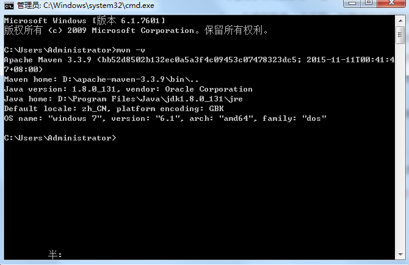
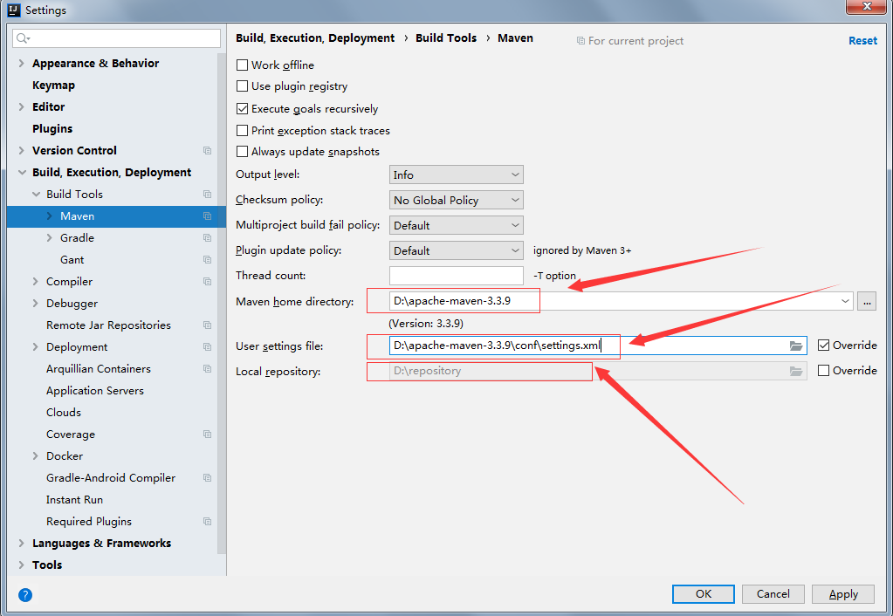
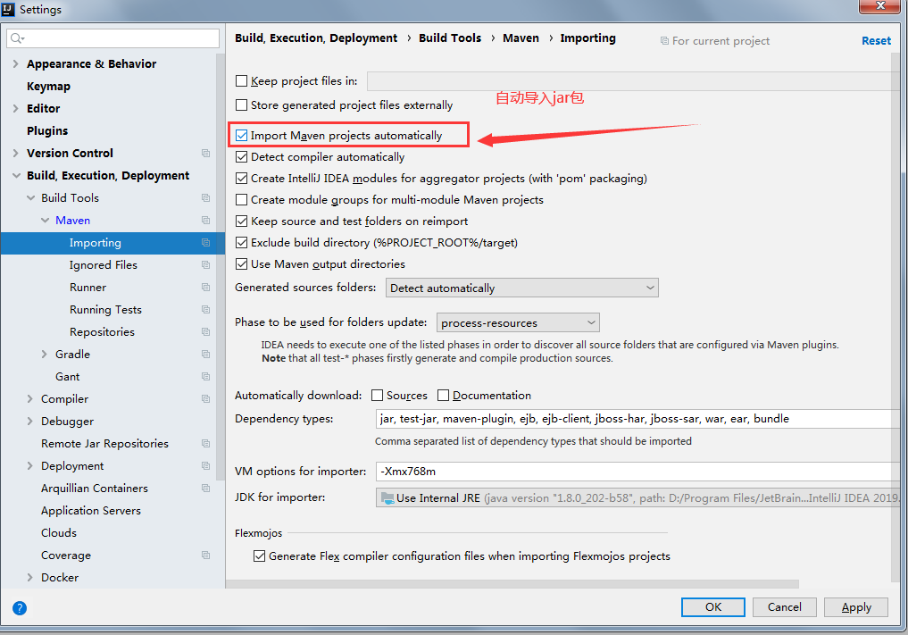

# Maven

## 1.为什么要学习Maven?

1. 一个项目就是一个工程，如果项目非常庞大，就不适合使用package进行划分，最好每一个模块对应一个工程，有利于分工协作
2. 项目中的jar包，需要复制粘贴到lib，借助于Maven可以将jar包保存在仓库中，不管在哪个项目只要引用就可以了
3. jar包需要的时候每次都在官网上下载，借助于Maven可以用统一的规范方式下载jar包
4. jar包版本不一致存在风险，不同项目在使用Jar包的时候，有可能导致各个项目的jar包版本不一致，导致执行错误，借助maven所有jar包都放在仓库中，所有项目使用一份jar包
5. 一个jar包依赖的其它jar包需要手动导入到项目中，借助于maven会将这些依赖的jar包导入进来

## 2.什么是Maven?

概念：Maven是一款服务于Java平台的自动化构建工具

<font color=red>注：我们可以叫妹文也可以麦文，没有妈文的</font>

## 3.如何使用Maven?

**Maven的配置**

1. 去maven官网去下载maven

   ```
   https://maven.apache.org/download.cgi
   ```

   下载之后将Maven压缩包解压，要记住解压的位置，后面配置环境变量需要

2. 配置环境变量，进入高级系统设置，打开环境变量，在系统变量里新建一个系统变量，变量名为MAVEN_HOME，变量值为Maven解压位置，配置path变量，编辑path变量，将%MAVEN_HOME%\bin;添加进去，这时候Maven就配置上去了，这时候我们通过win+r命令提示符检查是否配置成功，输入mvn -v

   

3. 配置maven全局配置文件

   1. 新建一个文件夹repository作为我们的本地仓库，maven下载jar都会存放在这个文件夹下

   2. 接下来打开maven文件夹下的conf文件夹，打开里面的setting.xml（推荐使用notepad++打开），防止编译报错，首先配置项目的本地路径。接下来配置==阿里云镜像(推荐配置)==，这样下载速度会更快，一般配置阿里云即可

      ```xml
      <mirror>
            <id>alimaven</id>
            <name>aliyun maven</name>
            <url>http://maven.aliyun.com/nexus/content/groups/public</url>
      	  <mirrorOf>central</mirrorOf>
      </mirror>
      ```

   3. 在IDEA中配置maven

      

   

4. 新建maven项目，会出现一个==pom.xml==文件，这是存储你版本信息以及进行maven仓库配置和下载的

