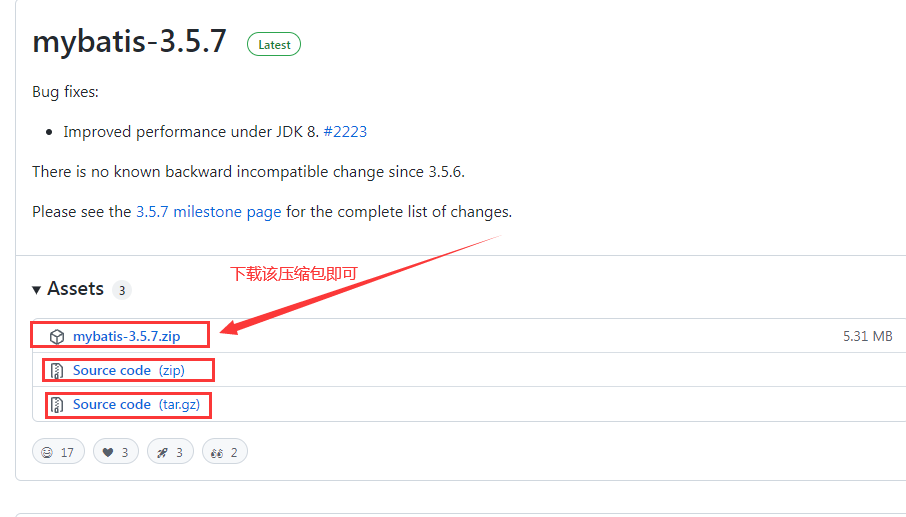

## MyBatis

## 1.Mybatis的简介

MyBatis 本是apache的一个[开源项目](https://baike.baidu.com/item/开源项目/3406069)==iBatis==, 2010年这个[项目](https://baike.baidu.com/item/项目/477803)由apache software foundation 迁移到了[google code](https://baike.baidu.com/item/google code/2346604)，并且改名为MyBatis 。==2013年11==月迁移到[Github](https://baike.baidu.com/item/Github/10145341)。

iBATIS一词来源于“internet”和“abatis”的组合，是一个基于Java的[持久层](https://baike.baidu.com/item/持久层/3584971)框架。iBATIS提供的持久层框架包括SQL Maps和Data Access Objects（DAOs）

当前，最新版本是==MyBatis 3.5.7== ，其发布时间是==2021年4月21日==。

**Mybatis概述**

1. 半自动的ORM（==Object Relational Mapping==）框架
2. DAO层
3. 支持动态SQL
4. 小巧灵活、简单易学

## 2.环境搭建

MyBatis的3.4.2版本可以通过网址下载如下。下载时只需选择mybatis-3.4.2.zip即可，==解压==后得到如下图所示的目录。

```
https://github.com/mybatis/mybatis-3/releases
```



## 3.工作原理

Mybatis工作原理分为8个步骤

​    1．读取 MyBatis 配置文件（==核心配置文件==）。

​    2．加载映射文件。

​    3．构造会话工厂。=>连接池=>==SqlSessionFactory==

​    4．创建会话对象。=>Connection=>==SqlSession==

​    5．Executor 执行器。

​    6．MappedStatement对象。=>==PrepareStatement==

​    7．输入参数映射。

​    8．输出结果映射。

```
http://c.biancheng.net/view/4304.html
```

**配置Mybatis核心配置文件**

```xml
<?xml version="1.0" encoding="UTF-8"?>
<!DOCTYPE configuration PUBLIC "-//mybatis.org//DTD Config 3.0//EN"
"http://mybatis.org/dtd/mybatis-3-config.dtd">

<configuration>
    <!-- 加载类路径下的属性文件 -->
    <properties resource="database.properties"/>

    <!-- 设置类型别名 -->
    <typeAliases>
        <typeAlias type="app01.Student" alias="student"/>
    </typeAliases>

    <!-- 设置一个默认的连接环境信息 -->
    <environments default="mysql_developer">
        <!-- 连接环境信息，取一个任意唯一的名字 -->
        <environment id="mysql_developer">
            <!-- mybatis默认使用jdbc事务管理方法 -->
            <transactionManager type="jdbc"/>
            <!-- mybatis使用连接池的方式获取连接 -->
            <dataSource type="pooled">
                <!-- 配置与数据库交互的四个重要属性 -->
                <property name="driver" value="${mysql.driver}"/>
                <property name="url" value="${mysql.url}"/>
                <property name="username" value="${mysql.username}"/>
                <property name="password" value="${mysql.password}"/>
            </dataSource>
        </environment>

        <environment id="oracle_developer">
            <transactionManager type="jdbc"/>
            <dataSource type="pooled">
                <!-- 配置与数据库交互的四个重要属性 -->
                <property name="driver" value="${oracle.driver}"/>
                <property name="url" value="${oracle.url}"/>
                <property name="username" value="${oracle.username}"/>
                <property name="password" value="${oracle.password}"/>
            </dataSource>
        </environment>
    </environments>
</configuration>
```

## 4.第一个Mybatis程序

```java
package app01;

public interface StudentMapper {

    //学生添加
    void add() throws Exception;
}
```

