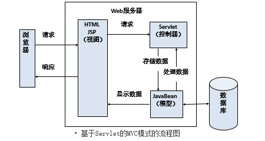
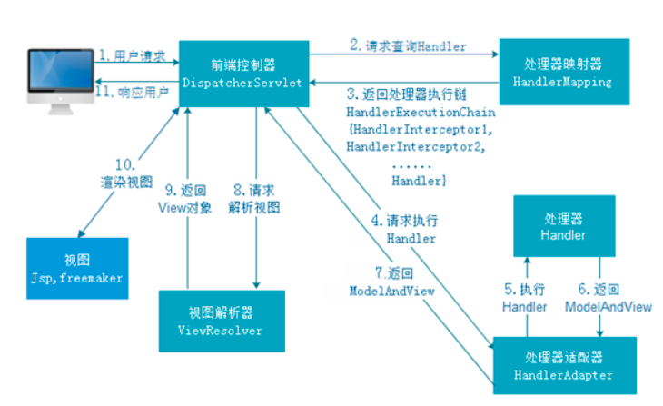

# Spring MVC

## 1.Spring MVC简介

Spring MVC属于SpringFrameWork的==后续产品==，已经融合在Spring Web Flow里面。Spring 框架提供了构建 [Web](https://baike.baidu.com/item/Web/150564) 应用程序的全功能 ==MVC== 模块。使用 Spring 可插入的 MVC 架构，从而在使用Spring进行WEB开发时，可以选择使用Spring的Spring MVC框架或集成其他MVC开发框架，如Struts1(现在一般不用)，Struts 2(一般==老项目==使用)等等。

## 2.MVC模式

MVC是Model、View、Cotroller的缩写，分别代表Web应用程序中的3种职责

1. 模型（Model）：用户存储数据级处理用户请求的业务逻辑
2. 视图（View）：向控制台提出数据，显示模型中的数据
3. 控制器（Cotroller）：根据视图提出的请求判断将请求和数据交给哪个模块处理，将处理后的关系结果交给哪个视图更新显示

> 关于Servlet的MVC模式？jd_2002

1. 模型：一个或多个JavaBean
2. 视图：一个或多个JSP页面
3. 控制器：一个或多个Servlet对象



## 3.Spring MVC的工作原理



Spring MVC的工作流程

1. 客户端请求提交到DispatherServlet（核心控制器）
2. 由DispatherServlet控制器找到一个或多个HanlderMapping，找到处理请求的Controller
3. DispatherServlet将请求提交到Controller
4. Controller调用业务逻辑处理后返回ModelAndView（==对象+视图组成==）
5. DispatherServlet寻找一个或多个ViewResolver（视图解析器），找到ModelAndView指定的视图
6. 视图负责将结果显示到客户端

<font color="red">注：Spring MVC的核心控制是一个Servlet，Struts2的核心控制器是一个过滤器</font>

## 4.Spring MVC的环境搭建

环境搭建

1. 创建Maven Web项目（==选择Maven Web骨架结构==）
2. 在pom.xml中编写Spring MVC的所有jar包坐标（==将jar包下载到我们的本地仓库==）
3. 在web.xml中配置核心控制器（==DispatherServlet==）
4. 在web.xml中配置处理请求乱码的过滤器（==Spring中自带该过滤器==）

**配置web.xml**

```xml
<?xml version="1.0" encoding="UTF-8"?>
<web-app xmlns="http://xmlns.jcp.org/xml/ns/javaee"
         xmlns:xsi="http://www.w3.org/2001/XMLSchema-instance"
         xsi:schemaLocation="http://xmlns.jcp.org/xml/ns/javaee http://xmlns.jcp.org/xml/ns/javaee/web-app_4_0.xsd"
         version="4.0">

    <!-- 配置Spring MVC的核心控制器 -->
    <servlet>
        <servlet-name>DispatcherServlet</servlet-name>
        <servlet-class>org.springframework.web.servlet.DispatcherServlet</servlet-class>
    </servlet>
    <servlet-mapping>
        <servlet-name>DispatcherServlet</servlet-name>
        <url-pattern>*.action</url-pattern>
    </servlet-mapping>

   <!-- 配置Spring提供的针对POST请求的中文乱码问题 -->
    <filter>
        <filter-name>CharacterEncodingFilter</filter-name>
        <filter-class>org.springframework.web.filter.CharacterEncodingFilter</filter-class>
        <init-param>
            <param-name>encoding</param-name>
            <param-value>utf-8</param-value>
        </init-param>
    </filter>
    <filter-mapping>
        <filter-name>CharacterEncodingFilter</filter-name>
        <url-pattern>/*</url-pattern>
    </filter-mapping>
</web-app>
```

<font color=red>注：如果在web.xml中没有指定springmvc的配置文件，那么springmvc会自动在WEB-INF目录下寻找名为DispatcherServlet-*.xml这样的xml文件</font>

## 5.Spring MVC快速入门（xml版）

> 如果没有指定springmvc配置文件？

我们需要在WEB-INF目录下新建一个名为DispatcherServlet-*.xml

**配置DispatcherServlet-servlet.xml**

```xml
<?xml version="1.0" encoding="UTF-8"?>
<beans xmlns="http://www.springframework.org/schema/beans"
       xmlns:xsi="http://www.w3.org/2001/XMLSchema-instance"
       xsi:schemaLocation="http://www.springframework.org/schema/beans http://www.springframework.org/schema/beans/spring-beans.xsd">

    <!--
        注册Action

     -->
    <bean name="/hello.action" class="app01.HelloAction"/>

    <!--
        映射器
        BeanNameUrlHandlerMapping表示bean标签的name属性当作URL请求
        可选
     -->
    <bean class="org.springframework.web.servlet.handler.BeanNameUrlHandlerMapping"/>

    <!--
        适配器
        SimpleControllerHandlerAdapter表示查找实现了Controller接口的Action类
        可选
     -->
    <bean class="org.springframework.web.servlet.mvc.SimpleControllerHandlerAdapter"/>

    <!--
        视图解析器
        InternalResourceViewResolver表示通过ModelAndView对象中的视图名到真正的页面
        可选
     -->
    <bean class="org.springframework.web.servlet.view.InternalResourceViewResolver"/>
</beans>
```

```java
package app01;

import org.springframework.web.servlet.ModelAndView;
import org.springframework.web.servlet.mvc.Controller;

import javax.servlet.http.HttpServletRequest;
import javax.servlet.http.HttpServletResponse;

public class HelloAction implements Controller {

    public HelloAction(){
        System.out.println("HelloAction->" + this.hashCode());
    }

    public ModelAndView handleRequest(HttpServletRequest httpServletRequest, HttpServletResponse httpServletResponse) throws Exception {
        System.out.println("HelloAction::handleRequest");
        //ModelAndView表示向视图封装的数据和真实路径
        ModelAndView modelAndView = new ModelAndView();
        //封装数据
        modelAndView.addObject("message","这是我们第一个Spring MVC应用程序，映射器_适配器_视图解析器为可选配置");
        //封装视图
        modelAndView.setViewName("/jsp/success.jsp");
        return modelAndView;
    }
}
```

<font color=red>注：Spring MVC为单例模式，scope="singleton"</font>

## 6.自定义的spring.xml配置文件

指定加载的spring.xml

```xml
<init-param>
    <param-name>contextConfigLocation</param-name>
    <param-value>classpath:spring.xml</param-value>
</init-param>
```

**配置视图解析器**

```xml
<?xml version="1.0" encoding="UTF-8"?>
<beans xmlns="http://www.springframework.org/schema/beans"
       xmlns:xsi="http://www.w3.org/2001/XMLSchema-instance"
       xsi:schemaLocation="http://www.springframework.org/schema/beans http://www.springframework.org/schema/beans/spring-beans.xsd">

    <!-- 注册Action（必） -->
    <bean name="/hello.action" class="app02.HelloAction"/>

    <!--
        如果Action中视图逻辑名称，那么视图解析器就必须配置
        如果Action中书写的是视图的完整名称，那么视图解析器就是可选配置
     -->
    <bean class="org.springframework.web.servlet.view.InternalResourceViewResolver">
        <!-- /jsp/success.jsp -->
        <!-- 路径前缀 -->
        <property name="prefix" value="/jsp/"/>
        <!-- 路径后缀 -->
        <property name="suffix" value=".jsp"/>
        <!-- 前缀 + 视图逻辑名 + 后最 = 真实路径 -->
    </bean>
</beans>
```

```java
package app02;

import org.springframework.web.servlet.ModelAndView;
import org.springframework.web.servlet.mvc.Controller;

import javax.servlet.http.HttpServletRequest;
import javax.servlet.http.HttpServletResponse;

public class HelloAction implements Controller {

    @Override
    public ModelAndView handleRequest(HttpServletRequest httpServletRequest, HttpServletResponse httpServletResponse) throws Exception {
        //实例化ModelAndView对象
        ModelAndView modelAndView = new ModelAndView();
        //封装数据
        modelAndView.addObject("message","这是我们第二个SpringMVC应用程序，视图使用逻辑名...");
        //封装视图的真实路径
        //modelAndView.setViewName("/jsp/success.jsp");
        //封装视图的逻辑名称
        modelAndView.setViewName("success");
        return modelAndView;
    }
}
```

## 7.第一个Spring MVC应用（注解版）

