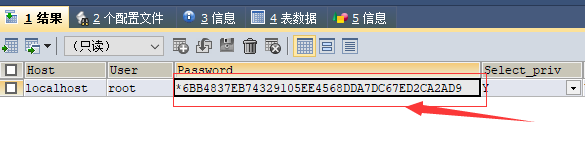

# 11月11日笔记 2002 34节

## 1.回顾

1. 子查询
   1. IN关键字
   2. ALL关键字
   3. SOME/ANY关键字
   4. EXISTS和NOT EXISTS

## 2.MySQL常用的系统函数

MySQL函数是MySQL数据库提供的==内置函数==。这些内置函数可以帮助用户更加方便地处理表中的数据。MySQL的内置函数可以对表中数据进行相应的处理，以便得到用户希望得到的数据。有了这些内置函数可以使MySQL数据库的功能更加强大。

**字符串函数**

**CONCAT(str1**,**str**1...strn)：字符串连接函数

```sql
-- 字符串连接
SELECT CONCAT('LNBOXUE','MySQL');
SELECT CONCAT('LNBOXUE','-','MySQL');
-- 使用指定的分隔符进行字符串连接
SELECT CONCAT_WS('|','A','B','C');
SELECT CONCAT_WS('-','LNBOXUE','MySQL','Functions');
```

**INSERT(**str**,**pos,len**,**newstr**)**：字符串替换

```SQL
SELECT INSERT('这是SQL SERVER数据库',3,10,'MySQL');
SELECT REPLACE('??My??SQL???','?','');
SELECT REPLACE('??My??SQL???','??','!');
```

LOWER(STR)：将字符串转成小写

UPPER(STR)：将字符串转成大写

```sql
-- 转换成小写字母
SELECT LOWER('MySQL');
-- 转换成大写字母
SELECT UPPER('mysql');
```

**获取左侧字符**

```sql
-- 获取左侧字符
SELECT LEFT('MySQL',2);
-- 获取左侧两个字符并将这两字符转换小写字母
SELECT LOWER(LEFT('MySQL',2));
```

**获取右侧字符**

```SQL
-- 获取右侧字符
SELECT RIGHT('MySQL',3);
```

**获取字符串的长度**

```sql
-- 获取字符串的长度
SELECT LENGTH('MySQL');
SELECT LENGTH('My SQL');
```

**删除前导空格**

```sql
-- 删除前导空格
SELECT LTRIM('  MySQL   ');
-- 函数的嵌套
SELECT LENGTH(LTRIM('  MySQL   '));
```

**删除后导空格**

```SQL
-- 删除后导空格
SELECT RTRIM('  MySQL   ');
-- 函数嵌套
SELECT LENGTH(RTRIM('  MySQL   '));
```

**删除前导和后导空格**

```SQL
-- 删除前导和后导空格
SELECT TRIM('  MySQL   ');
SELECT LENGTH(TRIM('  MySQL   '));
```

**SUBSTRING**(**str,num,len**)：字符串的截取函数

```sql
-- 字符串截取
SELECT SUBSTRING('MySQL',1,2);
SELECT SUBSTRING('MySQL',3);
```

**数学运算符和函数**

```sql
-- 数字运算符和函数
SELECT 3+4;
SELECT 3/4;
-- 整数除法
SELECT 3 DIV 4;
-- 取余数
SELECT 5 MOD 3;
SELECT 5.3 MOD 3;
-- 幂运算
SELECT POWER(3,3);
-- 进一取整
SELECT CEIL(3.01);
-- 舍一取证
SELECT FLOOR(3.99);
-- 随机数 0~1
SELECT RAND();
-- 四舍五入
SELECT ROUND(3.625,2);
SELECT ROUND(3.625,1);
```

**日期和时间函数**

**CURDATE()**：获取当前日期

```sql
-- 获取当前日期
SELECT CURDATE();
```

CURTIME()：获取当前时间

```sql
-- 获取当前时间
SELECT CURTIME();
```

NOW()：获取当前日期和时间

```sql
-- 获取当前日期和时间
SELECT NOW();
```

<font color=red>注：比如下单时间为datetime类型，就可以使用该函数</font>

```sql
insert into orders(food,createtime) values('老鸭粉',now());
```

WEEK(date)：**返回日期**date**为一年中的第几周**

```sql
-- 返回日期date为一年中的第几周
SELECT WEEK(NOW());
```

YEAR(date)：**返回日期**date**的年份**

```sql
-- 返回日期date的年份
SELECT YEAR(NOW());
```

HOUR(time)：**返回时间**time**的小时值**

```sql
-- 返回时间time的小时值
SELECT HOUR(NOW());
```

MINUTE(time)：返回时间time的分钟值

```sql
-- 返回时间time的分钟值
SELECT MINUTE(NOW());
```

DATEDIFF(date1,date2)：**返回日期参数**date1**和**date2**之间相隔的天数**

```sql
-- 返回日期参数date1和date2之间相隔的天数
SELECT DATEDIFF(NOW(),'2020-10-21');
```

ADDDATE(date,n)：**计算日期参数**date**加上**n**天后的日期**

```sql
-- 计算日期参数date加上n天后的日期
SELECT ADDDATE(NOW(),5);
```

DATE_FORMAT(date,format)：返回格式化后的日期

```sql
-- 返回格式化后的日期 yyyy-MM-dd
SELECT DATE_FORMAT('2021-11-12','%m/%d/%Y');
```

**信息函数**

CONNECTION_ID()：返回当前连接的唯一连接ID

```SQL
-- 返回当前连接的唯一连接ID
SELECT CONNECTION_ID();
```

DATABASE()：返回当前的数据库名

```sql
-- 返回当前的数据库名
SELECT DATABASE();
```

**LAST_INSERT_ID**：返回具有AUTO_INCREMENT(自动增长)特性的属性列的最新值

<font color=red>注：salary_table表中id字段是自增长的</font>

```sql
-- 返回具有AUTO_INCREMENT(自动增长)特性的属性列的最新值
SELECT LAST_INSERT_ID();
-- 插入数据
INSERT INTO salary_table(POSITION,salary) 
VALUES('Python',8000);
SELECT * FROM salary_table;
```

USER()：返回当前登录的用户名

```sql
-- 返回当前登录的用户名 root@localhost
SELECT USER();
```

VERSION()：返回MySQL数据库的版本信息

```SQL
-- 返回MySQL数据库的版本信息
SELECT VERSION();
```

**聚合函数**

我们讲解了5个聚合函数

1. AVG()：求平均
2. SUM():：求和
3. MAX()：求最大值
4. MIN()：求最小值
5. COUNT()：计数（当前表中的总记录数）

**条件判断函数**

**IF(EXPR,V1,V2)函数**

IF(EXPR,V1,V2)函数：IF(EXPR,V1,V2)如果表达式expr是TRUE(expr<>0 and expr<>NULL)，则IF()返回v1;否则返回值为v2，IF()的返回值为==数字==或==字符串==值，具体情况视其所在语境而定

```sql
-- IF(EXPR,V1,V2)函数
-- 返回数字
SELECT IF(1>2,2,3); -- 3
SELECT IF(1<2,2,3); -- 2
-- 返回字符串
SELECT IF(1<2,'yes','no'); -- yes
SELECT IF(1>2,'yes','no'); -- no
```

**IFNULL(v1,v2)函数**

IFNULL(v1,v2)函数：假如v1不为NULL，则IFNULL函数的返回值为v1，否则其返回值为v2

```sql
-- IFNULL(v1,v2)函数
SELECT IFNULL(1,2); -- 1
SELECT IFNULL(NULL,'IO'); -- IO
SELECT 1/0; -- NULL
SELECT IFNULL(1/0,'wrong');
SELECT IFNULL(1,2),IFNULL(NULL,'IO'),IFNULL(1/0,'wrong');
```

**CASE函数**

相当于Java中switch...case语句

写法一：

```sql
CASE expr WHEN v1 THEN r1 [WHEN v2 THEN r2][ELSE rn] END
```

写法二：

```sql
CASE WHEN v1 THEN r1 [WHEN v2 THEN r2][ELSE rn] END
```

需求：查询用户信息，使用CASE WHEN使查询结果中的gender的值显示为汉字

**写法一（枚举型）**

```sql
-- 创建USER表
DROP TABLE IF EXISTS USER;
CREATE TABLE USER(
	id INT PRIMARY KEY,
	NAME VARCHAR(20),
	gender TINYINT(4) -- 0:男 1:女 2:未知性别
);
-- 插入测试数据
INSERT INTO USER VALUES(1,'张三',0);
INSERT INTO USER VALUES(2,'李四',1);
INSERT INTO USER VALUES(3,'王五',2);
SELECT * FROM USER;
-- 需求：查询用户信息，使用CASE WHEN使查
-- 询结果中的gender的值显示为汉字
-- 枚举型
SELECT u.`id`,u.`name`,
CASE u.`gender` WHEN 0 THEN '男' WHEN 1 THEN '女' ELSE '未知性别' END AS 'gender'
FROM USER u;
```

**写法二（条件型）**

```sql
-- 条件型
SELECT u.`id`,u.`name`,
CASE WHEN u.`gender`=0 THEN '男' WHEN u.`gender`=1 THEN '女' ELSE '未知性别' END AS 'gender'
FROM USER u;
```

**加密函数**

信息摘要算法可以对传入的字符串进行md5加密，并返回加密后的32位字符串。

<font color=red>注：严格来讲md5()是一个摘要函数，因为通过md5转换只能进行加密不能解密，而加密函数要能加密也能解密，所以它只是一个摘要</font>

```sql
-- 信息摘要算法(md5()函数)
SELECT MD5('admin');
```

密码算法：该算法是一个真正的加密函数，不像md5()，password()加密后的内容可以解密出来

<font color="red">注：mysql用户登录时的验证就使用了password()函数，其将所输入的密码转换之后与存入的密码的加密码进行比较验证用户</font>

```sql
-- 我们的MySQL数据库密码经过加密
-- *6BB4837EB74329105EE4568DDA7DC67ED2CA2AD9
SELECT PASSWORD('123456');
USE mysql;
SHOW TABLES;
-- 查询用户表（User）
SELECT * FROM USER;
```



## 3.存储过程

> 什么是存储过程？

概念：一组预先编译好的SQL语句的集合，理解成批处理语句

> 存储过程的作用？

如果你在前台处理的话。可能会涉及到多次数据库连接。但如果你用存储过程的话，就只有一次。存储过程可以给我们带来运行效率提高的好处

**从安全性而言**

从安全上使用存储过程的系统更加稳定，因为存储过程只要数据库不出现问题，基本上不会出现什么问题

> 如何创建一个存储过程？

**语法：**

```sql
声明结束符
CREATE PROCEDURE 存储过程名(参数列表)
BEGIN
存储过程体(一组合法的SQL语句)
END
```

```sql
-- 创建存储过程
DELIMITER $
CREATE PROCEDURE pro_test()
BEGIN
	-- 可以写多个sql语句
	SELECT * FROM empolyee;
END $
```

**调用存储过程**

存储过程一旦创建，就存在于对应的数据库中，如果要执行此存储过程，可以通过存储过程名显示调用

**语法：**

```SQL
CALL 存储过程名[(传参)]
```

```sql
-- 调用存储过程
CALL pro_test;
```

**删除存储过程**

```sql
DROP PROCEDURE [IF EXISTS] 存储过程名;
```

```sql
-- 删除存储过程
DROP PROCEDURE IF EXISTS pro_test;
```

<font color=red>注：不能一次性删除多个存储过程</font>

**查看创建存储存储过程语句**

```sql
SHOW CREATE PROCEDURE 存储过程名;
```

```sql
-- 查看创建存储存储过程语句
SHOW CREATE PROCEDURE pro_test;
```

**创建一个带参数的存储过程**

需求：==传入==一个员工编号，查询员工信息

```sql
-- 需求：传入一个员工编号，查询员工信息
DELIMITER $
CREATE PROCEDURE pro_findById(IN eid INT) -- IN：输入参数
BEGIN
	SELECT * FROM `employee` WHERE id=eid;
END $
-- 调用存储过程
CALL pro_findById(4);
```

**创建带有输出参数的存储过程**

```sql
-- 创建带有输出参数的存储过程
DELIMITER $
CREATE PROCEDURE pro_testOut(OUT str VARCHAR(20)) -- OUT：输出参数
BEGIN
	-- 给参数赋值
	SET str='hellojava';
END $
```

> 如何接收返回参数的值？

需要使用MySQL中的变量

**MySQL中的变量**

**全局变量**

概念：全局变量（内置变量），其为MySQL数据库的内置变量，也就是说对所有连接都起作用

查看所有的全局变量：**SHOW VARIABLES;**

模糊查看某些全局变量（以character开头）：**SHOW VARIABLES LIKE 'character%';**

查看某个全局变量：**SELECT @@变量名;**

需求：查看MySQL的版本号以及系统时间

```sql
SELECT @@VERSION,current_date;
```

修改某个全局变量：**SET 变量名=新值;**

character_set_client：作为客户端发送的查询中使用的字符集

character_set_results：服务器返回查询结果到客户端使用的字符集，当前为==uft8==

修改全局变量

```sql
SET character_set_client = utf8;
SET character_set_results = gbk;
```

**简便写法**

```sql
set names gbk;
```

**会话变量**

概念：会话变量只存在于当前客户端与数据库服务器端 一次连接当中。如果连接断开，那么会话变量全部消失

定义会话变量：

语法：

```sql
SET @变量 = 值;
```

查看会话变量：

语法：

```sql
SELECT @变量;
```

**局部变量**

概念：在存储过程中使用的变量叫做局部变量。只要存储过程执行完毕，==局部变量就丢失==！！！

**接收存储过程输出参数的步骤**

1. 定义会话变量
2. 使用该会话变量接收存储过程的返回值

```SQL
-- 接收输出参数
CALL pro_testOut(@NAME);
-- 查看会话变量
SELECT @NAME;
```

**带有输入输出参数的存储过程**

```sql
-- 带有输入输出参数的存储过程
DELIMITER $
CREATE PROCEDURE pro_testInOut(INOUT n INT) -- INOUT：输入输出参数
BEGIN
	-- 查看变量
	SELECT n;
	SET n=500;
END $
```

**调用存储过程**

```sql
-- 调用存储过程
SET @n=10;
CALL pro_testInOut(@n);
-- 查看会话变量
SELECT @n;
```

**带有条件判断的存储过程**

IF语句用于条件判断，根据不同条件执行不同语句

**IF语句语法：**

```sql
IF 条件表达式1 THEN 语句序列1
[ELSEIF 条件表达式2 THEN 语法序列2]
[ELSE 语句序列3]
END IF;
```

需求：输入一个整数，如果为1，则返回”星期一“，如果为2，则返回”星期二“，如果为3，则返回”星期三“，如果为其它数字则返回”输入错误“

