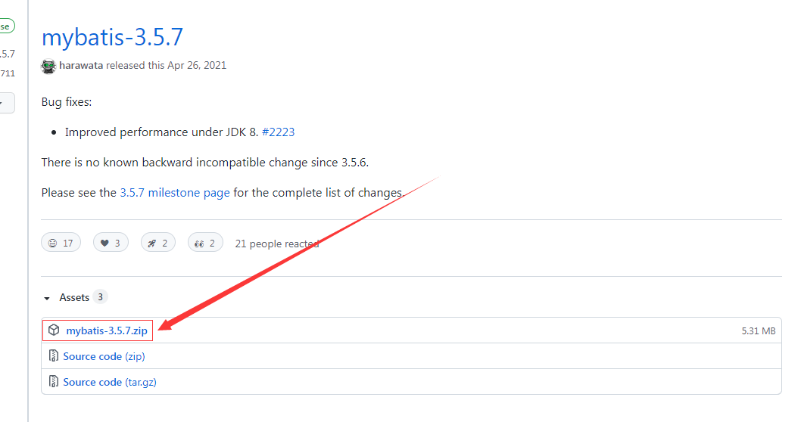

# 10月16日笔记 2003 78节

## 1.MyBatis的简介

MyBatis 本是apache的一个[开源项目](https://baike.baidu.com/item/开源项目/3406069)iBatis, 2010年这个[项目](https://baike.baidu.com/item/项目/477803)由apache software foundation 迁移到了[google code](https://baike.baidu.com/item/google code/2346604)，并且改名为MyBatis 。2013年11月迁移到[Github](https://baike.baidu.com/item/Github/10145341)。

iBATIS一词来源于“internet”和“abatis”的组合，是一个基于Java的[持久层](https://baike.baidu.com/item/持久层/3584971)框架。iBATIS提供的持久层框架包括SQL Maps和Data Access Objects（DAOs）

<font color="red">注：当前，最新版本是MyBatis 3.5.7 ，其发布时间是2021年4月21日。</font>

1. 半自动化的ORM(==Object Relationship Mapping==)实现

2. DAO层

3. 动态SQL

4. 小巧灵活、简单易学

## 2.MyBatis的环境搭建

MyBatis的3.4.2版本可以通过“https://github.com/mybatis/mybatis-3/releases”网址下载。下载时只需选择mybatis-3.4.2.zip即可，解压后得到如下图所示的目录。



maven不好用的同学

1. 连接寝室wifi
2. 删除本地仓库中所有的文件
3. reimport jar文件（右键pom.xml->maven->reimport）
4. 向日葵

**编写核心配置文件**

```xml
<?xml version="1.0" encoding="UTF-8"?>
<!DOCTYPE configuration PUBLIC "-//mybatis.org//DTD Config 3.0//EN"
"http://mybatis.org/dtd/mybatis-3-config.dtd">

<configuration>
    <!-- 加载类路径的属性文件 -->
    <properties resource="database.properties"/>

    <!-- 设置别名 -->
    <typeAliases>
        <typeAlias type="app01.Student" alias="student"/>
    </typeAliases>
    
    <!-- 设置一个默认的连接环境信息 -->
    <environments default="mysql_developer">
        <!-- 连接环境信息，取一个任意唯一的名字即可 -->
        <environment id="mysql_developer">
            <!-- Mybatis使用jdbc事务管理方式 -->
            <transactionManager type="jdbc"/>
            <!-- mybatis使用使用连接池的方式获取连接 -->
            <dataSource type="pooled">
                <!-- 配置与数据库交互的四个必要属性 -->
                <property name="driver" value="${mysql.driver}"/>
                <property name="url" value="${mysql.url}"/>
                <property name="username" value="${mysql.username}"/>
                <property name="password" value="${mysql.password}"/>
            </dataSource>
        </environment>

        <environment id="oracle_developer">
            <!-- Mybatis使用jdbc事务管理方式 -->
            <transactionManager type="jdbc"/>
            <!-- mybatis使用使用连接池的方式获取连接 -->
            <dataSource type="pooled">
                <!-- 配置与数据库交互的四个必要属性 -->
                <property name="driver" value="${oracle.driver}"/>
                <property name="url" value="${oracle.url}"/>
                <property name="username" value="${oracle.username}"/>
                <property name="password" value="${oracle.password}"/>
            </dataSource>
        </environment>
    </environments>
</configuration>
```

## 3.Mybatis的工作原理

mybatis的工作原理分为八个步骤

​    1．读取 MyBatis 配置文件。

​    2．加载映射文件。

​    3．构造会话工厂。

​    4．创建会话对象。

​    5．Executor 执行器。

​    6．MappedStatement对象。

​    7．输入参数映射。

​    8．输出结果映射。

```
http://c.biancheng.net/view/4304.html
```

## 4.第一个Mybatis程序（案例）

操作步骤：

1. 编写核心配置文件（mybatis.xml）
2. 编写MybatisUtils工具类
3. 编写Mapper接口
4. 编写Mapper映射文件
5. 创建测试类进行测试

```xml
<?xml version="1.0" encoding="UTF-8"?>
<!DOCTYPE configuration PUBLIC "-//mybatis.org//DTD Config 3.0//EN"
"http://mybatis.org/dtd/mybatis-3-config.dtd">

<configuration>
    <!-- 加载类路径的属性文件 -->
    <properties resource="database.properties"/>

    <!-- 设置别名 -->
    <typeAliases>
        <typeAlias type="app01.Student" alias="student"/>
    </typeAliases>
    
    <!-- 设置一个默认的连接环境信息 -->
    <environments default="mysql_developer">
        <!-- 连接环境信息，取一个任意唯一的名字即可 -->
        <environment id="mysql_developer">
            <!-- Mybatis使用jdbc事务管理方式 -->
            <transactionManager type="jdbc"/>
            <!-- mybatis使用使用连接池的方式获取连接 -->
            <dataSource type="pooled">
                <!-- 配置与数据库交互的四个必要属性 -->
                <property name="driver" value="${mysql.driver}"/>
                <property name="url" value="${mysql.url}"/>
                <property name="username" value="${mysql.username}"/>
                <property name="password" value="${mysql.password}"/>
            </dataSource>
        </environment>

        <environment id="oracle_developer">
            <!-- Mybatis使用jdbc事务管理方式 -->
            <transactionManager type="jdbc"/>
            <!-- mybatis使用使用连接池的方式获取连接 -->
            <dataSource type="pooled">
                <!-- 配置与数据库交互的四个必要属性 -->
                <property name="driver" value="${oracle.driver}"/>
                <property name="url" value="${oracle.url}"/>
                <property name="username" value="${oracle.username}"/>
                <property name="password" value="${oracle.password}"/>
            </dataSource>
        </environment>
    </environments>

    <!-- 加载映射文件 -->
    <mappers>
        <mapper resource="app01/StudentMapper.xml"/>
    </mappers>
</configuration>

```

```java
package utils;

import org.apache.ibatis.io.Resources;
import org.apache.ibatis.session.SqlSession;
import org.apache.ibatis.session.SqlSessionFactory;
import org.apache.ibatis.session.SqlSessionFactoryBuilder;

import java.io.IOException;
import java.io.Reader;
import java.sql.Connection;

/**
 * mybatis工具类
 */
public class MybatisUtils {

    //定义sqlSession工厂
    private static SqlSessionFactory sqlSessionFactory;

    //加载位于resources/mybatis.xml
    static {
        try {
            Reader reader = Resources.getResourceAsReader("mybatis.xml");
            //获取SqlSessionFactory对象
            sqlSessionFactory = new SqlSessionFactoryBuilder().build(reader);
        } catch (IOException e) {
            e.printStackTrace();
            throw new RuntimeException();
        }
    }

    //禁止外界通过new方式进行创建
    private MybatisUtils(){}

    //获取SqlSession对象
    public static SqlSession getSqlSession(){
        return sqlSessionFactory.openSession();
    }

    //关闭SqlSession对象
    public static void closeSqlSession(SqlSession sqlSession){
        if(null!=sqlSession){
            //关闭session
            sqlSession.close();
        }
    }

    public static void main(String[] args) {
        //获取Connection对象
        Connection connection = MybatisUtils.getSqlSession().getConnection();
        System.out.println(connection!=null?"连接成功":"连接失败");
    }
}
```

```java
package app01;

public interface StudentMapper {

    //添加学生
    void add1() throws Exception;
    int add2(Student student) throws Exception;
}
```

```xml
<?xml version="1.0" encoding="UTF-8"?>
<!DOCTYPE mapper PUBLIC "-//mybatis.org//DTD Config 3.0//EN"
        "http://mybatis.org/dtd/mybatis-3-mapper.dtd">

<!-- namespac属性是名称空间，必须全局唯一 -->
<mapper namespace="app01.StudentMapper">
    <!--
            resultMap标签：映射的是实体类与表
                type属性：表示实体类的全路径名
                id属性：为实体类与表映射取一个任意唯一的名字
     -->
    <resultMap id="studentMap" type="app01.Student">
        <!--
            id标签：映射主键属性
            result标签：映射非主键属性
                property属性：实体类的属性
                column属性：表的字段名
        -->
        <id property="id" column="id"/>
        <result property="name" column="name"/>
        <result property="sal" column="sal"/>
    </resultMap>

    <!--
        insert标签：要书写插入的SQL语句
            id属性：为insert语句取一个任意唯一的名字
            parameterType属性：要执行的dao方法的参数（如果是类必须使用全路径名）
    -->
    <insert id="add1">
        insert into student values(1,'家辉',7000)
    </insert>

    <insert id="add2" parameterType="student">
        insert into student(id,name,sal) values (#{id},#{name},#{sal})
    </insert>
</mapper>
```

```java
package app01;

import org.apache.ibatis.session.SqlSession;
import org.apache.log4j.Logger;
import org.junit.Test;
import utils.MybatisUtils;

public class App {

    private Logger logger = Logger.getLogger(App.class);

    @Test
    public void testAdd1() {
        //定义对象
        SqlSession sqlSession = null;
        try {
            //获取sqlSession对象
            sqlSession = MybatisUtils.getSqlSession();
            //获取mapper代理丢向并调用方法
            sqlSession.getMapper(StudentMapper.class).add1();
            //提交事务
            sqlSession.commit();
        } catch (Exception e) {
            e.printStackTrace();
            //回滚事务
            sqlSession.rollback();
        } finally {
            MybatisUtils.closeSqlSession(sqlSession);
        }
    }

    @Test
    public void testAdd2(){
        SqlSession sqlSession = null;
        //影响的行数
        int updateRows = 0;
        try {
            sqlSession = MybatisUtils.getSqlSession();
            updateRows = sqlSession.getMapper(StudentMapper.class).add2(new Student(2, "春然", 7000D));
            //判断是否插入成功
            if (updateRows>0){
                logger.debug("添加成功...");
            }
            //提交事务
            sqlSession.commit();
        } catch (Exception e) {
            e.printStackTrace();
            //回滚事务
            sqlSession.rollback();
        } finally {
            MybatisUtils.closeSqlSession(sqlSession);
        }
    }
}
```

 ## 5.mybatis的crud案例

| **元素名称**  | **描**  **述**                                             | **备**  **注**                                      |
| ------------- | ---------------------------------------------------------- | --------------------------------------------------- |
| select        | 查询语句，最常用、最复杂的元素之一                         | 可以自定义参数，返回结果集等                        |
| insert        | 插入语句                                                   | 执行后返回一个==整数==，代表插入的行数              |
| update        | 更新语句                                                   | 执行后返回一个整数，代表更新的行数                  |
| delete        | 删除语句                                                   | 执行后返回一个整数，代表删除的行数                  |
| ==sql==       | 定义一部分SQL，在多个位置被引用                            | 例如，一张表列名，一次定义，可以在多个SQL语句中使用 |
| ==resultMap== | 用来描述从数据库结果集中来加载对象，是最复杂、最强大的元素 | 提供映射规则                                        |

这些标签统称为mybatis的映射器，映射器是Mybatis最复杂且最重要的组件，有一个接口加上一个XML文件(SQL映射文件)组成

**insert标签**

```java
//学生添加
int add(Student student) throws Exception;
```

```xml
<!-- 学生添加功能 -->
<insert id="add" parameterType="app02.Student">
    insert into student(id,name,sal) values (#{id},#{name},#{sal})
</insert>
```

<font color="red">注：该方法使用的是JavaBean作参数，参数为Student对象</font>

**select标签**

```java
//按id查询学生
Student findById(int id) throws Exception;
```

```xml
<!--
        根据id查询学生
        select标签：用于映射SQL的select语句
            id属性：命名空间的唯一标示符
            parameterType属性：表示传入SQL的参数类型
            resultType属性：表示SQL语句返回类型的完整类名或别名
-->
<select id="findById" parameterType="int" resultType="app02.Student">
    select id,name,sal from student where id=#{id}
</select>
```

```java
//学生全查询
List<Student> findAll() throws Exception;
```

```xml
<!--
        查询所有学生
        注：理论上resultType要写List<Student>但这里只写List中的泛型类型即可，即只要书写Student的全路径名
    -->
    <select id="findAll" resultType="app02.Student">
        select id,name,sal from student
    </select>
```

**update标签**

```java
//学生更新
    int update(Student student) throws Exception;
```

```xml
<!--
        学生更新
        update标签：用于映射SQL的update语句
            id属性：命名空间的唯一标示符
            parameterType属性：表示传入SQL中的参数类型
    -->
<update id="update" parameterType="app02.Student">
    update student set name=#{name},sal=#{sal} where id=#{id}
</update>
```

**删除标签**

```java
//学生删除
int delete(Student student) throws Exception;
```

```xml
!--
        学生删除
        delete标签：用于映射SQL的delete语句
            id属性：命名空间的唯一标示符
            parameterType：表示传入SQL中的参数类型
    -->
<delete id="delete" parameterType="app02.Student">
    delete from student where id=#{id}
</delete>
```

**测试类**

```java
package app02;

import org.apache.ibatis.session.SqlSession;
import org.apache.log4j.Logger;
import org.junit.Test;
import utils.MybatisUtils;

import java.util.List;


/**
 * 测试类
 */
public class App {

    //引入日志对象
    private Logger logger = Logger.getLogger(App.class);

    @Test
    public void testAdd(){
        SqlSession sqlSession = null;
        //影响的行数(执行后返回一个整数，代表插入的行数)
        int updateRows = 0;
        //获取sqlSession对象
        sqlSession = MybatisUtils.getSqlSession();
        try {
            //获取mapper的代理对象
            StudentMapper mapper = sqlSession.getMapper(StudentMapper.class);
            //调用方法
            updateRows = mapper.add(new Student(3,"海娇",8000D));
            //判断是否添加成功
            if (updateRows>0){
                logger.debug("添加成功...");
            }
            //提交事务
            sqlSession.commit();
        } catch (Exception e) {
            e.printStackTrace();
            //回滚事务
            sqlSession.rollback();
        } finally {
            MybatisUtils.closeSqlSession(sqlSession);
        }
    }

    @Test
    public void testFindById(){
        SqlSession sqlSession = null;
        try {
            sqlSession = MybatisUtils.getSqlSession();
            //获取mapper代理对象并调用方法
            Student student = sqlSession.getMapper(StudentMapper.class).findById(1);
            logger.debug(student);
        } catch (Exception e) {
            e.printStackTrace();
        } finally {
            MybatisUtils.closeSqlSession(sqlSession);
        }
    }

    @Test
    public void testFindAll(){
        SqlSession sqlSession = null;
        try {
            sqlSession = MybatisUtils.getSqlSession();
            //获取mapper代理对象并调用方法
            List<Student> studentList = sqlSession.getMapper(StudentMapper.class).findAll();
            /*for (Student student : studentList) {
                logger.debug(student);
            }*/
            logger.debug(studentList);
        } catch (Exception e) {
            e.printStackTrace();
        } finally {
            MybatisUtils.closeSqlSession(sqlSession);
        }
    }

    @Test
    public void testUpdate(){
        SqlSession sqlSession = null;
        //影响的行数
        int updateRows = 0;
        try {
            sqlSession = MybatisUtils.getSqlSession();
            //获取mapper代理对象并调用方法
            updateRows = sqlSession.getMapper(StudentMapper.class).update(new Student(3, "邱海娇", 8500D));
            //判断是否更新成功
            if (updateRows>0){
                logger.debug("修改成功...");
            }
            //提交事务
            sqlSession.commit();
        } catch (Exception e) {
            e.printStackTrace();
            //回滚事务
            sqlSession.rollback();
        } finally {
            MybatisUtils.closeSqlSession(sqlSession);
        }
    }

    @Test
    public void testDelete(){
        SqlSession sqlSession = null;
        //影响的行数
        int updateRows = 0;
        try {
            sqlSession = MybatisUtils.getSqlSession();
            //获取mapper代理对象并调用方法
            updateRows = sqlSession.getMapper(StudentMapper.class).delete(new Student(2,null,null));
            if (updateRows>0){
                logger.debug("删除成功...");
            }
            //提交事务
            sqlSession.commit();
        } catch (Exception e) {
            e.printStackTrace();
            //回滚事务
            sqlSession.rollback();
        } finally {
            MybatisUtils.closeSqlSession(sqlSession);
        }
    }
}
```

## 6.Mybatis的分页查询

> 在JavaWeb中是如何处理分页查询的呢？

```sql
String sql = "select * from goodstable limit ?,?";
```

我们要将两个问号中的参数信息进行注入

1. 第一个参数：就是m值，起始行
2. 第二参数：每页显示多少条（容量）

**批量插入（学生表分页的准备工作）**

```java
//学生添加
int add(Student student) throws Exception;
```

```xml
<?xml version="1.0" encoding="UTF-8"?>
<!DOCTYPE mapper PUBLIC "-//mybatis.org//DTD Config 3.0//EN"
        "http://mybatis.org/dtd/mybatis-3-mapper.dtd">


<mapper namespace="app03.StudentMapper">
    <!-- 配置resultMap(建立实体类与映射关系)-->
    <resultMap id="studentMap" type="app03.Student">
        <id property="id" column="stuId"/>
        <result property="name" column="stuName"/>
        <result property="sal" column="stuSal"/>
    </resultMap>

    <!-- 学生添加 -->
    <insert id="add" parameterType="app03.Student">
        insert into student(stuId,stuName,stuSal) values (#{id},#{name},#{sal})
    </insert>
</mapper>
```

**测试类**

```java
@Test
    public void testAdd(){
        SqlSession sqlSession = null;
        //影响的行数
        int updateRows = 0;
        try {
            sqlSession = MybatisUtils.getSqlSession();
            //循环插入
            for (int i=1;i<=10;i++){
                //获取代理对象并调用方法
                updateRows = sqlSession.getMapper(StudentMapper.class).add(new Student(i,"李季"+i,5000D));
            }
            //判断插入是否成功
            if (updateRows>0){
                logger.debug("批量插入成功...");
            }
            //提交事务
            sqlSession.commit();
        } catch (Exception e) {
            e.printStackTrace();
            //回滚事务
            sqlSession.rollback();
        } finally {
            MybatisUtils.closeSqlSession(sqlSession);
        }
    }
```

**Map类型作参数**

在实际开发中，查询SQL语句经常需要多个参数，比如多条件查询。多个参数传递时，在Mybatis中允许Map接口通过键值对传递多个参数

分页查询

1. 有条件分页查询
2. 无条件分页查询

无条件分页查询

```java
/**
     * 无条件分页
     * start：表示在MySQL中从第几条记录的索引开始显示，索引默认0开始
     * size：表示在MySQL中最多显示几条记录（容量）
     */
List<Student> findAllByPage(Map<String,Object> map) throws Exception;
```

```xml
 <!-- 无条件分页查询 -->
<select id="findAllByPage" parameterType="map" resultMap="studentMap">
    select stuId,stuName,stuSal from student limit #{start},#{size}
</select>
```

**测试类**

```java
 @Test
    public void testFindAllByPage(){
        SqlSession sqlSession = null;
        try {
            sqlSession = MybatisUtils.getSqlSession();
            //定义Map集合
            Map<String,Object> map = new LinkedHashMap<>();
            //将条件封装到Map集合中
            map.put("start",0);
            map.put("size",3);
            //获取mapper代理对象并调用方法
            List<Student> studentList = sqlSession.getMapper(StudentMapper.class).findAllByPage(map);
            logger.debug(studentList);
        } catch (Exception e) {
            e.printStackTrace();
        } finally {
            MybatisUtils.closeSqlSession(sqlSession);
        }
    }
```

有条件分页查询

CONCAT（）函数用于将多个字符串连接成一个字符串，是最重要的mysql函数之一，下面就将为您详细介绍mysql CONCAT（）函数，供您参考

mysql CONCAT(str1,str2,…)            

```sql
SELECT CONCAT('My','S','QL'); -- 结果：MySQL=>CONCAT('%',#{pname},'%')
```

```java
//有条件的分页
List<Student> findByNameByPage(Map<String,Object> map) throws Exception;
```

```xml
<!-- 有条件分页查询 -->
<select id="findByNameByPage" parameterType="map" resultMap="studentMap">
    select * from student where stuName like concat('%',#{pname},'%') limit #{start},#{size}
</select>
```

> mybatis中，#{}与${}的区别？

在MyBatis 的映射配置文件中，动态传递参数有两种方式：

1. #{}：占位符，属于sql预编译（==推荐使用==）
2. ${}：拼接符，属于sql的拼接

```xml
<!--
        方式1：CONCAT('%',#{pname},'%')
        方式2：CONCAT('%','${pname}','%')
    -->
<select id="findByNameByPage" parameterType="map" resultMap="studentMap">
    select * from student where stuName like concat('%','${pname}','%') limit #{start},#{size}
</select>
```

