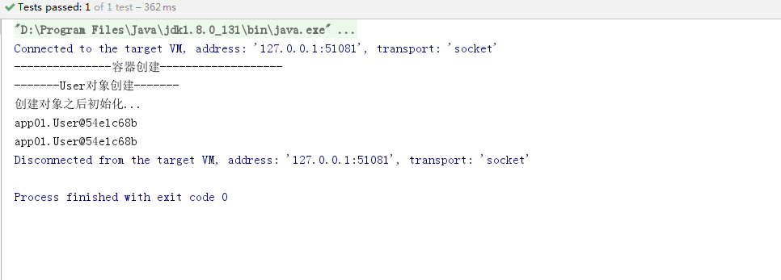
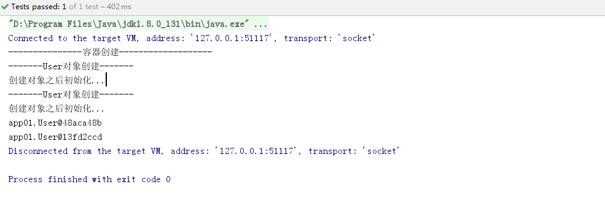

# Spring

## 1.Spring简介

Spring是当前主流的Java Web开发框架，为企业级应用开发提供了丰富的功能，掌握Spring框架的使用是Java开发者必备的技能之一，Spring作为一个轻量级框架，它的出现迎来了JavaEE的春天，目前已经为当今最主流的框架之一

> 为什么要学习Spring？

它是一个轻量级开发框架，最早由Rod Johnson创建，该框架解决企业级应用开发的业务逻辑和其它各层的耦合问题，并且分层的==一站式==轻量级开源框架，为开发Java应用提供全面的基础框架支持

**Spring的体系结构**


## 2.开发环境搭建

```xml
<?xml version="1.0" encoding="UTF-8"?>
<project xmlns="http://maven.apache.org/POM/4.0.0"
         xmlns:xsi="http://www.w3.org/2001/XMLSchema-instance"
         xsi:schemaLocation="http://maven.apache.org/POM/4.0.0 http://maven.apache.org/xsd/maven-4.0.0.xsd">
    <modelVersion>4.0.0</modelVersion>

    <groupId>com.lnboxue</groupId>
    <artifactId>springdemo_2003</artifactId>
    <version>1.0-SNAPSHOT</version>

    <dependencies>
        <!-- Spring -->
        <dependency>
            <groupId>org.springframework</groupId>
            <artifactId>spring-webmvc</artifactId>
            <version>5.1.9.RELEASE</version>
        </dependency>
        <dependency>
            <groupId>org.aspectj</groupId>
            <artifactId>aspectjweaver</artifactId>
            <version>1.9.4</version>
        </dependency>
        <!-- Junit -->
        <dependency>
            <groupId>junit</groupId>
            <artifactId>junit</artifactId>
            <version>4.12</version>
        </dependency>
    </dependencies>
    <!-- 解决maven项目无法读取src/main/java目录下面的配置文件问题 -->
    <build>
        <resources>
            <resource>
                <directory>src/main/java</directory>
                <includes>
                    <include>**/*.properties</include>
                    <include>**/*.xml</include>
                </includes>
                <filtering>false</filtering>
            </resource>
            <resource>
                <directory>src/main/resources</directory>
                <includes>
                    <include>**/*.properties</include>
                    <include>**/*.xml</include>
                </includes>
                <filtering>false</filtering>
            </resource>
        </resources>
    </build>
</project>
```

## 3.bean的创建细节

**编写实体类**

```java
package app01;

public class User {

    //编号
    private Integer id;
    private String name;

    //无参构造方法
    public User(){
        System.out.println("-------User对象创建-------");
    }

    public Integer getId() {
        return id;
    }

    public void setId(Integer id) {
        this.id = id;
    }

    public String getName() {
        return name;
    }

    public void setName(String name) {
        this.name = name;
    }

    public void initUser(){
        System.out.println("创建对象之后初始化...");
    }

    public void destroyUser(){
        System.out.println("IOC容器销毁，user对象回收...");
    }
}
```

```xml
<!-- IOC容器的配置，要创建的所有对象都配置到这里 -->
<!--<bean id="user" class="app01.User"/>-->
```

**测试类**

```java
package app01;

import org.junit.Test;
import org.springframework.context.ApplicationContext;
import org.springframework.context.support.ClassPathXmlApplicationContext;

/**
 * 测试类
 */
public class App01 {

    //直接获取IOC容器对象
    @Test
    public void testAc() throws Exception{
        //获取IOC容器对象
        ApplicationContext ac = new ClassPathXmlApplicationContext("app01/applicationContext.xml");
        //从容器中获取User对象
        User user = (User) ac.getBean("user");
        System.out.println(user);
    }
}
```

**bean标签中的属性**

```xml
<bean id="user" class="app01.User" init-method="initUser" destroy-method="destroyUser" scope="singleton" lazy-init="false"/>
```

创建对象：分为单例和多例

1. scope="singleton"：默认值，默认为单例，如：service、dao、工具类
2. scope="prototype"：多例 如：action

> 什么时候创建？

1. scope=“prototype”，在用到对象的时候才创建
2. scope="singleton"，在启动(容器初始化之前)，这时就已经创建了bean，并整个应用中有且仅有一个

> 是否延迟创建？

1. lazy-init=”false“，默认为false，不延迟创建，即在启动时创建对象
2. lazy-init="true"，延迟初始化，在用到对象时才创建，==仅对单例模式有效==

创建对象之后，初始化与销毁

1. init-method="initUser"：对应对象的initUser方法，在对象创建之后执行
2. destroy-method="destroyUser"：在调用容器对象的destroy()方法时候执行（使用IOC容器实现类）


```xml
<bean id="user" class="app01.User" init-method="initUser" destroy-method="destroyUser" scope="singleton" lazy-init="true"/>
```



```xml
<bean id="user" class="app01.User" init-method="initUser" destroy-method="destroyUser" scope="prototype" lazy-init="false"/>
```


```xml
<bean id="user" class="app01.User" init-method="initUser" destroy-method="destroyUser" scope="prototype" lazy-init="true"/>
```



```java
package app01;

import org.junit.Test;
import org.springframework.context.ApplicationContext;
import org.springframework.context.support.ClassPathXmlApplicationContext;

/**
 * 测试类
 */
public class App02 {

    @Test
    public void testAc() throws Exception{
        //获取IOC容器对象
        //ApplicationContext ac = new ClassPathXmlApplicationContext("app01/applicationContext.xml");
        ClassPathXmlApplicationContext ac = new ClassPathXmlApplicationContext("app01/applicationContext.xml");
        System.out.println("---------------容器创建-------------------");
        //从容器中获取两个User对象
        User user1 = (User) ac.getBean("user");
        User user2 = (User) ac.getBean("user");
        System.out.println(user1);
        System.out.println(user2);
        //销毁容器对象(已过时)
        ac.destroy();
    }
}
```

## 4.IOC容器创建对象

> 什么是IOC？

IOC(控制反转)是Spring框架的基础，也是Spring框架的核心理念

1. 控制反转

2. 依赖注入

   
