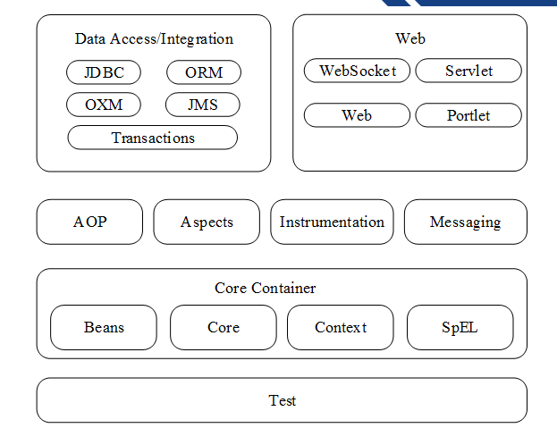
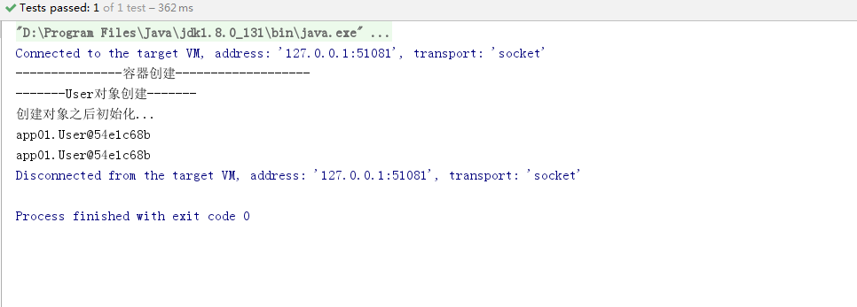
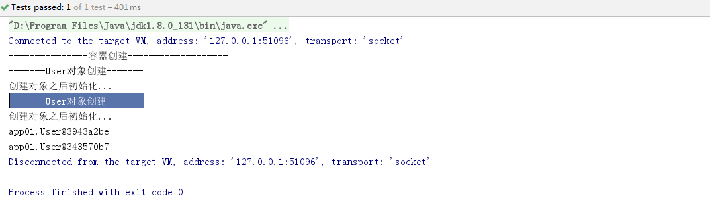
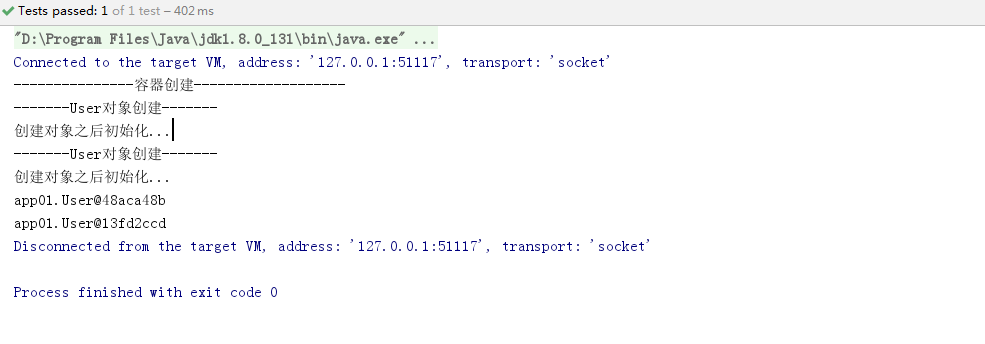
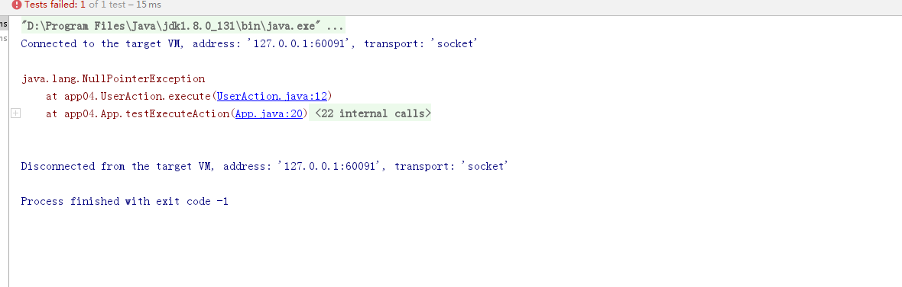
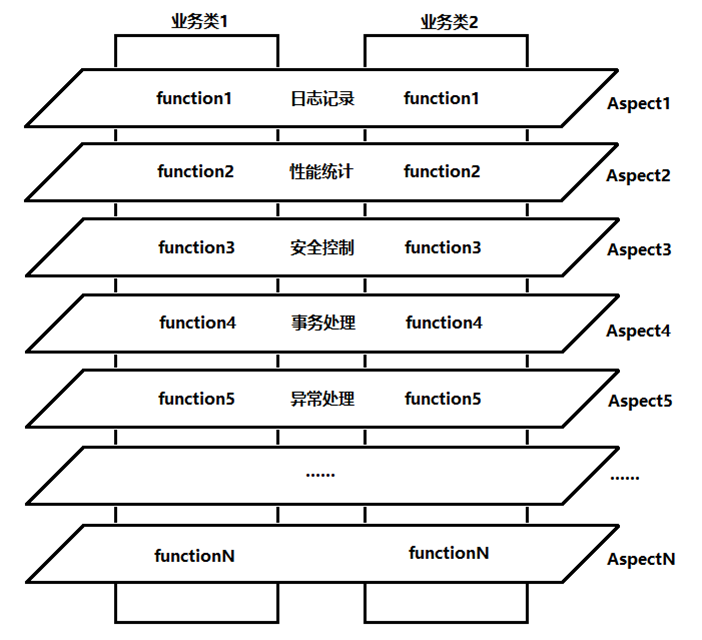

# Spring

## 1.Spring简介

Spring是当前主流的Java Web开发框架，为企业级应用开发提供了丰富的功能，掌握Spring框架的使用是Java开发者必备的技能之一，Spring作为一个轻量级框架，它的出现迎来了JavaEE的春天，目前已经为当今最主流的框架之一

> 为什么要学习Spring？

它是一个轻量级开发框架，最早由Rod Johnson创建，该框架解决企业级应用开发的业务逻辑和其它各层的耦合问题，并且分层的==一站式==轻量级开源框架，为开发Java应用提供全面的基础框架支持

**Spring的体系结构**



## 2.开发环境搭建

```xml
<?xml version="1.0" encoding="UTF-8"?>
<project xmlns="http://maven.apache.org/POM/4.0.0"
         xmlns:xsi="http://www.w3.org/2001/XMLSchema-instance"
         xsi:schemaLocation="http://maven.apache.org/POM/4.0.0 http://maven.apache.org/xsd/maven-4.0.0.xsd">
    <modelVersion>4.0.0</modelVersion>

    <groupId>com.lnboxue</groupId>
    <artifactId>springdemo_2003</artifactId>
    <version>1.0-SNAPSHOT</version>

    <dependencies>
        <!-- Spring -->
        <dependency>
            <groupId>org.springframework</groupId>
            <artifactId>spring-webmvc</artifactId>
            <version>5.1.9.RELEASE</version>
        </dependency>
        <dependency>
            <groupId>org.aspectj</groupId>
            <artifactId>aspectjweaver</artifactId>
            <version>1.9.4</version>
        </dependency>
        <!-- Junit -->
        <dependency>
            <groupId>junit</groupId>
            <artifactId>junit</artifactId>
            <version>4.12</version>
        </dependency>
    </dependencies>
    <!-- 解决maven项目无法读取src/main/java目录下面的配置文件问题 -->
    <build>
        <resources>
            <resource>
                <directory>src/main/java</directory>
                <includes>
                    <include>**/*.properties</include>
                    <include>**/*.xml</include>
                </includes>
                <filtering>false</filtering>
            </resource>
            <resource>
                <directory>src/main/resources</directory>
                <includes>
                    <include>**/*.properties</include>
                    <include>**/*.xml</include>
                </includes>
                <filtering>false</filtering>
            </resource>
        </resources>
    </build>
</project>
```

## 3.bean的创建细节

**编写实体类**

```java
package app01;

public class User {

    //编号
    private Integer id;
    private String name;

    //无参构造方法
    public User(){
        System.out.println("-------User对象创建-------");
    }

    public Integer getId() {
        return id;
    }

    public void setId(Integer id) {
        this.id = id;
    }

    public String getName() {
        return name;
    }

    public void setName(String name) {
        this.name = name;
    }

    public void initUser(){
        System.out.println("创建对象之后初始化...");
    }

    public void destroyUser(){
        System.out.println("IOC容器销毁，user对象回收...");
    }
}
```

```xml
<!-- IOC容器的配置，要创建的所有对象都配置到这里 -->
<!--<bean id="user" class="app01.User"/>-->
```

**测试类**

```java
package app01;

import org.junit.Test;
import org.springframework.context.ApplicationContext;
import org.springframework.context.support.ClassPathXmlApplicationContext;

/**
 * 测试类
 */
public class App01 {

    //直接获取IOC容器对象
    @Test
    public void testAc() throws Exception{
        //获取IOC容器对象
        ApplicationContext ac = new ClassPathXmlApplicationContext("app01/applicationContext.xml");
        //从容器中获取User对象
        User user = (User) ac.getBean("user");
        System.out.println(user);
    }
}
```

**bean标签中的属性**

```xml
<bean id="user" class="app01.User" init-method="initUser" destroy-method="destroyUser" scope="singleton" lazy-init="false"/>
```

创建对象：分为单例和多例

1. scope="singleton"：默认值，默认为单例，如：service、dao、工具类
2. scope="prototype"：多例 如：action

> 什么时候创建？

1. scope=“prototype”，在用到对象的时候才创建
2. scope="singleton"，在启动(容器初始化之前)，这时就已经创建了bean，并整个应用中有且仅有一个

> 是否延迟创建？

1. lazy-init=”false“，默认为false，不延迟创建，即在启动时创建对象
2. lazy-init="true"，延迟初始化，在用到对象时才创建，==仅对单例模式有效==

创建对象之后，初始化与销毁

1. init-method="initUser"：对应对象的initUser方法，在对象创建之后执行
2. destroy-method="destroyUser"：在调用容器对象的destroy()方法时候执行（使用IOC容器实现类）


```xml
<bean id="user" class="app01.User" init-method="initUser" destroy-method="destroyUser" scope="singleton" lazy-init="true"/>
```



```xml
<bean id="user" class="app01.User" init-method="initUser" destroy-method="destroyUser" scope="prototype" lazy-init="false"/>
```



```xml
<bean id="user" class="app01.User" init-method="initUser" destroy-method="destroyUser" scope="prototype" lazy-init="true"/>
```



```java
package app01;

import org.junit.Test;
import org.springframework.context.ApplicationContext;
import org.springframework.context.support.ClassPathXmlApplicationContext;

/**
 * 测试类
 */
public class App02 {

    @Test
    public void testAc() throws Exception{
        //获取IOC容器对象
        //ApplicationContext ac = new ClassPathXmlApplicationContext("app01/applicationContext.xml");
        ClassPathXmlApplicationContext ac = new ClassPathXmlApplicationContext("app01/applicationContext.xml");
        System.out.println("---------------容器创建-------------------");
        //从容器中获取两个User对象
        User user1 = (User) ac.getBean("user");
        User user2 = (User) ac.getBean("user");
        System.out.println(user1);
        System.out.println(user2);
        //销毁容器对象(已过时)
        ac.destroy();
    }
}
```

## 4.IOC容器创建对象

> 什么是IOC？

IOC(控制反转)是Spring框架的基础，也是Spring框架的核心理念

1. 控制反转(Inversion of control)：是一个比较抽象的概念，是Spring框架的核心，用于消减计算机程序的耦合问题
2. 依赖注入(DI：dependency injection)：是IOC的另一个说法，不同角度描述相同的概念

**创建对象**

**无参构造器创建**

```xml
<!-- 1.无参构造器创建 -->
<bean id="user" class="app02.User"/>
```

```java
package app02;

import org.junit.Test;
import org.springframework.context.ApplicationContext;
import org.springframework.context.support.ClassPathXmlApplicationContext;

/**
 * 测试类
 */
public class App {

    @Test
    public void testIOC() throws Exception{
        //创建IOC容器对象
        ApplicationContext ac = new ClassPathXmlApplicationContext("app02/applicationContext.xml");
        //获取容器中的对象
        User user = (User) ac.getBean("user");
        System.out.println(user);
    }
}
```

<font color=red>注：默认调用无参构造器创建对象</font>

**有参构造器创建**

```xml
<!-- 2.有参构造器创建 -->
<bean id="user2" class="app02.User">
    <constructor-arg index="0" type="java.lang.Integer" value="100"/>
    <constructor-arg index="1" type="java.lang.String" value="haijiao"/>
</bean>
```

> 让其中一个参数为一个bean的方式？

```xml
<!-- 定义一个字符串，值为chenyang，String str = new String("chenyang); -->
<bean id="str" class="java.lang.String">
    <constructor-arg value="chenyang"/>
</bean>

<!-- 让一个参数为一个bean -->
<bean id="user3" class="app02.User">
    <constructor-arg index="0" type="java.lang.Integer" value="100"/>
    <constructor-arg index="1" type="java.lang.String" ref="str"/>
</bean>
```

> 让两个参数都为bean的方式？

```xml
<!-- 定义一个字符串，值为chenyang，String str = new String("chenyang); -->
<bean id="str" class="java.lang.String">
    <constructor-arg value="chenyang"/>
</bean>

<bean id="iid" class="java.lang.Integer">
    <constructor-arg value="101"/>
</bean>

<!-- 让一个参数为一个bean -->
<!--<bean id="user3" class="app02.User">
        <constructor-arg index="0" type="java.lang.Integer" value="100"/>
        <constructor-arg index="1" type="java.lang.String" ref="str"/>
    </bean>-->

<!-- 让两个参数都为bean -->
<bean id="user3" class="app02.User">
    <constructor-arg index="0" type="java.lang.Integer" ref="iid"/>
    <constructor-arg index="1" type="java.lang.String" ref="str"/>
</bean>
```

总结：构造方法注入采用了Java的反射机制，通过构造方法完成了依赖注入，即在Spring配置文件中通过\<constructor-arg>元素为构造方法传参

**工厂类类创建对象**

工厂类

```java
package app02;

/**
 * 工厂创建对象
 */
public class ObjectFactory {
    
    //实例方法创建对象
    public User getInstance(){
        return new User(100,"调用实例方法...");
    }
    
    //静态方法创建对象
    public static User getStaticInstance(){
        return new User(101,"调用静态方法...");
    }
}
```

**工厂类：实例方法**

```xml
<!-- 3.工厂类创建对象 -->
<bean id="factory" class="app02.ObjectFactory"/>
<!-- 在创建User对象，调用工厂中的实例方法 -->
<bean id="user4" class="app02.User" factory-bean="factory" factory-method="getInstance"/>
```

**工厂类：静态方法**

```xml
<!-- 3.2 工厂类：静态方法 -->
<bean id="user5" class="app02.ObjectFactory" factory-method="getStaticInstance"/>
```

```java
package app02;

import org.junit.Test;
import org.springframework.context.ApplicationContext;
import org.springframework.context.support.ClassPathXmlApplicationContext;

/**
 * 测试类
 */
public class App {

    @Test
    public void testIOC() throws Exception{
        //创建IOC容器对象
        ApplicationContext ac = new ClassPathXmlApplicationContext("app02/applicationContext.xml");
        //获取容器中的对象
        //User user = (User) ac.getBean("user");
        //User user = (User) ac.getBean("user2");
        //User user = (User) ac.getBean("user3");
        //User user = (User) ac.getBean("user4");
        User user = (User) ac.getBean("user5");
        System.out.println(user);
    }
}
```

## 5.DI对象关系处理

**使用属性的setter方法注入**

概述：使用setter方法注入是Spring框架中最主流的注入方式，它利用JavaBean规范所定义的setter方法来完成注入，灵活且可读性高，对于setter方法注入，Spring框架也是使用Java的==反射机制==实现的

```xml
<!-- 通过set为属性赋值(注入) -->
<bean id="user2" class="app03.User" scope="prototype">
    <property name="id" value="101"/>
    <property name="name" value="lihao"/>
</bean>
```

**案例：action/service/dao**

```java
package app03;

/**
 * 数据库访问层
 */
public class UserDao {

    void save(){
        System.out.println("DB：保存用户...");
    }
}
```

```java
package app03;

/**
 * 业务层
 */
public class UserService {

    //Sprin IOC容器注入进来
    private UserDao userDao;

    //IOC：对象的创建交给Spring的IOC容器完成
    public void setUserDao(UserDao userDao) {
        this.userDao = userDao;
    }

    void save(){
        userDao.save();
    }
}
```

```java
package app03;

/**
 * 控制层
 */
public class UserAction {

    //Service对象会被Spring IOC容器注入进来
    private UserService userService;

    public void setUserService(UserService userService) {
        this.userService = userService;
    }

    public String execute(){
        userService.save();
        return null;
    }
}
```

**xml配置**

```xml
<!-- 案例：action/service/dao -->
<!-- dao instance -->
<bean id="userDao" class="app03.UserDao"/>
<!-- service instance -->
<bean id="userService" class="app03.UserService">
    <property name="userDao" ref="userDao"/>
</bean>
<!-- action instance -->
<bean id="userAction" class="app03.UserAction">
    <property name="userService" ref="userService"/>
</bean>
```

**内部bean的方式**

```xml
<!-- 内部bean的方式 -->
<bean id="userAction2" class="app03.UserAction">
    <property name="userService">
        <bean class="app03.UserService">
            <property name="userDao">
                <bean class="app03.UserDao"/>
            </property>
        </bean>
    </property>
</bean>
```

```java
package app03;

import org.junit.Test;
import org.springframework.context.ApplicationContext;
import org.springframework.context.support.ClassPathXmlApplicationContext;

/**
 * 测试类
 */
public class App {

    //创建IOC容器对象
    ApplicationContext ac = new ClassPathXmlApplicationContext("app03/applicationContext.xml");

    @Test
    public void testSet() throws Exception{
        //获取容器中的对象
        //User user = (User) ac.getBean("user");
        User user = (User) ac.getBean("user2");
        System.out.println(user);
    }

    @Test
    public void testExecuteAction() throws Exception{
        //获取容器中的action对象
        //UserAction userAction = (UserAction) ac.getBean("userAction");
        UserAction userAction = (UserAction) ac.getBean("userAction2");
        //调用控制层中的方法
        userAction.execute();
    }
}
```

## 6.自动装配

Spring中的自动装配有两种方式

1. 根据类型装配
2. 根据名称装配

**类型装配**

```xml
<?xml version="1.0" encoding="UTF-8"?>
<beans xmlns="http://www.springframework.org/schema/beans"
       xmlns:xsi="http://www.w3.org/2001/XMLSchema-instance"
       xsi:schemaLocation="http://www.springframework.org/schema/beans http://www.springframework.org/schema/beans/spring-beans.xsd" default-autowire="byType">

    <!-- 按照类型自动装配 -->
    <!-- dao instance -->
    <bean id="userDao" class="app04.UserDao"/>
    <!-- service instance -->
    <bean id="userService" class="app04.UserService"/>
    <!-- action instance -->
    <bean id="userAction" class="app04.UserAction"/>
</beans>
```

<font color=red>注：按照类型自动装配，配置default-autowire="byType"，id可以改，但是建议不改</font>

**名称装配**

```xml
<?xml version="1.0" encoding="UTF-8"?>
<beans xmlns="http://www.springframework.org/schema/beans"
       xmlns:xsi="http://www.w3.org/2001/XMLSchema-instance"
       xsi:schemaLocation="http://www.springframework.org/schema/beans http://www.springframework.org/schema/beans/spring-beans.xsd" default-autowire="byName">

    <!-- 按照类型自动装配
         按照类型自动装配，配置default-autowire="byType"，id可以改，但是建议不改
    -->
    <!-- dao instance -->
    <!--<bean id="userDao1" class="app04.UserDao"/>-->
    <!-- service instance -->
    <!--<bean id="userService1" class="app04.UserService"/>-->
    <!-- action instance -->
    <!--<bean id="userAction" class="app04.UserAction"/>-->

    <!--
        按照名称装配
    -->
    <!-- dao instance -->
    <bean id="userDao1" class="app04.UserDao"/>
    <!-- service instance -->
    <bean id="userService1" class="app04.UserService"/>
    <!-- action instance -->
    <bean id="userAction" class="app04.UserAction"/>
</beans>
```

名称匹配失败



方式二：

```xml
<!--
        按照名称装配
        根据名称自动装配，userAction中注入的属性，会去IOC中自动查找与属性同名的对象
    -->
<!-- dao instance -->
<bean id="userDao" class="app04.UserDao" autowire="byName"/>
<!-- service instance -->
<bean id="userService" class="app04.UserService" autowire="byName"/>
<!-- action instance -->
<bean id="userAction" class="app04.UserAction" autowire="byName"/>
```

## 7.自动装配(注解版)

> 为什么要使用 注解装配？

在Spring框架中，尽管使用XML配置文件可以简单地装配Bean，但应用中大量的Bean需要装配，会导致XML配置文件过于庞大，不凡便以后的升级与维护，因此更多的时候推荐开发者使用注解的方式去装备Bean

1. @Component：表示一个组件对象（Bean），可以作用在任何层次上

2. @Repository：用于将<font color=red>数据访问层（DAO）</font>的类标识为Bean

3. @Service：用于标注一个<font color="red">业务逻辑组件（Service层）</font>

4. @Controller：用于标注一个<font color="red">控制器组件类</font>=>在SpringMVC框架中会经常使用该注解

5. ==@Autowired==：可以对类成员变量、方法及构造方法进行标注，完成自动装配的工作
6. @Resource：该注解与@Autowired的功能一样
7. ==@Qualifier==：该注解与@Autowired配合使用

**开启注解扫描**

```xml
<?xml version="1.0" encoding="UTF-8"?>
<beans xmlns="http://www.springframework.org/schema/beans"
       xmlns:xsi="http://www.w3.org/2001/XMLSchema-instance"
       xmlns:context="http://www.springframework.org/schema/context"
       xsi:schemaLocation="http://www.springframework.org/schema/beans http://www.springframework.org/schema/beans/spring-beans.xsd http://www.springframework.org/schema/context https://www.springframework.org/schema/context/spring-context.xsd">

    <!-- 开启注解扫描 -->
    <context:component-scan base-package="app05"/>
</beans>
```

**写法一**

```java
package app05;

import org.springframework.stereotype.Component;

//<bean id="userDao" class="app05.UserDao"/>
@Component
public class UserDao {

    public void save(){
        System.out.println("DB：保存用户...");
    }
}
```

```java
package app05;

import org.springframework.stereotype.Component;

import javax.annotation.Resource;

@Component
public class UserService {

    @Resource
    private UserDao userDao;

    public void save(){
        userDao.save();
    }
}
```

```java
package app05;

import org.springframework.stereotype.Component;

import javax.annotation.Resource;

@Component
public class UserAction {

    @Resource
    private UserService userService;

    public String execute(){
        userService.save();
        return null;
    }
}
```

**写法二**

```java
package app05;

import org.springframework.stereotype.Component;

//<bean id="userDao" class="app05.UserDao"/>
//@Component
@Component("userDao")
public class UserDao {

    public void save(){
        System.out.println("DB：保存用户...");
    }
}
```

```java
package app05;

import org.springframework.beans.factory.annotation.Autowired;
import org.springframework.beans.factory.annotation.Qualifier;
import org.springframework.stereotype.Component;

import javax.annotation.Resource;

//@Component
@Component("userService")
public class UserService {

    //@Resource //先按照名称查找再按照类型查找
    //@Resource(name="userDao") //按照名称查找
    @Autowired //按照类型
    @Qualifier("userDao")
    private UserDao userDao;

    public void save(){
        userDao.save();
    }
}
```

```java
package app05;

import org.springframework.beans.factory.annotation.Autowired;
import org.springframework.beans.factory.annotation.Qualifier;
import org.springframework.stereotype.Component;

import javax.annotation.Resource;

//@Component
@Component("userAction")
public class UserAction {

    //@Resource
    //@Resource(name="userService")
    @Autowired
    @Qualifier("userService")
    private UserService userService;

    public String execute(){
        userService.save();
        return null;
    }
}
```

<font color=red>注：当@Autowired注解需要按照名称来装配注入时需要与@Qualifier注解一起使用，Bean的实例名称由@Qualifier注解注解的参数指定</font>

**写法三**

```java
package app05;

import org.springframework.stereotype.Component;
import org.springframework.stereotype.Repository;

//<bean id="userDao" class="app05.UserDao"/>
//@Component
//@Component("userDao")
@Repository
public class UserDao {

    public void save(){
        System.out.println("DB：保存用户...");
    }
}
```

```java
package app05;

import org.springframework.beans.factory.annotation.Autowired;
import org.springframework.beans.factory.annotation.Qualifier;
import org.springframework.stereotype.Component;
import org.springframework.stereotype.Service;

import javax.annotation.Resource;

//@Component
//@Component("userService")
@Service
public class UserService {

    //@Resource //先按照名称查找再按照类型查找
    //@Resource(name="userDao") //按照名称查找
    @Autowired //按照类型
    @Qualifier("userDao")
    private UserDao userDao;

    public void save(){
        userDao.save();
    }
}
```

```java
package app05;

import org.junit.Test;
import org.springframework.context.ApplicationContext;
import org.springframework.context.support.ClassPathXmlApplicationContext;

public class App {

    ApplicationContext ac = new ClassPathXmlApplicationContext("app05/applicationContext.xml");

    @Test
    public void testExecuteAction() throws Exception{
        //从Spring IOC容器中获取action
        UserAction userAction = (UserAction) ac.getBean("userAction");
        userAction.execute();
    }
}
```

##  8.动态代理

AOP的概念：AOP(Aspect-Oriemted Programming)即面向切面编程，它与OOP(Object-Oriented Programming)相辅相成，提供了与OOP不同的抽象结构视角

> AOP的基本原理？

在OOP中，以类作为程序的基本单元。而AOP中基本单元是Aspect（切面），Struts2的拦截器设计就是给予AOP思想，是一个比较经典的应用，在项目开发的业务处理中通常会有日志记录、性能统计、安全控制、事务处理、异常处理等操作。尽管OOP可以通过封装或继承达到代码重用 ，但仍然需要将代码分散到各个方法中，这时用OOP不仅增加了开发的工作量，给项目后期的维护带来难度。这种情况我们需要使用是AOP，它采取横向抽取机制，将分散在各个方法中的重复代码抽取出来，然后在程序==编译和运行阶段==将这些抽取出来的代码用到需要执行的地方

<font color="red">注：OOP实现的是父子关系的纵向重用，但是AOP不是OOP的替代品，而是OOP的补充，它们相辅相成</font>



​                                                                                               **上图显示AOP中类与切面的关系**

**动态代理**

概述：在Java中有多种动态代理技术，例如：JDK、CGLIB、ASM等代理技术，其中最常见的是JDK和CGLIB代理

1. ==JDK动态代理==：JDK动态代理java.lang.reflect.*包提供的方式，它必须==借助一个接口==才能产生代理对象
2. CGLIB动态代理：CGLIB是一个高性能的代码生成包，采用非常底层的字节码技术，对指定目标类生成一个子类，并对子类进行增强

```java
package app06;

import java.lang.reflect.InvocationHandler;
import java.lang.reflect.Method;
import java.lang.reflect.Proxy;

public class ProxyFactory implements InvocationHandler {

    //代理接口
    private UserDao userDao;

    public void setUserDao(UserDao userDao) {
        this.userDao = userDao;
    }

    //生成获取代理类
    public Object getProxy(){
        return Proxy.newProxyInstance(this.getClass().getClassLoader(),userDao.getClass().getInterfaces(),this);
    }

    /*
       处理代理对象实例并返回结果
       什么是代理？
       指为目标对象提供了一个代理对象，并由代理对象控制对目标对象的引用，是为了不修改目标对象的基础上，增强目标对象的业务逻辑
     */
    @Override
    public Object invoke(Object proxy, Method method, Object[] args) throws Throwable {
        System.out.println("开启事务...");
        //动态代理的本质就是使用反射机制事项
        /**
         * method：指的是该接口中的方法=>save()方法
         * args：指的是接口中方法的参数列表
         * result：接口中方法的返回值
         */
        Object result = method.invoke(userDao, args);
        System.out.println("提交事务...");
        return result;
    }
}
```

## 9.AOP实现方式一：使用SpringAPI实现

```xml
<aop:config>
```

该标签是开发AspectJ的顶层配置元素，在配置\<beans>下可以包含多个该元素

```xml
<aop:pointcut></aop:pointcut>
```

该标签用于配置切入点，属性expression指定通知增强哪些方法

```java
package app07;

import org.springframework.aop.AfterReturningAdvice;

import java.lang.reflect.Method;

public class AfterLog implements AfterReturningAdvice {

    /**
     *
     * @param returnValue;目标方法的返回值
     * @param method
     * @param objects
     * @param target
     * @throws Throwable
     */
    @Override
    public void afterReturning(Object returnValue, Method method, Object[] objects, Object target) throws Throwable {
        System.out.println("执行了" + method.getName() + "返回结果为：" + returnValue);
    }
}
```

```java
package app07;

import org.springframework.aop.MethodBeforeAdvice;

import java.lang.reflect.Method;

public class Log implements MethodBeforeAdvice {

    /**
     *
     * @param method：要执行的目标对象的方法
     * @param objects：要执行的目标对象方法的参数
     * @param target：目标对象
     * @throws Throwable
     */
    @Override
    public void before(Method method, Object[] objects, Object target) throws Throwable {
        System.out.println(target.getClass().getName() + "的" + method.getName() + "被执行了...");
    }
}
```

```java
package app07;

public interface UserService {

    void add();
    void delete();
    void update();
    void select();
}
```

```java
package app07;

public class UserServiceImpl implements UserService {
    @Override
    public void add() {
        System.out.println("添加一个用户...");
    }

    @Override
    public void delete() {
        System.out.println("删除了一个用户...");
    }

    @Override
    public void update() {
        System.out.println("修改了一个用户...");
    }

    @Override
    public void select() {
        System.out.println("查询一个用户...");
    }
}
```

```xml
<?xml version="1.0" encoding="UTF-8"?>
<beans xmlns="http://www.springframework.org/schema/beans"
       xmlns:xsi="http://www.w3.org/2001/XMLSchema-instance" xmlns:aop="http://www.springframework.org/schema/aop"
       xsi:schemaLocation="http://www.springframework.org/schema/beans http://www.springframework.org/schema/beans/spring-beans.xsd http://www.springframework.org/schema/aop https://www.springframework.org/schema/aop/spring-aop.xsd">

    <!-- 注册bean -->
    <bean id="userService" class="app07.UserServiceImpl"/>
    <bean id="log" class="app07.Log"/>
    <bean id="afterLog" class="app07.AfterLog"/>

    <!-- 配置AOP -->
    <aop:config>
        <!-- 切入点
            第一个*：任意访问修饰符和返回值类型
            app07.UserServiceImpl.*:UserServiceImpl类中的任意方法
            (..)：任意参数列表
        -->
        <aop:pointcut id="pointcut" expression="execution(* app07.UserServiceImpl.*(..))"/>
        <!-- 执行环绕添加 -->
        <aop:advisor advice-ref="log" pointcut-ref="pointcut"/>
        <aop:advisor advice-ref="afterLog" pointcut-ref="pointcut"/>
    </aop:config>
</beans>
```

```java
package app07;

import org.junit.Test;
import org.springframework.context.ApplicationContext;
import org.springframework.context.support.ClassPathXmlApplicationContext;

/**
 * 测试类
 */
public class App {

    ApplicationContext ac = new ClassPathXmlApplicationContext("app07/applicationContext.xml");

    @Test
    public void testApp() throws Exception{
        //注：动态代理的是接口
        //UserService userService = (UserService) ac.getBean("userService");
        UserService userService = ac.getBean("userService",UserService.class);
        userService.add();
    }
}
```

## 10.AOP实现方式二：自定义类实现


