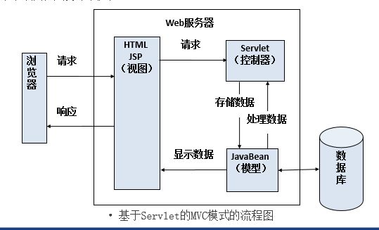
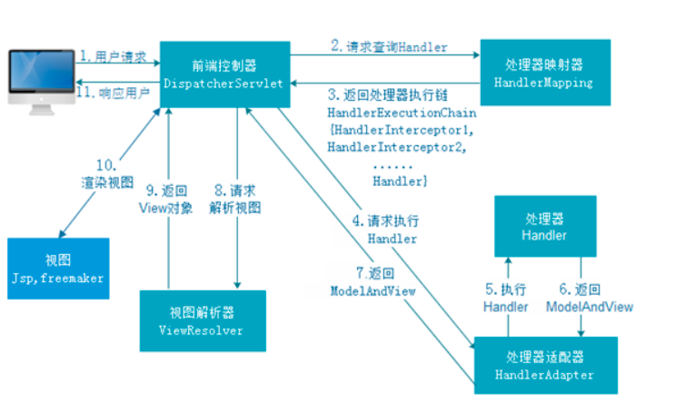

# Spring MVC

## 1.Spring MVC的简介

Spring MVC属于SpringFrameWork的==后续产品==，已经融合在Spring Web Flow里面。Spring 框架提供了构建 [Web](https://baike.baidu.com/item/Web/150564) 应用程序的全功能 ==MVC== 模块。使用 Spring 可插入的 MVC 架构，从而在使用Spring进行WEB开发时，可以选择使用Spring的Spring MVC框架或集成其他MVC开发框架，如Struts1(现在一般不用)，Struts 2(一般==老项目==使用)等等。

## 2.MVC模式

MVC是Model、View、Controller的缩写，分别代表Web应用程序中3中职责

1. 模型(Model)：用户存储数据级处理用户请求的业务逻辑
2. 视图(View)：向控制台提交数据，显示模型中的数据
3. 控制器(Controller)：根据视图提出的请求判断将请求和数据交给哪个模型处理，将处理后的关系结果交给哪个视图更新显示

> 关于Servlet的MVC模式？(jd_2003)

1. 模型：一个或多个JavaBean
2. 视图：一个或多个JSP页面
3. 控制器：一个或多个==Servlet==对象

## 3.Spring MVC的工作原理

SpringMVC的工作流程

1. 客户端请求提交到DispatherServlet（核心控制器）
2. 由DispatherServlet控制器寻找一个或多个HandlerMapping，找到处理请求的Controller
3. DispatherServlet将请求提交到Controller
4. Controller调用业务逻辑处理后返回ModelAndView（==对象+视图组成==）
5. DispatherServlet寻找一个或多个ViewResolver（视图解析器），找到ModelAndView指定的视图
6. 视图负责将结果显示到客户端

## 4.Spring MVC环境搭建

环境搭建步骤

1. 创建Maven Web项目（==选择maven web的骨架结构==）
2. 在pom.xml中编写Spring MVC的所有jar包的坐标（==下载到我们的本地仓库==）
3. 在web.xml中配置核心控制器（==DispatcherServlet==）
4. 配置处理POST请求乱码的过滤器(==Spring中自带该过滤器==)

注：如果在web.xml文件中没有指定springmvc的配置文件，那么springmvc会自动在WEB-INF目录下寻找名为DispatcherServlet-*.xml

## 5.Spring MVC快速入门（xml版）

**编写DispatcherServlet-servlet.xml**

