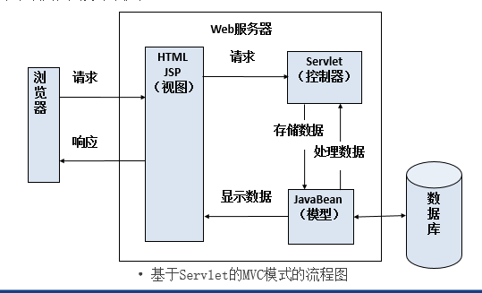

# Spring MVC

## 1.Spring MVC的简介

Spring MVC属于SpringFrameWork的==后续产品==，已经融合在Spring Web Flow里面。Spring 框架提供了构建 [Web](https://baike.baidu.com/item/Web/150564) 应用程序的全功能 ==MVC== 模块。使用 Spring 可插入的 MVC 架构，从而在使用Spring进行WEB开发时，可以选择使用Spring的Spring MVC框架或集成其他MVC开发框架，如Struts1(现在一般不用)，Struts 2(一般==老项目==使用)等等。

## 2.MVC模式

MVC是Model、View、Controller的缩写，分别代表Web应用程序中3中职责

1. 模型(Model)：用户存储数据级处理用户请求的业务逻辑
2. 视图(View)：向控制台提交数据，显示模型中的数据
3. 控制器(Controller)：根据视图提出的请求判断将请求和数据交给哪个模型处理，将处理后的关系结果交给哪个视图更新显示

> 关于Servlet的MVC模式？(jd_2003)

1. 模型：一个或多个JavaBean
2. 视图：一个或多个JSP页面
3. 控制器：一个或多个==Servlet==对象




## 3.Spring MVC的工作原理


SpringMVC的工作流程

1. 客户端请求提交到DispatherServlet（核心控制器）
2. 由DispatherServlet控制器寻找一个或多个HandlerMapping，找到处理请求的Controller
3. DispatherServlet将请求提交到Controller
4. Controller调用业务逻辑处理后返回ModelAndView（==对象+视图组成==）
5. DispatherServlet寻找一个或多个ViewResolver（视图解析器），找到ModelAndView指定的视图
6. 视图负责将结果显示到客户端

## 4.Spring MVC环境搭建

环境搭建步骤

1. 创建Maven Web项目（==选择maven web的骨架结构==）
2. 在pom.xml中编写Spring MVC的所有jar包的坐标（==下载到我们的本地仓库==）
3. 在web.xml中配置核心控制器（==DispatcherServlet==）
4. 配置处理POST请求乱码的过滤器(==Spring中自带该过滤器==)

配置web.xml文件

```xml
<?xml version="1.0" encoding="UTF-8"?>
<web-app xmlns="http://xmlns.jcp.org/xml/ns/javaee"
         xmlns:xsi="http://www.w3.org/2001/XMLSchema-instance"
         xsi:schemaLocation="http://xmlns.jcp.org/xml/ns/javaee http://xmlns.jcp.org/xml/ns/javaee/web-app_4_0.xsd"
         version="4.0">

    <!-- 配置Spring MVC核心控制器 -->
    <servlet>
        <servlet-name>DispatcherServlet</servlet-name>
        <servlet-class>org.springframework.web.servlet.DispatcherServlet</servlet-class>
    </servlet>
    <servlet-mapping>
        <servlet-name>DispatcherServlet</servlet-name>
        <url-pattern>*.action</url-pattern>
    </servlet-mapping>

    <!-- 配置Spring提供的针对于POST请求的中文乱码问题 -->
    <filter>
        <filter-name>CharacterEncodingFilter</filter-name>
        <filter-class>org.springframework.web.filter.CharacterEncodingFilter</filter-class>
        <init-param>
            <param-name>encoding</param-name>
            <param-value>utf-8</param-value>
        </init-param>
    </filter>
    <filter-mapping>
        <filter-name>CharacterEncodingFilter</filter-name>
        <url-pattern>/*</url-pattern>
    </filter-mapping>
</web-app>
```

<font color="red">注：如果在web.xml文件中没有指定springmvc的配置文件，那么springmvc会自动在WEB-INF目录下寻找名为DispatcherServlet-*.xml</font>

## 5.Spring MVC快速入门（xml版）

**编写DispatcherServlet-servlet.xml**

```xml
<?xml version="1.0" encoding="UTF-8"?>
<beans xmlns="http://www.springframework.org/schema/beans"
       xmlns:xsi="http://www.w3.org/2001/XMLSchema-instance"
       xsi:schemaLocation="http://www.springframework.org/schema/beans http://www.springframework.org/schema/beans/spring-beans.xsd">

    <!--
        注册action
            class：表示处理类的全路径名
            name：表示请求路径
            必须配置
     -->
    <bean name="/hello.action" class="app01.HelloAction"/>

    <!--
        映射器
        BeanNameUrlHandlerMapping表示bean的name属性当作url请求
        可选
     -->
    <bean class="org.springframework.web.servlet.handler.BeanNameUrlHandlerMapping"/>

    <!--
        适配器
        SimpleControllerHandlerAdapter表示查找实现了Controller接口的Action类
        可选
    -->
    <bean class="org.springframework.web.servlet.mvc.SimpleControllerHandlerAdapter"/>

    <!--
        视图解析器
        InternalResourceViewResolver表示通过ModelAndView对象中的视图名到真正的页面
        可选
     -->
    <bean class="org.springframework.web.servlet.view.InternalResourceViewResolver"/>
</beans>
```

```java
package app01;

import org.springframework.web.servlet.ModelAndView;
import org.springframework.web.servlet.mvc.Controller;

import javax.servlet.http.HttpServletRequest;
import javax.servlet.http.HttpServletResponse;

public class HelloAction implements Controller {

    public HelloAction(){
        System.out.println("HelloAction-->" + this.hashCode());
    }

    @Override
    public ModelAndView handleRequest(HttpServletRequest httpServletRequest, HttpServletResponse httpServletResponse) throws Exception {
        System.out.println("HelloAction:handleRequest()");
        //ModelAndView表示视图封装数据和真实路径
        ModelAndView modelAndView = new ModelAndView();
        //封装数据
        modelAndView.addObject("message","这是我们第一个Spring MVC应用程序，映射器_适配器_视图解析器都可以省略...");
        //封装视图（完整的视图路径）
        modelAndView.setViewName("/jsp/success.jsp");
        return modelAndView;
    }
}
```

<font color="red">注：Spring MVC为单例的，scope="singleton"</font>

## 6.自定义的spring.xml配置文件

指定加载spring.xml文件

```xml
<init-param>
	<param-name>contextConfigLocation</param-name>
    <param-value>classpath:spring.xml</param-value>
</init-param>
```

**配置视图解析器（spring.xml）**

```xml
<?xml version="1.0" encoding="UTF-8"?>
<beans xmlns="http://www.springframework.org/schema/beans"
       xmlns:xsi="http://www.w3.org/2001/XMLSchema-instance"
       xsi:schemaLocation="http://www.springframework.org/schema/beans http://www.springframework.org/schema/beans/spring-beans.xsd">

    <!-- 注册Action（必） -->
    <bean name="/hello.action" class="app02.HelloAction"/>

    <!--
        如果Action中书写的是视图逻辑名称，那么视图解析器必须配置
        如果Action中书写的是视图的完整名称，那么视图解析器就是可选配置
     -->
    <bean class="org.springframework.web.servlet.view.InternalResourceViewResolver">
        <!-- /jsp/success.jsp -->
        <!-- 路径前缀 -->
        <property name="prefix" value="/jsp/"/>
        <!-- 路径后缀 -->
        <property name="suffix" value=".jsp"/>
        <!-- 前缀 + 视图逻辑名 + 后缀 = 真实路径（/jsp/success.jsp） -->
    </bean>
</beans>
```

```java
package app02;

import org.springframework.web.servlet.ModelAndView;
import org.springframework.web.servlet.mvc.Controller;

import javax.servlet.http.HttpServletRequest;
import javax.servlet.http.HttpServletResponse;

public class HelloAction implements Controller {

    @Override
    public ModelAndView handleRequest(HttpServletRequest httpServletRequest, HttpServletResponse httpServletResponse) throws Exception {
        //实例化ModelAndView对象
        ModelAndView modelAndView = new ModelAndView();
        //封装数据
        modelAndView.addObject("message","这是我们第二个Spring MVC应用程序...");
        //原来是如何实现的呢？
        //modelAndView.setViewName("/jsp/success.jsp");
        //现在封装视图的逻辑名称
        modelAndView.setViewName("success");
        return modelAndView;
    }
}
```

## 7.第一个Spring MVC应用注解版

> 使用基于注解的控制器有什么优点？

1. 在基于注解的控制器中，可以编写多个处理方法，进而可以处理多个请求，这就允许将相关的操作编写在一个控制类中，从而减少控制器类的数量，方便以后的维护
2. 基于注解的控制器不需要在配置文件中部署映射，仅需要使用@RequestMapping注解去注解一个方法进行请求处理

**@Controller注解**

概述：在Spring MVC中，使用@Controller注解类型声明某类的实例是一个控制器

**@RequestMapping注解**

概述：在基于注解的控制类中，可以为每个请求编写对应的处理方法。使用@RequestMapping注解将请求和处理方法一一对应，@RequestMapping注解类型有两种。

1. 方法级别

   方法级别的@RequestMapping注解作用在处理方法上。该注解的value属性将请求URL映射到方法，value属性是改注解的默认属性，如果只有一个value属性，则可以省略该属性。

2. 类级别

   在类级别注解的情况下，控制类中所有方法都将映射为类级别请求

<font color=red>注：为了方便维护程序，建议开发者使用类级别注解，将相关处理放在同一个控制类中</font>

```xml
<?xml version="1.0" encoding="UTF-8"?>
<beans xmlns="http://www.springframework.org/schema/beans"
       xmlns:xsi="http://www.w3.org/2001/XMLSchema-instance"
       xmlns:context="http://www.springframework.org/schema/context"
       xsi:schemaLocation="http://www.springframework.org/schema/beans http://www.springframework.org/schema/beans/spring-beans.xsd http://www.springframework.org/schema/context https://www.springframework.org/schema/context/spring-context.xsd">

    <!-- 让Spring IOC容器扫描带有@Controller的类 -->
    <context:component-scan base-package="app03"/>

    <!-- 配置视图解析器 -->
    <bean class="org.springframework.web.servlet.view.InternalResourceViewResolver">
        <property name="prefix" value="/jsp/"/>
        <property name="suffix" value=".jsp"/>
    </bean>
</beans>
```

```java
package app03;

import org.springframework.stereotype.Controller;
import org.springframework.ui.Model;
import org.springframework.web.bind.annotation.RequestMapping;

@Controller
public class HelloAction {

    /**
     * 业务方法
     * 只要是/hello.action的请求，都会由HelloAction对象中的hello()方法处理
     *
     * @param model
     * @return
     * @throws Exception
     */
    @RequestMapping(value = "/hello.action")
    public String hello(Model model) throws Exception{
        System.out.println("HelloAction():hello()");
        //保存数据
        model.addAttribute("message","加油，大数据2003...");
        //返回逻辑视图名
        return "success";
    }

    /**
     * 业务方法
     * 只要是/hello.action的请求，都会由都会由HelloAction对象中的bye()方法处理
     * @param model
     * @return
     * @throws Exception
     */
    @RequestMapping(value = "/bye.action")
    public String bye(Model model) throws Exception{
        System.out.println("HelloAction():bye()");
        //保存数据
        model.addAttribute("message","战胜困难，大数据2003...");
        return "success";
    }
}
```

## 8.在action中写多个业务控制方法

```xml
<?xml version="1.0" encoding="UTF-8"?>
<beans xmlns="http://www.springframework.org/schema/beans"
       xmlns:xsi="http://www.w3.org/2001/XMLSchema-instance"
       xmlns:context="http://www.springframework.org/schema/context"
       xsi:schemaLocation="http://www.springframework.org/schema/beans http://www.springframework.org/schema/beans/spring-beans.xsd http://www.springframework.org/schema/context https://www.springframework.org/schema/context/spring-context.xsd">

    <!-- 开启注解扫描 -->
    <context:component-scan base-package="app04"/>
</beans>
```

```java
package app04;

import org.springframework.stereotype.Controller;
import org.springframework.ui.Model;
import org.springframework.web.bind.annotation.RequestMapping;

@Controller
@RequestMapping("/user")
public class UserAction {

    //URL：/user/register
    /**
     * 用户注册
     * @param model
     * @return
     * @throws Exception
     */
    @RequestMapping(value = "/register")
    public String register(Model model) throws Exception{
        //保存数据
        model.addAttribute("message","员工注册成功...");
        return "/jsp/success.jsp";
    }
}
```

**My97时间控件**

1. 下载时间控件

2. 引入时间控件

   ```jsp
   <script type="text/javascript" src="${pageContext.request.contextPath}/js/My97DatePicker/WdatePicker.js"></script>
   ```

3. 设置单击事件

4. 使用控件进行日期选择


```java
package app04;

import org.springframework.stereotype.Controller;
import org.springframework.ui.Model;
import org.springframework.web.bind.annotation.RequestMapping;

@Controller
@RequestMapping("/user")
public class UserAction {

    //URL：/user/register
    /**
     * 用户注册
     * @param model
     * @return
     * @throws Exception
     */
    @RequestMapping(value = "/register")
    public String register(Model model) throws Exception{
        //保存数据
        model.addAttribute("message","员工注册成功...");
        return "/jsp/success.jsp";
    }

    /**
     * 员工登录
     * @param model
     * @return
     * @throws Exception
     */
    @RequestMapping("/login")
    public String login(Model model) throws Exception{
        //保存数据
        model.addAttribute("message","员工登录成功...");
        return "/jsp/success.jsp";
    }
}
```

## 9.在业务控制方法中接收参数

> 如何在业务控制方法中接收参数？

1. 通过处理方法的形参接收请求参数（@RequestParam注解）
2. 通过实体bean接收请求参数
3. 通过HttpServletRequest接收请求参数
4. @PathVariable注解接收URL中的请求参数

```xml
<?xml version="1.0" encoding="UTF-8"?>
<beans xmlns="http://www.springframework.org/schema/beans"
       xmlns:xsi="http://www.w3.org/2001/XMLSchema-instance"
       xmlns:context="http://www.springframework.org/schema/context"
       xsi:schemaLocation="http://www.springframework.org/schema/beans http://www.springframework.org/schema/beans/spring-beans.xsd http://www.springframework.org/schema/context https://www.springframework.org/schema/context/spring-context.xsd">

    <!-- 开启注解扫描 -->
    <context:component-scan base-package="app05"/>
</beans>
```

```java
package app05;

import org.springframework.stereotype.Controller;
import org.springframework.ui.Model;
import org.springframework.web.bind.annotation.RequestMapping;
import org.springframework.web.bind.annotation.RequestMethod;

@Controller
@RequestMapping(value = "/user")
public class UserAction {

    /**
     * 用户注册，只能接收POST请求
     * @param model
     * @param username
     * @param salary
     * @return
     * @throws Exception
     */
    @RequestMapping(method = RequestMethod.POST,value = "/register")
    public String register(Model model,String username,double salary) throws Exception{
        System.out.println("用户注册-->" + username + "：" + salary);
        //保存数据
        model.addAttribute("message","员工注册成功...");
        return "/jsp/success.jsp";
    }

    //如果执行method = RequestMethod.POST，那么GET/POST均可
    /**
     * 员工登录，既能接收POST请求也能接收GET请求
     * @param model
     * @param username
     * @return
     * @throws Exception
     */
    //@RequestMapping(value = "/login")
    //等价于下面的写法
    @RequestMapping(value = "/login",method = {RequestMethod.POST,RequestMethod.GET})
    public String login(Model model,String username) throws Exception{
        System.out.println("用户名-->" + username);
        //保存数据
        model.addAttribute("message","员工登录成功...");
        return "/jsp/success.jsp";
    }
}
```

<font color="red">注：业务控制方法的参数名称必须与页面表单中的控件名一致</font>

## 10.在业务控制方法中写入传统的Web参数

> Spring MVC在业务方法中可以传递哪些Web应用参数？

1. HttpServletRequest：请求=>请求转发
2. HttpServletReponse：响应=>重定向
3. HttpSession：会话=>可以将数据直接保存到会话中

```java
package app06;

import org.springframework.stereotype.Controller;
import org.springframework.web.bind.annotation.RequestMapping;
import org.springframework.web.bind.annotation.RequestMethod;

import javax.servlet.http.HttpServletRequest;
import javax.servlet.http.HttpServletResponse;

@Controller
@RequestMapping(value = "/user")
public class UserAction {

    /**
     * 用户注册，只能接收POST请求
     * @param request
     * @param response
     * @return
     * @throws Exception
     */
    @RequestMapping(method = RequestMethod.POST,value = "/register")
    public String register(HttpServletRequest request, HttpServletResponse response) throws Exception{
        //获取用户名和薪水
        String username = request.getParameter("username");
        String salary = request.getParameter("salary");
        System.out.println("用户注册-->" + username + ":" + salary);
        //将用户名和薪水保存到session对象中
        request.getSession().setAttribute("username",username);
        request.getSession().setAttribute("salary",salary);
        //推荐使用（SpringMVC）=>转发到一个视图
        //return "/jsp/success.jsp";
        //Servlet API中的请求转发
        //request.getRequestDispatcher("/jsp/success.jsp").forward(request,response);
        //对于Servlet API中的请求转发，在Spring MVC中如何实现
        //return "forward:/jsp/success.jsp";
        //Servlet API中的重定向
        //response.sendRedirect(request.getContextPath() + "/jsp/success.jsp");
        //对于Servlet API中的重定向，在Spring MVC中如何实现
        return "redirect:/jsp/success.jsp";
    }
}
```

## 11.@RequestParam注解获取参数

**@RequestParam注解**

概述：通过处理方法的形参接收请求参数

> @RequestParam注解有哪些属性？

1. value属性：参数名

2. required属性：是否必须，有两个值分别为true和false，如果不加该属性，默认为required=true

   <font color=red>注：可以简化为，@RequestParam String username</font>

3. defaultValue属性：该参数的默认值

   <font color="red">注：如果没有传递该参数，则该参数为此属性设置的默认值</font>


```java
package app07;

import org.springframework.stereotype.Controller;
import org.springframework.web.bind.annotation.RequestMapping;
import org.springframework.web.bind.annotation.RequestMethod;
import org.springframework.web.bind.annotation.RequestParam;

import javax.servlet.http.HttpSession;

@Controller
@RequestMapping(value = "/user")
public class UserAction {

    @RequestMapping(method = RequestMethod.POST,value = "/register")
    public String register(@RequestParam String username, @RequestParam double salary, HttpSession session) throws Exception{
        System.out.println("用户注册-->" + username + ":" + salary);
        //将数据保存到session对象中
        session.setAttribute("username",username);
        session.setAttribute("salary",salary);
        //重定向
        return "redirect:/jsp/success.jsp";
    }
}
```

