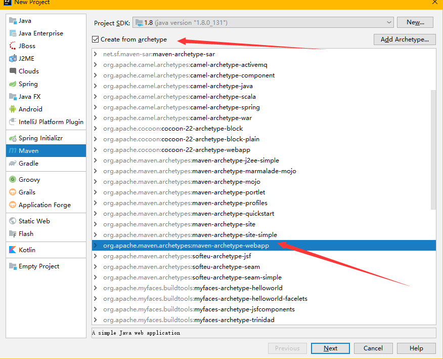
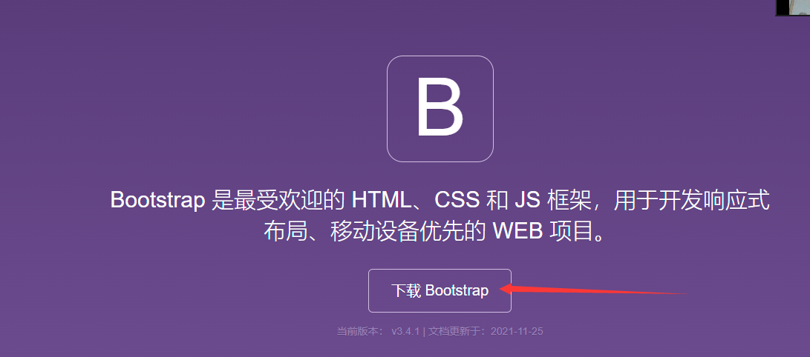
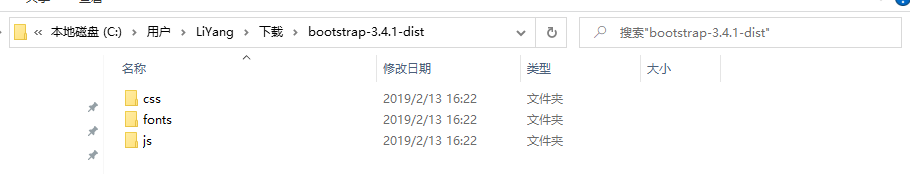

# SSM框架整合（学生信息管理系统）

## 1.系统数据库设计

**管理员表**

```sql
DROP TABLE IF EXISTS `admin`;

CREATE TABLE `admin` (
  -- 管理员编号  
  `id` int(11) NOT NULL AUTO_INCREMENT,
  -- 用户名  
  `username` varchar(20) DEFAULT NULL,
  -- 密码  
  `password` varchar(20) DEFAULT NULL,
  -- 真实姓名  
  `name` varchar(20) DEFAULT NULL,
  PRIMARY KEY (`id`)
) ENGINE=InnoDB AUTO_INCREMENT=2 DEFAULT CHARSET=utf8;
```

**课程表**

```sql
DROP TABLE IF EXISTS `course`;

CREATE TABLE `course` (
  -- 课程号
  `id` int(11) NOT NULL,
  -- 课程名  
  `name` varchar(20) DEFAULT NULL,
  -- 教工号  
  `teacher_id` int(11) DEFAULT NULL,
  PRIMARY KEY (`id`),
  KEY `teacher_course` (`teacher_id`)
) ENGINE=InnoDB DEFAULT CHARSET=utf8;
```

**成绩表**

```sql
DROP TABLE IF EXISTS `score`;

CREATE TABLE `score` (
  -- 成绩号  
  `id` int(11) NOT NULL AUTO_INCREMENT,
  -- 学生学号	
  `student_id` int(11) DEFAULT NULL,
  -- 课程号  
  `course_id` int(11) DEFAULT NULL,
  -- 成绩  
  `score` double(6,1) DEFAULT NULL,
  PRIMARY KEY (`id`),
  KEY `stu_score` (`student_id`),
  KEY `course_score` (`course_id`)
) ENGINE=InnoDB AUTO_INCREMENT=6 DEFAULT CHARSET=utf8;
```

**学生表**

```sql
DROP TABLE IF EXISTS `student`;

CREATE TABLE `student` (
  -- 学号  
  `id` int(11) NOT NULL AUTO_INCREMENT,
  -- 姓名  
  `name` varchar(20) DEFAULT NULL,
  -- 密码  
  `password` varchar(20) DEFAULT NULL,
  -- 性别  
  `sex` int(20) DEFAULT NULL,
  -- 班级  
  `clazz` varchar(20) DEFAULT NULL,
  -- 出生日期  
  `birthday` varchar(20) DEFAULT NULL,
  PRIMARY KEY (`id`)
) ENGINE=InnoDB AUTO_INCREMENT=107 DEFAULT CHARSET=utf8;
```

**教师表**

```sql
DROP TABLE IF EXISTS `teacher`;

CREATE TABLE `teacher` (
  -- 教工号  
  `id` int(11) NOT NULL,
  -- 姓名  
  `name` varchar(20) DEFAULT NULL,
  -- 密码  
  `password` varchar(20) DEFAULT NULL,
  -- 性别  
  `sex` int(11) DEFAULT NULL,
  -- 出生日期  
  `birthday` varchar(20) DEFAULT NULL,
  -- 课程编号  
  `course_id` int(11) DEFAULT NULL,
  -- 职称  
  `professional` varchar(20) DEFAULT NULL,
  -- 薪水  
  `salary` int(11) DEFAULT NULL,
  PRIMARY KEY (`id`),
  KEY `course_teacher` (`course_id`),
  CONSTRAINT `course_teacher` FOREIGN KEY (`course_id`) REFERENCES `course` (`Id`) ON DELETE CASCADE ON UPDATE CASCADE
) ENGINE=InnoDB DEFAULT CHARSET=utf8;
```

**创建数据库并插入测试数据**

```sql
/*
SQLyog Ultimate v11.25 (64 bit)
MySQL - 5.5.56 : Database - studentdb
*********************************************************************
*/


/*!40101 SET NAMES utf8 */;

/*!40101 SET SQL_MODE=''*/;

/*!40014 SET @OLD_UNIQUE_CHECKS=@@UNIQUE_CHECKS, UNIQUE_CHECKS=0 */;
/*!40014 SET @OLD_FOREIGN_KEY_CHECKS=@@FOREIGN_KEY_CHECKS, FOREIGN_KEY_CHECKS=0 */;
/*!40101 SET @OLD_SQL_MODE=@@SQL_MODE, SQL_MODE='NO_AUTO_VALUE_ON_ZERO' */;
/*!40111 SET @OLD_SQL_NOTES=@@SQL_NOTES, SQL_NOTES=0 */;
CREATE DATABASE /*!32312 IF NOT EXISTS*/`studentdb` /*!40100 DEFAULT CHARACTER SET utf8 */;

USE `studentdb`;

/*Table structure for table `admin` */

DROP TABLE IF EXISTS `admin`;

CREATE TABLE `admin` (
  `id` int(11) NOT NULL AUTO_INCREMENT,
  `username` varchar(20) DEFAULT NULL,
  `password` varchar(20) DEFAULT NULL,
  `name` varchar(20) DEFAULT NULL,
  PRIMARY KEY (`id`)
) ENGINE=InnoDB AUTO_INCREMENT=2 DEFAULT CHARSET=utf8;

/*Data for the table `admin` */

insert  into `admin`(`id`,`username`,`password`,`name`) values (1,'admin','admin','超级管理员');

/*Table structure for table `course` */

DROP TABLE IF EXISTS `course`;

CREATE TABLE `course` (
  `id` int(11) NOT NULL,
  `name` varchar(20) DEFAULT NULL,
  `teacher_id` int(11) DEFAULT NULL,
  PRIMARY KEY (`id`),
  KEY `teacher_course` (`teacher_id`)
) ENGINE=InnoDB DEFAULT CHARSET=utf8;

/*Data for the table `course` */

insert  into `course`(`id`,`name`,`teacher_id`) values (1,'面向对象程序设计',201),(2,'软件项目管理',202),(3,'基于ssm框架项目开发',203);

/*Table structure for table `score` */

DROP TABLE IF EXISTS `score`;

CREATE TABLE `score` (
  `id` int(11) NOT NULL AUTO_INCREMENT,
  `student_id` int(11) DEFAULT NULL,
  `course_id` int(11) DEFAULT NULL,
  `score` double(6,1) DEFAULT NULL,
  PRIMARY KEY (`id`),
  KEY `stu_score` (`student_id`),
  KEY `course_score` (`course_id`)
) ENGINE=InnoDB AUTO_INCREMENT=6 DEFAULT CHARSET=utf8;

/*Data for the table `score` */

insert  into `score`(`id`,`student_id`,`course_id`,`score`) values (1,101,1,100.0),(2,102,1,99.0),(3,102,2,88.0),(4,101,3,222.0),(5,101,2,44.0);

/*Table structure for table `student` */

DROP TABLE IF EXISTS `student`;

CREATE TABLE `student` (
  `id` int(11) NOT NULL AUTO_INCREMENT,
  `name` varchar(20) DEFAULT NULL,
  `password` varchar(20) DEFAULT NULL,
  `sex` int(20) DEFAULT NULL,
  `clazz` varchar(20) DEFAULT NULL,
  `birthday` varchar(20) DEFAULT NULL,
  PRIMARY KEY (`id`)
) ENGINE=InnoDB AUTO_INCREMENT=107 DEFAULT CHARSET=utf8;

/*Data for the table `student` */

insert  into `student`(`id`,`name`,`password`,`sex`,`clazz`,`birthday`) values (102,'萧炎亮','0000',0,'13软件1','1995-08-01'),(103,'叶凡凯','0000',1,'13软件1','1994-01-23'),(104,'李牧尘','1111',0,'13软件1','1997-12-05'),(105,'刘红枫','0000',1,'13软件2','1995-11-15'),(106,'叶一','0000',1,'13软件2','1996-12-12');

/*Table structure for table `teacher` */

DROP TABLE IF EXISTS `teacher`;

CREATE TABLE `teacher` (
  `id` int(11) NOT NULL,
  `name` varchar(20) DEFAULT NULL,
  `password` varchar(20) DEFAULT NULL,
  `sex` int(11) DEFAULT NULL,
  `birthday` varchar(20) DEFAULT NULL,
  `course_id` int(11) DEFAULT NULL,
  `professional` varchar(20) DEFAULT NULL,
  `salary` int(11) DEFAULT NULL,
  PRIMARY KEY (`id`),
  KEY `course_teacher` (`course_id`),
  CONSTRAINT `course_teacher` FOREIGN KEY (`course_id`) REFERENCES `course` (`Id`) ON DELETE CASCADE ON UPDATE CASCADE
) ENGINE=InnoDB DEFAULT CHARSET=utf8;

/*Data for the table `teacher` */

insert  into `teacher`(`id`,`name`,`password`,`sex`,`birthday`,`course_id`,`professional`,`salary`) values (201,'李青山','0000',1,'1965-01-01',1,'教授',3000),(202,'唐嫣然','0000',1,'1968-01-01',2,'教授',8000),(203,'萧玄茂','0000',1,'1978-01-01',3,'高级教师',9008);

/*!40101 SET SQL_MODE=@OLD_SQL_MODE */;
/*!40014 SET FOREIGN_KEY_CHECKS=@OLD_FOREIGN_KEY_CHECKS */;
/*!40014 SET UNIQUE_CHECKS=@OLD_UNIQUE_CHECKS */;
/*!40111 SET SQL_NOTES=@OLD_SQL_NOTES */;
```

## 2.项目搭建

### 2.1 创建项目



### 2.2 导入依赖

```xml
<?xml version="1.0" encoding="UTF-8"?>

<project xmlns="http://maven.apache.org/POM/4.0.0" xmlns:xsi="http://www.w3.org/2001/XMLSchema-instance"
  xsi:schemaLocation="http://maven.apache.org/POM/4.0.0 http://maven.apache.org/xsd/maven-4.0.0.xsd">
  <modelVersion>4.0.0</modelVersion>

  <groupId>com.lnboxue</groupId>
  <artifactId>student_2003</artifactId>
  <version>1.0-SNAPSHOT</version>
  <packaging>war</packaging>

  <dependencies>
    <!-- Junit -->
    <dependency>
      <groupId>junit</groupId>
      <artifactId>junit</artifactId>
      <version>4.12</version>
      <scope>test</scope>
    </dependency>
    <!-- 数据库驱动 -->
    <dependency>
      <groupId>mysql</groupId>
      <artifactId>mysql-connector-java</artifactId>
      <version>5.1.47</version>
    </dependency>
    <!-- druid -->
    <dependency>
      <groupId>com.alibaba</groupId>
      <artifactId>druid</artifactId>
      <version>1.1.20</version>
    </dependency>
    <!-- Mybatis -->
    <dependency>
      <groupId>org.mybatis</groupId>
      <artifactId>mybatis</artifactId>
      <version>3.5.2</version>
    </dependency>
    <dependency>
      <groupId>org.mybatis</groupId>
      <artifactId>mybatis-spring</artifactId>
      <version>2.0.2</version>
    </dependency>
    <!-- Spring -->
    <dependency>
      <groupId>org.springframework</groupId>
      <artifactId>spring-webmvc</artifactId>
      <version>5.1.9.RELEASE</version>
    </dependency>
    <dependency>
      <groupId>org.aspectj</groupId>
      <artifactId>aspectjweaver</artifactId>
      <version>1.9.4</version>
    </dependency>
    <dependency>
      <groupId>org.springframework</groupId>
      <artifactId>spring-jdbc</artifactId>
      <version>5.1.9.RELEASE</version>
    </dependency>
    <!-- Jackson -->
    <dependency>
      <groupId>com.fasterxml.jackson.core</groupId>
      <artifactId>jackson-databind</artifactId>
      <version>2.9.8</version>
    </dependency>
    <!-- FileUpload -->
    <dependency>
      <groupId>commons-fileupload</groupId>
      <artifactId>commons-fileupload</artifactId>
      <version>1.2.2</version>
    </dependency>
    <dependency>
      <groupId>commons-io</groupId>
      <artifactId>commons-io</artifactId>
      <version>2.4</version>
    </dependency>
    <!-- pagehelper -->
    <dependency>
      <groupId>com.github.pagehelper</groupId>
      <artifactId>pagehelper</artifactId>
      <version>5.1.9</version>
    </dependency>
    <!-- JSR303 hibernate-validator -->
    <dependency>
      <groupId>org.hibernate</groupId>
      <artifactId>hibernate-validator</artifactId>
      <version>5.1.0.Final</version>
    </dependency>
    <!-- Servlet - JSP -->
    <dependency>
      <groupId>javax.servlet</groupId>
      <artifactId>javax.servlet-api</artifactId>
      <version>3.0.1</version>
      <scope>provided</scope>
    </dependency>
    <dependency>
      <groupId>javax.servlet.jsp</groupId>
      <artifactId>jsp-api</artifactId>
      <version>2.1</version>
      <scope>provided</scope>
    </dependency>
    <dependency>
      <groupId>javax.servlet.jsp.jstl</groupId>
      <artifactId>jstl-api</artifactId>
      <version>1.2</version>
    </dependency>
    <dependency>
      <groupId>taglibs</groupId>
      <artifactId>standard</artifactId>
      <version>1.1.2</version>
    </dependency>
    <!-- logback -->
    <!-- 接口 -->
    <dependency>
      <groupId>org.slf4j</groupId>
      <artifactId>slf4j-api</artifactId>
      <version>1.7.30</version>
    </dependency>
    <!-- 实现类 -->
    <dependency>
      <groupId>ch.qos.logback</groupId>
      <artifactId>logback-classic</artifactId>
      <version>1.1.2</version>
    </dependency>
    <dependency>
      <groupId>ch.qos.logback</groupId>
      <artifactId>logback-core</artifactId>
      <version>1.1.2</version>
    </dependency>
    <dependency>
      <groupId>org.logback-extensions</groupId>
      <artifactId>logback-ext-spring</artifactId>
      <version>0.1.1</version>
    </dependency>
  </dependencies>
  <!-- 解决maven项目无法读取src/main/java目录下面的配置文件问题 -->
  <build>
    <resources>
      <resource>
        <directory>src/main/java</directory>
        <includes>
          <include>**/*.properties</include>
          <include>**/*.xml</include>
        </includes>
        <filtering>false</filtering>
      </resource>
      <resource>
        <directory>src/main/resources</directory>
        <includes>
          <include>**/*.properties</include>
          <include>**/*.xml</include>
        </includes>
        <filtering>false</filtering>
      </resource>
    </resources>
  </build>

</project>
```

### 2.3 配置web.xml

```xml
<?xml version="1.0" encoding="UTF-8"?>
<web-app xmlns="http://xmlns.jcp.org/xml/ns/javaee"
         xmlns:xsi="http://www.w3.org/2001/XMLSchema-instance"
         xsi:schemaLocation="http://xmlns.jcp.org/xml/ns/javaee http://xmlns.jcp.org/xml/ns/javaee/web-app_4_0.xsd"
         version="4.0">

    <!-- DispatcherServlet -->
    <servlet>
        <servlet-name>DispatcherServlet</servlet-name>
        <servlet-class>org.springframework.web.servlet.DispatcherServlet</servlet-class>
        <!--<init-param>
            <param-name>contextConfigLocation</param-name>
            <param-value>classpath:applicationContext.xml</param-value>
        </init-param>-->
        <load-on-startup>1</load-on-startup>
    </servlet>
    <servlet-mapping>
        <servlet-name>DispatcherServlet</servlet-name>
        <url-pattern>/</url-pattern>
    </servlet-mapping>

    <!-- CharacterEncodingFilter -->
    <filter>
        <filter-name>encodingFilter</filter-name>
        <filter-class>org.springframework.web.filter.CharacterEncodingFilter</filter-class>
        <init-param>
            <param-name>encoding</param-name>
            <param-value>utf-8</param-value>
        </init-param>
    </filter>
    <filter-mapping>
        <filter-name>encodingFilter</filter-name>
        <url-pattern>/*</url-pattern>
    </filter-mapping>

    <!-- logback -->
    <!--<context-param>
        <param-name>logbackConfigLocation</param-name>
        <param-value>classpath:logback.xml</param-value>
    </context-param>
    <listener>
        <listener-class>ch.qos.logback.ext.spring.web.LogbackConfigListener</listener-class>
    </listener>-->

    <!-- Session过期时间 -->
    <session-config>
        <session-timeout>15</session-timeout>
    </session-config>
</web-app>
```

### 2.4 SSM整合配置

**数据库信息配置**

```properties
#jdbc.driver=com.mysql.cj.jdbc.Driver
jdbc.driver=com.mysql.jdbc.Driver
#如果使用的是MySQL8.0+,增加一个时区的配置，即serverTimezone=Asia/Shanghai
jdbc.url=jdbc:mysql://localhost:3306/student_2003?useSSL=true&useUnicode=true&characterEncoding=utf8
jdbc.username=root
jdbc.password=123456
```

**logback日志**

```xml
<?xml version="1.0" encoding="UTF-8"?>
<configuration scan="true" scanPeriod="60 seconds" debug="false">
    <!--
   `根节点<configuration>包含的属性：
        scan：当此属性设置为true时，配置文件如果发生改变，将会被重新加载，默认值为true。
        scanPeriod：设置监测配置文件是否有修改的时间间隔，如果没有给出时间单位，默认单位是毫秒。当scan为true时，此属性生效。默认的时间间隔为1分钟。
        debug：当此属性设置为true时，将打印出logback内部日志信息，实时查看logback运行状态。默认值为false。
    -->
    <!-- 定义参数常量 -->
    <!-- TRACE < DEBUG < INFO < WARN <ERROR -->
    <property name="log.level" value="debug"/>
    <property name="log.maxHistory" value="30"/>     <!--文件最大保存历史数量,30-->
    <property name="log.filePath" value="D:/log"/> <!--标识这个日志储存的根路径-->
    <property name="log.pattern" value="%d{yyyy-MM-dd HH:mm:ss.SSS}[%thread]%-5level%logger{50}-%msg%n"/>  <!--日志展现的格式-->
    <!--
    %d{yyyy-MM-dd HH:mm:ss.SSS} :时间格式
    [%thead] :是哪个线程执行
    %-5level :哪个级别的日志
    %logger{50} :哪个package下面的哪个类里面的信息
    %msg :信息
    -->
    <!-- 控制台输出 -->
    <appender name="consoleAppender" class="ch.qos.logback.core.ConsoleAppender">
        <encoder>
            <pattern>${log.pattern}</pattern>
        </encoder>
    </appender>

    <!-- DEBUG -->
    <appender name="debugAppender" class="ch.qos.logback.core.rolling.RollingFileAppender">
        <!-- 文件路径 -->
        <file>${log.filePath}/debug.log</file>
        <!-- 滚动策略:按天或者按月,还是按年... -->
        <rollingPolicy class="ch.qos.logback.core.rolling.TimeBasedRollingPolicy">
            <!-- 文件名称 -->
            <fileNamePattern>${log.filePath}/debug/debug.%d{yyyy-MM-dd}.log.gz</fileNamePattern>
            <!-- 文件最大保存历史数量 -->
            <maxHistory>${log.maxHistory}</maxHistory>
        </rollingPolicy>
        <encoder>
            <pattern>${log.pattern}</pattern>
        </encoder>
        <!-- 过滤器 -->
        <filter class="ch.qos.logback.classic.filter.LevelFilter">
            <level>DEBUG</level>
            <onMatch>ACCEPT</onMatch>     <!--如果是DEBUG信息就保留-->
            <onMismatch>DENY</onMismatch> <!--如果不是DEBUG信息就过滤掉-->
        </filter>
    </appender>

    <!-- INFO -->
    <appender name="infoAppender" class="ch.qos.logback.core.rolling.RollingFileAppender">
        <!-- 文件路径 -->
        <file>${log.filePath}/info.log</file>
        <!-- 滚动策略:按天或者按月,还是按年 -->
        <rollingPolicy class="ch.qos.logback.core.rolling.TimeBasedRollingPolicy">
            <!-- 文件名称 -->
            <fileNamePattern>${log.filePath}/info/info.%d{yyyy-MM-dd}.log.gz</fileNamePattern>
            <!-- 文件最大保存历史数量 -->
            <maxHistory>${log.maxHistory}</maxHistory>
        </rollingPolicy>
        <encoder>
            <pattern>${log.pattern}</pattern>
        </encoder>
        <!-- 过滤器 -->
        <filter class="ch.qos.logback.classic.filter.LevelFilter">
            <level>INFO</level>
            <onMatch>ACCEPT</onMatch>     <!--如果是INFO信息就保留-->
            <onMismatch>DENY</onMismatch> <!--如果不是INFO信息就过滤掉-->
        </filter>
    </appender>

    <!-- ERROR -->
    <appender name="errorAppender" class="ch.qos.logback.core.rolling.RollingFileAppender">
        <!-- 文件路径 -->
        <file>${log.filePath}/error.log</file>
        <!-- 滚动策略:按天或者按月,还是按年... -->
        <rollingPolicy class="ch.qos.logback.core.rolling.TimeBasedRollingPolicy">
            <!-- 文件名称 -->
            <fileNamePattern>${log.filePath}/error/error.%d{yyyy-MM-dd}.log.gz</fileNamePattern>
            <!-- 文件最大保存历史数量 -->
            <maxHistory>${log.maxHistory}</maxHistory>
        </rollingPolicy>
        <encoder>
            <pattern>${log.pattern}</pattern>
        </encoder>
        <!-- 过滤器 -->
        <filter class="ch.qos.logback.classic.filter.LevelFilter">
            <level>ERROR</level>
            <onMatch>ACCEPT</onMatch>
            <onMismatch>DENY</onMismatch>
        </filter>
    </appender>

    <!-- additivity="true"这个的意思是：也继承下面root里面的信息 -->
    <logger name="com.lnboxue" level="${log.level}" additivity="true">
        <appender-ref ref="debugAppender"/>
        <appender-ref ref="infoAppender"/>
        <appender-ref ref="errorAppender"/>
    </logger>
    <!-- 如果上面的logger没输出,就执行下面的root -->
    <root level="info">
        <appender-ref ref="consoleAppender"/>
    </root>

</configuration>
```

**mybatis配置**

```xml
<?xml version="1.0" encoding="UTF-8" ?>
<!DOCTYPE configuration
        PUBLIC "-//mybatis.org//DTD Config 3.0//EN"
        "http://mybatis.org/dtd/mybatis-3-config.dtd">
<configuration>

    <typeAliases> 
        <package name="com.lnboxue.pojo"/>
    </typeAliases>

    <mappers>
        <!-- <mapper class="com.lnboxue.dao.UserMapper"></mapper> -->
        <!--<mapper resource="com/lnboxue/dao/UserMapper.xml"/>-->
    </mappers>
</configuration>
```

**Sping整合Dao**

```xml
<?xml version="1.0" encoding="UTF-8"?>
<beans xmlns="http://www.springframework.org/schema/beans"
       xmlns:xsi="http://www.w3.org/2001/XMLSchema-instance"
       xmlns:context="http://www.springframework.org/schema/context"
       xsi:schemaLocation="http://www.springframework.org/schema/beans
       http://www.springframework.org/schema/beans/spring-beans.xsd
       http://www.springframework.org/schema/context
       https://www.springframework.org/schema/context/spring-context.xsd">

    <!-- 配置整合mybatis -->
    <!-- 关联数据库文件 -->
    <context:property-placeholder location="classpath:database.properties"/>

    <!-- 2.数据库连接池 -->
    <bean id="dataSource" class="com.alibaba.druid.pool.DruidDataSource">
        <!-- 配置连接池属性 -->
        <property name="driverClassName" value="${jdbc.driver}"/>
        <property name="url" value="${jdbc.url}"/>
        <property name="username" value="${jdbc.username}"/>
        <property name="password" value="${jdbc.password}"/>
    </bean>

    <!-- 配置SqlSessionFactory对象 -->
    <bean id="sqlSessionFactory" class="org.mybatis.spring.SqlSessionFactoryBean">
        <!-- 注入数据库连接池 -->
        <property name="dataSource" ref="dataSource"/>
        <!-- 配置MyBatis全局配置文件:mybatis-config.xml -->
        <property name="configLocation" value="classpath:mybatis-config.xml"/>
        <!-- 配置PageHelper插件-->
        <property name="plugins">
            <array>
                <bean class="com.github.pagehelper.PageInterceptor">
                    <property name="properties">
                        <!-- 使用下面的方式配置参数，一行配置一个 -->
                        <!-- helperDialect表示使用的数据库 -->
                        <!-- reasonable表示当用户查看的页码超出了拥有的范围时 默认查询第一页或最后一页 -->
                        <value>
                            helperDialect=mysql
                            reasonable=true
                        </value>
                    </property>
                </bean>
            </array>
        </property>
    </bean>

    <!-- 4.配置扫描Dao接口包，动态实现Dao接口注入到spring容器中 -->
    <bean class="org.mybatis.spring.mapper.MapperScannerConfigurer">
        <!-- 注入sqlSessionFactory -->
        <property name="sqlSessionFactoryBeanName" value="sqlSessionFactory"/>
        <!-- 给出需要扫描Dao接口包 -->
        <property name="basePackage" value="com.lnboxue.dao"/>
    </bean>
</beans>
```

**连接池**

> 什么是连接池？

连接池技术在项目中使用最为频繁。连接池的基本思想是在系统初始化的时候，将数据库连接作为对象存储在内存中，当用户需要访问数据库时，并非建立一个新的连接，而时从内存的连接池中取出一个已建立的空闲连接对象。使用完毕后并非断开连接，而是将连接放回到连接池中，以供下一个用户访问时使用

<font color=red>注：连接的建立和断开都是由连接池自身来管理</font>

**DBCP**

概述：DBCP（DataBase Connection Pooling，数据库连接池）是Apache上的一个Java连接池项目，它是依赖Jakarta commons-pool对象池机制的数据库连接池，我们可以在Maven仓库里找到第三方包

**C3P0**

概述：C3P0是一个开放源代码JDBC数据源实现项目，它实现了JDBC3和JDBC2扩展规范说明的Connection池和Statament池，我们可以在Maven仓库里找到第三方包

**Alibaba Druid**

概述：Alibaba Druid据说是最快速的连接池技术，它结合C3P0、DBCP、Proxool等数据库连接池的优点，增加了日志监控功能，同时它提供了强大的监控和扩展功能。我们在使用前可以在Maven仓库中搜索druid，添加依赖

```xml
<!-- druid -->
<dependency>
    <groupId>com.alibaba</groupId>
    <artifactId>druid</artifactId>
    <version>1.1.20</version>
</dependency>
```

**Spring整合Service**

```xml
<?xml version="1.0" encoding="UTF-8"?>
<beans xmlns="http://www.springframework.org/schema/beans"
       xmlns:xsi="http://www.w3.org/2001/XMLSchema-instance"
       xmlns:tx="http://www.springframework.org/schema/tx"
       xmlns:context="http://www.springframework.org/schema/context"
       xmlns:aop="http://www.springframework.org/schema/aop"
       xsi:schemaLocation="http://www.springframework.org/schema/beans
       http://www.springframework.org/schema/beans/spring-beans.xsd
       http://www.springframework.org/schema/tx
       http://www.springframework.org/schema/tx/spring-tx.xsd
       http://www.springframework.org/schema/context
       https://www.springframework.org/schema/context/spring-context.xsd http://www.springframework.org/schema/aop https://www.springframework.org/schema/aop/spring-aop.xsd">

    <!-- 扫描service相关的bean -->
    <context:component-scan base-package="com.lnboxue.service" />

    <!-- 声明式事务配置 -->
    <bean id="transactionManager" class="org.springframework.jdbc.datasource.DataSourceTransactionManager">
        <!-- 注入数据库连接池 -->
        <property name="dataSource" ref="dataSource" />
    </bean>

    <!-- aop事务支持 -->
    <!-- 配置事务通知，即让哪些方法需要事务支持 -->
    <tx:advice id="tx" transaction-manager="transactionManager">
         <tx:attributes>
             <tx:method name="*" propagation="REQUIRED"/>
         </tx:attributes>
    </tx:advice>

    <!-- 配置事务切面，即让哪些包下的类需要事务 -->
    <aop:config>
        <aop:pointcut id="pointcut" expression="execution(* com.lnboxue.service.*.*(..))"/>
        <aop:advisor advice-ref="tx" pointcut-ref="pointcut"/>
    </aop:config>
</beans>
```

**Spring MVC配置**

```xml
<?xml version="1.0" encoding="UTF-8"?>
<beans xmlns="http://www.springframework.org/schema/beans"
       xmlns:xsi="http://www.w3.org/2001/XMLSchema-instance"
       xmlns:mvc="http://www.springframework.org/schema/mvc"
       xmlns:context="http://www.springframework.org/schema/context"
       xsi:schemaLocation="http://www.springframework.org/schema/beans
       http://www.springframework.org/schema/beans/spring-beans.xsd
       http://www.springframework.org/schema/mvc
       http://www.springframework.org/schema/mvc/spring-mvc.xsd
       http://www.springframework.org/schema/context
       https://www.springframework.org/schema/context/spring-context.xsd">

    <!-- 配置SpringMVC -->
    <!-- 开启SpringMVC注解驱动及Jackson乱码解决 -->
    <mvc:annotation-driven>
        <mvc:message-converters>
            <bean class="org.springframework.http.converter.StringHttpMessageConverter">
                <constructor-arg value="UTF-8"/>
            </bean>
            <bean class="org.springframework.http.converter.json.MappingJackson2HttpMessageConverter">
                <property name="objectMapper">
                    <bean class="org.springframework.http.converter.json.Jackson2ObjectMapperFactoryBean">
                        <property name="failOnEmptyBeans" value="false"/>
                    </bean>
                </property>
            </bean>
        </mvc:message-converters>
    </mvc:annotation-driven>

    <!-- 静态资源默认servlet配置 -->
    <mvc:default-servlet-handler/>

    <!-- 配置SpringMVC静态资源路径映射，即如果你的静态资源是放在WEB-INF下的，那么静态资源通过http是请求不到的，这时候就会使用资源映射。-->
    <!--<mvc:resources mapping="" location="" />
    <mvc:resources mapping="" location="" />-->

    <!-- 配置jsp 显示ViewResolver视图解析器 -->
    <bean class="org.springframework.web.servlet.view.InternalResourceViewResolver">
        <property name="prefix" value="/WEB-INF/views/" />
        <property name="suffix" value=".jsp" />
    </bean>

    <!-- 扫描web相关的bean -->
    <context:component-scan base-package="com.lnboxue.controller" />

</beans>
```

**Spring总配置文件**

```xml
<?xml version="1.0" encoding="UTF-8"?>
<beans xmlns="http://www.springframework.org/schema/beans"
       xmlns:xsi="http://www.w3.org/2001/XMLSchema-instance"
       xsi:schemaLocation="http://www.springframework.org/schema/beans http://www.springframework.org/schema/beans/spring-beans.xsd">

    <import resource="classpath:spring-dao.xml"/>
    <import resource="classpath:spring-service.xml"/>
    <import resource="classpath:spring-mvc.xml"/>
</beans>
```

### 2.5 BootStrap前端框架集成

#### 2.5.1 BootStrap简介

1. Bootstrap是Twitter突出的最受欢迎的HTML、CSS、JS框架，用于开发==响应式==布局、移动设备优先的Web项目
2. Bootstrap让前端开发快捷、简单，所有开发者都能快速上手，所有设备都可以适配，所有项目都使用
3. Bootstrap是完全==开源==的，于2011年8月发布在GitHib平台上。它的代码托管、开发、维护都依赖GitHub平台

#### 2.5.2 Bootstrap的下载与集成

访问Bootstrap官网，单击“下载Bootstrap超链接”，下载对应版本的压缩包（3.3.7版本）



将Bootstrap压缩包解压后将得到3个子文件夹：css、fonts、js。这三个子文件夹分别存放了Bootstrap所有需要的布局、字体和JS文件



#### 2.5.3 Bootstrap组件的使用

在JSP文件中使用Bootstrap组件前，必须先引入连接.css，并声明使用的脚本文件

```jsp
<link href="${pageContext.request.contextPath}/bootstrap/css/bootstrap.min.css" rel="stylesheet">
    <!-- jQuery文件。务必在bootstrap.min.js 之前引入 -->
    <script src="${pageContext.request.contextPath}/bootstrap/js/jquery-3.3.1.min.js"></script>
    <!-- 最新的 Bootstrap 核心 JavaScript 文件 -->
    <script src="${pageContext.request.contextPath}/bootstrap/js/bootstrap.min.js"></script>
```

## 3.项目开发

### 3.1 编写实体类

```java
package com.lnboxue.pojo;

import java.io.Serializable;

/**
 * 管理员类
 */
public class Admin implements Serializable {

    //管理员编号
    private Integer id;
    //用户名
    private String username;
    //密码
    private String password;
    //管理真实姓名
    private String name;

    //无参构造方法
    public Admin(){}

    public Integer getId() {
        return id;
    }

    public void setId(Integer id) {
        this.id = id;
    }

    public String getUsername() {
        return username;
    }

    public void setUsername(String username) {
        this.username = username;
    }

    public String getPassword() {
        return password;
    }

    public void setPassword(String password) {
        this.password = password;
    }

    public String getName() {
        return name;
    }

    public void setName(String name) {
        this.name = name;
    }
}
```

```java
package com.lnboxue.pojo;

import java.io.Serializable;

/**
 * 课程类
 */
public class Course implements Serializable {

    //课程编号
    private Integer id;
    //课程名称
    private String name;
    //教师编号
    private Integer teacherId;

    //无参构造放啊
    public Course(){}

    public Integer getId() {
        return id;
    }

    public void setId(Integer id) {
        this.id = id;
    }

    public String getName() {
        return name;
    }

    public void setName(String name) {
        this.name = name;
    }

    public Integer getTeacherId() {
        return teacherId;
    }

    public void setTeacherId(Integer teacherId) {
        this.teacherId = teacherId;
    }
}
```

```java
package com.lnboxue.pojo;

import java.io.Serializable;

/**
 * 成绩类
 */
public class Score implements Serializable {
    
    //成绩编号
    private Integer id;
    //学生学号
    private Integer studentId;
    //课程编号
    private Integer courseId;
    //成绩
    private Double score;
    
    //一个课程对应一个分数
    private Course course;
    
    //无参构造方法
    public Score(){}

    public Integer getId() {
        return id;
    }

    public void setId(Integer id) {
        this.id = id;
    }

    public Integer getStudentId() {
        return studentId;
    }

    public void setStudentId(Integer studentId) {
        this.studentId = studentId;
    }

    public Integer getCourseId() {
        return courseId;
    }

    public void setCourseId(Integer courseId) {
        this.courseId = courseId;
    }

    public Double getScore() {
        return score;
    }

    public void setScore(Double score) {
        this.score = score;
    }

    public Course getCourse() {
        return course;
    }

    public void setCourse(Course course) {
        this.course = course;
    }
}
```

### 3.2 编写业务代码（学生模块）

##### 3.2.1 用户登录（学生登录）

**数据库访问层**

```java
package com.lnboxue.dao;

import com.lnboxue.pojo.Student;
import org.apache.ibatis.annotations.Param;

import java.util.List;

/**
 * 数据库访问层
 */
public interface StudentMapper {

    //学生登录
    Student login(@Param("name") String name,@Param("pwd") String pwd);
}
```

```xml
<?xml version="1.0" encoding="UTF-8"?>
<!DOCTYPE mapper PUBLIC "-//mybatis.org//DTD Config 3.0//EN"
        "http://mybatis.org/dtd/mybatis-3-mapper.dtd">

<mapper namespace="com.lnboxue.dao.StudentMapper">
    <resultMap id="studentMap" type="Student">
        <id column="id" property="id"/>
        <result column="name" property="name"/>
        <result column="password" property="password"/>
        <result column="sex" property="sex"/>
        <result column="clazz" property="clazz"/>
        <result column="birthday" property="birthday"/>
        <collection property="scores" ofType="Score">
            <result column="courseid" property="courseId"/>
            <result column="score" property="score"/>
            <association property="course" javaType="Course">
                <result column="cname" property="name"/>
            </association>
        </collection>
    </resultMap>

    <!-- 学生登录 -->
    <select id="login" resultMap="studentMap" parameterType="string">
        SELECT id,NAME,PASSWORD,sex,clazz,birthday FROM student WHERE NAME=#{name} AND PASSWORD=#{pwd}
    </select>

</mapper>

```

**业务层**

```java
package com.lnboxue.service;

import com.lnboxue.pojo.Student;

import java.util.List;

/**
 * 业务层
 */
public interface StudentService {

    Student login(String name,String pwd);
}
```

```java
package com.lnboxue.service.impl;

import com.lnboxue.dao.StudentMapper;
import com.lnboxue.pojo.Student;
import com.lnboxue.service.StudentService;
import org.springframework.beans.factory.annotation.Autowired;
import org.springframework.stereotype.Service;

import java.util.List;

/**
 * 业务层实现类
 */
@Service
public class StudentServiceImpl implements StudentService {

    @Autowired
    private StudentMapper studentMapper;

    @Override
    public Student login(String name, String pwd) {
        return studentMapper.login(name,pwd);
    }
}

```

**控制层**

```java
package com.lnboxue.controller;

import com.lnboxue.pojo.Student;
import com.lnboxue.service.StudentService;
import org.springframework.beans.factory.annotation.Autowired;
import org.springframework.stereotype.Controller;
import org.springframework.web.bind.annotation.RequestMapping;

import javax.servlet.http.HttpServletRequest;
import javax.servlet.http.HttpSession;

/**
 * 控制层
 */
@Controller
@RequestMapping("/user")
public class LoginController {

    @Autowired
    private StudentService studentService;

    @RequestMapping("/check")
    public String check(String username, String password, String type, HttpServletRequest request){
        //判断角色
        switch (Integer.parseInt(type)){
            //学生角色
            case 0:{
                //调用业务层中的登录方法
                Student student = studentService.login(username, password);
                //判断用户是否存在
                if (null!=student){
                    //获取Session对象
                    HttpSession session = request.getSession();
                    //将用户名保存到Session对象中
                    session.setAttribute("username",username);
                    return "listStudents";
                } else {
                    //跳转到登录页面
                    return "login";
                }
            }
            //教师角色
            case 1:{

            }
            //管理员角色
            case 2:{

            }
            default:{
                return "login";
            }
        }
    }
}
```

##### 3.2.2 学生分页查询

**PageHelper分页工具**

概述：PageHelper是一款开源的==Mybatis==分页插件。它支持任何复杂的单表、多表分页；支持常见的12种数据库，如：Oracle、MySQL、MariaDB、SQLite、DB2等；支持常见的RowBounds（PageRowBounds）；使用QueryInterceptor规范。使用该插件实现分页显示更为轻松，使用前可以在Maven仓库种搜索pagehelper添加依赖

```xml
<!-- pagehelper -->
<dependency>
    <groupId>com.github.pagehelper</groupId>
    <artifactId>pagehelper</artifactId>
    <version>5.1.9</version>
</dependency>
```

**maven仓库网址**

```
https://mvnrepository.com/
```

**数据库访问层**

```java
//学生分页查询
List<Student> list();
```

```xml
<!-- 学生分页查询 -->
<select id="list" resultMap="studentMap">
    SELECT s.*,sc.`course_id` AS courseid,sc.`score` AS score,c.`name` AS cname
    FROM student s
    LEFT OUTER JOIN
    score sc ON s.`id`=sc.`student_id`
    LEFT OUTER JOIN
    course c ON sc.`course_id`=c.`id`
</select>
```

**业务层**

```java
List<Student> list();
```

```java
 @Override
public List<Student> list() {
    return studentMapper.list();
}
```

**控制层**

```java
package com.lnboxue.controller;

import com.github.pagehelper.PageHelper;
import com.github.pagehelper.PageInfo;
import com.lnboxue.pojo.Student;
import com.lnboxue.service.StudentService;
import org.springframework.beans.factory.annotation.Autowired;
import org.springframework.stereotype.Controller;
import org.springframework.ui.Model;
import org.springframework.web.bind.annotation.RequestMapping;
import org.springframework.web.bind.annotation.RequestParam;

import java.util.List;

@Controller
@RequestMapping("/student")
public class StudentController {

    @Autowired
    private StudentService studentService;

    @RequestMapping("/list")
    public String list(@RequestParam(value = "page",defaultValue = "1") int page, Model model){
        //定义第几页和每页显示的条数
        PageHelper.startPage(page,5);
        //调用业务层中的方法，只要紧跟在startPage()方法的第一个Mybatis查询方法会被分页
        List<Student> students = studentService.list();
        //通过Model对象带出分页封装的students数据pageInfo，并跳到listStudents.jsp页面
        PageInfo pageInfo = new PageInfo(students);
        //保存分页数据
        model.addAttribute("pageInfo",pageInfo);
        return "listStudents";
    }
}
```

**jsp页面**

```jsp
<%@page pageEncoding="UTF-8"%>
<%@taglib prefix="c" uri="http://java.sun.com/jsp/jstl/core" %>
<html>
<head>
    <meta charset="utf-8">
    <title> Bootstrap </title>
    <link href="${pageContext.request.contextPath}/bootstrap/css/bootstrap.min.css" rel="stylesheet">

</head>
<body>
<!-- jQuery文件。务必在bootstrap.min.js 之前引入 -->
<script src="${pageContext.request.contextPath}/bootstrap/js/jquery-3.3.1.min.js"></script>

<!-- 最新的 Bootstrap 核心 JavaScript 文件 -->
<script src="${pageContext.request.contextPath}/bootstrap/js/bootstrap.min.js"></script>

<table class="table table-striped">
    <tr>
        <td>id</td>
        <td>名字</td>
        <td>性别</td>
        <td>班级</td>
        <td>生日</td>
        <td>选课名称&nbsp;&nbsp;&nbsp;&nbsp;&nbsp;成绩</td>
        <td>编辑</td>
    </tr>
    <c:forEach items="${pageInfo.list}" var="student">
        <tr>
            <td>${student.id}</td>
            <td>${student.name}</td>
            <td>${student.sex==0?'男':'女'}</td>
            <td>${student.clazz}</td>
            <td>${student.birthday}</td>
            <td>
                <c:forEach items="${student.scores}" var="sc">
                    <c:out value="${sc.course.name}"/>&nbsp;&nbsp;<c:out value="${sc.score}"/><br/>
                </c:forEach>
            </td>
            <td><a href="">删除</a>
                <a href="">修改</a>
            </td>
        </tr>
    </c:forEach>
</table>
    <div class="row">
        <div class="col-md-6">
            第${pageInfo.pageNum}页，共${pageInfo.pages}页，共${pageInfo.total}条记录
        </div>
        <div class="col-md-6 offset-md-4">
            <nav aria-label="Page navigation example">
                <ul class="pagination pagination-sm">
                    <li class="page-item"><a class="page-link" href="${pageContext.request.contextPath}/student/list?page=1">首页</a></li>
                    <c:if test="${pageInfo.hasPreviousPage}">
                        <li class="page-item"><a class="page-link"
                                                 href="${pageContext.request.contextPath}/student/list?page=${pageInfo.pageNum-1}">上一页</a></li>
                    </c:if>
                    <c:forEach items="${pageInfo.navigatepageNums}" var="page">
                        <c:if test="${page==pageInfo.pageNum}">
                            <li class="page-item active"><a class="page-link" href="#">${page}</a></li>
                        </c:if>
                        <c:if test="${page!=pageInfo.pageNum}">
                            <li class="page-item"><a class="page-link"
                                                     href="${pageContext.request.contextPath}/student/list?page=${page}">${page}</a></li>
                        </c:if>
                    </c:forEach>
                    <c:if test="${pageInfo.hasNextPage}">
                        <li class="page-item"><a class="page-link"
                                                 href="${pageContext.request.contextPath}/student/list?page=${pageInfo.pageNum+1}">下一页</a></li>
                    </c:if>
                    <li class="page-item"><a class="page-link" href="${pageContext.request.contextPath}/student/list?page=${pageInfo.pages}">末页</a>
                    </li>
                </ul>
            </nav>
        </div>
    </div>
    </div>
    <a class="btn btn-primary" href="">add student</a>
</body>
</html>
```

##### 3.2.3 学生添加

```jsp
<div class="form-group">
        <label for="dtp_input2" class="col-md-2 control-label">生日</label>
        <div class="input-group date form_date col-md-5" data-date="" data-date-format="dd MM yyyy" data-link-field="dtp_input2" data-link-format="yyyy-mm-dd">
            <input class="form-control" size="16" type="text" name="birthday" value="" readonly>
            <span class="input-group-addon"><span class="glyphicon glyphicon-remove"></span></span>
            <span class="input-group-addon"><span class="glyphicon glyphicon-calendar"></span></span>
        </div>
        <input type="hidden" id="dtp_input2" value="" /><br/>
</div>
```

**引入控件**

```jsp
<script src="${pageContext.request.contextPath}/bootstrap/js/locales/bootstrap-datetimepicker.zh-CN.js"></script>
<script type="text/javascript">
    $('.form_date').datetimepicker({
        language:  'zh-CN',
        weekStart: 1,
        todayBtn:  1,
        autoclose: 1,
        todayHighlight: 1,
        startView: 2,
        minView: 2,
        forceParse: 0
    });

</script>
```

**使用扩展日期组件 datetimepicker**

**使用步骤**

1. 访问网址，单击下载获取压缩包

   ```
   http://www.bootcss.com/p/bootstrap-datetimepicker/
   ```

2. 将压缩包解压到项目中，并放到webapp/bootstrap文件夹下

3. 在jsp中使用该组件

**数据库访问层**

```java
//学生添加
int insert(Student student);
```

```xml
<!--
        方式二：动态SQL
        学生添加
    -->
<insert id="insert" parameterType="Student">
    insert into student
    <trim prefix="(" suffix=")" suffixOverrides=",">
        <if test="id!=null">
            id,
        </if>
        <if test="name!=null">
            name,
        </if>
        <if test="password!=null">
            password,
        </if>
        <if test="sex!=null">
            sex,
        </if>
        <if test="clazz!=null">
            clazz,
        </if>
        <if test="birthday!=null">
            birthday,
        </if>
    </trim>
    <trim prefix="values (" suffix=")" suffixOverrides=",">
        <if test="id!=null">
            #{id},
        </if>
        <if test="name!=null">
            #{name},
        </if>
        <if test="password!=null">
            #{password},
        </if>
        <if test="sex!=null">
            #{sex},
        </if>
        <if test="clazz!=null">
            #{clazz},
        </if>
        <if test="birthday!=null">
            #{birthday},
        </if>
    </trim>
</insert>
```

**业务层**

```java
boolean insert(Student student);
```

```java
@Override
public boolean insert(Student student) {
    //设置成功标识
    boolean isDone = false;
    //调用数据库访问层中的添加方法
    if (studentMapper.insert(student)>0){
        //重置标识
        isDone = true;
    }
    return isDone;
}
```

**控制层**

```java
@RequestMapping("/add")
public String add(Student student){
    //调用业务层中的添加方法
    if (studentService.insert(student)){
        //成功重定向到学生分页的action
        return "redirect:/student/list";
    }
    //失败重定向到学生添加页面
    return "redirect:/student/toAdd";
}
```

##### 3.2.3 按学号查询学生

**数据库访问层**

```java
//按学号查询学生
Student findById(int id);
```

```xml
<!-- 按学号查询学生 -->
<select id="findById" resultMap="studentMap">
    SELECT id,NAME,PASSWORD,sex,clazz,birthday FROM student WHERE id=#{id}
</select>
```

**业务层**

```java
Student findById(int id);
```

```java
@Override
public Student findById(int id) {
    return studentMapper.findById(id);
}
```

**控制层**

```java
@RequestMapping("/toUpdate")
public String toUpdate(int id,Model model){
    //调用业务层中的查询方法
    Student student = studentService.findById(id);
    //保存数据
    model.addAttribute("student",student);
    //跳转到学生修改页面进行数据回显
    return "updateStudent";
}
```

**数据回显**

```jsp
<%@page pageEncoding="UTF-8" %>
<%@taglib prefix="c" uri="http://java.sun.com/jsp/jstl/core" %>
<html>
<head>
    <meta charset="utf-8">
    <title>Bootstrap </title>
    <link href="${pageContext.request.contextPath}/bootstrap/css/bootstrap.min.css" rel="stylesheet">
    <link href="/bootstrap/css/bootstrap-datetimepicker.min.css" rel="stylesheet">
</head>
<body>
<!-- jQuery文件。务必在bootstrap.min.js 之前引入 -->
<script src="${pageContext.request.contextPath}/bootstrap/js/jquery-3.3.1.min.js"></script>
<!-- 最新的 Bootstrap 核心 JavaScript 文件 -->
<script src="${pageContext.request.contextPath}/bootstrap/js/bootstrap.min.js"></script>
<script src="${pageContext.request.contextPath}/bootstrap/js/bootstrap-datetimepicker.min.js"></script>
<form action="" method="post" class="form-control">
    <input name="id"  class="form-control" type="hidden" value="${student.id}">
    姓名：<input name="name"  class="form-control" type="text" value="${student.name}">
    密码：<input name="password"  class="form-control" type="password" value="${student.password}">
    性别：<div>
        <label class="radio-inline">
            <input type="radio" name="sex" id="optionsRadios3" value="0" <c:if test="${student.sex eq '0'}">checked</c:if>/> 男
        </label>
        <label class="radio-inline">
            <input type="radio" name="sex" id="optionsRadios4"  value="1" <c:if test="${student.sex eq '1'}">checked</c:if>/> 女
        </label>
    </div>
    班级：<input name="clazz"  class="form-control" type="text" value="${student.clazz}">
    <div class="form-group">
        <label for="dtp_input2" class="col-md-2 control-label">生日</label>
        <div class="input-group date form_date col-md-5" data-date="" data-date-format="dd MM yyyy" data-link-field="dtp_input2" data-link-format="yyyy-mm-dd">
            <input class="form-control" size="16" type="text" name="birthday" value="${student.birthday}" readonly>
            <span class="input-group-addon"><span class="glyphicon glyphicon-remove"></span></span>
            <span class="input-group-addon"><span class="glyphicon glyphicon-calendar"></span></span>
        </div>
        <input type="hidden" id="dtp_input2" value="" /><br/>
    </div>
    <div class="form-group">
    <input  class="col-lg-4" value="update student" type="submit">
    </div>
</form>
</body>
<script src="${pageContext.request.contextPath}/bootstrap/js/locales/bootstrap-datetimepicker.zh-CN.js"></script>
<script type="text/javascript">
    $('.form_date').datetimepicker({
        language:  'zh-CN',
        weekStart: 1,
        todayBtn:  1,
        autoclose: 1,
        todayHighlight: 1,
        startView: 2,
        minView: 2,
        forceParse: 0
    });
</script>
</html>
```

##### 3.2.4 学生修改

**数据库访问层**

```java
//学生修改
int update(Student student);
```

```xml
<!--
        方式二：动态SQL
        学生修改
-->
<update id="update" parameterType="Student">
    update student
    <set>
        <if test="name!=null">
            name=#{name},
        </if>
        <if test="password!=null">
            password=#{password},
        </if>
        <if test="sex!=null">
            sex=#{sex},
        </if>
        <if test="clazz!=null">
            clazz=#{clazz},
        </if>
        <if test="birthday!=null">
            birthday=#{birthday},
        </if>
    </set>
    where id=#{id}
</update>
```

**业务层**

```java
boolean update(Student student);
```

```java
@Override
public boolean update(Student student) {
    boolean isDone = false;
    if (studentMapper.update(student)>0){
        isDone = true;
    }
    return isDone;
}
```

**控制层**

```java
@RequestMapping("/update")
public String update(Student student){
    //调用业务层中的查询方法
    if (studentService.update(student)){
        //重定向到学生分页的action
        return "redirect:/student/list";
    }
    //重定向到数据库错误页面
    return "redirect:/student/toError";
}
```


