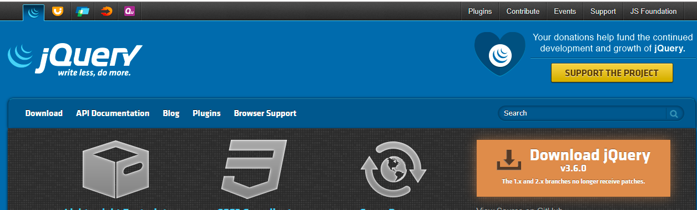

# jQuery

## 1.jQuery简介

jQuery是一个快速、简洁的[JavaScript](https://baike.baidu.com/item/JavaScript/321142)框架，是继[Prototype](https://baike.baidu.com/item/Prototype/14335188)之后又一个优秀的==JavaScript代码库（框架）==于2006年1月由[John Resig](https://baike.baidu.com/item/John Resig/6336344)发布。jQuery设计的宗旨是“write Less，Do More”，即倡导写更少的代码，做更多的事情。它封装JavaScript常用的功能代码，提供一种简便的JavaScript[设计模式](https://baike.baidu.com/item/设计模式/1212549)，优化[HTML](https://baike.baidu.com/item/HTML/97049)==文档操作==、==事件处理==、==动画设计==和==Ajax==交互。

## 2.jQuery的使用

首先进入jQuery官网获取jQuery的库文件，下载jQuery库文件

```
https://jquery.com/
```



jQuery库分为开发版和发布版，两种版本有细微的差别

| 名称                             | 大小    | 说明                                                         |
| -------------------------------- | ------- | ------------------------------------------------------------ |
| jQuery-3.版本号.js（开发版）     | 约268KB | 完整无压缩版本，主要用于测试、学习和开发                     |
| jQuery-3.版本号.min.js（发布版） | 约91KB  | 经过工具压缩或经过服务器开启Gzip压缩，主要应用于发布产品和项目 |

## 3.初识jQuery

### 3.1 简化创建自定义对象的方式

```html
<!DOCTYPE html>
<html lang="en">
<head>
	<meta charset="UTF-8">
	<title>简化创建自定义对象的方式</title>
</head>
<body>
	<!-- js方式定义Person对象 -->
	<script type="text/javascript">
		/*function Person(id,name,sal) {
			this.id = id;
			this.name = name;
			this.sal = sal;
		}
		var p = new Person(1,"昱霖",7000);
		document.write("编号：" + p.id + "<br/>");
		document.write("姓名：" + p.name + "<br/>");
		document.write("薪水：" + p.sal + "<br/>");*/
	</script>

	<hr/>

	<!-- json方式定义Person对象 -->
	<script type="text/javascript">
		var p = {
			id:1,
			name:"兴龙",
			sal:8000
		};
		//注：属性可以''或""符号，字符串必须加''或""符号，其它类型不用加符号
		document.write("编号：" + p.id + "<br/>");
		document.write("姓名：" + p.name + "<br/>");
		document.write("薪水：" + p.sal + "<br/>");
	</script>
</body>
</html>
```

### 3.2 创建一个数组，数组中有三个对象

```html
<!DOCTYPE html>
<html lang="en">
<head>
	<meta charset="UTF-8">
	<title>创建一个数组，数组中有三个对象</title>
</head>
<body>
	<script type="text/javascript">
		var ps = [
			{
				id:1,
				name:'天宇'
			},
			{
				id:2,
				name:'刘鉴'
			},
			{
				id:3,
				name:'礼浩'
			}
		];
	</script>

	<script type="text/javascript">
		document.write("共有" + ps.length + "个学生<br/>");
		//循环遍历
		for (var i=0;i<ps.length;i++){
			document.write("编号：" + ps[i].id + "<br/>");
			document.write("姓名：" + ps[i].name + "<br/>");
		}
	</script>
</body>
</html>
```

### 3.3 创建一个对象，其中一个属性是数组

```html
<!DOCTYPE html>
<html lang="en">
<head>
	<meta charset="UTF-8">
	<title>创建一个对象，其中一个属性是数组</title>
</head>
<body>
	<script type="text/javascript">
		var p = {
			id:1,
			name:"陈阳",
			home:['沈阳','大连','本溪']
		};
		//遍历属性（数组）
		for (var i=0;i<p.home.length;i++){
			document.write(p.home[i] + "&nbsp;");
		}
	</script>
</body>
</html>
```

### 3.4 jQuery入门

**引入jQuery库**

在页面中引入jQuery库的方法是HTML文档的头部，加上一下代码

```html
<script type="text/javascript" src="js/jquery-3.3.1.min.js"></script>
```

jQuery的语法格式如下

```javascript
$(selector).action();
```

语法说明：

1. 工厂函数$()：将DOM对象转化为jQuery对象
2. 选择器selector：获取需要操作的DOM元素
3. 方法action()：jQuery中提供的方法，其中包括绑定事件处理的方法

<font color=red>注：jQuery代码与JavaScript类似，都是在页面中通过\<script>标签嵌入jQuery代码</font>

```html
<!DOCTYPE html>
<html lang="en">
<head>
	<meta charset="UTF-8">
	<title>jQuery入门</title>
	<script type="text/javascript" src="js/jquery-3.3.1.min.js"></script>
</head>
<body>
	<input id="inputID" type="button" value="这是jQuery框架，写少代码，多做事情"/>

	<div id="divID">哈哈</div>

	<script type="text/javascript">
		//取得input标签中的value属性内容
		/*var $input = $("#inputID");
		var input = $input.val();
		alert(input);*/

		//获取div标签中的文本内容
		var $div = $("#divID");
		var div = $div.html();
		alert(div);
	</script>
</body>
</html>
```

### 3.5 js对象和jQuery对象的相互转换

DOM对象与jQuery对象相互转换的原因有以下两点

1. DOM对象比较麻烦，为了完成一个功能要写很多代码，还要考虑兼容性，而jQuery对象的操作封装成了函数，操作简单不考虑兼容性
2. jQuery中并不是封装了所有的方法，编写复杂的功能还是需要原生JS代码实现

**DOM对象转成jQuery对象**

概述：对于一个DOM对象，只需要用$()把DOM对象包装起来，就可以获得一个jQuery对象了

语法：

```javascript
$(DOM对象)
```

**jQuery对象转换成DOM对象**

1. 索引：jQuery对象是一个类似数组的对象，可以通过[index]方法得到相应的对象
2. get(index)：jQuery本身提供一个get(index)方法，可以通过该方法得到相应的DOM对象

```html
<!DOCTYPE html>
<html lang="en">
<head>
	<meta charset="UTF-8">
	<title>js对象和jQuery对象的相互转换</title>
	<script src="js/jquery-3.3.1.min.js"></script>
</head>
<body>
	<input id="inputID" type="button" value="这是jQuery框架，写少代码，多做事情"/>

	<div id="divID">哈哈</div>

	<script type="text/javascript">
		//获取<input>标签中value属性的内容[js对象->jQuery对象]
		/*var inputElement = document.getElementById("inputID"); //js对象
		var $input = $(inputElement);
		var input = $input.val();
		alert(input);*/

		//获取<div>标签中文本内容[jQuery->js对象]
		var $div = $("#divID"); //jQuery对象
		//通过索引
		//var divElement = $div[0];
		//get(index)方法
		var divElement = $div.get(0);
		var div = divElement.innerHTML;
		alert(div);
	</script>
</body>
</html>
```

## 4.jQuery的选择器

### 4.1 基本选择器


