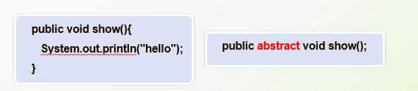

# 8月30日笔记 2002 56节

## 1.回顾

1. 继承的概念
2. 多态的基本概念
3. 多态的应用：父类作为方法形参
4. 向上转型：父类的引用指向子类对象
5. super关键字的用法
6. 方法的重写，方法重写与方法重载的区别

## 2.多态

向上转型：父类应用指向子类对象

**第四版 给宠物看病**

```java
package app07;
/** 
* @description 宠物类（父类）
* @author 李洋 
* @address 辽宁冶金职业技术学院
* @created 2021年8月28日 上午8:27:21
* @version 1.0.0
*/
public abstract class Pet {

	//宠物名称
	private String name = "无名氏";
	//宠物健康值
	private int health = 100;
	//宠物亲密度
	private int love = 20;
	
	//无参构造方法
	public Pet(){}
	
	//有参构造方法
	public Pet(String name){
		this.name = name;
	}

	public String getName() {
		return name;
	}

	public void setName(String name) {
		this.name = name;
	}

	public int getHealth() {
		return health;
	}

	public void setHealth(int health) {
		this.health = health;
	}

	public int getLove() {
		return love;
	}

	public void setLove(int love) {
		this.love = love;
	}
	
	//打印方法（宠物的自白）
	public void print(){
		System.out.println("宠物的自白：\n"
				+ "宠物的名字：" + this.name
				+ "\t宠物的健康值" + this.health
				+ "\t宠物的亲密度" + this.love);
	}
	
	//给宠物看病
	public abstract void toHospital();
}
```

```java
package app07;
/** 
* @description 狗狗类（子类）
* @author 李洋 
* @address 辽宁冶金职业技术学院
* @created 2021年8月28日 上午9:00:08
* @version 1.0.0
*/
public class Dog extends Pet {

	//狗狗的品种
	private String strain = "牧羊犬";
	
	//无参构造方法
	public Dog(){}
	
	//有参构造方法
	public Dog(String name,String strain){
		//调用父类的构造方法
		super(name);
		this.strain = strain;
	}

	public String getStrain() {
		return strain;
	}

	public void setStrain(String strain) {
		this.strain = strain;
	}
	
	//方法重写 注解
	@Override
	public void print() {
		//调用父类的成员方法
		super.print();
		System.out.println("狗狗的品种为：" + this.strain);
	}

	@Override
	public void toHospital() {
		System.out.println("打针、吃药...");
	}
}
```

```java
package app07;
/** 
* @description 企鹅类（子类）
* @author 李洋 
* @address 辽宁冶金职业技术学院
* @created 2021年8月28日 上午9:05:43
* @version 1.0.0
*/
public class Penguin extends Pet {

	//宠物的性别
	private String sex = "Q妹";
	
	//无参构造方法
	public Penguin(){}
	
	//有参构造方法
	public Penguin(String name,String sex){
		//调用父类的构造方法
		super(name);
		this.sex = sex;
	}

	public String getSex() {
		return sex;
	}

	public void setSex(String sex) {
		this.sex = sex;
	}
	
	//方法重写 public 默认 protected private
	@Override
	public void print() {
		//调用父类的成员方法
		super.print();
		System.out.println("企鹅的性别为：" + this.sex);
	}

	@Override
	public void toHospital() {
		System.out.println("吃药、疗养...");
	}
}	
```

```java
package app07;
/** 
* @description 主人类
* @author 李洋 
* @address 辽宁冶金职业技术学院
* @created 2021年8月28日 上午11:12:08
* @version 1.0.0
*/
public class MasterTest {

	//给给宠物看病，父类作为方法形参
	public void cure(Pet pet){
		//判断健康值
		if(pet.getHealth()<60){
			//调用看病方法
			pet.toHospital();
		}
	}
	
	public static void main(String[] args) {
		//示例化主人类
		MasterTest mt = new MasterTest();
		//实例化一个宠物（企鹅）
		Pet penguin = new Penguin();
		//使企鹅生病
		penguin.setHealth(10);
		//调用治疗方法
		mt.cure(penguin);
		
		//实例化一个宠物，父类引用指向子类对象
		//Pet dog = new Dog();
		//使狗狗生病
		//dog.setHealth(20);
		//调用治疗方法
		//mt.cure(dog);
	}
}
```

## 3.抽象类



普通方法VS抽象方法

1. 普通方法必须有方法的实现，而抽象方法只能有方法的声明
2. 抽象方法必须使用abstract关键字修饰
3. 抽象方法只能在抽象类中

普通类VS抽象类

1. 普通类可以被实例化，而抽象类不能被实例化
2. 抽象类必须用abstract关键字修饰
3. 抽象类中可以有抽象方法，也可以有普通方法

```JAVA
package app08;
/** 
* @description 鸟类（父类）
* @author 李洋 
* @address 辽宁冶金职业技术学院
* @created 2021年8月30日 下午2:11:37
* @version 1.0.0
*/
public abstract class Bird {

	//飞行方法
	public void fly(){
		System.out.println("弹射飞...");
	}
	
	//鸣叫方法
	public void shout(){
		System.out.println("嗷嗷叫...");
	}
	
	//攻击
	public abstract void attack();
}
```

```JAVA
package app08;
/** 
* @description 分裂鸟（子类）
* @author 李洋 
* @address 辽宁冶金职业技术学院
* @created 2021年8月30日 下午2:25:34
* @version 1.0.0
*/
public class SplitBird extends Bird {

	@Override
	public void attack() {
		System.out.println("分裂攻击...");
	}
}
```

```java
package app08;
/** 
* @description 火箭鸟（子类）
* @author 李洋 
* @address 辽宁冶金职业技术学院
* @created 2021年8月30日 下午2:31:02
* @version 1.0.0
*/
public class RocketBird extends Bird {

	@Override
	public void attack() {
		System.out.println("加速冲撞...");
	}
}
```

```java
package app08;
/** 
* @description 测试类
* @author 李洋 
* @address 辽宁冶金职业技术学院
* @created 2021年8月30日 下午2:34:15
* @version 1.0.0
*/
public class BirdTest {

	public static void main(String[] args) {
		//实例化分裂鸟对象，父类引用指向子类对象
		Bird splitBird = new SplitBird();
		//调用飞行方法
		splitBird.fly();
		//调用鸣叫方法
		splitBird.shout();
		//调用攻击方法
		splitBird.attack();
		//实例化火箭鸟
		Bird rocketBird = new RocketBird();
		//调用飞行方法
		rocketBird.fly();
		//调用鸣叫方法
		rocketBird.shout();
		//调用攻击方法
		rocketBird.attack();
	}
}
```

