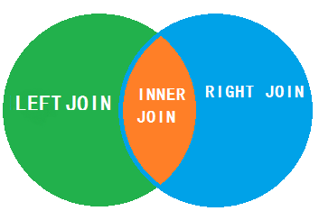

# 10月22日笔记 2002 78节

## 1.回顾

1. 内连接查询
   1. WHERE=>等值连接查询
   2. INNER JOIN...ON...
   3. 加入了表的别名的方式
   4. LEFT OUTER JOIN(左表的数据会完全显示)
   5. RIGHT OUTER JOIN（右表的数据数据会完全显示）

## 2.联表查询（多表连接查询）

**右外连接**

预期结果：

软件开发部 张三

软件开发部 李四

应用维护部  王五

秘书部          陈六

总经办          NULL

需求：使用右外连接的方式完成上面的预期结果

```sql
USE db_2002;
-- 预期结果见笔记
-- 需求：使用右外连接的方式完成上面的预期结果
SELECT d.`deptName`,e.`empName`
FROM employee e RIGHT OUTER JOIN dept d
ON d.`id`=e.`deptId`;
```

**自连接**

自连接：两个相同的表相连接

需求：查询员工及其上司

预期结果

张三   null

李四   张三

王五   李四

陈六   王五

```sql
-- 需求：查询员工及其上司
SELECT e.`empName`,b.`empName`
FROM employee e LEFT OUTER JOIN employee b
ON e.`bossId`=b.`id`;
```

**不同SQL的对比**

| **操作符名称**                   | **描述**                                   |
| -------------------------------- | ------------------------------------------ |
| **INNER  JOIN** **( JOIN** **)** | 如果表中有至少一个匹配，则返回行           |
| **LEFT JOIN**                    | 即使右表中没有匹配，也从左表中返回所有的行 |
| **RIGHT JOIN**                   | 即使左表中没有匹配，也从右表中返回所有的行 |



**自查询**

> 什么是子查询？

在查询语句中的WHERE条件子句中，又嵌套了另外一个==查询语句==

注：**嵌套查询可由多个子查询组成，求解的方式是由里及外；**子查询返回的结果一般都是集合，故而建议使用 **IN** **关键字；**

IN操作符允许我们在WHERE子句中规定多个值

语法：

```sql
SELECT 字段1，字段2,... FROM table_1.字段x IN(值1,值2,值2,...);
```

要学习子查询，我们需要学习IN关键字的用法

需求：查询部门名称为软件开发部和秘书部的部门信息（==子查询的前提==）

```sql
-- 需求：查询部门名称为软件开发部和秘书部的部门信息（子查询的前提）
-- 方式一：使用IN关键字
SELECT * FROM dept d WHERE d.`deptName` IN('软件开发部','秘书部');
-- 方式二：使用WHERE...OR
SELECT * FROM dept d WHERE d.`deptName`='软件开发部' 
OR d.`deptName`='秘书部'; 
```

需求：查询在软件开发部的员工的姓名

```sql
-- 需求：查询在软件开发部的员工的姓名
-- 子查询：当一个查询是另一个查询的条件时，称之为子查询
SELECT e.`empName`
FROM 
employee e 
WHERE e.`deptId` IN
(SELECT d.`id` 
FROM dept d 
WHERE d.`deptName`='软件开发部');
```

如果返回单个值（子查询）可以使用"="或IN

```sql
SELECT e.`empName`
FROM 
employee e 
WHERE e.`deptId` =
(SELECT d.`id` 
FROM dept d 
WHERE d.`deptName`='软件开发部');
```

如果多个值（子查询）必须使用IN

```sql
SELECT e.`empName`
FROM 
employee e 
WHERE e.`deptId` IN
(SELECT d.`id` 
FROM dept d 
WHERE d.`deptName`='软件开发部' OR d.`deptName`='秘书部');
```

如果使用等号

```
错误代码： 1242
Subquery returns more than 1 row
```


