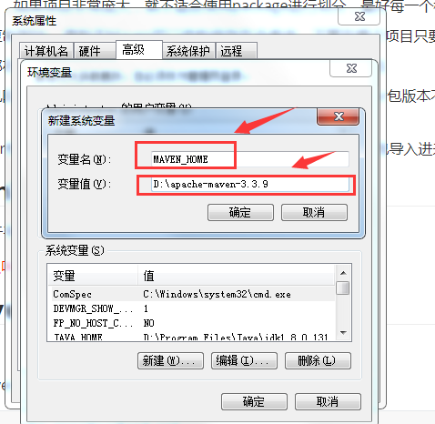

# Maven

## 1.为什么要学习Maven?

1. 一个项目就是一个工程，如果项目非常庞大，就不适合使用package进行划分，最好每一个模块对应一个工程，有利于分工协作
2. 项目中的jar包，需要复制到lib，借助于Maven可以将包保存在仓库中，不管在哪个项目只要引用就可以了
3. jar包需要的时候每次都在官网上下载，借助Maven可以用统一规范的方式下载jar包
4. jar包版本不一致存在风险，不同项目在使用jar包的时候，有可能导致各个项目的jar包版本不一致，导致执行错误，借助于Maven所有jar包都在仓库中，所有项目使用一份jar包
5. 一个jar包依赖的其它jar包需要手动导入到项目中，借助于Maven会将这些依赖jar包导入进来

## 2.什么是Maven?

概念：Maven是一款服务于平台的自动化构建工具

<font color=red>注：我们可以叫妹文也可以叫麦文，没有叫妈文的</font>

## 3.如何使用Maven?

Maven的配置

1. 去maven官网下载Maven

   ```
   https://maven.apache.org/download.cgi
   ```

   下载之后将Maven压缩包解压，要记住解压的位置，后面配置环境变量时需要

2. 配置环境变量，进入高级系统设置，打开环境变量，在系统变量中新建一个系统变量，变量名为MAVEN_HOME，变量值为Maven的加压位置，配置path变量，编辑path变量，将%MAVEN_HOME%\bin;添加进去，这时Maven就配置上去了，这个时候我们通过win+r命令提示符监测是否配置成功，输入mvn -v

   