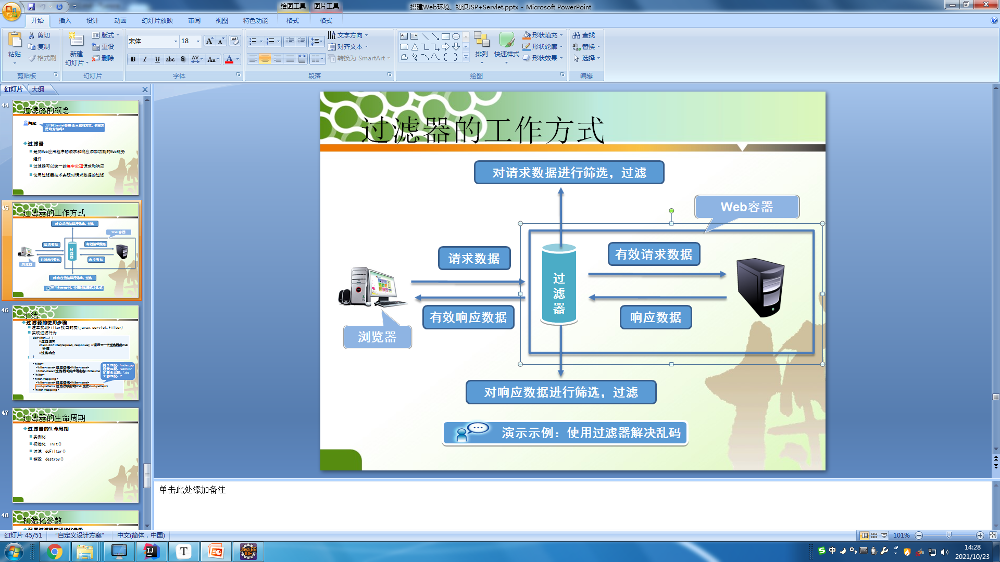

# 10月8日笔记 2002 项目搭建

## 1.新建数据库，并插入测试数据

```sql
/*
SQLyog Ultimate v11.25 (64 bit)
MySQL - 5.5.56 : Database - jd
*********************************************************************
*/


/*!40101 SET NAMES utf8 */;

/*!40101 SET SQL_MODE=''*/;

/*!40014 SET @OLD_UNIQUE_CHECKS=@@UNIQUE_CHECKS, UNIQUE_CHECKS=0 */;
/*!40014 SET @OLD_FOREIGN_KEY_CHECKS=@@FOREIGN_KEY_CHECKS, FOREIGN_KEY_CHECKS=0 */;
/*!40101 SET @OLD_SQL_MODE=@@SQL_MODE, SQL_MODE='NO_AUTO_VALUE_ON_ZERO' */;
/*!40111 SET @OLD_SQL_NOTES=@@SQL_NOTES, SQL_NOTES=0 */;
CREATE DATABASE /*!32312 IF NOT EXISTS*/`jd` /*!40100 DEFAULT CHARACTER SET utf8 */;

USE `jd`;

/*Table structure for table `goodstable` */

DROP TABLE IF EXISTS `goodstable`;

-- 商品表
CREATE TABLE `goodstable` (
  `id` int(4) NOT NULL AUTO_INCREMENT, -- 商品编号
  `name` varchar(30) NOT NULL, -- 商品名称
  `gtId` int(2) NOT NULL, -- 商品类别编号
  `price` double(10,2) NOT NULL, -- 商品价格
  `stock` int(11) NOT NULL, -- 商品库存
  `remarks` varchar(300) DEFAULT NULL, -- 商品备注
  PRIMARY KEY (`id`), -- 主键
  KEY `gtId` (`gtId`),
  CONSTRAINT `goodstable_ibfk_1` FOREIGN KEY (`gtId`) REFERENCES `goodstype` (`id`) -- 外键
) ENGINE=InnoDB AUTO_INCREMENT=1009 DEFAULT CHARSET=utf8;

/*Data for the table `goodstable` */

insert  into `goodstable`(`id`,`name`,`gtId`,`price`,`stock`,`remarks`) values (1001,'天津麻花',1,188.00,100,'富有丰富的防腐剂,开袋即食'),(1002,'旺仔小窝窝',1,9.80,1000,'开袋即食'),(1003,'兰州瓷砖',2,188.00,10000,'坚硬耐磨'),(1004,'吊床',3,1880.00,100,'柔软舒适'),(1005,'水床',3,588.00,100,'冬冷夏凉'),(1006,'止疼片',4,8.00,100,'开袋即食'),(1007,'感冒药',4,15.00,100,'开袋即食'),(1008,'红牛',4,5.50,100,'开袋即食');

/*Table structure for table `goodstype` */

DROP TABLE IF EXISTS `goodstype`;

-- 商品类别表
CREATE TABLE `goodstype` (
  `id` int(2) NOT NULL AUTO_INCREMENT, -- 商品类别编号
  `name` varchar(30) NOT NULL, -- 商品类别名称
  PRIMARY KEY (`id`)
) ENGINE=InnoDB AUTO_INCREMENT=6 DEFAULT CHARSET=utf8;

/*Data for the table `goodstype` */

insert  into `goodstype`(`id`,`name`) values (1,'食品类'),(2,'建材类'),(3,'家具类'),(4,'药品类'),(5,'服装类');

/*Table structure for table `usertable` */

DROP TABLE IF EXISTS `usertable`;

-- 用户表
CREATE TABLE `usertable` (
  `id` int(4) NOT NULL AUTO_INCREMENT,  -- 用户编号
  `name` varchar(30) NOT NULL, -- 用户名
  `password` varchar(30) NOT NULL, -- 用户密码
  PRIMARY KEY (`id`)
) ENGINE=InnoDB AUTO_INCREMENT=3 DEFAULT CHARSET=utf8;

/*Data for the table `usertable` */

insert  into `usertable`(`id`,`name`,`password`) values (1001,'admin','1'),(1002,'liyang','1');

/*!40101 SET SQL_MODE=@OLD_SQL_MODE */;
/*!40014 SET FOREIGN_KEY_CHECKS=@OLD_FOREIGN_KEY_CHECKS */;
/*!40014 SET UNIQUE_CHECKS=@OLD_UNIQUE_CHECKS */;
/*!40111 SET SQL_NOTES=@OLD_SQL_NOTES */;
```

## 2.项目搭建

**项目搭建的步骤**

1. 新建Web项目
2. 导入该项目所需要的jar文件（将jar放入到该项目的类路径下）
3. 测试Web应用是否正常（在浏览器中访问某页面，先配置tomcat，并解决控制台乱码）
4. 编写数据库连接共通类测试数据库环境是否正常，即程序能否成功连接数据库（MySQL、Oracle）
5. 进行项目代码的编写

**目录结构**

dao：数据库访问层

entity/pojo/po/domain：实体类

service：业务层代码

common/utils：工具类

action/controller：控制层代码

filter：过滤器

listener：监听器

**编写实体类**

```java
package com.lnboxue.entity;

/**
 * 用户类
 */
public class UserTable {

    //用户编号
    private Integer id;
    //用户名
    private String name;
    //用户密码
    private String password;

    //无参构造方法
    public UserTable(){}

    public Integer getId() {
        return id;
    }

    public void setId(Integer id) {
        this.id = id;
    }

    public String getName() {
        return name;
    }

    public void setName(String name) {
        this.name = name;
    }

    public String getPassword() {
        return password;
    }

    public void setPassword(String password) {
        this.password = password;
    }
}
```

```java
package com.lnboxue.entity;

/**
 * 商品实体类
 */
public class GoodsTable {

    //商品编号
    private Integer id;
    //商品名称
    private String name;
    //类别id
    private Integer gtId;
    //商品价格
    private Double price;
    //商品库存
    private Integer stock;
    //商品备注
    private String remarks;

    public GoodsTable(){}

    public Integer getId() {
        return id;
    }

    public void setId(Integer id) {
        this.id = id;
    }

    public String getName() {
        return name;
    }

    public void setName(String name) {
        this.name = name;
    }

    public Integer getGtId() {
        return gtId;
    }

    public void setGtId(Integer gtId) {
        this.gtId = gtId;
    }

    public Double getPrice() {
        return price;
    }

    public void setPrice(Double price) {
        this.price = price;
    }

    public Integer getStock() {
        return stock;
    }

    public void setStock(Integer stock) {
        this.stock = stock;
    }

    public String getRemarks() {
        return remarks;
    }

    public void setRemarks(String remarks) {
        this.remarks = remarks;
    }
}
```

```java
package com.lnboxue.entity;

/**
 * 商品类别实体类
 */
public class GoodsType {

    //商品类别编号
    private Integer id;
    //商品类别名称
    private String name;

    //无参构造方法
    public GoodsType(){}

    public Integer getId() {
        return id;
    }

    public void setId(Integer id) {
        this.id = id;
    }

    public String getName() {
        return name;
    }

    public void setName(String name) {
        this.name = name;
    }
}
```

**数据访问层**

```java
package com.lnboxue.dao.user;

/**
 * 用户模块数据库访问层
 */
public interface UserTableDao {

    //用户登录
    boolean userSelect(String name,String password);
}
```

```java
package com.lnboxue.dao.user.impl;

import com.lnboxue.dao.BaseDao;
import com.lnboxue.dao.user.UserTableDao;

import java.sql.Connection;
import java.sql.PreparedStatement;
import java.sql.ResultSet;

/**
 * 用户模块数据库访问层实现
 */
public class UserTableDaoImpl implements UserTableDao {

    @Override
    public boolean userSelect(String name, String password) {
        //执行的sql语句
        String sql = "select * from usertable where name = ? and password = ?";
        //数据库连接对象
        Connection connection = null;
        //数据库预处理对象
        PreparedStatement preparedStatement = null;
        //结果集对象
        ResultSet resultSet = null;
        //登录标识
        boolean isExits = false;
        //传递的参数
        Object[] params = {name,password};
        try {
            //获取数据库连接
            connection = BaseDao.getConnection();
            //获取结果集对象
            resultSet = BaseDao.execute(sql,connection,preparedStatement,resultSet,params);
            //判断是否有该用户
            if(resultSet.next()){
                //重置布尔值
                isExits = true;
            }
        } catch (Exception e) {
            e.printStackTrace();
        } finally {
            BaseDao.closeResource(connection,preparedStatement,resultSet);
        }
        return isExits;
    }
}
```

**业务层**

```java
package com.lnboxue.service.user;

/**
 * 用户模块业务层
 */
public interface UserTableService {

    boolean userSelect(String name, String password);
}
```

```java
package com.lnboxue.service.user.impl;

import com.lnboxue.dao.user.UserTableDao;
import com.lnboxue.dao.user.impl.UserTableDaoImpl;
import com.lnboxue.service.user.UserTableService;

/**
 * 用户业务层实现类
 */
public class UserTableServiceImpl implements UserTableService {

    private UserTableDao userTableDao;

    public UserTableServiceImpl(){
        userTableDao = new UserTableDaoImpl();
    }

    @Override
    public boolean userSelect(String name, String password) {
        return userTableDao.userSelect(name,password);
    }
}
```

**控制层**

```java
package com.lnboxue.action;

import com.lnboxue.service.user.UserTableService;
import com.lnboxue.service.user.impl.UserTableServiceImpl;

import javax.servlet.ServletException;
import javax.servlet.http.HttpServlet;
import javax.servlet.http.HttpServletRequest;
import javax.servlet.http.HttpServletResponse;
import java.io.IOException;

/**
 * 登录功能控制层实现
 */
public class LoginServlet extends HttpServlet {

    private UserTableService userTableService;

    @Override
    public void init() throws ServletException {
        userTableService = new UserTableServiceImpl();
    }

    @Override
    protected void doGet(HttpServletRequest request, HttpServletResponse response) throws ServletException, IOException {
        //获取用户名
        String name = request.getParameter("name");
        //获取密码
        String password = request.getParameter("password");
        //判断登陆是否成功
        if(userTableService.userSelect(name,password)){

        } else {
            //登陆失败，跳转到错误页面

        }
    }

    @Override
    protected void doPost(HttpServletRequest request, HttpServletResponse response) throws ServletException, IOException {
        this.doGet(request, response);
    }
}
```

**商品全查询**

```java
package com.lnboxue.dao.goods;

import com.lnboxue.entity.GoodsTable;

import java.util.List;

/**
 * 商品模块数据库访问层
 */
public interface GoodsTableDao {

    //商品全查询
    List<GoodsTable> goodsAllSelect();
}
```

```java
package com.lnboxue.dao.goods.impl;

import com.lnboxue.dao.BaseDao;
import com.lnboxue.dao.goods.GoodsTableDao;
import com.lnboxue.entity.GoodsTable;

import java.sql.Connection;
import java.sql.PreparedStatement;
import java.sql.ResultSet;
import java.util.ArrayList;
import java.util.List;

/**
 * 商品模块数据库访问层实现
 */
public class GoodsTableDaoImpl implements GoodsTableDao {

    @Override
    public List<GoodsTable> goodsAllSelect() {
        //执行的sql
        String sql = "select * from goodstable";
        //数据库连接对象
        Connection connection = null;
        //数据库预处理对象
        PreparedStatement preparedStatement = null;
        //结果集对象
        ResultSet resultSet = null;
        //传递的参数
        Object[] params = {};
        //商品列表
        List<GoodsTable> goodsList = new ArrayList<>();
        try {
            //获取数据库连接
            connection = BaseDao.getConnection();
            //获取查询的结果集
            resultSet = BaseDao.execute(sql,connection,preparedStatement,resultSet,params);
            //循环查询结果集
            while (resultSet.next()){
                //实例化商品对象
                GoodsTable goodsTable = new GoodsTable();
                //封装数据
                goodsTable.setId(resultSet.getInt("id"));
                goodsTable.setName(resultSet.getString("name"));
                goodsTable.setGtId(resultSet.getInt("gtid"));
                goodsTable.setPrice(resultSet.getDouble("price"));
                goodsTable.setStock(resultSet.getInt("stock"));
                goodsTable.setRemarks(resultSet.getString("remarks"));
                goodsList.add(goodsTable);
            }
        } catch (Exception e) {
            e.printStackTrace();
        } finally {
            BaseDao.closeResource(connection,preparedStatement,resultSet);
        }
        return goodsList;
    }
}
```

```java
package com.lnboxue.service.goods;

import com.lnboxue.entity.GoodsTable;

import java.util.List;

/**
 * 商品模块业务层
 */
public interface GoodsTableService {

    List<GoodsTable> goodsAllSelect();
}
```

```java
package com.lnboxue.service.goods.impl;

import com.lnboxue.dao.goods.GoodsTableDao;
import com.lnboxue.dao.goods.impl.GoodsTableDaoImpl;
import com.lnboxue.entity.GoodsTable;
import com.lnboxue.service.goods.GoodsTableService;

import java.util.List;

/**
 * 商品业务层实现
 */
public class GoodsTableServiceImpl implements GoodsTableService {

    private GoodsTableDao goodsTableDao;

    public GoodsTableServiceImpl(){
        goodsTableDao = new GoodsTableDaoImpl();
    }

    @Override
    public List<GoodsTable> goodsAllSelect() {
        return goodsTableDao.goodsAllSelect();
    }
}
```

```java
package com.lnboxue.action;

import com.lnboxue.entity.GoodsTable;
import com.lnboxue.service.goods.GoodsTableService;
import com.lnboxue.service.goods.impl.GoodsTableServiceImpl;

import javax.servlet.ServletException;
import javax.servlet.http.HttpServlet;
import javax.servlet.http.HttpServletRequest;
import javax.servlet.http.HttpServletResponse;
import java.io.IOException;
import java.util.List;

/**
 * 商品模块控制层-商品全查询
 */
public class ShowGoodsServlet extends HttpServlet {

    private GoodsTableService goodsTableService;

    @Override
    public void init() throws ServletException {
        goodsTableService = new GoodsTableServiceImpl();
    }

    @Override
    protected void doGet(HttpServletRequest request, HttpServletResponse response) throws ServletException, IOException {
        //调用Service方法
        List<GoodsTable> goodsList = goodsTableService.goodsAllSelect();
        //将商品信息保存到request对象中
        request.setAttribute("goodsList",goodsList);
        //请求转发
        request.getRequestDispatcher("/jsp/goodsList.jsp").forward(request,response);
    }

    @Override
    protected void doPost(HttpServletRequest request, HttpServletResponse response) throws ServletException, IOException {
        this.doGet(request, response);
    }
}
```

```jsp
<%@ page import="com.lnboxue.entity.UserTable" %>
<%@ page import="java.util.List" %>
<%@ page import="com.lnboxue.entity.GoodsTable" %>
<%@ page language="java" contentType="text/html; charset=UTF-8"
		 pageEncoding="UTF-8"%>
<!DOCTYPE html PUBLIC "-//W3C//DTD HTML 4.01 Transitional//EN" "http://www.w3.org/TR/html4/loose.dtd">
<html>
<head>
<meta http-equiv="Content-Type" content="text/html; charset=UTF-8">
<title>商品列表</title>
<style type="text/css">
	.title{
		background-color: orange;
		font-size: 24px;
		color: black;
	}
	table{
		line-height: 30px;
	}
	td{
		text-align: center;
	}
</style>
</head>
<%
	UserTable userTable = (UserTable)session.getAttribute("userTable");
	List<GoodsTable> goodsList = (List<GoodsTable>)request.getAttribute("goodsList");
%>
<body>
	<p>欢迎您，<strong><%=userTable.getName()%></strong></p><br/>
	<hr/>
	<table width="100%" cellpadding="0" cellspacing="0">
		<tr class="title">
			<th>编号</th>
			<th>名称</th>
			<th>单价</th>
			<th>库存</th>
			<th>相关操作</th>
		</tr>
		<%
			for(GoodsTable goodsTable : goodsList){
		%>
			<tr>
				<td><%=goodsTable.getId()%></td>
				<td><%=goodsTable.getName()%></td>
				<td><%=goodsTable.getPrice()%></td>
				<td><%=goodsTable.getStock()%></td>
				<td><a href="#">修改
				</a><a href="#">删除</a>
				</td>
			</tr>
		<%
			}
		%>
	</table>
	<a href="<%=request.getContextPath()%>/jsp/goodsAdd.jsp">添加</a>
</body>
</html>
```

**商品类别查询**

```java
package com.lnboxue.dao.goods;

import com.lnboxue.entity.GoodsType;

import java.util.List;

/**
 * 商品类别数据库访问层
 */
public interface GoodsTypeDao {

    //查询商品类别
    List<GoodsType> goodsTypeAllSelect();
}
```

```java
package com.lnboxue.dao.goods.impl;

import com.lnboxue.dao.BaseDao;
import com.lnboxue.dao.goods.GoodsTypeDao;
import com.lnboxue.entity.GoodsType;

import java.sql.Connection;
import java.sql.PreparedStatement;
import java.sql.ResultSet;
import java.util.ArrayList;
import java.util.List;

/**
 * 商品列表数据库访问层实现
 */
public class GoodsTypeDaoImpl implements GoodsTypeDao {

    @Override
    public List<GoodsType> goodsTypeAllSelect() {
        //执行sql
        String sql = "select * from goodstype";
        //数据库连接对象
        Connection connection = null;
        //数据库预处理对象
        PreparedStatement preparedStatement = null;
        //数据库结果集对象
        ResultSet resultSet = null;
        //传递的参数
        Object[] params = {};
        //定义商品类别列表
        List<GoodsType> goodsTypeList = new ArrayList<>();
        try {
            //获取数据库连接
            connection = BaseDao.getConnection();
            //获取查询的结果集
            resultSet = BaseDao.execute(sql,connection,preparedStatement,resultSet,params);
            //处理查询结果
            while (resultSet.next()){
                //进行数据封装
                GoodsType goodsType = new GoodsType();
                goodsType.setId(resultSet.getInt("id"));
                goodsType.setName(resultSet.getString("name"));
                //将类别信息放入集合中
                goodsTypeList.add(goodsType);
            }
        } catch (Exception e) {
            e.printStackTrace();
        } finally {
            //关闭资源
            BaseDao.closeResource(connection,preparedStatement,resultSet);
        }
        return goodsTypeList;
    }
}
```

业务层

```java
package com.lnboxue.service.goods;

import com.lnboxue.entity.GoodsType;

import java.util.List;

/**
 * 商品类别模块业务层
 */
public interface GoodsTypeService {

    List<GoodsType> goodsTypeAllSelect();
}
```

```java
package com.lnboxue.service.goods.impl;

import com.lnboxue.dao.goods.GoodsTypeDao;
import com.lnboxue.dao.goods.impl.GoodsTypeDaoImpl;
import com.lnboxue.entity.GoodsType;
import com.lnboxue.service.goods.GoodsTypeService;

import java.util.List;

/**
 * 商品类别模块业务层实现
 */
public class GoodsTypeServiceImpl implements GoodsTypeService {

    private GoodsTypeDao goodsTypeDao;

    public GoodsTypeServiceImpl(){
        goodsTypeDao = new GoodsTypeDaoImpl();
    }

    @Override
    public List<GoodsType> goodsTypeAllSelect() {
        return goodsTypeDao.goodsTypeAllSelect();
    }
}
```

**商品添加功能**

```java
package com.lnboxue.dao.goods;

import com.lnboxue.entity.GoodsTable;

import java.util.List;

/**
 * 商品模块数据库访问层
 */
public interface GoodsTableDao {

    //商品全查询
    List<GoodsTable> goodsAllSelect();
    //商品添加
    int goodsInsert(GoodsTable goodsTable);
}
```

```java
package com.lnboxue.dao.goods.impl;

import com.lnboxue.dao.BaseDao;
import com.lnboxue.dao.goods.GoodsTableDao;
import com.lnboxue.entity.GoodsTable;

import java.sql.Connection;
import java.sql.PreparedStatement;
import java.sql.ResultSet;
import java.util.ArrayList;
import java.util.List;

/**
 * 商品模块数据库访问层实现
 */
public class GoodsTableDaoImpl implements GoodsTableDao {

    @Override
    public List<GoodsTable> goodsAllSelect() {
        //执行的sql
        String sql = "select * from goodstable";
        //数据库连接对象
        Connection connection = null;
        //数据库预处理对象
        PreparedStatement preparedStatement = null;
        //结果集对象
        ResultSet resultSet = null;
        //传递的参数
        Object[] params = {};
        //商品列表
        List<GoodsTable> goodsList = new ArrayList<>();
        try {
            //获取数据库连接
            connection = BaseDao.getConnection();
            //获取查询的结果集
            resultSet = BaseDao.execute(sql,connection,preparedStatement,resultSet,params);
            //循环查询结果集
            while (resultSet.next()){
                //实例化商品对象
                GoodsTable goodsTable = new GoodsTable();
                //封装数据
                goodsTable.setId(resultSet.getInt("id"));
                goodsTable.setName(resultSet.getString("name"));
                goodsTable.setGtId(resultSet.getInt("gtid"));
                goodsTable.setPrice(resultSet.getDouble("price"));
                goodsTable.setStock(resultSet.getInt("stock"));
                goodsTable.setRemarks(resultSet.getString("remarks"));
                goodsList.add(goodsTable);
            }
        } catch (Exception e) {
            e.printStackTrace();
        } finally {
            BaseDao.closeResource(connection,preparedStatement,resultSet);
        }
        return goodsList;
    }

    @Override
    public int goodsInsert(GoodsTable goodsTable) {
        //执行的sql
        String sql = "insert into goodstable (name,gtid,price,stock,remarks) values(?,?,?,?,?)";
        //数据库连接
        Connection connection = null;
        //数据库预处理对象
        PreparedStatement preparedStatement = null;
        //传递的参数
        Object[] params = {goodsTable.getName(),goodsTable.getGtId(),goodsTable.getPrice(),goodsTable.getStock(),goodsTable.getRemarks()};
        //影响的行数
        int updateRows = 0;
        try {
            //获取数据库连接
            connection = BaseDao.getConnection();
            //返回影响的行数
            updateRows = BaseDao.execute(sql,connection,preparedStatement,params);
        } catch (Exception e) {
            e.printStackTrace();
        } finally {
            BaseDao.closeResource(connection,preparedStatement,null);
        }
        return updateRows;
    }
}
```

```java
package com.lnboxue.service.goods;

import com.lnboxue.entity.GoodsTable;

import java.util.List;

/**
 * 商品模块业务层
 */
public interface GoodsTableService {

    List<GoodsTable> goodsAllSelect();
    boolean goodsInsert(GoodsTable goodsTable);
}
```

```java
package com.lnboxue.service.goods.impl;

import com.lnboxue.dao.goods.GoodsTableDao;
import com.lnboxue.dao.goods.impl.GoodsTableDaoImpl;
import com.lnboxue.entity.GoodsTable;
import com.lnboxue.service.goods.GoodsTableService;

import java.util.List;

/**
 * 商品业务层实现
 */
public class GoodsTableServiceImpl implements GoodsTableService {

    private GoodsTableDao goodsTableDao;

    public GoodsTableServiceImpl(){
        goodsTableDao = new GoodsTableDaoImpl();
    }

    @Override
    public List<GoodsTable> goodsAllSelect() {
        return goodsTableDao.goodsAllSelect();
    }

    @Override
    public boolean goodsInsert(GoodsTable goodsTable) {
        //假设添加失败
        boolean isDone = false;
        //判断是否插入成功
        if (goodsTableDao.goodsInsert(goodsTable)>0){
            //添加成功，重置布尔值
            isDone = true;
        }
        return isDone;
    }
}
```

```java
package com.lnboxue.action;

import com.lnboxue.entity.GoodsTable;
import com.lnboxue.service.goods.GoodsTableService;
import com.lnboxue.service.goods.impl.GoodsTableServiceImpl;

import javax.servlet.ServletException;
import javax.servlet.http.HttpServlet;
import javax.servlet.http.HttpServletRequest;
import javax.servlet.http.HttpServletResponse;
import java.io.IOException;

/**
 * 商品添加功能控制层
 */
public class GoodsAddServlet extends HttpServlet {

    private GoodsTableService goodsTableService;

    @Override
    public void init() throws ServletException {
        goodsTableService = new GoodsTableServiceImpl();
    }

    @Override
    protected void doGet(HttpServletRequest request, HttpServletResponse response) throws ServletException, IOException {
        //处理post请求的乱码
        request.setCharacterEncoding("utf-8");
        //获取数据
        String name = request.getParameter("name");
        String gtId = request.getParameter("gtId");
        //进行类型转换
        int gtIdNew = Integer.parseInt(gtId);
        String price = request.getParameter("price");
        //进行类型转换
        double priceNew = Double.parseDouble(price);
        String stock = request.getParameter("stock");
        //进行类型转换
        int stockNew = Integer.parseInt(stock);
        String remarks = request.getParameter("remarks");
        //封装数据
        GoodsTable goodsTable = new GoodsTable();
        goodsTable.setName(name);
        goodsTable.setGtId(gtIdNew);
        goodsTable.setPrice(priceNew);
        goodsTable.setStock(stockNew);
        goodsTable.setRemarks(remarks);
        //判断插入是否成功
        if (goodsTableService.goodsInsert(goodsTable)){
            //重定向到商品全查询的servlet
            response.sendRedirect(request.getContextPath() + "/ShowGoodsServlet");
        } else {
            response.sendRedirect(request.getContextPath() + "/jsp/error.jsp");
        }
    }

    @Override
    protected void doPost(HttpServletRequest request, HttpServletResponse response) throws ServletException, IOException {
        this.doGet(request, response);
    }
}
```

```jsp
<%@ page import="com.lnboxue.service.goods.impl.GoodsTypeServiceImpl" %>
<%@ page import="com.lnboxue.entity.GoodsType" %>
<%@ page import="java.util.List" %>
<%@ page language="java" contentType="text/html; charset=UTF-8"
		 pageEncoding="UTF-8"%>
<!DOCTYPE html PUBLIC "-//W3C//DTD HTML 4.01 Transitional//EN" "http://www.w3.org/TR/html4/loose.dtd">
<html>
<head>
<meta http-equiv="Content-Type" content="text/html; charset=UTF-8">
<title>商品添加页面</title>
</head>
<body>
	<%
		GoodsTypeServiceImpl goodsTypeService = new GoodsTypeServiceImpl();
		List<GoodsType> goodsTypeList = goodsTypeService.goodsTypeAllSelect();
	%>
	<form action="<%=request.getContextPath()%>/GoodsAddServlet"
	method="post" >
		商品名称:<input type="text" name="name" value="" /><br/>
		商品类别:<select name="gtId">
					<%
						for (GoodsType goodsType : goodsTypeList){
					%>
						<option value="<%=goodsType.getId()%>"><%=goodsType.getName()%></option>
					<%
						}
					%>
			  	</select>
		<br/>
		商品单价:<input type="text" name="price" value="" /><br/>
		商品库存:<input type="text" name="stock" value="" /><br/>
		商品描述:
			   <textarea name="remarks" rows="5" cols="15"></textarea>
		<br/>
		<input type="submit"  value="提交" />
	</form>
</body>
</html>
```

**商品详情查询**

```java
package com.lnboxue.dao.goods;

import com.lnboxue.entity.GoodsTable;

import java.util.List;

/**
 * 商品模块数据库访问层
 */
public interface GoodsTableDao {

    //商品全查询
    List<GoodsTable> goodsAllSelect();
    //商品添加
    int goodsInsert(GoodsTable goodsTable);
    //商品详情查询
    GoodsTable goodsByIdSelect(int id);
}
```

```java
package com.lnboxue.dao.goods.impl;

import com.lnboxue.dao.BaseDao;
import com.lnboxue.dao.goods.GoodsTableDao;
import com.lnboxue.entity.GoodsTable;

import java.sql.Connection;
import java.sql.PreparedStatement;
import java.sql.ResultSet;
import java.util.ArrayList;
import java.util.List;

/**
 * 商品模块数据库访问层实现
 */
public class GoodsTableDaoImpl implements GoodsTableDao {

    @Override
    public List<GoodsTable> goodsAllSelect() {
        //执行的sql
        String sql = "select * from goodstable";
        //数据库连接对象
        Connection connection = null;
        //数据库预处理对象
        PreparedStatement preparedStatement = null;
        //结果集对象
        ResultSet resultSet = null;
        //传递的参数
        Object[] params = {};
        //商品列表
        List<GoodsTable> goodsList = new ArrayList<>();
        try {
            //获取数据库连接
            connection = BaseDao.getConnection();
            //获取查询的结果集
            resultSet = BaseDao.execute(sql,connection,preparedStatement,resultSet,params);
            //循环查询结果集
            while (resultSet.next()){
                //实例化商品对象
                GoodsTable goodsTable = new GoodsTable();
                //封装数据
                goodsTable.setId(resultSet.getInt("id"));
                goodsTable.setName(resultSet.getString("name"));
                goodsTable.setGtId(resultSet.getInt("gtid"));
                goodsTable.setPrice(resultSet.getDouble("price"));
                goodsTable.setStock(resultSet.getInt("stock"));
                goodsTable.setRemarks(resultSet.getString("remarks"));
                goodsList.add(goodsTable);
            }
        } catch (Exception e) {
            e.printStackTrace();
        } finally {
            BaseDao.closeResource(connection,preparedStatement,resultSet);
        }
        return goodsList;
    }

    @Override
    public int goodsInsert(GoodsTable goodsTable) {
        //执行的sql
        String sql = "insert into goodstable (name,gtid,price,stock,remarks) values(?,?,?,?,?)";
        //数据库连接
        Connection connection = null;
        //数据库预处理对象
        PreparedStatement preparedStatement = null;
        //传递的参数
        Object[] params = {goodsTable.getName(),goodsTable.getGtId(),goodsTable.getPrice(),goodsTable.getStock(),goodsTable.getRemarks()};
        //影响的行数
        int updateRows = 0;
        try {
            //获取数据库连接
            connection = BaseDao.getConnection();
            //返回影响的行数
            updateRows = BaseDao.execute(sql,connection,preparedStatement,params);
        } catch (Exception e) {
            e.printStackTrace();
        } finally {
            BaseDao.closeResource(connection,preparedStatement,null);
        }
        return updateRows;
    }

    @Override
    public GoodsTable goodsByIdSelect(int id) {
        String sql = "select g.id,g.name,g.gtid,gt.name as gtname,price,stock,remarks from goodstable g inner join goodstype gt on g.gtid=gt.id where g.id = ?";
        Connection connection = null;
        PreparedStatement preparedStatement = null;
        ResultSet resultSet = null;
        Object[] params = {id};
        GoodsTable goodsTableNew = new GoodsTable();
        try {
            connection = BaseDao.getConnection();
            resultSet = BaseDao.execute(sql,connection,preparedStatement,resultSet,params);
            if (resultSet.next()){
                goodsTableNew.setId(resultSet.getInt("id"));
                goodsTableNew.setName(resultSet.getString("name"));
                goodsTableNew.setGtId(resultSet.getInt("gtid"));
                goodsTableNew.setGtName(resultSet.getString("gtname"));
                goodsTableNew.setPrice(resultSet.getDouble("price"));
                goodsTableNew.setStock(resultSet.getInt("stock"));
                goodsTableNew.setRemarks(resultSet.getString("remarks"));
            }
        } catch (Exception e) {
            e.printStackTrace();
        } finally {
            BaseDao.closeResource(connection,preparedStatement,resultSet);
        }
        return goodsTableNew;
    }
}
```

```java
package com.lnboxue.service.goods;

import com.lnboxue.entity.GoodsTable;

import java.util.List;

/**
 * 商品模块业务层
 */
public interface GoodsTableService {

    List<GoodsTable> goodsAllSelect();
    boolean goodsInsert(GoodsTable goodsTable);
    GoodsTable goodsByIdSelect(int id);
}
```

```java
package com.lnboxue.service.goods.impl;

import com.lnboxue.dao.goods.GoodsTableDao;
import com.lnboxue.dao.goods.impl.GoodsTableDaoImpl;
import com.lnboxue.entity.GoodsTable;
import com.lnboxue.service.goods.GoodsTableService;

import java.util.List;

/**
 * 商品业务层实现
 */
public class GoodsTableServiceImpl implements GoodsTableService {

    private GoodsTableDao goodsTableDao;

    public GoodsTableServiceImpl(){
        goodsTableDao = new GoodsTableDaoImpl();
    }

    @Override
    public List<GoodsTable> goodsAllSelect() {
        return goodsTableDao.goodsAllSelect();
    }

    @Override
    public boolean goodsInsert(GoodsTable goodsTable) {
        //假设添加失败
        boolean isDone = false;
        //判断是否插入成功
        if (goodsTableDao.goodsInsert(goodsTable)>0){
            //添加成功，重置布尔值
            isDone = true;
        }
        return isDone;
    }

    @Override
    public GoodsTable goodsByIdSelect(int id) {
        return goodsTableDao.goodsByIdSelect(id);
    }
}
```

```java
package com.lnboxue.action;

import com.lnboxue.entity.GoodsTable;
import com.lnboxue.service.goods.GoodsTableService;
import com.lnboxue.service.goods.impl.GoodsTableServiceImpl;

import javax.servlet.ServletException;
import javax.servlet.http.HttpServlet;
import javax.servlet.http.HttpServletRequest;
import javax.servlet.http.HttpServletResponse;
import java.io.IOException;

/**
 * 商品详情查询控制层
 */
public class GoodsDetailServlet extends HttpServlet {

    private GoodsTableService goodsTableService;

    @Override
    public void init() throws ServletException {
        goodsTableService = new GoodsTableServiceImpl();
    }

    @Override
    protected void doGet(HttpServletRequest request, HttpServletResponse response) throws ServletException, IOException {
        //获取商品编号
        String id = request.getParameter("id");
        //将商品编号进行类型转换
        int idNew = Integer.parseInt(id);
        //调用业务层方法
        GoodsTable goodsTable = goodsTableService.goodsByIdSelect(idNew);
        //将商品信息保存到request对象中
        request.setAttribute("goodsTable",goodsTable);
        //请求转发到商品详情页
        request.getRequestDispatcher("/jsp/goodsDetail.jsp").forward(request,response);
    }

    @Override
    protected void doPost(HttpServletRequest request, HttpServletResponse response) throws ServletException, IOException {
        this.doGet(request,response);
    }
}
```

**商品修改功能及删除功能**

```java
package com.lnboxue.dao.goods;

import com.lnboxue.entity.GoodsTable;

import java.util.List;

/**
 * 商品模块数据库访问层
 */
public interface GoodsTableDao {

    //商品全查询
    List<GoodsTable> goodsAllSelect();
    //商品添加
    int goodsInsert(GoodsTable goodsTable);
    //商品详情查询
    GoodsTable goodsByIdSelect(int id);
    //商品修改
    int goodsUpdate(GoodsTable goodsTable);
    //商品删除
    int goodsDelete(int id);
}
```

```java
package com.lnboxue.dao.goods.impl;

import com.lnboxue.dao.BaseDao;
import com.lnboxue.dao.goods.GoodsTableDao;
import com.lnboxue.entity.GoodsTable;

import java.sql.Connection;
import java.sql.PreparedStatement;
import java.sql.ResultSet;
import java.util.ArrayList;
import java.util.List;

/**
 * 商品模块数据库访问层实现
 */
public class GoodsTableDaoImpl implements GoodsTableDao {

    @Override
    public List<GoodsTable> goodsAllSelect() {
        //执行的sql
        String sql = "select * from goodstable";
        //数据库连接对象
        Connection connection = null;
        //数据库预处理对象
        PreparedStatement preparedStatement = null;
        //结果集对象
        ResultSet resultSet = null;
        //传递的参数
        Object[] params = {};
        //商品列表
        List<GoodsTable> goodsList = new ArrayList<>();
        try {
            //获取数据库连接
            connection = BaseDao.getConnection();
            //获取查询的结果集
            resultSet = BaseDao.execute(sql,connection,preparedStatement,resultSet,params);
            //循环查询结果集
            while (resultSet.next()){
                //实例化商品对象
                GoodsTable goodsTable = new GoodsTable();
                //封装数据
                goodsTable.setId(resultSet.getInt("id"));
                goodsTable.setName(resultSet.getString("name"));
                goodsTable.setGtId(resultSet.getInt("gtid"));
                goodsTable.setPrice(resultSet.getDouble("price"));
                goodsTable.setStock(resultSet.getInt("stock"));
                goodsTable.setRemarks(resultSet.getString("remarks"));
                goodsList.add(goodsTable);
            }
        } catch (Exception e) {
            e.printStackTrace();
        } finally {
            BaseDao.closeResource(connection,preparedStatement,resultSet);
        }
        return goodsList;
    }

    @Override
    public int goodsInsert(GoodsTable goodsTable) {
        //执行的sql
        String sql = "insert into goodstable (name,gtid,price,stock,remarks) values(?,?,?,?,?)";
        //数据库连接
        Connection connection = null;
        //数据库预处理对象
        PreparedStatement preparedStatement = null;
        //传递的参数
        Object[] params = {goodsTable.getName(),goodsTable.getGtId(),goodsTable.getPrice(),goodsTable.getStock(),goodsTable.getRemarks()};
        //影响的行数
        int updateRows = 0;
        try {
            //获取数据库连接
            connection = BaseDao.getConnection();
            //返回影响的行数
            updateRows = BaseDao.execute(sql,connection,preparedStatement,params);
        } catch (Exception e) {
            e.printStackTrace();
        } finally {
            BaseDao.closeResource(connection,preparedStatement,null);
        }
        return updateRows;
    }

    @Override
    public GoodsTable goodsByIdSelect(int id) {
        String sql = "select g.id,g.name,g.gtid,gt.name as gtname,price,stock,remarks from goodstable g inner join goodstype gt on g.gtid=gt.id where g.id = ?";
        Connection connection = null;
        PreparedStatement preparedStatement = null;
        ResultSet resultSet = null;
        Object[] params = {id};
        GoodsTable goodsTableNew = new GoodsTable();
        try {
            connection = BaseDao.getConnection();
            resultSet = BaseDao.execute(sql,connection,preparedStatement,resultSet,params);
            if (resultSet.next()){
                goodsTableNew.setId(resultSet.getInt("id"));
                goodsTableNew.setName(resultSet.getString("name"));
                goodsTableNew.setGtId(resultSet.getInt("gtid"));
                goodsTableNew.setGtName(resultSet.getString("gtname"));
                goodsTableNew.setPrice(resultSet.getDouble("price"));
                goodsTableNew.setStock(resultSet.getInt("stock"));
                goodsTableNew.setRemarks(resultSet.getString("remarks"));
            }
        } catch (Exception e) {
            e.printStackTrace();
        } finally {
            BaseDao.closeResource(connection,preparedStatement,resultSet);
        }
        return goodsTableNew;
    }

    @Override
    public int goodsUpdate(GoodsTable goodsTable) {
        String sql = "update goodstable set name=?,gtid=?,price=?,stock=?,remarks=? where id=?";
        Connection connection = null;
        PreparedStatement preparedStatement = null;
        Object[] params = {goodsTable.getName(),goodsTable.getGtId(),goodsTable.getPrice(),goodsTable.getStock(),goodsTable.getRemarks(),goodsTable.getId()};
        //影响的行数
        int updateRows = 0;
        try {
            connection = BaseDao.getConnection();
            updateRows = BaseDao.execute(sql,connection,preparedStatement,params);
        } catch (Exception e) {
            e.printStackTrace();
        } finally {
            BaseDao.closeResource(connection,preparedStatement,null);
        }
        return updateRows;
    }

    @Override
    public int goodsDelete(int id) {
        String sql = "delete from goodstable where id=?";
        Connection connection = null;
        PreparedStatement preparedStatement = null;
        Object[] params = {id};
        //影响的行数
        int updateRows = 0;
        try {
            connection = BaseDao.getConnection();
            updateRows = BaseDao.execute(sql,connection,preparedStatement,params);
        } catch (Exception e) {
            e.printStackTrace();
        } finally {
            BaseDao.closeResource(connection,preparedStatement,null);
        }
        return updateRows;
    }
}
```

```java
package com.lnboxue.service.goods;

import com.lnboxue.entity.GoodsTable;

import java.util.List;

/**
 * 商品模块业务层
 */
public interface GoodsTableService {

    List<GoodsTable> goodsAllSelect();
    boolean goodsInsert(GoodsTable goodsTable);
    GoodsTable goodsByIdSelect(int id);
    boolean goodsUpdate(GoodsTable goodsTable);
    boolean goodsDelete(int id);
}
```

**数据回显的Servlet**

```java
package com.lnboxue.action;

import com.lnboxue.entity.GoodsTable;
import com.lnboxue.service.goods.GoodsTableService;
import com.lnboxue.service.goods.impl.GoodsTableServiceImpl;

import javax.servlet.ServletException;
import javax.servlet.http.HttpServlet;
import javax.servlet.http.HttpServletRequest;
import javax.servlet.http.HttpServletResponse;
import java.io.IOException;


public class GoodsUpdateInitServlet extends HttpServlet {

    private GoodsTableService goodsTableService;

    @Override
    public void init() throws ServletException {
        goodsTableService = new GoodsTableServiceImpl();
    }

    @Override
    protected void doGet(HttpServletRequest request, HttpServletResponse response) throws ServletException, IOException {
        //获取商品id
        String id = request.getParameter("id");
        //数据类型转换
        int idNew = Integer.parseInt(id);
        //调用业务层方法
        GoodsTable goodsTable = goodsTableService.goodsByIdSelect(idNew);
        //保存商品信息到request对象中
        request.setAttribute("goodsTable",goodsTable);
        //请求转发到修改页面
        request.getRequestDispatcher("/jsp/goodsUpdate.jsp").forward(request,response);
    }

    @Override
    protected void doPost(HttpServletRequest request, HttpServletResponse response) throws ServletException, IOException {
        this.doGet(request, response);
    }
}
```

```java
package com.lnboxue.action;

import com.lnboxue.dao.goods.GoodsTableDao;
import com.lnboxue.entity.GoodsTable;
import com.lnboxue.service.goods.GoodsTableService;
import com.lnboxue.service.goods.impl.GoodsTableServiceImpl;

import javax.servlet.ServletException;
import javax.servlet.http.HttpServlet;
import javax.servlet.http.HttpServletRequest;
import javax.servlet.http.HttpServletResponse;
import java.io.IOException;

/**
 * 商品修改功能控制层
 */
public class GoodsUpdateServlet extends HttpServlet {

    private GoodsTableService goodsTableService;

    @Override
    public void init() throws ServletException {
        goodsTableService = new GoodsTableServiceImpl();
    }

    @Override
    protected void doGet(HttpServletRequest request, HttpServletResponse response) throws ServletException, IOException {
        //处理POST请求
        request.setCharacterEncoding("utf-8");
        //获取修改页面中的表单信息
        String id = request.getParameter("id");
        String name = request.getParameter("name");
        String gtId = request.getParameter("gtId");
        String price = request.getParameter("price");
        String stock = request.getParameter("stock");
        String remarks = request.getParameter("remarks");
        //数据类型转换
        int idNew = Integer.parseInt(id);
        int gtIdNew = Integer.parseInt(gtId);
        double priceNew = Double.parseDouble(price);
        int stockNew = Integer.parseInt(stock);
        //将这些数据进行封装
        GoodsTable goodsTable = new GoodsTable();
        goodsTable.setId(idNew);
        goodsTable.setName(name);
        goodsTable.setGtId(gtIdNew);
        goodsTable.setPrice(priceNew);
        goodsTable.setStock(stockNew);
        goodsTable.setRemarks(remarks);
        //调用业务层中的修改方法
        if (goodsTableService.goodsUpdate(goodsTable)){
            //成功重定向到商品全查询的SERVLET
            response.sendRedirect(request.getContextPath() + "/ShowGoodsServlet");
        } else {
            //失败重定向到错误页
            response.sendRedirect(request.getContextPath() + "/jsp/error.jsp");
        }
    }

    @Override
    protected void doPost(HttpServletRequest request, HttpServletResponse response) throws ServletException, IOException {
        this.doGet(request, response);
    }
}
```

```java
package com.lnboxue.action;

import com.lnboxue.service.goods.GoodsTableService;
import com.lnboxue.service.goods.impl.GoodsTableServiceImpl;

import javax.servlet.ServletException;
import javax.servlet.http.HttpServlet;
import javax.servlet.http.HttpServletRequest;
import javax.servlet.http.HttpServletResponse;
import java.io.IOException;

/**
 * 商品功能控制层
 */
public class GoodsDeleteServlet extends HttpServlet {

    private GoodsTableService goodsTableService;

    @Override
    public void init() throws ServletException {
        goodsTableService = new GoodsTableServiceImpl();
    }

    @Override
    protected void doGet(HttpServletRequest request, HttpServletResponse response) throws ServletException, IOException {
        //获取要删除的商品id
        String id = request.getParameter("id");
        //数据类型转换
        int idNew = Integer.parseInt(id);
        //调用业务层中的删除方法
        if (goodsTableService.goodsDelete(idNew)) {
            response.sendRedirect(request.getContextPath() + "/ShowGoodsServlet");
        } else {
            response.sendRedirect(request.getContextPath() + "/jsp/error.jsp");
        }
    }

    @Override
    protected void doPost(HttpServletRequest request, HttpServletResponse response) throws ServletException, IOException {
        this.doGet(request, response);
    }
}
```

```xml
<?xml version="1.0" encoding="UTF-8"?>
<web-app xmlns="http://xmlns.jcp.org/xml/ns/javaee"
         xmlns:xsi="http://www.w3.org/2001/XMLSchema-instance"
         xsi:schemaLocation="http://xmlns.jcp.org/xml/ns/javaee http://xmlns.jcp.org/xml/ns/javaee/web-app_4_0.xsd"
         version="4.0">

    <!-- 配置欢迎页 -->
    <welcome-file-list>
        <welcome-file>/jsp/login.jsp</welcome-file>
    </welcome-file-list>
    
    <servlet>
        <servlet-name>LoginServlet</servlet-name>
        <servlet-class>com.lnboxue.action.LoginServlet</servlet-class>
    </servlet>
    <servlet-mapping>
        <servlet-name>LoginServlet</servlet-name>
        <url-pattern>/LoginServlet</url-pattern>
    </servlet-mapping>
    
    <servlet>
        <servlet-name>ShowGoodsServlet</servlet-name>
        <servlet-class>com.lnboxue.action.ShowGoodsServlet</servlet-class>
    </servlet>
    <servlet-mapping>
        <servlet-name>ShowGoodsServlet</servlet-name>
        <url-pattern>/ShowGoodsServlet</url-pattern>
    </servlet-mapping>
    
    <servlet>
        <servlet-name>GoodsAddServlet</servlet-name>
        <servlet-class>com.lnboxue.action.GoodsAddServlet</servlet-class>
    </servlet>
    <servlet-mapping>
        <servlet-name>GoodsAddServlet</servlet-name>
        <url-pattern>/GoodsAddServlet</url-pattern>
    </servlet-mapping>

    <servlet>
        <servlet-name>GoodsDetailServlet</servlet-name>
        <servlet-class>com.lnboxue.action.GoodsDetailServlet</servlet-class>
    </servlet>
    <servlet-mapping>
        <servlet-name>GoodsDetailServlet</servlet-name>
        <url-pattern>/GoodsDetailServlet</url-pattern>
    </servlet-mapping>

    <servlet>
        <servlet-name>GoodsUpdateInitServlet</servlet-name>
        <servlet-class>com.lnboxue.action.GoodsUpdateInitServlet</servlet-class>
    </servlet>
    <servlet-mapping>
        <servlet-name>GoodsUpdateInitServlet</servlet-name>
        <url-pattern>/GoodsUpdateInitServlet</url-pattern>
    </servlet-mapping>

    <servlet>
        <servlet-name>GoodsUpdateServlet</servlet-name>
        <servlet-class>com.lnboxue.action.GoodsUpdateServlet</servlet-class>
    </servlet>
    <servlet-mapping>
        <servlet-name>GoodsUpdateServlet</servlet-name>
        <url-pattern>/GoodsUpdateServlet</url-pattern>
    </servlet-mapping>

    <servlet>
        <servlet-name>GoodsDeleteServlet</servlet-name>
        <servlet-class>com.lnboxue.action.GoodsDeleteServlet</servlet-class>
    </servlet>
    <servlet-mapping>
        <servlet-name>GoodsDeleteServlet</servlet-name>
        <url-pattern>/GoodsDeleteServlet</url-pattern>
    </servlet-mapping>
</web-app>
```

## 3.功能展示

1. 用户登陆
2. 商品全查询
3. 商品详情查询
4. 商品修改
5. 商品删除
6. ==商品分页查询==
   1. 如何查询商品表的总记录数
   2. 如何定位商品分页的参数 limit m,n=>m=?且n=?
   3. 如何对分页需要的数据进行封装（Page）

## 4.分页功能

> 求商品表中的总记录数？

```sql
select count(*) from goodstable;
```

> 求商品表的总页数？

1. 判断总页数%容量能否整除，如何能够整除那么为该表达式的商，否则为商+1

2. 对商品表进行分页

   ```sql
   select * from goodstable limit m,n
   -- 注：m为(当前页-1)*容量，n为容量
   ```

**计算总记录数**

```java
@Override
    public int getTotalCount() {
        String sql = "select count(id) from goodstable";
        Connection connection = null;
        PreparedStatement preparedStatement = null;
        ResultSet resultSet = null;
        Object[] params = {};
        //总记录数
        int allRecordNO = 0;
        try {
            connection = BaseDao.getConnection();
            resultSet = BaseDao.execute(sql,connection,preparedStatement,resultSet,params);
            //处理结果集对象
            if (resultSet.next()){
                allRecordNO = resultSet.getInt(1);
            }
        } catch (Exception e) {
            e.printStackTrace();
        } finally {
            BaseDao.closeResource(connection,preparedStatement,resultSet);
        }
        return allRecordNO;
    }
```

**分页工具类**

```java
package com.lnboxue.utils;

import java.util.ArrayList;
import java.util.List;


/**
 * @description 分页类
 * @author 李洋
 * @address 沈阳理工大学
 * @created 2016年10月5日 下午9:24:43
 * @version 1.0.0
 */
public class Page<T> {

	//当前页号
	private Integer currPageNO;
	//每页显示记录数，默认为3条记录
	private Integer perPageSize = 3;
	//总记录数
	private Integer allRecordNO;
	//总页数
	private Integer allPageNO;
	//该本页显示的内容
	private List<T> list = new ArrayList<>();

	public Page() {}

	public Integer getCurrPageNO() {
		return currPageNO;
	}

	public void setCurrPageNO(Integer currPageNO) {
		this.currPageNO = currPageNO;
	}

	public Integer getPerPageSize() {
		return perPageSize;
	}

	public void setPerPageSize(Integer perPageSize) {
		this.perPageSize = perPageSize;
	}

	public Integer getAllRecordNO() {
		return allRecordNO;
	}

	public void setAllRecordNO(Integer allRecordNO) {
		this.allRecordNO = allRecordNO;
	}

	public Integer getAllPageNO() {
		return allPageNO;
	}

	public void setAllPageNO(Integer allPageNO) {
		this.allPageNO = allPageNO;
	}

	public List<T> getList() {
		return list;
	}

	public void setList(List<T> list) {
		this.list = list;
	}
}
```

**处理分页的service（分页的逻辑）**

```java
@Override
    public Page<GoodsTable> goodsByPageAllSelect(int currPageNO) {
        //实例化分页工具类
        Page<GoodsTable> page = new Page<>();
        //总记录数
        int allRecordNO = goodsTableDao.getTotalCount();
        //封装当前页
        page.setCurrPageNO(currPageNO);
        //封装总记录数
        page.setAllRecordNO(allRecordNO);
        //总页数
        int allPageNO = 0;
        //判断并计算总页数
        if (page.getAllRecordNO() % page.getPerPageSize()==0){
            allPageNO = page.getAllRecordNO() / page.getPerPageSize();
        } else {
            allPageNO = page.getAllRecordNO() / page.getPerPageSize() + 1;
        }
        //封装总页数
        page.setAllPageNO(allPageNO);
        //计算起始行
        int start = (page.getCurrPageNO() - 1) * page.getPerPageSize();
        //调用数据库访问层的分页方法
        List<GoodsTable> goodsList = goodsTableDao.goodsByPageAllSelect(start, page.getPerPageSize());
        //封装分页后的列表信息
        page.setList(goodsList);
        return page;
    }
```

**分页功能控制层**

```java
package com.lnboxue.action;

import com.lnboxue.entity.GoodsTable;
import com.lnboxue.service.goods.GoodsTableService;
import com.lnboxue.service.goods.impl.GoodsTableServiceImpl;
import com.lnboxue.utils.Page;

import javax.servlet.ServletException;
import javax.servlet.http.HttpServlet;
import javax.servlet.http.HttpServletRequest;
import javax.servlet.http.HttpServletResponse;
import java.io.IOException;
import java.util.List;

/**
 * 商品模块控制层-商品全查询
 */
public class ShowGoodsServlet extends HttpServlet {

    private GoodsTableService goodsTableService;

    @Override
    public void init() throws ServletException {
        goodsTableService = new GoodsTableServiceImpl();
    }

    @Override
    protected void doGet(HttpServletRequest request, HttpServletResponse response) throws ServletException, IOException {
        //从客户端获取当前页
        String strPage = request.getParameter("pageNo");
        //进行非空判断
        if (strPage == null || strPage.trim().length()==0){
            strPage = "1";
        }
        //将当前页数据进行类型转换
        int currPageNO = Integer.parseInt(strPage);
        //获取分页信息
        Page<GoodsTable> page = goodsTableService.goodsByPageAllSelect(currPageNO);
        //将总页数保存到request对象中
        request.setAttribute("maxPageNo",page.getAllPageNO());
        //将商品列表信息保存到request对象中
        request.setAttribute("goodsList",page.getList());
        //请求转发到商品列表页
        request.getRequestDispatcher("/jsp/goodsList.jsp").forward(request,response);

        //调用Service方法
        //List<GoodsTable> goodsList = goodsTableService.goodsAllSelect();
        //将商品信息保存到request对象中
        //request.setAttribute("goodsList",goodsList);
        //请求转发
        //request.getRequestDispatcher("/jsp/goodsList.jsp").forward(request,response);
    }

    @Override
    protected void doPost(HttpServletRequest request, HttpServletResponse response) throws ServletException, IOException {
        this.doGet(request, response);
    }
}
```

## 5.jd_2002之el+jstl

**goodsList.jsp**

```jsp
<%@ page import="com.lnboxue.entity.UserTable" %>
<%@ page import="java.util.List" %>
<%@ page import="com.lnboxue.entity.GoodsTable" %>
<%@ page language="java" contentType="text/html; charset=UTF-8"
		 pageEncoding="UTF-8"%>
<%@taglib uri="http://java.sun.com/jsp/jstl/core" prefix="c"%>
<!DOCTYPE html PUBLIC "-//W3C//DTD HTML 4.01 Transitional//EN" "http://www.w3.org/TR/html4/loose.dtd">
<html>
<head>
<meta http-equiv="Content-Type" content="text/html; charset=UTF-8">
<title>商品列表</title>
<style type="text/css">
	.title{
		background-color: orange;
		font-size: 24px;
		color: black;
	}
	table{
		line-height: 30px;
	}
	td{
		text-align: center;
	}
</style>
</head>
<body>
	<p>欢迎您，<strong>${sessionScope.userTable.name}</strong></p><br/>
	<hr/>
	<table width="100%" cellpadding="0" cellspacing="0">
		<tr class="title">
			<th>序号</th>
			<th>编号</th>
			<th>名称</th>
			<th>单价</th>
			<th>库存</th>
			<th>相关操作</th>
		</tr>
		<c:forEach var="goodsTable" items="${goodsList}" varStatus="vs">
			<tr>
				<td>${vs.count}</td>
				<td>${goodsTable.id}</td>
				<td>
					<c:url var="url" value="GoodsDetailServlet">
						<c:param name="id" value="${goodsTable.id}"/>
					</c:url>
					<a href="${url}">${goodsTable.name}</a>
				</td>
				<td>${goodsTable.price}</td>
				<td>${goodsTable.stock}</td>
				<td><a href="${pageContext.request.contextPath}/GoodsUpdateInitServlet?id=${goodsTable.id}">修改
				</a><a href="${pageContext.request.contextPath}/GoodsDeleteServlet?id=${goodsTable.id}">删除</a>
				</td>
			</tr>
		</c:forEach>
	</table>
	<!-- 用于展示页码 -->
	<p style="text-align: center;">
		<c:forEach var="i" begin="1" end="${maxPageNo}">
			<a href="${pageContext.request.contextPath}/ShowGoodsServlet?pageNo=${i}">${i}</a>
		</c:forEach>

		<%-- <%
			//获取最大页码（总页数）
			int maxPageNo = (Integer)request.getAttribute("maxPageNo");
			for (int i=1;i<=maxPageNo;i++){
		%>
				<a href="<%=request.getContextPath()%>/ShowGoodsServlet?pageNo=<%=i%>"><%=i%></a>
		<%
			}
		%> --%>
	</p>
	<a href="${pageContext.request.contextPath}/jsp/goodsAdd.jsp">添加</a>
</body>
</html>
```

**隔行变色**

```jsp
<%@ page import="com.lnboxue.entity.UserTable" %>
<%@ page import="java.util.List" %>
<%@ page import="com.lnboxue.entity.GoodsTable" %>
<%@ page language="java" contentType="text/html; charset=UTF-8"
		 pageEncoding="UTF-8"%>
<%@taglib uri="http://java.sun.com/jsp/jstl/core" prefix="c"%>
<!DOCTYPE html PUBLIC "-//W3C//DTD HTML 4.01 Transitional//EN" "http://www.w3.org/TR/html4/loose.dtd">
<html>
<head>
<meta http-equiv="Content-Type" content="text/html; charset=UTF-8">
<title>商品列表</title>
<style type="text/css">
	.title{
		background-color: orange;
		font-size: 24px;
		color: black;
	}
	table{
		line-height: 30px;
	}
	td{
		text-align: center;
	}
	.context{
		background-color: gray;
	}
</style>
</head>
<body>
	<p>欢迎您，<strong>${sessionScope.userTable.name}</strong></p><br/>
	<hr/>
	<table width="100%" cellpadding="0" cellspacing="0">
		<tr class="title">
			<th>序号</th>
			<th>编号</th>
			<th>名称</th>
			<th>单价</th>
			<th>库存</th>
			<th>相关操作</th>
		</tr>
		<c:forEach var="goodsTable" items="${goodsList}" varStatus="vs">
			<tr
				<c:if test="${vs.count%2==0}">class="context" </c:if>
			>
				<td>${vs.count}</td>
				<td>${goodsTable.id}</td>
				<td>
					<c:url var="url" value="GoodsDetailServlet">
						<c:param name="id" value="${goodsTable.id}"/>
					</c:url>
					<a href="${url}">${goodsTable.name}</a>
				</td>
				<td>${goodsTable.price}</td>
				<td>${goodsTable.stock}</td>
				<td><a href="${pageContext.request.contextPath}/GoodsUpdateInitServlet?id=${goodsTable.id}">修改
				</a><a href="${pageContext.request.contextPath}/GoodsDeleteServlet?id=${goodsTable.id}">删除</a>
				</td>
			</tr>
		</c:forEach>
	</table>
	<!-- 用于展示页码 -->
	<p style="text-align: center;">
		<c:forEach var="i" begin="1" end="${maxPageNo}">
			<a href="${pageContext.request.contextPath}/ShowGoodsServlet?pageNo=${i}">${i}</a>
		</c:forEach>

		<%-- <%
			//获取最大页码（总页数）
			int maxPageNo = (Integer)request.getAttribute("maxPageNo");
			for (int i=1;i<=maxPageNo;i++){
		%>
				<a href="<%=request.getContextPath()%>/ShowGoodsServlet?pageNo=<%=i%>"><%=i%></a>
		<%
			}
		%> --%>
	</p>
	<a href="${pageContext.request.contextPath}/jsp/goodsAdd.jsp">添加</a>
</body>
</html>
```

**goodsUpdate.jsp**

```jsp
<%@ page import="com.lnboxue.service.goods.impl.GoodsTypeServiceImpl" %>
<%@ page import="java.util.List" %>
<%@ page import="com.lnboxue.entity.GoodsType" %>
<%@ page import="com.lnboxue.entity.GoodsTable" %>
<%@ page language="java" contentType="text/html; charset=UTF-8"
		 pageEncoding="UTF-8"%>
<%@taglib uri="http://java.sun.com/jsp/jstl/core" prefix="c"%>
<!DOCTYPE html PUBLIC "-//W3C//DTD HTML 4.01 Transitional//EN" "http://www.w3.org/TR/html4/loose.dtd">
<html>
<head>
<meta http-equiv="Content-Type" content="text/html; charset=UTF-8">
<title>商品添加页面</title>
</head>
<body>
	<%
		GoodsTypeServiceImpl goodsTypeService = new GoodsTypeServiceImpl();
		List<GoodsType> goodsTypeList = goodsTypeService.goodsTypeAllSelect();
		GoodsTable goodsTable = (GoodsTable) request.getAttribute("goodsTable");
		//将商品类别信息和当前商品信息均放入域对象中
		pageContext.setAttribute("goodsTypeList",goodsTypeList);
		pageContext.setAttribute("goodsTable",goodsTable);
	%>
	<form action="${pageContext.request.contextPath}/GoodsUpdateServlet"
		method="post" >
		商品编号<input  readonly="readonly" type="text" name="id" value="${goodsTable.id}" /><br />
		商品名称:<input type="text" name="name" value="${goodsTable.name}" /><br/>
		商品类别:<select name="gtId">
			<c:forEach var="goodsType" items="${goodsTypeList}">
				<c:choose>
					<c:when test="${goodsType.id eq goodsTable.gtId}">
						<option selected="selected"  value="${goodsType.id}">${goodsType.name}</option>
					</c:when>
					<c:otherwise>
						<option value="${goodsType.id}">${goodsType.name}</option>
					</c:otherwise>
				</c:choose>
			</c:forEach>

			<%--<%
				for (GoodsType goodsType : goodsTypeList){
					if(goodsType.getId().intValue()==goodsTable.getGtId().intValue()){
			%>
						<option selected="selected"  value="<%=goodsType.getId()%>"><%=goodsType.getName()%></option>
				<%
					}else {
				%>
						<option value="<%=goodsType.getId()%>"><%=goodsType.getName()%></option>
		    <%
					}
				}
		    %>--%>
		</select>
		<br/>
		商品单价:<input type="text" name="price" value="${goodsTable.price}" /><br/>
		商品库存:<input type="text" name="stock" value="${goodsTable.stock}" /><br/>
		商品描述:
			   <textarea name="remarks" rows="5" cols="15">
				   ${goodsTable.remarks}
			   </textarea>
		<br/>
		<input type="submit"  value="提交" />
	</form>
</body>
</html>
```

## 5.过滤器

> **JSP**和**Servlet**都要设置编码方式，有更方便的方法吗？

1. 是向Web应用程序的请求和响应添加功能的Web服务组件

2. 过滤器可以统一的集中处理请求和响应

3. 使用过滤器技术实现对请求数据的过滤

综上所述，我们可以使用过滤器去处理POST请求的乱码问题



**过滤器的实现步骤**

1. 建立实现Filter接口的类(==javax.servlet.Filter==)

2. 实现过滤行为

3. 在web.xml中配置过滤器

   ```xml
   <filter>
   	<fiter-name>过滤器名</fiter-name>
       <filter-class>过滤器的完全限定名</filter-class>
   </filter>
   <filter-mapping>
   	<filter-name>过滤器名</filter-name>
       <url-pattern>过滤器映射的web资源</url-pattern>
   </filter-mapping>
   ```

**过滤器的生命周期**

1. 实例化
2. 初始化：init()
3. 过滤：doFilter()
4. 销毁：destroy()

解决项目中POST请求乱码（方式一）

```java
package com.lnboxue.filter;

import javax.servlet.*;
import javax.servlet.http.HttpServletRequest;
import javax.servlet.http.HttpServletResponse;
import java.io.IOException;

/**
 * 过滤器：处理该项目POST请求的乱码
 */
public class EncodingFilter implements Filter {

    @Override
    public void init(FilterConfig filterConfig) throws ServletException {
        System.out.println("EncodingFilter被初始化...");
    }

    @Override
    public void doFilter(ServletRequest servletRequest, ServletResponse servletResponse, FilterChain filterChain) throws IOException, ServletException {
        //将当前请求进行转型(多态=>向下转型)
        HttpServletRequest request = (HttpServletRequest) servletRequest;
        HttpServletResponse response = (HttpServletResponse) servletResponse;
        //解决POST请求乱码问题
        request.setCharacterEncoding("utf-8");
        response.setCharacterEncoding("utf-8");
        //放行(执行下一个过滤器或Servlet)
        filterChain.doFilter(request,response);
    }

    @Override
    public void destroy() {
        System.out.println("EncodingFilter被销毁了...");
    }
}
```

设置项目中POST请求乱码（方式二）

**配置过滤器的初始化参数**

1. 配置\<init-param>元素

   ```xml
   <init-param>
       <param-name>Encoding</param-name>
       <param-value>UTF-8</param-value>
   </init-param>
   ```

2. 读取过滤器的初始化参数

   ```java
   init(FilterConfig fConfig)  {
       String encoding=fConfig.getInitParameter("Encoding");
   }
   ```

   <font color=red>注：通过FilterConfig对象去读取过滤器中的初始化参数</font>

```java
package com.lnboxue.filter;

import javax.servlet.*;
import javax.servlet.http.HttpServletRequest;
import javax.servlet.http.HttpServletResponse;
import java.io.IOException;

/**
 * 过滤器：处理该项目POST请求的乱码
 */
public class EncodingFilter implements Filter {

    private String encoding;

    @Override
    public void init(FilterConfig filterConfig) throws ServletException {
        //System.out.println("EncodingFilter被初始化...");
        //获取过滤器中的初始化参数
        this.encoding = filterConfig.getInitParameter("encoding");
    }

    @Override
    public void doFilter(ServletRequest servletRequest, ServletResponse servletResponse, FilterChain filterChain) throws IOException, ServletException {
        //将当前请求进行转型(多态=>向下转型)
        HttpServletRequest request = (HttpServletRequest) servletRequest;
        HttpServletResponse response = (HttpServletResponse) servletResponse;
        //解决POST请求乱码问题
        //request.setCharacterEncoding("utf-8");
        //response.setCharacterEncoding("utf-8");
        request.setCharacterEncoding(encoding);
        response.setCharacterEncoding(encoding);
        //放行(执行下一个过滤器或Servlet)
        filterChain.doFilter(request,response);
    }

    @Override
    public void destroy() {
        //System.out.println("EncodingFilter被销毁了...");
    }
}
```

```xml
<?xml version="1.0" encoding="UTF-8"?>
<web-app xmlns="http://xmlns.jcp.org/xml/ns/javaee"
         xmlns:xsi="http://www.w3.org/2001/XMLSchema-instance"
         xsi:schemaLocation="http://xmlns.jcp.org/xml/ns/javaee http://xmlns.jcp.org/xml/ns/javaee/web-app_4_0.xsd"
         version="4.0">

    <!-- 配置欢迎页 -->
    <welcome-file-list>
        <welcome-file>/jsp/login.jsp</welcome-file>
    </welcome-file-list>

    <!-- 配置过滤器 -->
    <filter>
        <filter-name>EncodingFilter</filter-name>
        <filter-class>com.lnboxue.filter.EncodingFilter</filter-class>
        <!-- 配置初始化参数 -->
        <init-param>
            <param-name>encoding</param-name>
            <param-value>UTF-8</param-value>
        </init-param>
    </filter>
    <filter-mapping>
        <filter-name>EncodingFilter</filter-name>
        <url-pattern>/*</url-pattern>
    </filter-mapping>
    
    <servlet>
        <servlet-name>LoginServlet</servlet-name>
        <servlet-class>com.lnboxue.action.LoginServlet</servlet-class>
    </servlet>
    <servlet-mapping>
        <servlet-name>LoginServlet</servlet-name>
        <url-pattern>/LoginServlet</url-pattern>
    </servlet-mapping>
    
    <servlet>
        <servlet-name>ShowGoodsServlet</servlet-name>
        <servlet-class>com.lnboxue.action.ShowGoodsServlet</servlet-class>
    </servlet>
    <servlet-mapping>
        <servlet-name>ShowGoodsServlet</servlet-name>
        <url-pattern>/ShowGoodsServlet</url-pattern>
    </servlet-mapping>
    
    <servlet>
        <servlet-name>GoodsAddServlet</servlet-name>
        <servlet-class>com.lnboxue.action.GoodsAddServlet</servlet-class>
    </servlet>
    <servlet-mapping>
        <servlet-name>GoodsAddServlet</servlet-name>
        <url-pattern>/GoodsAddServlet</url-pattern>
    </servlet-mapping>

    <servlet>
        <servlet-name>GoodsDetailServlet</servlet-name>
        <servlet-class>com.lnboxue.action.GoodsDetailServlet</servlet-class>
    </servlet>
    <servlet-mapping>
        <servlet-name>GoodsDetailServlet</servlet-name>
        <url-pattern>/GoodsDetailServlet</url-pattern>
    </servlet-mapping>

    <servlet>
        <servlet-name>GoodsUpdateInitServlet</servlet-name>
        <servlet-class>com.lnboxue.action.GoodsUpdateInitServlet</servlet-class>
    </servlet>
    <servlet-mapping>
        <servlet-name>GoodsUpdateInitServlet</servlet-name>
        <url-pattern>/GoodsUpdateInitServlet</url-pattern>
    </servlet-mapping>

    <servlet>
        <servlet-name>GoodsUpdateServlet</servlet-name>
        <servlet-class>com.lnboxue.action.GoodsUpdateServlet</servlet-class>
    </servlet>
    <servlet-mapping>
        <servlet-name>GoodsUpdateServlet</servlet-name>
        <url-pattern>/GoodsUpdateServlet</url-pattern>
    </servlet-mapping>

    <servlet>
        <servlet-name>GoodsDeleteServlet</servlet-name>
        <servlet-class>com.lnboxue.action.GoodsDeleteServlet</servlet-class>
    </servlet>
    <servlet-mapping>
        <servlet-name>GoodsDeleteServlet</servlet-name>
        <url-pattern>/GoodsDeleteServlet</url-pattern>
    </servlet-mapping>
</web-app>
```

**过滤器链**

过滤器链：**多个过滤器会形成过滤器链**

<font color=red>注：执行顺序遵循web.xml中过滤器的配置顺序</font>

## 6.监听器

> 如何观测某网站的在线人数呢？

我们需要对HttpSession对象进行监听，所以我们需要使用==HttpSessionListener==接口

**HttpSessionListener**

该类中包含两个方法

1. sessionCreated(HttpSessionEvent event)
2. sessionDestroyed(HttpSessionEvent event)
   1. 调用session失效方法=>session.invalivate()
   2. session过期（会话超市）

**监听器的配置**

在web.xml中配置监听器

```xml
<listener>
  	<listener-class>监听器完全限定名</listener-class>
</listener>
```

```java
package com.lnboxue.listener;

import javax.servlet.ServletContext;
import javax.servlet.http.HttpSessionEvent;
import javax.servlet.http.HttpSessionListener;

/**
 * 监听器(统计当前在线人数)
 */
public class OnlineListener implements HttpSessionListener {

    //session创建触发该方法
    @Override
    public void sessionCreated(HttpSessionEvent se) {
        //获取ServletContext对象
        ServletContext servletContext = se.getSession().getServletContext();
        System.out.println(se.getSession().getId());
        //获取在线人数
        Integer onlineCount = (Integer) servletContext.getAttribute("onlineCount");
        //判断在线人数是否存在
        if (null==onlineCount){
            onlineCount = 1;
        } else {
            onlineCount += 1;
        }
        //将在线人数放入到ServletContext对象中
        servletContext.setAttribute("onlineCount",onlineCount);
    }

    //session销毁或超时触发该方法
    @Override
    public void sessionDestroyed(HttpSessionEvent se) {
        //获取ServletContext对象
        ServletContext servletContext = se.getSession().getServletContext();
        //获取在线人数
        Integer onlineCount = (Integer) servletContext.getAttribute("onlineCount");
        //判断在线人数是否存在
        if (null==onlineCount){
            onlineCount = 0;
        } else {
            onlineCount -= 1;
        }
        //将在线人数放入到ServletContext对象中
        servletContext.setAttribute("onlineCount",onlineCount);
    }
}
```

```xml
<?xml version="1.0" encoding="UTF-8"?>
<web-app xmlns="http://xmlns.jcp.org/xml/ns/javaee"
         xmlns:xsi="http://www.w3.org/2001/XMLSchema-instance"
         xsi:schemaLocation="http://xmlns.jcp.org/xml/ns/javaee http://xmlns.jcp.org/xml/ns/javaee/web-app_4_0.xsd"
         version="4.0">

    <!-- 配置欢迎页 -->
    <welcome-file-list>
        <welcome-file>/jsp/login.jsp</welcome-file>
    </welcome-file-list>

    <!-- 配置过滤器 -->
    <filter>
        <filter-name>EncodingFilter</filter-name>
        <filter-class>com.lnboxue.filter.EncodingFilter</filter-class>
        <!-- 配置初始化参数 -->
        <init-param>
            <param-name>encoding</param-name>
            <param-value>UTF-8</param-value>
        </init-param>
    </filter>
    
    <!-- 配置监听器 -->
    <listener>
        <listener-class>com.lnboxue.listener.OnlineListener</listener-class>
    </listener>

    <filter-mapping>
        <filter-name>EncodingFilter</filter-name>
        <url-pattern>/*</url-pattern>
    </filter-mapping>
    
    <servlet>
        <servlet-name>LoginServlet</servlet-name>
        <servlet-class>com.lnboxue.action.LoginServlet</servlet-class>
    </servlet>
    <servlet-mapping>
        <servlet-name>LoginServlet</servlet-name>
        <url-pattern>/LoginServlet</url-pattern>
    </servlet-mapping>
    
    <servlet>
        <servlet-name>ShowGoodsServlet</servlet-name>
        <servlet-class>com.lnboxue.action.ShowGoodsServlet</servlet-class>
    </servlet>
    <servlet-mapping>
        <servlet-name>ShowGoodsServlet</servlet-name>
        <url-pattern>/ShowGoodsServlet</url-pattern>
    </servlet-mapping>
    
    <servlet>
        <servlet-name>GoodsAddServlet</servlet-name>
        <servlet-class>com.lnboxue.action.GoodsAddServlet</servlet-class>
    </servlet>
    <servlet-mapping>
        <servlet-name>GoodsAddServlet</servlet-name>
        <url-pattern>/GoodsAddServlet</url-pattern>
    </servlet-mapping>

    <servlet>
        <servlet-name>GoodsDetailServlet</servlet-name>
        <servlet-class>com.lnboxue.action.GoodsDetailServlet</servlet-class>
    </servlet>
    <servlet-mapping>
        <servlet-name>GoodsDetailServlet</servlet-name>
        <url-pattern>/GoodsDetailServlet</url-pattern>
    </servlet-mapping>

    <servlet>
        <servlet-name>GoodsUpdateInitServlet</servlet-name>
        <servlet-class>com.lnboxue.action.GoodsUpdateInitServlet</servlet-class>
    </servlet>
    <servlet-mapping>
        <servlet-name>GoodsUpdateInitServlet</servlet-name>
        <url-pattern>/GoodsUpdateInitServlet</url-pattern>
    </servlet-mapping>

    <servlet>
        <servlet-name>GoodsUpdateServlet</servlet-name>
        <servlet-class>com.lnboxue.action.GoodsUpdateServlet</servlet-class>
    </servlet>
    <servlet-mapping>
        <servlet-name>GoodsUpdateServlet</servlet-name>
        <url-pattern>/GoodsUpdateServlet</url-pattern>
    </servlet-mapping>

    <servlet>
        <servlet-name>GoodsDeleteServlet</servlet-name>
        <servlet-class>com.lnboxue.action.GoodsDeleteServlet</servlet-class>
    </servlet>
    <servlet-mapping>
        <servlet-name>GoodsDeleteServlet</servlet-name>
        <url-pattern>/GoodsDeleteServlet</url-pattern>
    </servlet-mapping>
</web-app>
```

