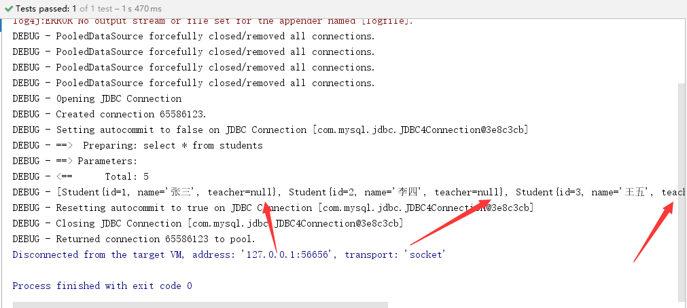

## MyBatis

## 1.Mybatis的简介

MyBatis 本是apache的一个[开源项目](https://baike.baidu.com/item/开源项目/3406069)==iBatis==, 2010年这个[项目](https://baike.baidu.com/item/项目/477803)由apache software foundation 迁移到了[google code](https://baike.baidu.com/item/google code/2346604)，并且改名为MyBatis 。==2013年11==月迁移到[Github](https://baike.baidu.com/item/Github/10145341)。

iBATIS一词来源于“internet”和“abatis”的组合，是一个基于Java的[持久层](https://baike.baidu.com/item/持久层/3584971)框架。iBATIS提供的持久层框架包括SQL Maps和Data Access Objects（DAOs）

当前，最新版本是==MyBatis 3.5.7== ，其发布时间是==2021年4月21日==。

**Mybatis概述**

1. 半自动的ORM（==Object Relational Mapping==）框架
2. DAO层
3. 支持动态SQL
4. 小巧灵活、简单易学

## 2.环境搭建

MyBatis的3.4.2版本可以通过网址下载如下。下载时只需选择mybatis-3.4.2.zip即可，==解压==后得到如下图所示的目录。

```
https://github.com/mybatis/mybatis-3/releases
```


## 3.工作原理

Mybatis工作原理分为8个步骤

​    1．读取 MyBatis 配置文件（==核心配置文件==）。

​    2．加载映射文件。

​    3．构造会话工厂。=>连接池=>==SqlSessionFactory==

​    4．创建会话对象。=>Connection=>==SqlSession==

​    5．Executor 执行器。

​    6．MappedStatement对象。=>==PrepareStatement==

​    7．输入参数映射。

​    8．输出结果映射。

```
http://c.biancheng.net/view/4304.html
```

**配置Mybatis核心配置文件**

```xml
<?xml version="1.0" encoding="UTF-8"?>
<!DOCTYPE configuration PUBLIC "-//mybatis.org//DTD Config 3.0//EN"
"http://mybatis.org/dtd/mybatis-3-config.dtd">

<configuration>
    <!-- 加载类路径下的属性文件 -->
    <properties resource="database.properties"/>

    <!-- 设置类型别名 -->
    <typeAliases>
        <typeAlias type="app01.Student" alias="student"/>
    </typeAliases>

    <!-- 设置一个默认的连接环境信息 -->
    <environments default="mysql_developer">
        <!-- 连接环境信息，取一个任意唯一的名字 -->
        <environment id="mysql_developer">
            <!-- mybatis默认使用jdbc事务管理方法 -->
            <transactionManager type="jdbc"/>
            <!-- mybatis使用连接池的方式获取连接 -->
            <dataSource type="pooled">
                <!-- 配置与数据库交互的四个重要属性 -->
                <property name="driver" value="${mysql.driver}"/>
                <property name="url" value="${mysql.url}"/>
                <property name="username" value="${mysql.username}"/>
                <property name="password" value="${mysql.password}"/>
            </dataSource>
        </environment>

        <environment id="oracle_developer">
            <transactionManager type="jdbc"/>
            <dataSource type="pooled">
                <!-- 配置与数据库交互的四个重要属性 -->
                <property name="driver" value="${oracle.driver}"/>
                <property name="url" value="${oracle.url}"/>
                <property name="username" value="${oracle.username}"/>
                <property name="password" value="${oracle.password}"/>
            </dataSource>
        </environment>
    </environments>
</configuration>
```

## 4.第一个Mybatis程序

```java
package app01;

public interface StudentMapper {

    //学生添加
    void add() throws Exception;
}
```

操作步骤

1. 配置mybatis的核心配置文件=>mybatis.xml
2. 编写MybatisUtils工具类=>为了获取SqlSession对象
3. 编写Mapper接口=>StudentMapper接口
4. 编写该接口的映射文件=>StudentMapper.xml
5. 编写测试类进行测试=>App

**映射器**

| **元素名称**  | **描**  **述**                                             | **备**  **注**                                      |
| ------------- | ---------------------------------------------------------- | --------------------------------------------------- |
| select        | 查询语句，最常用、最复杂的元素之一                         | 可以自定义参数，返回结果集等                        |
| ==insert==    | 插入语句                                                   | 执行后返回一个整q数，代表插入的行数                 |
| update        | 更新语句                                                   | 执行后返回一个整数，代表更新的行数                  |
| delete        | 删除语句                                                   | 执行后返回一个整数，代表删除的行数                  |
| sql           | 定义一部分SQL，在多个位置被引用                            | 例如，一张表列名，一次定义，可以在多个SQL语句中使用 |
| ==resultMap== | 用来描述从数据库结果集中来加载对象，是最复杂、最强大的元素 | 提供映射规则                                        |

## 5.Mybatis的CRUD操作

## 6.分页查询

> 在jd_2002中我们是如何处理商品分页查询的呢？

```sql
select * from goodstable limit m,n;
```

我们需要注入进去两个参数

1. 第一个参数：就是m值，指的是我们起始行
2. 第二个参数：就是n值，指的是每页显示几条数据，容量

**Map类型作参数**

在实际开发中，查询SQL语句精华参观需要多个参数，比如多条件查询。多个参数传递时，在Mybatis中允许Map接口通过键值对传递多个参数

分页查询

1. 有条件分页查询
2. 无条件分页查询

**无条件分页查询**

```java
/**
     * 无条件分页
     * start：表示在MySQL中从第几条记录的索引开始显示
     * size：表示MySQL中最多显示几条记录（容量）
     */
List<Student> findAllByPage(Map<String,Object> map) throws Exception;
```

```xml
<!-- 无条件分页查询 -->
<select id="findAllByPage" parameterType="map" resultMap="studentMap">
    select stuId,stuName,stuSal from student limit #{start},#{size}
</select>
```

**测试类**

```java
@Test
public void testFindAllByPage(){
    SqlSession sqlSession = null;
    try {
        sqlSession = MybatisUtils.getSqlSession();
        //定义Map集合
        Map<String,Object> map = new LinkedHashMap<>();
        //将条件封装到Map集合中
        map.put("start",0);
        map.put("size",3);
        //获取mapper代理对象并调用方法
        List<Student> studentList = sqlSession.getMapper(StudentMapper.class).findAllByPage(map);
        logger.debug(studentList);
    } catch (Exception e) {
        e.printStackTrace();
    } finally {
        MybatisUtils.closeSqlSession(sqlSession);
    }
}
```

**有条件的分页查询**

CONCAT()函数用于将多个字符串连接一个字符串，是最重要的MySQL函数之一

```sql
SELECT CONCAT('My','S','QL');
```

```xml
<!-- 有条件的分页 -->
<select id="findByNameByPage" parameterType="map" resultMap="studentMap">
    select * from student where stuName like concat('%','${pname}','%') limit #{start},#{size}
</select>
```

```java
@Test
public void testFindByNameByPage(){
    SqlSession sqlSession = null;
    try {
        sqlSession = MybatisUtils.getSqlSession();
        //定义Map集合
        Map<String,Object> map = new HashMap<>();
        map.put("pname","莹");
        map.put("start",3);
        map.put("size",3);
        //获取mapper代理对象并调用方法
        List<Student> studentList = sqlSession.getMapper(StudentMapper.class).findByNameByPage(map);
        logger.debug(studentList);
    } catch (Exception e) {
        e.printStackTrace();
    } finally {
        MybatisUtils.closeSqlSession(sqlSession);
    }
}
```

> 在Mybatis中，#{}与${}的区别？

1. #{}：占位符，属于sql预编译（==推荐使用==）
2. ${}：拼接符，属于sql的拼接

```xml
<!--
        方式1：CONCAT('%',#{pname},'%')
        方式2：CONCAT('%','${pname}','%')
     -->
<select id="findByNameByPage" parameterType="map" resultMap="studentMap">
    select * from student where stuName like concat('%',#{pname},'%') limit #{start},#{size}
</select>
```

## 7.动态SQL之查询

> 为什么要使用动态SQL?

开发人员同工厂根据手动拼接SQL语句，这厮一个机器麻烦的工作，而Mybatis提供了对SQL语句动态组装的功能，恰恰能够解决这一问题

动态SQL标签

1. \<where>标签：会在写入where 元素的地方输出一个where语句，另外不需要考虑输出是什么样子
2. \<if>标签：是有条件的包含，where子句的一部分，索引if标签是最常用的元素

```java
package app04;

import java.util.List;
import java.util.Map;

public interface StudentMapper {

    //有条件的查询所有学生
    List<Student> findAllByCondition(Map<String,Object> map) throws Exception;
}
```

```xml
<!-- 有条件的查询所有学生（动态SQL）注意：去掉第一个and或or -->
<select id="findAllByCondition" parameterType="map" resultMap="studentMap">
    select * from student
    <where>
        <if test="pid!=null">
            and stuId=#{pid}
        </if>
        <if test="pname!=null and pname!=''">
            and stuName=#{pname}
        </if>
        <if test="psal!=null">
            and stuSal=#{psal}
        </if>
    </where>
</select>
```

3.\<trim>标签

trim标签：trim元素主要功能是可以在自己包含的内容加上某些前缀，也可以在气候加上某些后缀，与值对应的属性是preffix和suffix，可以将包含的内容的首部某些内容覆盖，即忽略，也可以把尾部的某些内容覆盖，对应的属性是prefixOverrides和suffixOverrides

```xml
<!-- 有条件的查询所有学生（动态SQL）注意：去掉第一个and或or -->
<select id="findAllByCondition" parameterType="map" resultMap="studentMap">
    select * from student
    <!--<where>
            <if test="pid!=null">
                and stuId=#{pid}
            </if>
            <if test="pname!=null and pname!=''">
                and stuName=#{pname}
            </if>
            <if test="psal!=null">
                and stuSal=#{psal}
            </if>
        </where>-->
    <!-- 注：去掉第一个and或or -->
    <trim prefix="where" prefixOverrides="and|or">
        <if test="pid!=null">
            and stuId=#{pid}
        </if>
        <if test="pname!=null and pname!=''">
            and stuName=#{pname}
        </if>
        <if test="psal!=null">
            and stuSal=#{psal}
        </if>
    </trim>
</select>
```

## 8.动态SQL之更新

> 更新的语法

```sql
update student set name=?,sal=? where id=?；
```

\<set>标签

\<set>标签：在动态的update语句中，可以使用set元素==动态==更新列

```xml
<!-- 修改学生（动态SQL） -->
<update id="updateByCondition" parameterType="app05.Student">
    update student
    <!-- set标签：自动检测字段哪一个是最后一个字段，然后会自动去掉最后一个"," -->
    <set>
        <if test="name!=null and name!=''">
            stuName=#{name},
        </if>
        <if test="sal!=null">
            stuSal=#{sal},
        </if>
    </set>
    <where>
        <if test="id!=null">
            stuId=#{id}
        </if>
    </where>
</update>
```

**测试类**

```java
package app05;

import org.apache.ibatis.session.SqlSession;
import org.apache.log4j.Logger;
import org.junit.Test;
import utils.MybatisUtils;

/**
 * 测试类
 */
public class App {

    private Logger logger = Logger.getLogger(App.class);

    @Test
    public void testUpdateByCondition(){
        SqlSession sqlSession = null;
        try {
            //影响的行数
            int updateRows = 0;
            sqlSession = MybatisUtils.getSqlSession();
            //获取mapper的代理对象并调用方法
            updateRows = sqlSession.getMapper(StudentMapper.class).
                    updateByCondition(new Student(5,"国俊",null));
            //判断是否修改成功
            if (updateRows>0){
                logger.debug("修改成功...");
            }
            //提交事务
            sqlSession.commit();
        } catch (Exception e) {
            e.printStackTrace();
            //回滚事务
            sqlSession.rollback();
        } finally {
            //关闭资源
            MybatisUtils.closeSqlSession(sqlSession);
        }
    }
}
```

## 9.动态SQL之删除

**\<foreach>元素**

\<foreach标签>：在使用该标签时，最关键的最荣誉出现错误的是collection属性，该属性是必选的，主要有以下情况

1. 如果传入是单参数，且参数类型是一个array数组的时候，collection属性值为array
2. 如果传入是单参数，且参数类型是一个List集合的时候，collection属性值为list
3. 如果传入是多参数，则需要把它们封装称一个Map（==当然单参数也可可以封装称一个Map==）

该标签的作用：用于迭代数组元素

该标签中必要的属性

1. open属性：表示开始的符号
2. close属性：表示结束符号
3. separator属性：表示元素的分隔符
4. item属性：表示迭代的数组，属性值可以任意，但是体长与方法中的数组名（参数）相同

**单条删除**

```xml
<!-- 删除学生 -->
<delete id="studentDelete" parameterType="app06.Student">
    delete from student
    <where>
        <if test="id!=null">
            stuId=#{id}
        </if>
    </where>
</delete>
```

**批量删除**

```xml
<!-- 批量删除学生（id数组）
        DELETE FROM student WHERE stuId IN(2,3);
    -->
<delete id="studentDeleteByArray">
    delete from student where stuId in
    <!-- foreach标签
             注：#{ids}表示数组每个元素的值
        -->
    <foreach collection="array" open="(" close=")" separator="," item="ids">
        #{ids}
    </foreach>
</delete>
```

```java
@Test
    public void testStudentDeleteByArray(){
        SqlSession sqlSession = null;
        try {
            //影响的行数
            int updateRows = 0;
            //传递的参数
            int[] ids = {2,3};
            //获取mapper代理对象并调用方法
            sqlSession = MybatisUtils.getSqlSession();
            //获取mapper代理对象并调用方法
            updateRows = sqlSession.getMapper(StudentMapper.class).
                    studentDeleteByArray(ids);
            //判断批量删除是否成功
            if (updateRows>0){
                logger.debug("批量删除成功...");
            }
            //提交事务
            sqlSession.commit();
        } catch (Exception e) {
            e.printStackTrace();
            //回滚事务
            sqlSession.rollback();
        } finally {
            //关闭资源
            MybatisUtils.closeSqlSession(sqlSession);
        }
    }
```

**参数为集合**

```java
package app06;

import java.util.List;

public interface StudentMapper {

    //删除学生
    int studentDelete(Student student) throws Exception;
    //根据id批量删除学生（数组版本）
    int studentDeleteByArray(int[] ids) throws Exception;
    //根据id批量删除学生（集合版本）
    int studentDeleteByList(List<Integer> ids) throws Exception;
}
```

```xml
<!-- 批量删除学生（集合） -->
<delete id="studentDeleteByList">
    delete from student where stuId in
    <!-- foreach标签 -->
    <foreach collection="list" open="(" close=")" separator="," item="ids">
        #{ids}
    </foreach>
</delete>
```

```java
@Test
public void testStudentDeleteByList(){
    SqlSession sqlSession = null;
    try {
        //影响的函数
        int updateRows = 0;
        //传入的参数（方式一）
        //List<Integer> ids = new ArrayList<>();
        //向集合中添加元素
        //ids.add(8);
        //ids.add(9);
        //将数组转为集合（方式二）
        List<Integer> ids = Arrays.asList(7,8,9);
        sqlSession = MybatisUtils.getSqlSession();
        //获取mapper代理对象并调用方法
        updateRows = sqlSession.getMapper(StudentMapper.class)
            .studentDeleteByList(ids);
        //判断批量删除是否成功
        if (updateRows>0){
            logger.debug("批量删除成功...");
        }
        //提交事务
        sqlSession.commit();
    } catch (Exception e) {
        e.printStackTrace();
        //回滚事务
        sqlSession.rollback();
    } finally {
        MybatisUtils.closeSqlSession(sqlSession);
    }
}
```

## 10.动态sql之插入（sql片段）

在Mybatis映射器中，有一个名为sql的映射器，用来定义==一部分==SQL，并且多个位置中被引用，例如：一个表列名，一次定义，可以在多个SQL语句中使用

```java
package app07;

public interface StudentMapper {

    //学生添加（SQL片段）
    int studentInsertByParts(Student student) throws Exception;
}
```

```xml
<?xml version="1.0" encoding="UTF-8"?>
<!DOCTYPE mapper PUBLIC "-//mybatis.org//DTD Config 3.0//EN"
        "http://mybatis.org/dtd/mybatis-3-mapper.dtd">


<mapper namespace="app07.StudentMapper">
    <resultMap id="studentMap" type="app07.Student">
        <id property="id" column="stuId"/>
        <result property="name" column="stuName"/>
        <result property="sal" column="stuSal"/>
    </resultMap>

    <!-- sql片段对应字段，id属性为任意
         insert into student(stuId,stuName,stuSal) values(11,'继达',8000);
         insert into student(sql片段1（key）) values(sql片段2（value）);
    -->
    <sql id="key">
        <!-- 去掉最后一个逗号 -->
        <trim suffixOverrides=",">
            <if test="id!=null">
                stuId,
            </if>
            <if test="name!=null and name!=''">
                stuName,
            </if>
            <if test="sal!=null">
                stuSal,
            </if>
        </trim>
    </sql>

    <!-- sql片段对应为字段填充的值，id属性为任意 -->
    <sql id="value">
        <trim suffixOverrides=",">
            <if test="id!=null">
                #{id},
            </if>
            <if test="name!=null and name!=''">
                #{name},
            </if>
            <if test="sal!=null">
                #{sal},
            </if>
        </trim>
    </sql>

    <!-- 学生添加
        <include refid="key"/>和<include refid="value"/>表示引入上面定义的sql片段
    -->
    <insert id="studentInsertByParts" parameterType="app07.Student">
        insert into student (<include refid="key"/>) values (<include refid="value"/>)
    </insert>
</mapper>
```

**测试类**

```java
package app07;

import org.apache.ibatis.session.SqlSession;
import org.apache.log4j.Logger;
import org.junit.Test;
import utils.MybatisUtils;

/**
 * 测试类
 */
public class App {

    private Logger logger = Logger.getLogger(StudentMapper.class);

    @Test
    public void testStudentInsertByParts(){
        SqlSession sqlSession = null;
        try {
            //影响的行数
            int updateRows = 0;
            sqlSession = MybatisUtils.getSqlSession();
            updateRows = sqlSession.getMapper(StudentMapper.class)
                    .studentInsertByParts(new Student(11,"继达",7000D));
            //判断是否插入成功
            if (updateRows>0){
                logger.debug("插入成功...");
            }
            //提交事务
            sqlSession.commit();
        } catch (Exception e) {
            e.printStackTrace();
            //回滚事务
            sqlSession.rollback();
        } finally {
            MybatisUtils.closeSqlSession(sqlSession);
        }
    }
}
```

## 11.多对一映射

多对一：多个学生对应一个老师

**学生实体类（修改）**

```java
package app08;

/**
 * 学生类
 */
public class Student {

    //学号
    private Integer id;
    //姓名
    private String name;

    //学生需要关联一个老师
    private Teacher teacher;

    //无参构造方法
    public Student(){}

    public Integer getId() {
        return id;
    }

    public void setId(Integer id) {
        this.id = id;
    }

    public String getName() {
        return name;
    }

    public void setName(String name) {
        this.name = name;
    }

    public Teacher getTeacher() {
        return teacher;
    }

    public void setTeacher(Teacher teacher) {
        this.teacher = teacher;
    }

    @Override
    public String toString() {
        return "Student{" +
                "id=" + id +
                ", name='" + name + '\'' +
                ", teacher=" + teacher +
                '}';
    }
}
```

如果下图所示，原始的方式处理不了该问题，发现没有查询出老师的信息



思路

1. 查询出所有学生的信息
2. 根据查询出的学生的tid，寻找对应的老师

<font color="red">注：该方式就是子查询的方式</font>

**子查询的方式（方式一）**

```xml
<!-- 方式一：按照子查询处理 -->
<select id="getStudent" resultMap="studentTeacher">
    select * from students
</select>
<resultMap id="studentTeacher" type="app08.Student">
    <id property="id" column="id"/>
    <result property="name" column="name"/>
    <!--
            复杂的属性，我们需要单独处理
                对象：association
                集合：collection
        -->
    <association property="teacher" column="tid" javaType="app08.Teacher" select="getTeacher"/>
</resultMap>
<select id="getTeacher" resultType="app08.Teacher">
    <!-- id=#{id}，#{id}相当于Student类中的tid -->
    select * from teachers where id=#{tid}
</select>
```

```java
package app08;

import org.apache.ibatis.session.SqlSession;
import org.apache.log4j.Logger;
import org.junit.Test;
import utils.MybatisUtils;

import java.util.List;

/**
 * 测试类
 */
public class App {

    Logger logger = Logger.getLogger(App.class);

    @Test
    public void testGetStudent(){
        SqlSession sqlSession = null;
        try {
            sqlSession = MybatisUtils.getSqlSession();
            //获取mapper代理对象并调用方法
            List<Student> studentList = sqlSession.getMapper(StudentMapper.class).getStudent();
            logger.debug(studentList);
        } catch (Exception e) {
            e.printStackTrace();
        } finally {
            //关闭资源
            MybatisUtils.closeSqlSession(sqlSession);
        }
    }
}
```

**按照结果嵌套处理（方式二）**

```xml
<!-- 方式二：按照结果嵌套处理 推荐使用 -->
<select id="getStudent2" resultMap="studentTeacher2">
    SELECT s.`id` sid,s.`name` sname,t.`name` tname
    FROM students s INNER JOIN teachers t ON s.`tid`=t.`id`
</select>
<resultMap id="studentTeacher2" type="app08.Student">
    <id property="id" column="sid"/>
    <result property="name" column="sname"/>
    <association property="teacher" javaType="app08.Teacher">
        <result property="name" column="tname"/>
    </association>
</resultMap>
```

```java
@Test
public void testGetStudent2(){
    SqlSession sqlSession = null;
    try {
        sqlSession = MybatisUtils.getSqlSession();
        //获取mapper代理对象并调用方法
        List<Student> studentList = sqlSession.getMapper(StudentMapper.class).getStudent2();
        logger.debug(studentList);
    } catch (Exception e) {
        e.printStackTrace();
    } finally {
        MybatisUtils.closeSqlSession(sqlSession);
    }
}
```

## 12.一对多映射

一个老师对应多个学生，那么学生我们需要定义为==集合==类型


<font color="red">注：使用原始方式解决不了该问题，所以我们需要使用查询嵌套或结果嵌套的方式</font>

**Mybatis的参数配置**

Mybatis的参数配置属性是：parameterType。这个属性是可选的，因为Mybatis可以通过类型处理器（TypeHandler）推断出具体传入语句的参数

<font color="red">注：简单参数类型可以省略该属性，如：int,double，那么复杂数据类型不能省略，如：实体类（对象），Map（类型）</font>

**@Param注解**

这种方式不需要设置参数类型，参数名称为注解定义的名称。这种方式能够大大提高可读性，但是只适合参数较少的情况，一般是==少于5个==用此方法

**按照结果嵌套查询（方式一）**

```java
package app09;

import java.util.List;

/**
 * 老师类
 */
public class Teacher {

    //老师编号
    private Integer id;
    //老师姓名
    private String name;

    //该老师所教授的学生
    private List<Student> students;

    //无参构造方法
    public Teacher(){}

    public Integer getId() {
        return id;
    }

    public void setId(Integer id) {
        this.id = id;
    }

    public String getName() {
        return name;
    }

    public void setName(String name) {
        this.name = name;
    }

    public List<Student> getStudents() {
        return students;
    }

    public void setStudents(List<Student> students) {
        this.students = students;
    }

    @Override
    public String toString() {
        return "Teacher{" +
                "id=" + id +
                ", name='" + name + '\'' +
                ", students=" + students +
                '}';
    }
}
```

```xml
<!-- 按照结果嵌套处理 -->
<select id="getTeacher" resultMap="teacherStudent">
    SELECT s.`id` sid,s.`name` sname,t.`id` tid,t.`name` tname
    FROM students s,teachers t
    WHERE s.`tid`=t.`id` AND t.`id`=#{tid}
</select>
<resultMap id="teacherStudent" type="app09.Teacher">
    <id property="id" column="tid"/>
    <result property="name" column="tname"/>
    <!--
            复杂属性我们需要单独处理
                对象：association
                        javaType：指定属性的类型
                集合：collection
                        ofType：集合的泛型使用该属性获取
         -->
    <collection property="students" ofType="app09.Student">
        <id property="id" column="sid"/>
        <result property="name" column="sname"/>
        <result property="tid" column="tid"/>
    </collection>
</resultMap>
```

**测试类**

```java
@Test
public void testGetTeacher(){
    SqlSession sqlSession = null;
    try {
        sqlSession = MybatisUtils.getSqlSession();
        //获取Mapper代理对象并调用方法
        Teacher teacher = sqlSession.getMapper(TeacherMapper.class).getTeacher(1);
        logger.debug(teacher);
    } catch (Exception e) {
        e.printStackTrace();
    } finally {
        MybatisUtils.closeSqlSession(sqlSession);
    }
}
```

**按照查询嵌套处理即子查询（方式二）**

```xml
<!-- 按照查询嵌套（子查询） -->
<select id="getTeacher2" resultMap="teacherStudent2">
    select * from teachers where id=#{tid}
</select>
<resultMap id="teacherStudent2" type="app09.Teacher">
    <id property="id" column="id"/>
    <result property="name" column="name"/>
    <collection property="students" ofType="app09.Student" select="getStudentByTeacherId" column="id"/>
</resultMap>
<select id="getStudentByTeacherId" resultType="app09.Student">
    select * from students where tid=#{tid}
</select>
```

**测试类**

```java
package app09;

import org.apache.ibatis.session.SqlSession;
import org.apache.log4j.Logger;
import org.junit.Test;
import utils.MybatisUtils;

import java.util.List;

/**
 * 测试类
 */
public class App {

    private Logger logger = Logger.getLogger(App.class);

    /*@Test
    public void testGetTeacher(){
        SqlSession sqlSession = null;
        try {
            sqlSession = MybatisUtils.getSqlSession();
            //获取mapper代理对象并调用方法
            List<Teacher> teacherList = sqlSession.getMapper(TeacherMapper.class).getTeacher();
            logger.debug(teacherList);
        } catch (Exception e) {
            e.printStackTrace();
        } finally {
            MybatisUtils.closeSqlSession(sqlSession);
        }
    }*/

    @Test
    public void testGetTeacher(){
        SqlSession sqlSession = null;
        try {
            sqlSession = MybatisUtils.getSqlSession();
            //获取Mapper代理对象并调用方法
            Teacher teacher = sqlSession.getMapper(TeacherMapper.class).getTeacher(1);
            logger.debug(teacher);
        } catch (Exception e) {
            e.printStackTrace();
        } finally {
            MybatisUtils.closeSqlSession(sqlSession);
        }
    }
    
    @Test
    public void testGetTeacher2(){
        SqlSession sqlSession = null;
        try {
            sqlSession = MybatisUtils.getSqlSession();
            //获取mapper代理对象并调用方法
            Teacher teacher = sqlSession.getMapper(TeacherMapper.class).getTeacher2(1);
            logger.debug(teacher);
        } catch (Exception e) {
            e.printStackTrace();
        } finally {
            MybatisUtils.closeSqlSession(sqlSession);
        }
    }
}
```

**13.一级缓存**

mybatis的缓存机制

使用缓存可以减少服务器与数据库==交互次数==，提高程序的运行效率，当第一次执行SQL语句查询出结果后，自动将对象保存导缓存中，当执行==相同SQL时==，直接从缓存中取出对象，不需要==重复访问==数据库

**一级缓存**

SqlSession级别，默认开启，不能关闭。Mybatis操作数据库时需要创建SqlSession对象，SqlSession中存在一个hashmap容器用于存储缓存数据，当执行相同的SQL语句时，只要SqlSession对象不关闭，往后执行多次相同的SQL语句都不会再次访问数据库，只需从缓存中即可获取

**执行相同SQL语句（在同一个SqlSession中）**


<font color="red">注：执行了一次sql语句，也就是说至于一次从数据库中进行查询，那么证明了一级缓存存在</font>

```java
@Test
public void testFindAll(){
    SqlSession sqlSession = null;
    try {
        sqlSession = MybatisUtils.getSqlSession();
        //获取mapper代理对象
        StudentMapper studentMapper = sqlSession.getMapper(StudentMapper.class);
        //执行两次相同的查询语句
        List<Student> studentList = studentMapper.findAll();
        List<Student> studentList2 = studentMapper.findAll();
        logger.debug(studentList);
        logger.debug(studentList2);
    } catch (Exception e) {
        e.printStackTrace();
    } finally {
        MybatisUtils.closeSqlSession(sqlSession);
    }
}
```

****

**不同的StudentMapper会执行几次SQL语句（不同的SqlSession）**


<font color="red">注：执行了两次SQL语句，证明一级缓存为SqlSession级别</font>

```java
@Test
public void testFindAll2() throws Exception{
    SqlSession sqlSession = MybatisUtils.getSqlSession();
    //获取第一个mapper对象
    StudentMapper studentMapper = sqlSession.getMapper(StudentMapper.class);
    SqlSession sqlSession2 = MybatisUtils.getSqlSession();
    //获取第二个mapper对象
    StudentMapper studentMapper2 = sqlSession2.getMapper(StudentMapper.class);
    //执行相同的SQL语句
    List<Student> studentList = studentMapper.findAll();
    List<Student> studentList2 = studentMapper2.findAll();
    logger.debug(studentList);
    logger.debug(studentList2);
    //关闭资源
    MybatisUtils.closeSqlSession(sqlSession);
    MybatisUtils.closeSqlSession(sqlSession2);
}
```

**执行相同SQL，两个SQL语句中间加入DML语句**

