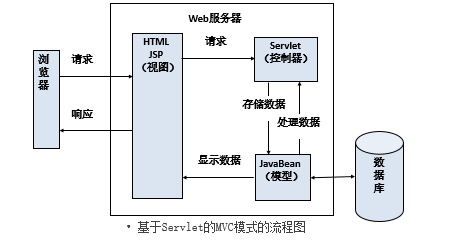
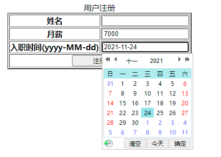
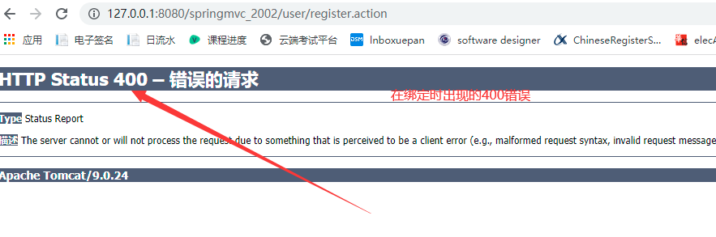

# Spring MVC

## 1.Spring MVC简介

Spring MVC属于SpringFrameWork的==后续产品==，已经融合在Spring Web Flow里面。Spring 框架提供了构建 [Web](https://baike.baidu.com/item/Web/150564) 应用程序的全功能 ==MVC== 模块。使用 Spring 可插入的 MVC 架构，从而在使用Spring进行WEB开发时，可以选择使用Spring的Spring MVC框架或集成其他MVC开发框架，如Struts1(现在一般不用)，Struts 2(一般==老项目==使用)等等。

## 2.MVC模式

MVC是Model、View、Cotroller的缩写，分别代表Web应用程序中的3种职责

1. 模型（Model）：用户存储数据级处理用户请求的业务逻辑
2. 视图（View）：向控制台提出数据，显示模型中的数据
3. 控制器（Cotroller）：根据视图提出的请求判断将请求和数据交给哪个模块处理，将处理后的关系结果交给哪个视图更新显示

> 关于Servlet的MVC模式？jd_2002

1. 模型：一个或多个JavaBean
2. 视图：一个或多个JSP页面
3. 控制器：一个或多个Servlet对象



## 3.Spring MVC的工作原理


Spring MVC的工作流程

1. 客户端请求提交到DispatherServlet（核心控制器）
2. 由DispatherServlet控制器找到一个或多个HanlderMapping，找到处理请求的Controller
3. DispatherServlet将请求提交到Controller
4. Controller调用业务逻辑处理后返回ModelAndView（==对象+视图组成==）
5. DispatherServlet寻找一个或多个ViewResolver（视图解析器），找到ModelAndView指定的视图
6. 视图负责将结果显示到客户端

<font color="red">注：Spring MVC的核心控制是一个Servlet，Struts2的核心控制器是一个过滤器</font>

## 4.Spring MVC的环境搭建

环境搭建

1. 创建Maven Web项目（==选择Maven Web骨架结构==）
2. 在pom.xml中编写Spring MVC的所有jar包坐标（==将jar包下载到我们的本地仓库==）
3. 在web.xml中配置核心控制器（==DispatherServlet==）
4. 在web.xml中配置处理请求乱码的过滤器（==Spring中自带该过滤器==）

**配置web.xml**

```xml
<?xml version="1.0" encoding="UTF-8"?>
<web-app xmlns="http://xmlns.jcp.org/xml/ns/javaee"
         xmlns:xsi="http://www.w3.org/2001/XMLSchema-instance"
         xsi:schemaLocation="http://xmlns.jcp.org/xml/ns/javaee http://xmlns.jcp.org/xml/ns/javaee/web-app_4_0.xsd"
         version="4.0">

    <!-- 配置Spring MVC的核心控制器 -->
    <servlet>
        <servlet-name>DispatcherServlet</servlet-name>
        <servlet-class>org.springframework.web.servlet.DispatcherServlet</servlet-class>
    </servlet>
    <servlet-mapping>
        <servlet-name>DispatcherServlet</servlet-name>
        <url-pattern>*.action</url-pattern>
    </servlet-mapping>

   <!-- 配置Spring提供的针对POST请求的中文乱码问题 -->
    <filter>
        <filter-name>CharacterEncodingFilter</filter-name>
        <filter-class>org.springframework.web.filter.CharacterEncodingFilter</filter-class>
        <init-param>
            <param-name>encoding</param-name>
            <param-value>utf-8</param-value>
        </init-param>
    </filter>
    <filter-mapping>
        <filter-name>CharacterEncodingFilter</filter-name>
        <url-pattern>/*</url-pattern>
    </filter-mapping>
</web-app>
```

<font color=red>注：如果在web.xml中没有指定springmvc的配置文件，那么springmvc会自动在WEB-INF目录下寻找名为DispatcherServlet-*.xml这样的xml文件</font>

## 5.Spring MVC快速入门（xml版）

> 如果没有指定springmvc配置文件？

我们需要在WEB-INF目录下新建一个名为DispatcherServlet-*.xml

**配置DispatcherServlet-servlet.xml**

```xml
<?xml version="1.0" encoding="UTF-8"?>
<beans xmlns="http://www.springframework.org/schema/beans"
       xmlns:xsi="http://www.w3.org/2001/XMLSchema-instance"
       xsi:schemaLocation="http://www.springframework.org/schema/beans http://www.springframework.org/schema/beans/spring-beans.xsd">

    <!--
        注册Action
            class：表示处理类的全路径
            name：表示请求路径
            必须配置
     -->
    <bean name="/hello.action" class="app01.HelloAction"/>

    <!--
        映射器
        BeanNameUrlHandlerMapping表示bean标签的name属性当作URL请求
        可选
     -->
    <bean class="org.springframework.web.servlet.handler.BeanNameUrlHandlerMapping"/>

    <!--
        适配器
        SimpleControllerHandlerAdapter表示查找实现了Controller接口的Action类
        可选
     -->
    <bean class="org.springframework.web.servlet.mvc.SimpleControllerHandlerAdapter"/>

    <!--
        视图解析器
        InternalResourceViewResolver表示通过ModelAndView对象中的视图名到真正的页面
        可选
     -->
    <bean class="org.springframework.web.servlet.view.InternalResourceViewResolver"/>
</beans>
```

```java
package app01;

import org.springframework.web.servlet.ModelAndView;
import org.springframework.web.servlet.mvc.Controller;

import javax.servlet.http.HttpServletRequest;
import javax.servlet.http.HttpServletResponse;

public class HelloAction implements Controller {

    public HelloAction(){
        System.out.println("HelloAction->" + this.hashCode());
    }

    public ModelAndView handleRequest(HttpServletRequest httpServletRequest, HttpServletResponse httpServletResponse) throws Exception {
        System.out.println("HelloAction::handleRequest");
        //ModelAndView表示向视图封装的数据和真实路径
        ModelAndView modelAndView = new ModelAndView();
        //封装数据
        modelAndView.addObject("message","这是我们第一个Spring MVC应用程序，映射器_适配器_视图解析器为可选配置");
        //封装视图
        modelAndView.setViewName("/jsp/success.jsp");
        return modelAndView;
    }
}
```

<font color=red>注：Spring MVC为单例模式，scope="singleton"</font>

## 6.自定义的spring.xml配置文件

指定加载的spring.xml

```xml
<init-param>
    <param-name>contextConfigLocation</param-name>
    <param-value>classpath:spring.xml</param-value>
</init-param>
```

**配置视图解析器**

```xml
<?xml version="1.0" encoding="UTF-8"?>
<beans xmlns="http://www.springframework.org/schema/beans"
       xmlns:xsi="http://www.w3.org/2001/XMLSchema-instance"
       xsi:schemaLocation="http://www.springframework.org/schema/beans http://www.springframework.org/schema/beans/spring-beans.xsd">

    <!-- 注册Action（必） -->
    <bean name="/hello.action" class="app02.HelloAction"/>

    <!--
        如果Action中视图逻辑名称，那么视图解析器就必须配置
        如果Action中书写的是视图的完整名称，那么视图解析器就是可选配置
     -->
    <bean class="org.springframework.web.servlet.view.InternalResourceViewResolver">
        <!-- /jsp/success.jsp -->
        <!-- 路径前缀 -->
        <property name="prefix" value="/jsp/"/>
        <!-- 路径后缀 -->
        <property name="suffix" value=".jsp"/>
        <!-- 前缀 + 视图逻辑名 + 后最 = 真实路径 -->
    </bean>
</beans>
```

```java
package app02;

import org.springframework.web.servlet.ModelAndView;
import org.springframework.web.servlet.mvc.Controller;

import javax.servlet.http.HttpServletRequest;
import javax.servlet.http.HttpServletResponse;

public class HelloAction implements Controller {

    @Override
    public ModelAndView handleRequest(HttpServletRequest httpServletRequest, HttpServletResponse httpServletResponse) throws Exception {
        //实例化ModelAndView对象
        ModelAndView modelAndView = new ModelAndView();
        //封装数据
        modelAndView.addObject("message","这是我们第二个SpringMVC应用程序，视图使用逻辑名...");
        //封装视图的真实路径
        //modelAndView.setViewName("/jsp/success.jsp");
        //封装视图的逻辑名称
        modelAndView.setViewName("success");
        return modelAndView;
    }
}
```

## 7.第一个Spring MVC应用（注解版）

> 使用基于注解的控制器有什么优点？

1. 在基于注解 的控制器中，可以编写多个处理方法，进而就可以处理多个请求，这就允许将相关操作编写在一个控制类中，从而减少控制器类的数量，方便以后的维护
2. 基于注解的控制器不需要再配置文件中部署映射，仅需要使用@RequestMapping注解去注解一个方法进行请求处理

**@Controller注解**

概述：在Spring MVC中，使用@Controller注解类型声明某类的实例是一个控制器

**@RequestMapping注解**

概述：在基于注解的控制类中，可以为每个请求编写对应的处理方法。使用@RequestMapping注解将请求和处理方法一一对应，@RequestMapping注解的类型有两种

1. 方法级别

   方法级别的@RequestMapping注解作用在处理方法上。该注解的value属性将请求URL映射到方法，value属性是该注解的默认属性，如果只有一个value属性，则可以省略该属性

2. 类级别

   在类级别注解的情况下，控制器中所有方法都将映射为类级别请求

<font color=red>注：为了方便维护程序，建议开发者使用类级别注解，将相关处理放在同一个控制类中</font>

```java
package app03;

import org.springframework.stereotype.Controller;
import org.springframework.ui.Model;
import org.springframework.web.bind.annotation.RequestMapping;

@Controller
public class HelloAction {

    /**
     * 业务方法
     * 只要是/hello.action的请求，都交由HelloAction对象中的hello()方法去处理
     * @param model
     * @return
     * @throws Exception
     */
    @RequestMapping(value = "/hello.action")
    public String hello(Model model) throws Exception{
        System.out.println("HelloAction:hello()");
        //保存数据
        model.addAttribute("message","加油，大数据2002....");
        return "success";
    }

    /**
     * 业务方法
     * 只要是/hello.action的请求，都交由HelloAction对象中的bye()方法去处理
     * @param model
     * @return
     * @throws Exception
     */
    @RequestMapping(value = "/bye.action")
    public String bye(Model model) throws Exception{
        System.out.println("HelloAction:bye()");
        //保存数据
        model.addAttribute("message","努力奋斗，大数据2002...");
        return "success";
    }
}
```

```xml
<?xml version="1.0" encoding="UTF-8"?>
<beans xmlns="http://www.springframework.org/schema/beans"
       xmlns:xsi="http://www.w3.org/2001/XMLSchema-instance"
       xmlns:context="http://www.springframework.org/schema/context"
       xsi:schemaLocation="http://www.springframework.org/schema/beans http://www.springframework.org/schema/beans/spring-beans.xsd http://www.springframework.org/schema/context https://www.springframework.org/schema/context/spring-context.xsd">

    <!-- 让Spring IOC容器去扫描带@Controller的类 -->
    <context:component-scan base-package="app03"/>

    <!-- 视图解析器 -->
    <bean class="org.springframework.web.servlet.view.InternalResourceViewResolver">
        <property name="prefix" value="/jsp/"/>
        <property name="suffix" value=".jsp"/>
    </bean>
</beans>
```

## 8.在action中编写多个业务方法

为了方便维护程序，建议开发者使用类级别注解，将==相关处理==放在同一个控制类中

```java
package app04;

import org.springframework.stereotype.Controller;
import org.springframework.ui.Model;
import org.springframework.web.bind.annotation.RequestMapping;

@Controller
@RequestMapping(value = "/user")
public class UserAction {

    //用户注册
    @RequestMapping("/register")
    public String register(Model model) throws Exception{
        //保存数据
        model.addAttribute("message","员工注册成功...");
        return "/jsp/success.jsp";
    }

    //用户登录
    @RequestMapping("/login")
    public String login(Model model) throws Exception{
        //保存数据
        model.addAttribute("message","员工登录成功...");
        return "/jsp/success.jsp";
    }
}
```

```xml
<?xml version="1.0" encoding="UTF-8"?>
<beans xmlns="http://www.springframework.org/schema/beans"
       xmlns:xsi="http://www.w3.org/2001/XMLSchema-instance"
       xmlns:context="http://www.springframework.org/schema/context"
       xsi:schemaLocation="http://www.springframework.org/schema/beans http://www.springframework.org/schema/beans/spring-beans.xsd http://www.springframework.org/schema/context https://www.springframework.org/schema/context/spring-context.xsd">

    <!-- 开启注解扫描 -->
    <context:component-scan base-package="app04"/>
</beans>
```

## 9.在业务控制方法中接收参数

> 如何在业务方法中接收参数？

1. 通过处理方法的形参接收参数（@RequestParam注解）
2. 通过实体bean接收参数（@ModelAttribute注解）
3. 通过HttpServletRequest接收参数
4. @PathVariable注解接收URL中的请求参数

```java
package app05;

import org.springframework.stereotype.Controller;
import org.springframework.ui.Model;
import org.springframework.web.bind.annotation.RequestMapping;
import org.springframework.web.bind.annotation.RequestMethod;

@Controller
@RequestMapping(value = "/user")
public class UserAction {

    //用户注册，只能接收POST请求
    @RequestMapping(method = RequestMethod.POST,value = "/register")
    public String register(Model model,String username,double salary) throws Exception{
        System.out.println("用户注册->" + username + "：" + salary);
        //保存数据
        model.addAttribute("message","员工注册成功...");
        return "/jsp/success.jsp";
    }

    //员工登录，技能接收POST请求，也能接收GET请求
    //不写GET和POST均可
    //@RequestMapping(value = "/login")
    //等价于上面的写法
    @RequestMapping(value = "/login",method = {RequestMethod.GET,RequestMethod.POST})
    public String login(Model model,String username) throws Exception{
        System.out.println("用户名->" + username);
        //保存数据
        model.addAttribute("message","员工登录成功...");
        return "/jsp/success.jsp";
    }
}
```

<font color=red>注：业务方法的参数名称必须与界面表单中的控件名一致</font>

## 10.在业务方法中写入传统的Web参数

> Spring MVC在业务方法中可以传递哪些Web应用参数？

1. HttpServletRequest：请求=>请求转发
2. HttpServletResponse：响应 =>重定向
3. HttpSession：会话=>可以将数据保存到Session对象中

```java
package app06;

import org.springframework.stereotype.Controller;
import org.springframework.web.bind.annotation.RequestMapping;
import org.springframework.web.bind.annotation.RequestMethod;

import javax.servlet.http.HttpServletRequest;
import javax.servlet.http.HttpServletResponse;

@Controller
@RequestMapping(value = "/user")
public class UserAction {

    //用户注册，只能接收POST请求
    @RequestMapping(method = RequestMethod.POST,value = "/register")
    public String register(HttpServletRequest request, HttpServletResponse response) throws Exception{
        //获取用户名
        String username = request.getParameter("username");
        //获取薪水
        String salary = request.getParameter("salary");
        System.out.println("用户注册->" + username + "：" + salary);
        //将数据存放到Session中
        request.getSession().setAttribute("username",username);
        request.getSession().setAttribute("salary",salary);
        //Servlet中请求转发
        //SpringMVC中的跳转，推荐使用
        //return "/jsp/success.jsp";
        //request.getRequestDispatcher("/jsp/success.jsp").forward(request,response);
        //Spring MVC中的请求转发写法
        //return "forward:/jsp/success.jsp";
        //Servlet中的重定向
        //response.sendRedirect(request.getContextPath() + "/jsp/success.jsp");
        //Spring MVC中的重定向写法
        return "redirect:/jsp/success.jsp";
    }
}
```

## 11.@RequestParam注解获取参数

**@RequestParm注解**

概述：通过处理方法的形参接收请求参数

> @RequestParam注解都有哪些属性？

1. value属性：参数名

2. required属性：是否必须，有两个值分别为true和false，如果不加该属性，默认为required=true

   <font color=red>注：可以简化为，如@RequestParam String username</font>

3. defaultValue属性：该参数的默认值

   <font color=red>注：该参数没有传参，则该参数为此该属性设置的值（默认值）</font>

```java
package app07;

import org.springframework.stereotype.Controller;
import org.springframework.web.bind.annotation.RequestMapping;
import org.springframework.web.bind.annotation.RequestMethod;
import org.springframework.web.bind.annotation.RequestParam;

import javax.servlet.http.HttpSession;

@Controller
@RequestMapping(value = "/user")
public class UserAction {

    @RequestMapping(method = RequestMethod.POST,value = "/register")
    public String register(@RequestParam String username, @RequestParam double salary, HttpSession session) throws Exception{
        System.out.println("用户注册->" + username + "：" + salary);
        //将数据保存到Session对象中
        session.setAttribute("username",username);
        session.setAttribute("salary",salary);
        return "redirect:/jsp/success.jsp";
    }
}
```

**没有传入salary值**


<font color=red>注：需要将参数由基本数据类型改为包装类型，如：double->Double，如果没有传参，则会赋值为null，这样才会避免400错误的产生</font>

**完整写法**

```java
package app07;

import org.springframework.stereotype.Controller;
import org.springframework.web.bind.annotation.RequestMapping;
import org.springframework.web.bind.annotation.RequestMethod;
import org.springframework.web.bind.annotation.RequestParam;

import javax.servlet.http.HttpSession;

@Controller
@RequestMapping(value = "/user")
public class UserAction {

    @RequestMapping(method = RequestMethod.POST,value = "/register")
    public String register(@RequestParam String username, @RequestParam(value = "salary",required = true,defaultValue = "7500") Double salary, HttpSession session) throws Exception{
        System.out.println("用户注册->" + username + "：" + salary);
        //将数据保存到Session对象中
        session.setAttribute("username",username);
        session.setAttribute("salary",salary);
        return "redirect:/jsp/success.jsp";
    }
}
```

<font color=red>注：如果没有传参，则值为null，如果设置默认值，则值为默认值，defaultValue属性通常用在分页当中，用于指定容量</font>

## 12.@InitBinder注解

**M97时间控件**

> 如何使用该时间控件？

1. 下载时间控件
2. 引入时间控件
3. 设置单击事件
4. 使用该控件进行日期选择



> 在Spring MVC中，能不能使用实体类去接收一个参数呢？

我们可以使用@ModelAttribute注解

**@ModelAttribute注解**

概述：该注解放在处理方法的形参上时，用于将分多个请求参数封装到一个实体类对象，从而简化数据绑定流程，而且自动暴露为模型数据用于视图页面展示时使用

```java
package app08;

import com.sun.org.apache.xpath.internal.operations.Mod;
import org.springframework.stereotype.Controller;
import org.springframework.ui.Model;
import org.springframework.web.bind.annotation.ModelAttribute;
import org.springframework.web.bind.annotation.RequestMapping;
import org.springframework.web.bind.annotation.RequestMethod;

@Controller
@RequestMapping(value = "/user")
public class UserAction {

    @RequestMapping(method = RequestMethod.POST,value = "/register")
    public String register(@ModelAttribute User user, Model model) throws Exception{
        System.out.println("用户注册：" + user.toString());
        //保存数据
        model.addAttribute("user",user);
        return "/jsp/success.jsp";
    }
}
```



<font color="red">注：如果表单有日期格式，那么在Spring MVC中需要进行字符串转日期类型的转换，其中@ModelAttribute可以省略</font>

```java
package app08;

import com.sun.org.apache.xpath.internal.operations.Mod;
import org.springframework.beans.propertyeditors.CustomDateEditor;
import org.springframework.stereotype.Controller;
import org.springframework.ui.Model;
import org.springframework.web.bind.WebDataBinder;
import org.springframework.web.bind.annotation.InitBinder;
import org.springframework.web.bind.annotation.ModelAttribute;
import org.springframework.web.bind.annotation.RequestMapping;
import org.springframework.web.bind.annotation.RequestMethod;

import java.text.SimpleDateFormat;
import java.util.Date;

@Controller
@RequestMapping(value = "/user")
public class UserAction {

    /**
     * 定义自定义类型转换器
     * 解决字符串转换成日期类型
     * @param
     * @param
     * @return
     * @throws Exception
     */
    @InitBinder
    public void initBinder(WebDataBinder binder) throws Exception{
        binder.registerCustomEditor(
                Date.class,
                new CustomDateEditor(new SimpleDateFormat("yyyy-MM-dd"),true)
        );
    }

    @RequestMapping(method = RequestMethod.POST,value = "/register")
    public String register(@ModelAttribute User user, Model model) throws Exception{
        System.out.println("用户注册：" + user.toString());
        //保存数据
        model.addAttribute("user",user);
        return "/jsp/success.jsp";
    }
}
```

```jsp
<%--
  Created by IntelliJ IDEA.
  User: LiYang
  Date: 2021/11/22
  Time: 15:02
  To change this template use File | Settings | File Templates.
--%>
<%@ page contentType="text/html;charset=UTF-8" language="java" %>
<%@ taglib uri="http://java.sun.com/jsp/jstl/core" prefix="c"%>
<%@ taglib uri="http://java.sun.com/jsp/jstl/fmt" prefix="fmt"%>
<html>
<head>
    <title>Title</title>
</head>
<body>
    ${message}<br/>
    success.jsp<br/>
    成功<br/>
    ${requestScope.message}<br/>
    ${username}<br/>
    ${salary}<br/>
    <!-- 格式化日期 -->
    <fmt:formatDate value="${user.hiredate}" type="date"/>
</body>
</html>
```

## 13.@ResponseBody注解响应JSON文本返回

> 由于没有讲解jQuery，我们不知道DOM的基本使用，以及JSON和AJAX

> 什么是JSON？

JSON(JavaScript Object Notation)是一种==轻量级==的数据交换格式

**JSON的结构**

JSON有两种结果

1. 对象结构：对象结构以"{"开始，以"}"结束，中间由0个或多个英文逗号分隔的key/value对构成，key和value之间以英文“:”分隔
2. 数组结构：数据结构以“[”开头，以“]”结束，中间由0个或多个英文逗号风格的值的列表组成

**@ResponseBody注解**

在注解开发时，需要两个重要的JSON格式转换注解，分别是@RequestBody和==@ResponseBody==

1. @RequestBody：用于将请求中的数据绑定到方法的形参中，该注解应用在方法的形参上
2. @ResponseBody：用于直接返回return对象，该注解应用在方法上

> 引入Jackson的jar包？

```xml
<!-- Jackson -->
<dependency>
    <groupId>com.fasterxml.jackson.core</groupId>
    <artifactId>jackson-databind</artifactId>
    <version>2.9.8</version>
</dependency>
```

```java
package app09;

import org.springframework.stereotype.Controller;
import org.springframework.web.bind.annotation.RequestMapping;
import org.springframework.web.bind.annotation.ResponseBody;

import java.util.Date;

@Controller
@RequestMapping("/emp")
public class EmpAction {

    @RequestMapping(value = "/beantojson")
    @ResponseBody
    public Emp beantojson() throws Exception{
        //创建员工对象
        Emp emp = new Emp();
        //封装数据
        emp.setId(1);
        emp.setUsername("郝月");
        emp.setSalary(7000D);
        emp.setHiredate(new Date());
        return emp;
    }
}
```

**对象转JSON**

```JAVA
package app09;

import org.springframework.stereotype.Controller;
import org.springframework.web.bind.annotation.RequestMapping;
import org.springframework.web.bind.annotation.ResponseBody;

import java.util.Date;

@Controller
@RequestMapping("/emp")
public class EmpAction {

    //对象转JSON
    @RequestMapping(value = "/beantojson")
    @ResponseBody
    public Emp beantojson() throws Exception{
        //创建员工对象
        Emp emp = new Emp();
        //封装数据
        emp.setId(1);
        emp.setUsername("郝月");
        emp.setSalary(7000D);
        emp.setHiredate(new Date());
        return emp;
    }
}
```

```xml
<?xml version="1.0" encoding="UTF-8"?>
<beans xmlns="http://www.springframework.org/schema/beans"
       xmlns:xsi="http://www.w3.org/2001/XMLSchema-instance"
       xmlns:contex="http://www.springframework.org/schema/context"
       xmlns:mvc="http://www.springframework.org/schema/mvc"
       xsi:schemaLocation="http://www.springframework.org/schema/beans http://www.springframework.org/schema/beans/spring-beans.xsd http://www.springframework.org/schema/context https://www.springframework.org/schema/context/spring-context.xsd http://www.springframework.org/schema/mvc https://www.springframework.org/schema/mvc/spring-mvc.xsd">

    <!-- 开启注解扫描 -->
    <contex:component-scan base-package="app09"/>

    <!-- 开启Spring MVC注解驱动及Jackson乱码解决 -->
    <mvc:annotation-driven>
        <mvc:message-converters>
            <bean class="org.springframework.http.converter.StringHttpMessageConverter">
                <constructor-arg value="UTF-8"/>
            </bean>
            <bean class="org.springframework.http.converter.json.MappingJackson2HttpMessageConverter">
                <property name="objectMapper">
                    <bean class="org.springframework.http.converter.json.Jackson2ObjectMapperFactoryBean">
                        <property name="failOnEmptyBeans" value="false"/>
                    </bean>
                </property>
            </bean>
        </mvc:message-converters>
    </mvc:annotation-driven>
</beans>
```

```javascript
{"id":1,"username":"郝月","salary":7000.0,"hiredate":1637903836739}
```

<font color=red>注：@ReponseBody的本质为将某对象转换成json文本，如果@ResponseBody遗漏就会出现404错误</font>

**List转JSON**

```java
//List转JSON
@RequestMapping("/listbeantojson")
@ResponseBody
public List list2json() throws Exception{
    //实例化集合对象
    List<Emp> empList = new ArrayList<>();
    //向集合中添加元素
    empList.add(new Emp(1,"继达",7000D,new Date()));
    empList.add(new Emp(2,"施迪",8000D,new Date()));
    empList.add(new Emp(3,"明昊",9000D,new Date()));
    return empList;
}
```

```javascript
[{"id":1,"username":"继达","salary":7000.0,"hiredate":1637904587452},{"id":2,"username":"施迪","salary":8000.0,"hiredate":1637904587452},{"id":3,"username":"明昊","salary":9000.0,"hiredate":1637904587452}]
```

**Map转JSON**

```java
//Map转JSON
@RequestMapping("/maptojson")
@ResponseBody
public Map<String,Object> map2json() throws Exception{
    //实例化List集合对象
    List<Emp> empList = new ArrayList<>();
    //向集合中添加元素
    empList.add(new Emp(1,"美楠",7000D,new Date()));
    empList.add(new Emp(2,"国俊",8000D,new Date()));
    empList.add(new Emp(3,"宏达",9000D,new Date()));
    //实例化Map集合对象
    Map<String,Object> map = new LinkedHashMap<>();
    //向集合中添加元素（模拟Easy UI前端框架的分页）
    map.put("total",empList.size());
    map.put("rows",empList);
    return map;
}
```

```javascript
{"total":3,"rows":[{"id":1,"username":"美楠","salary":7000.0,"hiredate":1637905422635},{"id":2,"username":"国俊","salary":8000.0,"hiredate":1637905422635},{"id":3,"username":"宏达","salary":9000.0,"hiredate":1637905422635}]}
```

<font color=red>注：在JSON中，对象和数组结构可以分别构成更为复杂的数据结构，如：Map集合（JSON）</font>

***由于没有讲解jQuery，这里涉及jQuery Ajax，所以我们还会回到这个demo***

## 14.Restful风格实现

> 如何在URL中接收请求参数？

==@PathVariable注解==接收URL中的请求参数

> 什么是Restful风格？

Restful风格是一个资源定位、资源操作的风格。不是标准也不是协议，只是一种风格。基于这个风格设计的软件可以更简介、更有层次、更易于实现缓存机制

**传统方式传参**

```
http://127.0.0.1:8080/jd_2002/GoodsDetailServlet.action?id=1
```

**Restful风格传参**

```
http://127.0.0.1:8080/jd_2002/GoodsDetailServlet/1.action
```

```java
package app10;

import org.springframework.stereotype.Controller;
import org.springframework.ui.Model;
import org.springframework.web.bind.annotation.PathVariable;
import org.springframework.web.bind.annotation.RequestMapping;

@Controller
@RequestMapping("/user")
public class UserAction {

    //跳转到修改页面（数据回显）
    @RequestMapping("/select")
    public String userByIdSelect(Model model) throws Exception{
        //实例化用户类
        User user = new User();
        //保存数据
        model.addAttribute("user",user);
        return "userEdit";
    }

    //修改方法 http://127.0.0.1:8080/jd_2002/GoodsDetailServlet/1.action
    @RequestMapping("/userEdit/{id}")
    public String userEdit(Model model,@PathVariable Integer id) throws Exception{
        System.out.println("修改的id为->" + id);
        //保存数据
        model.addAttribute("message","修改成功...");
        return "success";
    }
}
```

```jsp
<%@ page language="java" contentType="text/html; charset=UTF-8"
    pageEncoding="UTF-8"%>
<!DOCTYPE html PUBLIC "-//W3C//DTD HTML 4.01 Transitional//EN" "http://www.w3.org/TR/html4/loose.dtd">
<html>
<head>
<meta http-equiv="Content-Type" content="text/html; charset=UTF-8">
<title>Insert title here</title>
</head>
<body>
	<!--
		传统方式资源：http://127.0.0.1/ssm/item/userEdit.action?id=1
		restful方式：http://127.0.0.1/ssm/item/userEdit/1.action
	 -->
	 <a href="${pageContext.request.contextPath}/user/userEdit/${user.id}.action">修改</a>
</body>
</html>
```

## 15.文件的上传和下载

> 文件上传需要什么组件？

**commons-upload组件**

概述：由于Spring MVC框架的文件上传是基于commons-fileupload组件的文件上传，需要将commos-fileupload组件相关的jar（包括其依赖jar包）导入项目中（本地仓库）

```xml
<!-- FileUpload -->
<dependency>
    <groupId>commons-fileupload</groupId>
    <artifactId>commons-fileupload</artifactId>
    <version>1.2.2</version>
</dependency>
<dependency>
    <groupId>commons-io</groupId>
    <artifactId>commons-io</artifactId>
    <version>2.4</version>
</dependency>
```

**基于表单的文件上传**

标签\<input type="file"/>会在浏览器中显示一个输入框和一个按钮，输入框可供用户填写文件名和路径名，按钮可以让浏览器打开一个文件选择框供用户选择文件

> 表单需要设置什么？与之前有什么不同？

表单中的enctype属性指定表单数据的编码方式，该属性一般可以设置两种赋值

1. application/x-www-form-urlencoded：这是==默认的编码方式==，它只处理表单域中的value属性值
2. multipart/form-data：该编码方式以==二进制流==的方式开处理表单数据，并将文件域指定文件的内容封装到请求参数里

> Spring MVC框架为文件上传定制了什么接口呢？

**MultipartFile接口**

概述：在Spring MVC框架中，上传文件时，将文件相关信息及操作封装到MultipartFile对象中。开发者只需要在业务方法中将该对象入参即可

**文件上传（单、多文件）**

```java
/**
     * 文件上传的前提
     *  1.表单为POST请求
     *  2.文本框为file类型（文件域）
     *  3.enctype属性值为multipart/form-data
     */
@RequestMapping(value = "/fileUpload",method = RequestMethod.POST)
public String testUpload(HttpServletRequest request,
                         @RequestParam(value = "desc",required = false) String desc,
                         @RequestParam("photo") CommonsMultipartFile[] fileList) throws Exception{
    System.out.println("desc->" + desc);
    //获取ServletContext对象（代表当前的WEB应用）
    ServletContext servletContext = request.getServletContext();
    //获取文件上传的真实路径
    String realPath = servletContext.getRealPath("/upload");
    System.out.println("realPath->" + realPath);
    //实例化文件对象
    File file1 = new File(realPath);
    //判断是否存在该目录
    if (!file1.exists()){
        //创建目录
        file1.mkdir();
    }
    //遍历上传的文件数组
    for (CommonsMultipartFile file : fileList) {
        //判断该文件是否为空
        if (!file.isEmpty()){
            //防止文件名重复uuid_name.jpg
            String prefix = UUID.randomUUID().toString();
            //去掉前缀中的中划线
            prefix = prefix.replace("-","");
            //新文件名 = 前缀 + "_" + 文件名
            String fileName = prefix + "_" + file.getOriginalFilename();
            //实例化文件对象
            File file2 = new File(realPath + File.separator + fileName);
            //上传文件
            file.transferTo(file2);
        }
    }
    return "redirect:/file/showFile.action";
}
```

```xml
<?xml version="1.0" encoding="UTF-8"?>
<beans xmlns="http://www.springframework.org/schema/beans"
       xmlns:xsi="http://www.w3.org/2001/XMLSchema-instance"
       xmlns:context="http://www.springframework.org/schema/context"
       xsi:schemaLocation="http://www.springframework.org/schema/beans http://www.springframework.org/schema/beans/spring-beans.xsd http://www.springframework.org/schema/context https://www.springframework.org/schema/context/spring-context.xsd">

    <!-- 开启注解扫描 -->
    <context:component-scan base-package="app11"/>

    <!-- 配置视图解析器 -->
    <bean class="org.springframework.web.servlet.view.InternalResourceViewResolver">
        <property name="prefix" value="/jsp/"/>
        <property name="suffix" value=".jsp"/>
    </bean>

    <!-- 文件上传配置 -->
    <bean id="multipartResolver" class="org.springframework.web.multipart.commons.CommonsMultipartResolver">
        <!-- 上传文件的编码 -->
        <property name="defaultEncoding" value="UTF-8"/>
        <!-- 上传文件的最大大小（以字节为单位） 1M=1024*1024 -->
        <property name="maxUploadSize" value="10485760"/>
    </bean>
</beans>
```

```jsp
<%@ page language="java" contentType="text/html; charset=UTF-8"
    pageEncoding="UTF-8"%>
<!DOCTYPE html PUBLIC "-//W3C//DTD HTML 4.01 Transitional//EN" "http://www.w3.org/TR/html4/loose.dtd">
<html>
<head>
<meta http-equiv="Content-Type" content="text/html; charset=UTF-8">
<title>Insert title here</title>
</head>
<body>
<form action="${pageContext.request.contextPath}/file/fileUpload.action" method="post" enctype="multipart/form-data">
文件名：<input type="file" name="photo"/><br/>
     <input type="text" name="desc"/><br/>
     <input type="submit" value="提交"/><br/>
</form>
</body>
</html>
```

**文件显示**

```java
//文件列表显示
@RequestMapping("/showFile")
public String showFile(HttpServletRequest request, Model model) throws Exception{
    //获取ServletContext对象
    ServletContext servletContext = request.getServletContext();
    //获取文件的真实路径
    String path = servletContext.getRealPath("/upload");
    //获取上传的所有文件
    File[] fileList = new File(path).listFiles();
    //保存数据
    model.addAttribute("fileList",fileList);
    return "showFile";
}
```

```jsp
<%@ page language="java" contentType="text/html; charset=UTF-8"
    pageEncoding="UTF-8"%>
<%@taglib uri="http://java.sun.com/jsp/jstl/core" prefix="c" %>
<%@taglib uri="http://java.sun.com/jsp/jstl/functions" prefix="fn" %>
<!DOCTYPE html PUBLIC "-//W3C//DTD HTML 4.01 Transitional//EN" "http://www.w3.org/TR/html4/loose.dtd">
<html>
<head>
<meta http-equiv="Content-Type" content="text/html; charset=UTF-8">
<title>Insert title here</title>
</head>
<body>
	<table border="1" align="center">
		<tr>
			<td>编号</td>
			<td>文件名</td>
			<td>操作</td>
		</tr>
		<c:forEach var="file" items="${fileList}" varStatus="vs">
			<tr>
				<td>${vs.count}</td>
				<td>${file.name}</td>
				<td>

					<a href="">下载</a>
				</td>
			</tr>
		</c:forEach>
	</table>
</body>
</html>
```

**文件下载**

Web服务器希望浏览器不直接处理响应实体内容，而是由用户选择将相应的实体内容保存到一个文件中，这需要设置==Conent-Disposition报头==。该报头指定了接收程序处理数据内容的方式，在HTTP应用中只有attachment是标准方式，attachment表示需要用户干预，在attachment后面指定==filename（文件名）==，该参数是服务器建议浏览器将实体内容保存到文件中的文件名称

<font color=red>注：Conent-Disposition的作用是指示如何处理响应的内容（以附件形式下载）</font>

**ResponseEntity类**

ResponseEntity标识整个http响应：==状态码==、==头部信息==以及==响应体内容==。因此我们可以使用其对HTTP响应实现完整配置

