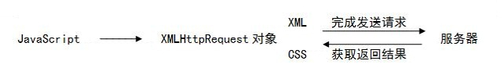

# jQuery

## 1.jQuery简介

jQuery是一个快速、简洁的[JavaScript](https://baike.baidu.com/item/JavaScript/321142)框架，是继[Prototype](https://baike.baidu.com/item/Prototype/14335188)之后又一个优秀的==JavaScript代码库（框架）==于2006年1月由[John Resig](https://baike.baidu.com/item/John Resig/6336344)发布。jQuery设计的宗旨是“write Less，Do More”，即倡导写更少的代码，做更多的事情。它封装JavaScript常用的功能代码，提供一种简便的JavaScript[设计模式](https://baike.baidu.com/item/设计模式/1212549)，优化[HTML](https://baike.baidu.com/item/HTML/97049)==文档操作==、==事件处理==、==动画设计==和==Ajax==交互。

## 2.jQuery的使用

首先进入jQuery官网获取jQuery的库文件，下载jQuery库文件

```
https://jquery.com/
```


jQuery库分为开发版和发布版，两种版本有细微的差别

| 名称                             | 大小    | 说明                                                         |
| -------------------------------- | ------- | ------------------------------------------------------------ |
| jQuery-3.版本号.js（开发版）     | 约268KB | 完整无压缩版本，主要用于测试、学习和开发                     |
| jQuery-3.版本号.min.js（发布版） | 约91KB  | 经过工具压缩或经过服务器开启Gzip压缩，主要应用于发布产品和项目 |

## 3.初识jQuery

### 3.1 简化创建自定义对象的方式

```html
<!DOCTYPE html>
<html lang="en">
<head>
	<meta charset="UTF-8">
	<title>简化创建自定义对象的方式</title>
</head>
<body>
	<!-- js方式定义Person对象 -->
	<script type="text/javascript">
		/*function Person(id,name,sal) {
			this.id = id;
			this.name = name;
			this.sal = sal;
		}
		var p = new Person(1,"昱霖",7000);
		document.write("编号：" + p.id + "<br/>");
		document.write("姓名：" + p.name + "<br/>");
		document.write("薪水：" + p.sal + "<br/>");*/
	</script>

	<hr/>

	<!-- json方式定义Person对象 -->
	<script type="text/javascript">
		var p = {
			id:1,
			name:"兴龙",
			sal:8000
		};
		//注：属性可以''或""符号，字符串必须加''或""符号，其它类型不用加符号
		document.write("编号：" + p.id + "<br/>");
		document.write("姓名：" + p.name + "<br/>");
		document.write("薪水：" + p.sal + "<br/>");
	</script>
</body>
</html>
```

### 3.2 创建一个数组，数组中有三个对象

```html
<!DOCTYPE html>
<html lang="en">
<head>
	<meta charset="UTF-8">
	<title>创建一个数组，数组中有三个对象</title>
</head>
<body>
	<script type="text/javascript">
		var ps = [
			{
				id:1,
				name:'天宇'
			},
			{
				id:2,
				name:'刘鉴'
			},
			{
				id:3,
				name:'礼浩'
			}
		];
	</script>

	<script type="text/javascript">
		document.write("共有" + ps.length + "个学生<br/>");
		//循环遍历
		for (var i=0;i<ps.length;i++){
			document.write("编号：" + ps[i].id + "<br/>");
			document.write("姓名：" + ps[i].name + "<br/>");
		}
	</script>
</body>
</html>
```

### 3.3 创建一个对象，其中一个属性是数组

```html
<!DOCTYPE html>
<html lang="en">
<head>
	<meta charset="UTF-8">
	<title>创建一个对象，其中一个属性是数组</title>
</head>
<body>
	<script type="text/javascript">
		var p = {
			id:1,
			name:"陈阳",
			home:['沈阳','大连','本溪']
		};
		//遍历属性（数组）
		for (var i=0;i<p.home.length;i++){
			document.write(p.home[i] + "&nbsp;");
		}
	</script>
</body>
</html>
```

### 3.4 jQuery入门

**引入jQuery库**

在页面中引入jQuery库的方法是HTML文档的头部，加上一下代码

```html
<script type="text/javascript" src="js/jquery-3.3.1.min.js"></script>
```

**jQuery语法**

jQuery的语法格式如下

```javascript
$(selector).action();
```

语法说明：

1. 工厂函数$()：将DOM对象转化为jQuery对象
2. 选择器selector：获取需要操作的DOM元素
3. 方法action()：jQuery中提供的方法，其中包括绑定事件处理的方法

<font color=red>注：jQuery代码与JavaScript类似，都是在页面中通过\<script>标签嵌入jQuery代码</font>

```html
<!DOCTYPE html>
<html lang="en">
<head>
	<meta charset="UTF-8">
	<title>jQuery入门</title>
	<script type="text/javascript" src="js/jquery-3.3.1.min.js"></script>
</head>
<body>
	<input id="inputID" type="button" value="这是jQuery框架，写少代码，多做事情"/>

	<div id="divID">哈哈</div>

	<script type="text/javascript">
		//取得input标签中的value属性内容
		/*var $input = $("#inputID");
		var input = $input.val();
		alert(input);*/

		//获取div标签中的文本内容
		var $div = $("#divID");
		var div = $div.html();
		alert(div);
	</script>
</body>
</html>
```

### 3.5 js对象和jQuery对象的相互转换

DOM对象与jQuery对象相互转换的原因有以下两点

1. DOM对象比较麻烦，为了完成一个功能要写很多代码，还要考虑兼容性，而jQuery对象的操作封装成了函数，操作简单不考虑兼容性
2. jQuery中并不是封装了所有的方法，编写复杂的功能还是需要原生JS代码实现

**DOM对象转成jQuery对象**

概述：对于一个DOM对象，只需要用$()把DOM对象包装起来，就可以获得一个jQuery对象了

语法：

```javascript
$(DOM对象)
```

**jQuery对象转换成DOM对象**

1. 索引：jQuery对象是一个类似数组的对象，可以通过[index]方法得到相应的对象
2. get(index)：jQuery本身提供一个get(index)方法，可以通过该方法得到相应的DOM对象

```html
<!DOCTYPE html>
<html lang="en">
<head>
	<meta charset="UTF-8">
	<title>js对象和jQuery对象的相互转换</title>
	<script src="js/jquery-3.3.1.min.js"></script>
</head>
<body>
	<input id="inputID" type="button" value="这是jQuery框架，写少代码，多做事情"/>

	<div id="divID">哈哈</div>

	<script type="text/javascript">
		//获取<input>标签中value属性的内容[js对象->jQuery对象]
		/*var inputElement = document.getElementById("inputID"); //js对象
		var $input = $(inputElement);
		var input = $input.val();
		alert(input);*/

		//获取<div>标签中文本内容[jQuery->js对象]
		var $div = $("#divID"); //jQuery对象
		//通过索引
		//var divElement = $div[0];
		//get(index)方法
		var divElement = $div.get(0);
		var div = divElement.innerHTML;
		alert(div);
	</script>
</body>
</html>
```

## 4.jQuery的选择器

### 4.1 基本选择器

```html
<!DOCTYPE html>
<html lang="en">
<head>
	<meta charset="UTF-8">
	<title>基本选择器</title>
	<script src="../js/jquery-3.3.1.min.js"></script>
</head>
<body>
	<div id="div1ID">div1</div>
	<div id="div2ID">div2</div>
	<span class="myClass">span</span>
	<p>p</p>

	<script type="text/javascript">
		//1)查找ID为"div1ID"的元素个数
		//在jQuery 1.8.3
		//alert($("#div1ID").size());
		//alert($("#div1ID").length)

		//2)查找DIV元素的个数
		//alert($("div").length);

		//3)查找所有样式是"myClass"的元素个数
		//alert($(".myClass").length);

		//4)查找所有DIV,SPAN,P元素的个数
		alert($("div,span,p").length);
	</script>
</body>
</html>
```

### 4.2 层次选择器

```html
<!DOCTYPE html>
<html lang="en">
<head>
	<meta charset="UTF-8">
	<title>层次选择器</title>
	<script src="../js/jquery-3.3.1.min.js"></script>
</head>
<body>
	<form action="">
		<input type="text" value="a"/>
		<table>
			<tr>
				<td>
					<input type="checkbox" value="b"/>
				</td>
			</tr>
		</table>
	</form>
	<input type="radio" value="c"/>
	<input type="radio" value="d"/>
	<input type="radio" value="e"/>

	<script type="text/javascript">
		//1)找到表单form下所有的input元素的个数
		//alert($("form input").length);

		//2)找到form表单里所有的子集input的元素个数
		//alert($("form>input").length);

		//3)找到表单form同级的第一个input元素的value属性值
		//alert($("form+input").val());

		//4)找到所有与表单form同级的input元素的个数
		alert($("form~input").length);
	</script>
</body>
</html>
```

### 4.3 基本加强型选择器

```html
<!DOCTYPE html>
<html lang="en">
<head>
	<meta charset="UTF-8">
	<title>基本加强型选择器</title>
	<script src="../js/jquery-3.3.1.min.js"></script>
</head>
<body>
	<ul>
		<li><a>list item 1</a></li>
		<li>list item 2</li>
		<li>list item 3</li>
		<li>list item 4</li>
		<li>list item 5</li>
	</ul>

	<input type="checkbox" checked="checked"/>
	<input type="checkbox" checked="checked"/>
	<input type="checkbox"/>

	<table border="1">
		<tr><td>line1[0]</td></tr>
		<tr><td>line2[1]</td></tr>
		<tr><td>line3[2]</td></tr>
		<tr><td>line4[3]</td></tr>
		<tr><td>line5[4]</td></tr>
		<tr><td>line6[5]</td></tr>
	</table>

	<h1>h1</h1>
	<h2>h2</h2>
	<h3>h3</h3>

	<p>p</p>

	<script type="text/javascript">
		//1)查找UL中第一个元素的内容
		//获取标签中的html元素
		//alert($("ul li:first").html());
		//获取标签中的文本内容
		//alert($("ul li:first").text());

		//2)查找UL中最后一个元素的内容
		//html()方法用于html/jsp，不能用在xml
		//text()方法既能用于html/jsp，且能用于xml
		//alert($("ul li:last").text());

		//3)查找表格的索引号为1、3、5...奇数行个数，索引号从0开始
		//alert($("table tr:odd").length);

		//4)查找表格的索引号为2、4、6...偶数行个数，索引号从0开始
		//alert($("table tr:even").length);

		//5)查找表格中第二行的内容，从索引号0开始，这是一种祖先 后代 的变化形式
		//alert($("table tr:eq(1)").text());

		//6)查找表格中索引号大于0的个数 大于：gt=>greater than 小于：lt=>less than
		alert($("table tr:gt(0)").length);
	</script>
</body>
</html>
```

### 4.4 内容选择器

```html
<!DOCTYPE html>
<html lang="en">
<head>
	<meta charset="UTF-8">
	<title>内容选择器</title>
	<script src="../js/jquery-3.3.1.min.js"></script>
	<style type="text/css">
		.myClass{
			font-size: 44px;
			color: blue;
		}
	</style>
</head>
<body>
	<div><p>John Resig</p></div>
	<div><p>George Martin</p></div>
	<div>Malcom John Sinclair</div>
	<div>J. Ohn</div>
	<div></div>

	<p></p>
	<p></p>

	<script type="text/javascript">
		//1)查找所有包含文本"John"的div元素个数
		//alert($("div:contains('John')").length);

		//2)查找所有p元素为空的元素个数
		//alert($("p:empty").length);

		//3)给所有包含p元素的div元素添加一个myClass样式
		$("div:has(p)").addClass("myClass");

		//4)查找所有含有子元素或者文本的p元素个数，即p为父元素
		//alert($("p:parent").length);
	</script>
</body>
</html>
```

### 4.5 可见性选择器

```html
<!DOCTYPE html>
<html lang="en">
<head>
	<meta charset="UTF-8">
	<title>可见性选择器</title>
	<script src="../js/jquery-3.3.1.min.js"></script>
</head>
<body>
	<table border="1" align="center">
		<tr style="display:none">
			<td>Value 1</td>
		</tr>
		<tr>
			<td>Value 2</td>
		</tr>
		<tr>
			<td>Value 3</td>
		</tr>
	</table>

	<script type="text/javascript">
		//1)查找隐藏的tr元素的个数
		//alert($("table tr:hidden").length);

		//2)查找所有可见的tr元素的个数
		//alert($("table tr:not(:hidden)").length);
		//推荐使用
		alert($("table tr:visible").length);
	</script>
</body>
</html>
```

### 4.6 属性选择器

```html
<!DOCTYPE html>
<html lang="en">
<head>
	<meta charset="UTF-8">
	<title>属性选择器</title>
	<script src="../js/jquery-3.3.1.min.js"></script>
</head>
<body>
	<div>
		<p>Hello!</p>
	</div>
	<div id="test2"></div>

	<input type="checkbox" name="newsletter" value="Hot Fuzz" />
	<input id="myID" type="checkbox" name="newsletter" value="Cold Fusion" />
	<input type="checkbox" name="newsAccept" value="Evil Plans" />

	<script type="text/javascript">
		//1)查找所有含有id属性的div元素个数
		//alert($("div[id]").length);

		//2)查找所有name属性是newsletter的input元素个数
		//alert($("input[name='newsletter']").length);

		//3)查找所有name属性不是newsletter的input元素，并将其选中
		//$("input[name!='newsletter']").attr("checked","checked");

		//4)查找所有name属性以'news'开始input的元素，并将其选中
		//$("input[name^='news']").attr("checked","checked");

		//5)查找所有name属性以'letter'结尾的input的元素，并将其选中
		//$("input[name$='letter']").attr("checked","checked");

		//6)查找所有name属性包含'news'的input的元素，并将其选中
		//$("input[name*='news']").attr("checked","checked");

		//7)找到所有含有id属性，并且它的name属性是以'letter'结尾的input元素，并将其选中
		$("input[id][name$='letter']").attr("checked","checked");
	</script>
</body>
</html>
```

### 4.7 子元素选择器

```html
<!DOCTYPE html>
<html lang="en">
<head>
	<meta charset="UTF-8">
	<title>子元素选择器</title>
	<script src="../js/jquery-3.3.1.min.js"></script>
</head>
<body>
	<ul>
		<li>John</li>
		<li>Karl</li>
		<li>Brandon</li>
	</ul>
	<ul>
		<li>Glen</li>
		<li>Tane</li>
		<li>Ralph</li>
	</ul>
	<ul>
		<li>Jack</li>
	</ul>
	<ul>
		<li>Marry</li>
	</ul>

	<script type="text/javascript">
		//1)迭代[each]每个ul中第一个li元素中的内容，索引从1开始
		/*$("ul li:first-child").each(function () {
			alert($(this).text());
		});*/

		//2)迭代[each]每个ul中最后一个li元素中的内容，索引从1开始
		/*$("ul li:last-child").each(function () {
			alert($(this).text());
		});*/

		//3)迭代[each]每个ul中第二个li元素中的内容，索引从1开始
		/*$("ul li:nth-child(2)").each(function () {
			alert($(this).text());
		});*/

		//4)迭代[each]每个ul中只有一个孩子li元素中的内容，索引从1开始
		$("ul li:only-child").each(function () {
			alert($(this).text());
		});
	</script>
</body>
</html>
```

### 4.8 表单选择器

```html
<!DOCTYPE html>
<html lang="en">
<head>
	<meta charset="UTF-8">
	<title>表单选择器</title>
	<script src="../js/jquery-3.3.1.min.js"></script>
</head>
<body>
	<form>
		<input type="button" value="Input Button"/><br/>
		<input type="checkbox" /><br/><br/>
		<input type="file" /><br/>
		<input type="hidden" /><br/>
		<input type="image" src="../images/girl.jpg" width="25px" height="25px"/><br/>
		<input type="password" /><br/>
		<input type="radio" /><br/>
		<input type="reset" /><br/>
		<input type="submit" /><br/>
		<input type="text" /><br/>
		<select><option>Option</option></select><br/>
		<textarea></textarea><br/>
		<button>Button</button><br/>
	</form>

	<script type="text/javascript">
		//1)查找所有input元素个数
		//alert($("input").length); //10，找input标签
		//alert($(":input").length); //13，找input标签和select/textarea/button

		//2)查找所有文本框的个数
		//alert($(":text").length);

		//3)查找所有密码框的个数
		//alert($(":password").length);

		//4)查找所有单选按钮的个数
		//alert($(":radio").length);

		//5)查找所有复选框的个数
		//alert($(":checkbox").length);

		//6)查找所有提交按钮的个数
		//alert($(":submit").length);

		//7)匹配所有图像域的个数
		//alert($(":image").length);

		//8)查找所有重置按钮的个数
		//alert($(":reset").length);

		//9)查找所有普通按钮的个数
		//alert($(":button").length);

		//10)查找所有文件域的个数
		//alert($(":file").length);

		//11)查找所有input元素为隐藏域的个数
		alert($(":input:hidden").length);
	</script>
</body>
</html>
```

### 4.9 表单对象选择器

```html
<!DOCTYPE html>
<html lang="en">
<head>
	<meta charset="UTF-8">
	<title>表单对象选择器</title>
	<script src="../js/jquery-3.3.1.min.js"></script>
</head>
<body>
	<form>
		<input type="text" name="email" disabled="disabled" />
		<input type="text" name="password" disabled="disabled" />
		<input type="text" name="id" />

		<input type="checkbox" name="newsletter" checked="checked" value="Daily" />
		<input type="checkbox" name="newsletter" value="Weekly" />
		<input type="checkbox" name="newsletter" checked="checked" value="Monthly" />

		<select>
			<option value="1">广东</option>
			<option value="2" selected="selected">湖南</option>
			<option value="3">湖北</option>
		</select>
	</form>

	<script type="text/javascript">
		//1)查找所有可用的input元素的个数
		//alert($("input:enabled").length);

		//2)查找所有不可用的input元素的个数
		//alert($("input:disabled").length);

		//3)查找所有选中的复选框元素的个数
		//alert($(":checkbox:checked").length);

		//4)查找所有选中的选项元素的个数
		alert($("select option:selected").length);
	</script>
</body>
</html>
```

## 5.jQuery的常用方法

### 5.1 append()与prepend()

```html
<!DOCTYPE html>
<html lang="en">
<head>
	<meta charset="UTF-8">
	<title>Title</title>
	<script src="../js/jquery-3.3.1.min.js"></script>
</head>
<body>
	<ul>
		<li>第一项</li>
		<li>第二项</li>
		<li>第三项</li>
	</ul>

	<hr/>

	<div>这是子元素，要插入到父元素内</div>


	<script type="text/javascript">
		//DIV标签插入到UL标签之后（父子关系）
		//$("ul").append($("div"));
		//DIV标签插入到UL标签之前（父子关系）
		$("ul").prepend($("div"));
	</script>
</body>
</html>
```

### 5.2 after()与before()

```html
<!DOCTYPE html>
<html lang="en">
<head>
	<meta charset="UTF-8">
	<title>Title</title>
	<script src="../js/jquery-3.3.1.min.js"></script>
</head>
<body>
	<ul>
		<li>第一项</li>
		<li>第二项</li>
		<li>第三项</li>
	</ul>

	<hr/>

	<div>这是子元素，要插入到父元素外</div>


	<script type="text/javascript">
		//DIV标签插入到UL标签之后（兄弟关系）
		$("ul").after($("div"));
		//DIV标签插入到UL标签之前（兄弟关系）
		$("ul").before($("div"));
	</script>
</body>
</html>
```

### 5.3 find()与attr()

```html
<!DOCTYPE html>
<html lang="en">
<head>
	<meta charset="UTF-8">
	<title>Title</title>
	<script src="../js/jquery-3.3.1.min.js"></script>
</head>
<body>
<form>
	<p><span>hefei</span></p>

	<table>
		<tr>
			<td>
				<input type="text" name="username" value="张三"/>
			</td>
			<td>
				<input type="password" name="password" value="123456"/>
			</td>
		</tr>
	</table>
</form>

<script type="text/javascript">
	//1)从所有的段落开始，进一步搜索下面的span元素的文本内容
	//alert($("p").find("span").text());

	//2)取得form里第一个input元素的type属性值
	//alert($("form input:first").attr("type"));

	//3)设置form下最后一个input元素的为只读文本框
	//$("form input:last").attr("readonly","readonly");
	$(":password").attr("readonly","readonly");
</script>
</body>
</html>
```

### 5.4 创建元素（create element）

```html
<!DOCTYPE html>
<html lang="en">
<head>
	<meta charset="UTF-8">
	<title>Title</title>
	<script src="../js/jquery-3.3.1.min.js"></script>
</head>
<body>
	<script type="text/javascript">
		//1)创建div元素，添加"继荣"文本，ID属性，并添加到文档中
		var $div = $("<div id='2021'>继荣</div>");
		//插入元素
		//$("body").append($div);
		$(document.body).append($div);
	</script>
</body>
</html>
```

### 5.5 remove()

```html
<!DOCTYPE html>
<html lang="en">
<head>
	<meta charset="UTF-8">
	<title>Title</title>
	<script src="../js/jquery-3.3.1.min.js"></script>
</head>
<body>
	<ul>
		<li>第一项</li>
		<li id="secondID">第二项</li>
		<li>第三项</li>
	</ul>

	<div>这是div元素</div>

	<script type="text/javascript">
		//1)删除ID为secondID的LI元素
		//$("#secondID").remove();

		//2)删除所有LI元素
		//$("ul li").remove();

		//3)删除UL元素
		$("ul").remove();
	</script>
</body>
</html>
```

### 5.6 val()与text()

```html
<!DOCTYPE html>
<html lang="en">
<head>
	<meta charset="UTF-8">
	<title>Title</title>
	<script src="../js/jquery-3.3.1.min.js"></script>
</head>
<body>
	<div>哈哈</div>

	<select id="city">
		<option value="福地">沈阳</option>
	</select>

	<script type="text/javascript">
		//1)取得<div>中的内容
		//alert($("div").text());

		//2)取得option的值和描述
		var $option = $("#city option");
		var value = $option.val();
		var html = $option.text();
		//alert(value + "：" + html);
		console.log(value + "：" + html);
	</script>
</body>
</html>
```

### 5.7 clone()与clone(true)

```html
<!DOCTYPE html>
<html lang="en">
<head>
	<meta charset="UTF-8">
	<title>Title</title>
	<script src="../js/jquery-3.3.1.min.js"></script>
</head>
<body>
<input type="button" value="原按钮"/>

<script type="text/javascript">
	//1)复制原input元素，添加到input的元素后，与其同级
	/*var $old = $(":button");
	var $new = $old.clone();
	//修改按钮的文本
	$new.val("新按钮");
	//兄弟关系
	$old.after($new);*/

	//2)为原input元素动态添加单击事件
	/*var $old = $(":button");
	//js：onclick，为原按钮添加单击事件
	$old.click(function () {
		alert("动态事件...");
	});*/

	//3)添加到原input元素后，与其同级，且和原来按钮一样的行为
	var $old = $(":button");
	//为原按钮添加点击事件
	$old.click(function () {
		alert("动态事件...");
	});
	//true：既复制行为，也复制样式
	var $new = $old.clone(true);
	$new.val("新按钮");
	$old.after($new);
</script>
</body>
</html>
```

### 5.8 replaceWith()

```html
<!DOCTYPE html>
<html lang="en">
<head>
	<meta charset="UTF-8">
	<title>Title</title>
	<script src="../js/jquery-3.3.1.min.js"></script>
</head>
<body>
<table border="1" align="center">
	<tr>
		<td>
			<div style="width: 165px;height: 23px">
				双击会被替换成文本框
			</div>
		</td>
		<td>
			不会变
		</td>
	</tr>
</table>

<script type="text/javascript">
	//1)双击<div>中的文本，用文本框替换文本
	$("div").dblclick(function () {
		//创建文本框
		var $text = $("<input type='text' style='width: 165px;height: 23px;'/>");
		//替换div中的文本
		$(this).replaceWith($text);
	});
</script>
</body>
</html>
```

### 5.9 removeAttr()

```html
<!DOCTYPE html>
<html lang="en">
<head>
	<meta charset="UTF-8">
	<title>Title</title>
	<script src="../js/jquery-3.3.1.min.js"></script>
</head>
<body>
	<table>
		<tr>
			<td>
				添加属性border/align/width
			</td>
			<td>
				删除属性align
			</td>
		</tr>
	</table>

	<script type="text/javascript">
		//1)为<table>元素添加属性border/align/width
		var $table = $("table").attr("border","2").attr("align","right").attr("width","60");

		//2)将table元素的属性删除
		$table.removeAttr("align");
	</script>
</body>
</html>
```

### 5.10 addClass()与removeClass、toggleClass()、hasClass()

```html
<!DOCTYPE html>
<html lang="en">
<head>
	<meta charset="UTF-8">
	<title>Title</title>
	<script src="../js/jquery-3.3.1.min.js"></script>
	<style>
		.myClass{
			font-size: 30px;
			color: red;
		}
	</style>
</head>
<body>
	<div>无样式</div>

	<div class="myClass">有样式</div>

	<script type="text/javascript">
		//1)为无样式的DIV添加样式
		//$("div:first").addClass("myClass");

		//2)为有样式的DIV删除样式
		//$("div:last").removeClass("myClass");

		//3)切换样式即有样式的变成无样式，无样式的变成有样式
		//$("div").toggleClass("myClass");

		//4)最后一个DIV是否有样式
		var flag = $("div:last").hasClass("myClass");
		alert(flag?"有样式":"无样式");
	</script>
</body>
</html>
```

### 5.11 show()与hide()

```html
<!DOCTYPE html>
<html lang="en">
<head>
	<meta charset="UTF-8">
	<title>Title</title>
	<script src="../js/jquery-3.3.1.min.js"></script>
</head>
<body>
	<p>
		
	</p>


	<script type="text/javascript">
		//1)图片隐藏
		$("img").hide();
		//休息3秒再显示 单位：毫秒
		window.setTimeout(function () {
			//图片显示
			$("img").show(5000);
		},3000);
	</script>
</body>
</html>
```

### 5.12 fadeIn()与fadeOut()

```html
<!DOCTYPE html>
<html lang="en">
<head>
	<meta charset="UTF-8">
	<title>Title</title>
	<script src="../js/jquery-3.3.1.min.js"></script>
</head>
	<body>
	<p>
		
	</p>


	<script type="text/javascript">
		//1)淡入显示图片
		$("img").fadeIn(3000);

		//2)淡出隐藏图片
		$("img").fadeOut(3000);
	</script>
</body>
</html>
```

### 5.13 slideToggle()

```html
<!DOCTYPE html>
<html lang="en">
<head>
	<meta charset="UTF-8">
	<title>Title</title>
	<script src="../js/jquery-3.3.1.min.js"></script>
</head>
<body>
	<div>
		中国0<br/>
		中国1<br/>
		中国2<br/>
		中国3<br/>
		中国4<br/>
		中国5<br/>
		中国6<br/>
		中国7<br/>
		中国8<br/>
		中国9<br/>
	</div>

	<input type="button" value="我的好友"/>

	<script type="text/javascript">
		//1)向上下滑动
		$(":button").click(function () {
			//div标签上下移动
			$("div").slideToggle(200);
		});
	</script>
</body>
</html>
```

## 6.jQuery的常用事件

### 6.1 $(document).ready()

在JavaScript中使用window.onload加载页面，在jQuery中使用$(document).ready()加入页面加载后的代码，二者可以实现相同的功能，但存在区别，\$(document).ready()的实例代码如下：

```javascript
$(document).ready(function(){
   alert("这是我们第一个jQuery程序！") 
});
```

**window.onload与$(document).ready()的区别**

| 项目       | window.onload                          | $(document).ready()                                          |
| ---------- | -------------------------------------- | ------------------------------------------------------------ |
| 执行的时机 | 必须等页面中的所有内容加载完后才能执行 | 网页中的所有DOM文档结构绘制完毕后即可实行，可能与DOM元素关联的内容并没有加载完 |
| 编写个数   | 同一个页面不能同时编写多个             | 同一个页面能同时编写多个                                     |
| 简化写法   | 无                                     | $(function(){//执行代码});                                   |

```html
<!DOCTYPE html>
<html lang="en">
<head>
	<meta charset="UTF-8">
	<title>Title</title>
	<script src="../js/jquery-3.3.1.min.js"></script>
</head>
<body>
	<script type="text/javascript">
		//将js方式的onload与jquery方式ready对比，哪个快
		//将js方式的onload与jquery方式ready对比，哪个快
		//JavaScript
		window.onload = function () {
			alert("传统方式...");
		}

		//jQuery
		/*$(document).ready(function () {
			alert("现代方式...");
		});*/

		//简便写法
		$(function () {
			alert("现代方式...");
		});
	</script>
</body>
</html>
```

### 6.2 change事件

```html
<!DOCTYPE html>
<html lang="en">
<head>
	<meta charset="UTF-8">
	<title>Title</title>
	<script src="../js/jquery-3.3.1.min.js"></script>
</head>
<body>
	<select id="city">
		<option value="bj">北京</option>
		<option value="sh">上海</option>
		<option value="gz">广州</option>
	</select>

	<script type="text/javascript">
		//1)当<select>标签触发onchange事件，显示选中<option>的value和innerHTML属性值
		$("#city").change(function () {
			var $option = $("#city option:selected");
			//获取option对象的value值
			var value = $option.val();
			//获取option对象的文本
			var text = $option.text();
			alert(value + ":" + text);
		});
	</script>
</body>
</html>
```

### 6.3 focus事件与select事件

```html
<!DOCTYPE html>
<html lang="en">
<head>
	<meta charset="UTF-8">
	<title>Title</title>
	<script src="../js/jquery-3.3.1.min.js"></script>
</head>
<body>
	<input type="text" value="加载页面时获取光标并选中所有文字" size="50"/>

	<script type="text/javascript">
		//1)加载页面时获取光标并选中所有文字
		$(function () {
			//光标定位到文本框
			//$(":text").focus();
			//选中文本框中的所有文本
			$(":text").select();
		});
	</script>
</body>
</html>
```

### 6.4 keyup事件

```html
<!DOCTYPE html>
<html lang="en">
<head>
	<meta charset="UTF-8">
	<title>Title</title>
	<script src="../js/jquery-3.3.1.min.js"></script>
</head>
<body>
<script type="text/javascript">
	//1)当按键弹起时，显示所按键的unicode码
	$(function () {
		//浏览器会自动创建一个event事件对象，那么开发人员可以根据需要来使用该event对象
		$(document).keyup(function (event) {
			//获取按键的unicode码 jquery-1.8.3.js
			//var code = event.keyCode;
			var code = event.which; //回车键为13
			alert(code);
		});
	});
</script>
</body>
</html>
```

### 6.5 mouseover事件与mouseout事件

```html
<!DOCTYPE html>
<html lang="en">
<head>
	<meta charset="UTF-8">
	<title>Title</title>
	<script src="../js/jquery-3.3.1.min.js"></script>
</head>
<body>
	<table border="2" align="center" width="80%" id="tableID">
		<tr>
			<td>张三</td>
			<td>男</td>
			<td>22</td>
		</tr>
		<tr>
			<td>李四</td>
			<td>男</td>
			<td>24</td>
		</tr>
		<tr>
			<td>王五</td>
			<td>男</td>
			<td>26</td>
		</tr>
		<tr>
			<td>周六</td>
			<td>男</td>
			<td>28</td>
		</tr>
	</table>

	<hr/>

	
	

	<script type="text/javascript">
		//1)鼠标移到某行上，某行背景变色
		$("table tr").mouseover(function () {
			//设置css样式
			$(this).css("background-color","gray");
		});

		//2)鼠标移出某行，某行还原
		$("table tr").mouseout(function () {
			$(this).css("background-color","white");
		});

		//3)鼠标移到某图片上，为图片加边框
		$("img").mouseover(function () {
			$(this).css("border-color","red");
		});

		//4)鼠标移出图片，图片还原
		$("img").mouseout(function () {
			$(this).css("border-color","white");
		});
	</script>
</body>
</html>
```

### 6.6 sumbit事件

**JavaScript表单验证**

```jsp
<%@ page language="java" import="java.util.*" pageEncoding="UTF-8"%>
<!DOCTYPE HTML PUBLIC "-//W3C//DTD HTML 4.01 Transitional//EN">
<html>
<head>
    <link href="${pageContext.request.contextPath}/bootstrap/css/bootstrap.min.css" rel="stylesheet">
    <!-- jQuery文件。务必在bootstrap.min.js 之前引入 -->
    <script src="${pageContext.request.contextPath}/bootstrap/js/jquery-3.3.1.min.js"></script>
    <!-- 最新的 Bootstrap 核心 JavaScript 文件 -->
    <script src="${pageContext.request.contextPath}/bootstrap/js/bootstrap.min.js"></script>

    <title>登录</title>

    <meta http-equiv="pragma" content="no-cache">
    <meta http-equiv="cache-control" content="no-cache">
    <meta http-equiv="expires" content="0">
    <meta http-equiv="keywords" content="keyword1,keyword2,keyword3">
    <meta http-equiv="description" content="This is my page">

</head>
<script type="text/javascript">
    //登录验证方法
    function checkLogin() {
        //获取用户名
        var username = document.getElementById("username");
        //获取密码
        var password = document.getElementById("password");
        //获取角色类型
        var type = document.getElementById("type");
        //进行非法判断
        if (type.value=="-1"){
            //给出提示信息
            window.alert("请选择登录身份，不得为空！");
            //表单不提交
            return false;
        } else {
            //用户名和密码均不能为空
            if (username.value=="" || password.value==""){
                //给出提示信息
                window.alert("登录ID、登录密码都不能为空！")
                //表单不提交
                return false;
            }
            //表单正常提交
            return true;
        }
    }
</script>
<body >
<form class="form-horizontal" role="form" action="${pageContext.request.contextPath}/user/check" method="post" onsubmit="return checkLogin();">
    <div class="form-group" align="center">
        <div class="form-group" align="center">
            <label  class="col-sm-6 control-label" style="font-size: 28px; color:black; font-family: 华文楷体;" >学生管理系统登陆界面</label>
        </div>
    </div>
    <div class="form-group">
        <label for="username" class="col-sm-2 control-label" style=" color:black;">名字</label>
        <div class="col-sm-6">
            <input type="text" class="form-control" name="username" id="username" placeholder="请输入名字">
        </div>
    </div>
    <div class="form-group">
        <label for="password" class="col-sm-2 control-label" style=" color:black;">密码</label>
        <div class="col-sm-6">
            <input type="password" class="form-control" name="password" id="password" placeholder="请输入密码">
        </div>
    </div>
    <div class="form-group">
        <div class="col-sm-offset-2 col-sm-10">
            <div class="checkbox">
                <td class="s2">
                    <label style=" color:black;">
                        登录身份:
                    </label>

                </td>
                <td>
                    <select id="type" name="type">
                        <option value="-1">
                            --请选择--
                        </option>
                        <option value="0">
                            学生
                        </option>
                        <option value="1">
                            教师
                        </option>
                        <option value="2">
                            管理员
                        </option>
                    </select>
                </td>
                <td height="37" colspan="2" align="right">
                    &nbsp;<button type="submit" id="submit" name="submit" value="登陆">登陆</button>
                    &nbsp;<button type="reset" id="reset" name="reset" style="background-color:transparent;border: 0;" ></button>
                </td>
            </div>
        </div>
    </div>
</form>
</body>
</html>
```

**jQuery表单验证**

```html
<!DOCTYPE html>
<html lang="en">
<head>
	<meta charset="UTF-8">
	<title>Title</title>
	<script src="../js/jquery-3.3.1.min.js"></script>
</head>
<body>
	<form action="05_mouseover_mouseout.html" method="post">
		用户名：<input type="text" value=""/>
		<input type="submit" value="表单提交"/>
	</form>

	<script type="text/javascript">
		//1)jquery方式表单验证
		$("form").submit(function () {
			//获取文本框的内容
			var name = $(":text").val();
			//去除首尾空格
			name = $.trim(name);
			//判断用户名是否为空
			if (name.length==0){
				alert("用户名必填...");
				//表单不提交
				return false;
			}
			//表单提交
			return true;
		});
	</script>
</body>
</html>
```

## 7.jQuery AJAX

**AJAX简介**

AJAX指==异步==的JavaScript及XML（Asynchronous JavaScript And XML），AJAX 不是编程语言，而是创建更好更快以及交互性更强的 Web 应用程序的技术

**AJAX的工作流程**

JavaScript使用 ==XMLHttpRequest== 对象来直接与服务器进行通信，异步传输数据



**AJAX的作用**

1. 从服务器请求少量的所需信息，而不是整个页面内容，==减少服务器压力==
2. 通过使用AJAX可实现页面==局部数据更新==，而不是整个页面的跳转

> 原生JavaScript中的AJAX实现复杂，有没有更加简便的方法呢？

jQuery AJAX大大简化了原生AJAX的步骤，且功能更强大

**$.post()方法**

概述：通过远程 HTTP POST请求载入信息，是==$.ajax()==方法中类型为POST请求的简化版

语法：

```
$.post(
    "发送的请求地址" ,
    要发送的数据 key/value , 
	回调函数 ,
	"返回内容格式，xml, html, script, json, text "
);
```

```
$.post(URL,data,callback);
```

该方法有三个参数：

1. ==必需==的 *URL* 参数规定您希望请求的 URL。

2. ==可选==的 *data* 参数规定连同请求发送的数据。

3. ==可选==的 *callback* 参数是==请求成功后==所执行的函数名。

**$.get()方法 **

概述：通过HTTP GET请求载入信息，是$.ajax方法中类型为GET请求的简化版

```
$.get(
	"发送的请求地址",
	要发送的数据key/value,
	回调函数，
	"返回内容格式，xml, html, script, json, text "
);
```

**serialize()**

概述：serialize()用于序列化表单内容为字符串

语法：

```
$("form").serialize();
//返回参数序列
username=zhangxinglong&password=123&hobby=football
```

好处：不用逐个去获取表单的值，拼凑参数序列

