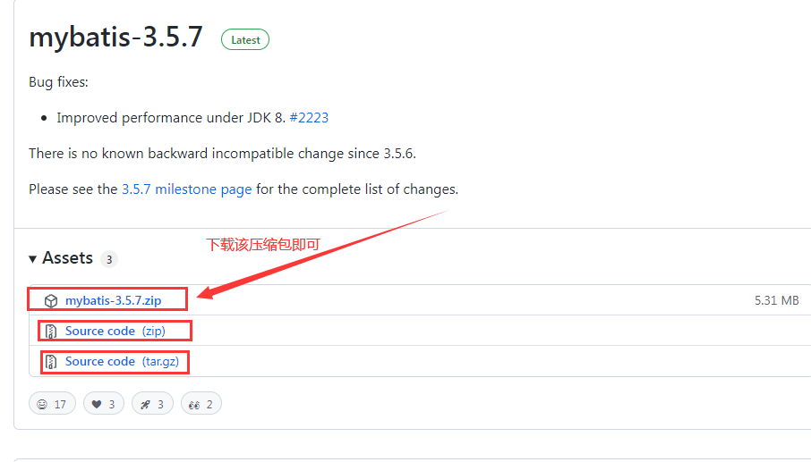

## MyBatis

## 1.Mybatis的简介

MyBatis 本是apache的一个[开源项目](https://baike.baidu.com/item/开源项目/3406069)==iBatis==, 2010年这个[项目](https://baike.baidu.com/item/项目/477803)由apache software foundation 迁移到了[google code](https://baike.baidu.com/item/google code/2346604)，并且改名为MyBatis 。==2013年11==月迁移到[Github](https://baike.baidu.com/item/Github/10145341)。

iBATIS一词来源于“internet”和“abatis”的组合，是一个基于Java的[持久层](https://baike.baidu.com/item/持久层/3584971)框架。iBATIS提供的持久层框架包括SQL Maps和Data Access Objects（DAOs）

当前，最新版本是==MyBatis 3.5.7== ，其发布时间是==2021年4月21日==。

**Mybatis概述**

1. 半自动的ORM（==Object Relational Mapping==）框架
2. DAO层
3. 支持动态SQL
4. 小巧灵活、简单易学

## 2.环境搭建

MyBatis的3.4.2版本可以通过网址下载如下。下载时只需选择mybatis-3.4.2.zip即可，==解压==后得到如下图所示的目录。

```
https://github.com/mybatis/mybatis-3/releases
```



## 3.工作原理

Mybatis工作原理分为8个步骤

​    1．读取 MyBatis 配置文件（==核心配置文件==）。

​    2．加载映射文件。

​    3．构造会话工厂。=>连接池=>==SqlSessionFactory==

​    4．创建会话对象。=>Connection=>==SqlSession==

​    5．Executor 执行器。

​    6．MappedStatement对象。=>==PrepareStatement==

​    7．输入参数映射。

​    8．输出结果映射。

```
http://c.biancheng.net/view/4304.html
```

**配置Mybatis核心配置文件**

```xml
<?xml version="1.0" encoding="UTF-8"?>
<!DOCTYPE configuration PUBLIC "-//mybatis.org//DTD Config 3.0//EN"
"http://mybatis.org/dtd/mybatis-3-config.dtd">

<configuration>
    <!-- 加载类路径下的属性文件 -->
    <properties resource="database.properties"/>

    <!-- 设置类型别名 -->
    <typeAliases>
        <typeAlias type="app01.Student" alias="student"/>
    </typeAliases>

    <!-- 设置一个默认的连接环境信息 -->
    <environments default="mysql_developer">
        <!-- 连接环境信息，取一个任意唯一的名字 -->
        <environment id="mysql_developer">
            <!-- mybatis默认使用jdbc事务管理方法 -->
            <transactionManager type="jdbc"/>
            <!-- mybatis使用连接池的方式获取连接 -->
            <dataSource type="pooled">
                <!-- 配置与数据库交互的四个重要属性 -->
                <property name="driver" value="${mysql.driver}"/>
                <property name="url" value="${mysql.url}"/>
                <property name="username" value="${mysql.username}"/>
                <property name="password" value="${mysql.password}"/>
            </dataSource>
        </environment>

        <environment id="oracle_developer">
            <transactionManager type="jdbc"/>
            <dataSource type="pooled">
                <!-- 配置与数据库交互的四个重要属性 -->
                <property name="driver" value="${oracle.driver}"/>
                <property name="url" value="${oracle.url}"/>
                <property name="username" value="${oracle.username}"/>
                <property name="password" value="${oracle.password}"/>
            </dataSource>
        </environment>
    </environments>
</configuration>
```

## 4.第一个Mybatis程序

```java
package app01;

public interface StudentMapper {

    //学生添加
    void add() throws Exception;
}
```

操作步骤

1. 配置mybatis的核心配置文件=>mybatis.xml
2. 编写MybatisUtils工具类=>为了获取SqlSession对象
3. 编写Mapper接口=>StudentMapper接口
4. 编写该接口的映射文件=>StudentMapper.xml
5. 编写测试类进行测试=>App

**映射器**

| **元素名称**  | **描**  **述**                                             | **备**  **注**                                      |
| ------------- | ---------------------------------------------------------- | --------------------------------------------------- |
| select        | 查询语句，最常用、最复杂的元素之一                         | 可以自定义参数，返回结果集等                        |
| ==insert==    | 插入语句                                                   | 执行后返回一个整q数，代表插入的行数                 |
| update        | 更新语句                                                   | 执行后返回一个整数，代表更新的行数                  |
| delete        | 删除语句                                                   | 执行后返回一个整数，代表删除的行数                  |
| sql           | 定义一部分SQL，在多个位置被引用                            | 例如，一张表列名，一次定义，可以在多个SQL语句中使用 |
| ==resultMap== | 用来描述从数据库结果集中来加载对象，是最复杂、最强大的元素 | 提供映射规则                                        |

## 5.Mybatis的CRUD操作

## 6.分页查询

> 在jd_2002中我们是如何处理商品分页查询的呢？

```sql
select * from goodstable limit m,n;
```

我们需要注入进去两个参数

1. 第一个参数：就是m值，指的是我们起始行
2. 第二个参数：就是n值，指的是每页显示几条数据，容量

**Map类型作参数**

在实际开发中，查询SQL语句精华参观需要多个参数，比如多条件查询。多个参数传递时，在Mybatis中允许Map接口通过键值对传递多个参数

分页查询

1. 有条件分页查询
2. 无条件分页查询

**无条件分页查询**

```java
/**
     * 无条件分页
     * start：表示在MySQL中从第几条记录的索引开始显示
     * size：表示MySQL中最多显示几条记录（容量）
     */
List<Student> findAllByPage(Map<String,Object> map) throws Exception;
```

```xml
<!-- 无条件分页查询 -->
<select id="findAllByPage" parameterType="map" resultMap="studentMap">
    select stuId,stuName,stuSal from student limit #{start},#{size}
</select>
```

**测试类**

```java
@Test
public void testFindAllByPage(){
    SqlSession sqlSession = null;
    try {
        sqlSession = MybatisUtils.getSqlSession();
        //定义Map集合
        Map<String,Object> map = new LinkedHashMap<>();
        //将条件封装到Map集合中
        map.put("start",0);
        map.put("size",3);
        //获取mapper代理对象并调用方法
        List<Student> studentList = sqlSession.getMapper(StudentMapper.class).findAllByPage(map);
        logger.debug(studentList);
    } catch (Exception e) {
        e.printStackTrace();
    } finally {
        MybatisUtils.closeSqlSession(sqlSession);
    }
}
```

**有条件的分页查询**

CONCAT()函数用于将多个字符串连接一个字符串，是最重要的MySQL函数之一

```sql
SELECT CONCAT('My','S','QL');
```

```xml
<!-- 有条件的分页 -->
<select id="findByNameByPage" parameterType="map" resultMap="studentMap">
    select * from student where stuName like concat('%','${pname}','%') limit #{start},#{size}
</select>
```

```java
@Test
public void testFindByNameByPage(){
    SqlSession sqlSession = null;
    try {
        sqlSession = MybatisUtils.getSqlSession();
        //定义Map集合
        Map<String,Object> map = new HashMap<>();
        map.put("pname","莹");
        map.put("start",3);
        map.put("size",3);
        //获取mapper代理对象并调用方法
        List<Student> studentList = sqlSession.getMapper(StudentMapper.class).findByNameByPage(map);
        logger.debug(studentList);
    } catch (Exception e) {
        e.printStackTrace();
    } finally {
        MybatisUtils.closeSqlSession(sqlSession);
    }
}
```

> 在Mybatis中，#{}与${}的区别？

1. #{}：占位符，属于sql预编译（==推荐使用==）
2. ${}：拼接符，属于sql的拼接

```xml
<!--
        方式1：CONCAT('%',#{pname},'%')
        方式2：CONCAT('%','${pname}','%')
     -->
<select id="findByNameByPage" parameterType="map" resultMap="studentMap">
    select * from student where stuName like concat('%',#{pname},'%') limit #{start},#{size}
</select>
```

## 7.动态SQL之查询

> 为什么要使用动态SQL?

开发人员同工厂根据手动拼接SQL语句，这厮一个机器麻烦的工作，而Mybatis提供了对SQL语句动态组装的功能，恰恰能够解决这一问题

动态SQL标签

1. \<where>标签：会在写入where 元素的地方输出一个where语句，另外不需要考虑输出是什么样子
2. \<if>标签：是有条件的包含，where子句的一部分，索引if标签是最常用的元素

```java
package app04;

import java.util.List;
import java.util.Map;

public interface StudentMapper {

    //有条件的查询所有学生
    List<Student> findAllByCondition(Map<String,Object> map) throws Exception;
}
```

```xml
<!-- 有条件的查询所有学生（动态SQL）注意：去掉第一个and或or -->
<select id="findAllByCondition" parameterType="map" resultMap="studentMap">
    select * from student
    <where>
        <if test="pid!=null">
            and stuId=#{pid}
        </if>
        <if test="pname!=null and pname!=''">
            and stuName=#{pname}
        </if>
        <if test="psal!=null">
            and stuSal=#{psal}
        </if>
    </where>
</select>
```

3.\<trim>标签

trim标签：trim元素主要功能是可以在自己包含的内容加上某些前缀，也可以在气候加上某些后缀，与值对应的属性是preffix和suffix，可以将包含的内容的首部某些内容覆盖，即忽略，也可以把尾部的某些内容覆盖，对应的属性是prefixOverrides和suffixOverrides

```xml
<!-- 有条件的查询所有学生（动态SQL）注意：去掉第一个and或or -->
<select id="findAllByCondition" parameterType="map" resultMap="studentMap">
    select * from student
    <!--<where>
            <if test="pid!=null">
                and stuId=#{pid}
            </if>
            <if test="pname!=null and pname!=''">
                and stuName=#{pname}
            </if>
            <if test="psal!=null">
                and stuSal=#{psal}
            </if>
        </where>-->
    <!-- 注：去掉第一个and或or -->
    <trim prefix="where" prefixOverrides="and|or">
        <if test="pid!=null">
            and stuId=#{pid}
        </if>
        <if test="pname!=null and pname!=''">
            and stuName=#{pname}
        </if>
        <if test="psal!=null">
            and stuSal=#{psal}
        </if>
    </trim>
</select>
```

## 8.动态SQL之更新

> 更新的语法

```sql
update student set name=?,sal=? where id=?；
```

\<set>标签

\<set>标签：在动态的update语句中，可以使用set元素==动态==更新列

```xml
<!-- 修改学生（动态SQL） -->
<update id="updateByCondition" parameterType="app05.Student">
    update student
    <!-- set标签：自动检测哦按段哪一个是最后一个字段，然后会自动去掉最后一个"," -->
    <set>
        <if test="name!=null and name!=''">
            stuName=#{name},
        </if>
        <if test="sal!=null">
            stuSal=#{sal},
        </if>
    </set>
    <where>
        <if test="id!=null">
            stuId=#{id}
        </if>
    </where>
</update>
```

