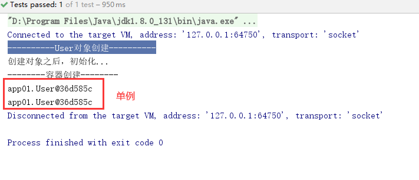
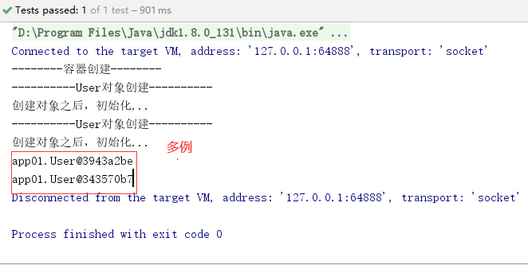

# Spring

## 1.Spring简介

Spring是当前主流的Java Web框架，为企业级应用开发提供了丰富的功能，掌握了Spring框架的使用是Java开发者必备的技能之一，Spring作为一个轻量级框架，它的出现迎来了JavaEE的春天，目前已经成为当今最主流的框架之一。

> 为什么要学习Spring？

它是一个轻量级开发框架，最早由Rod Johnson创建，该框架解决了企业级应用开发的业务逻辑和其它各层的耦合问题，并且分层的==一站式==轻量级开发框架，为开发Java应用提供全面的基础框架支持

**Spring体系结构**


Spring官网

```
https://spring.io/
```

## 2.开发环境搭建

导入jar文件

```xml
<?xml version="1.0" encoding="UTF-8"?>
<project xmlns="http://maven.apache.org/POM/4.0.0"
         xmlns:xsi="http://www.w3.org/2001/XMLSchema-instance"
         xsi:schemaLocation="http://maven.apache.org/POM/4.0.0 http://maven.apache.org/xsd/maven-4.0.0.xsd">
    <modelVersion>4.0.0</modelVersion>

    <groupId>com.lnboxue</groupId>
    <artifactId>springdemo_2002</artifactId>
    <version>1.0-SNAPSHOT</version>

    <dependencies>
        <!-- Spring -->
        <dependency>
            <groupId>org.springframework</groupId>
            <artifactId>spring-webmvc</artifactId>
            <version>5.1.9.RELEASE</version>
        </dependency>
        <dependency>
            <groupId>org.aspectj</groupId>
            <artifactId>aspectjweaver</artifactId>
            <version>1.9.4</version>
        </dependency>
        <!-- Junit -->
        <dependency>
            <groupId>junit</groupId>
            <artifactId>junit</artifactId>
            <version>4.12</version>
        </dependency>
    </dependencies>
    <!-- 解决maven项目无法读取src/main/java目录下面的配置文件问题 -->
    <build>
        <resources>
            <resource>
                <directory>src/main/java</directory>
                <includes>
                    <include>**/*.properties</include>
                    <include>**/*.xml</include>
                </includes>
                <filtering>false</filtering>
            </resource>
            <resource>
                <directory>src/main/resources</directory>
                <includes>
                    <include>**/*.properties</include>
                    <include>**/*.xml</include>
                </includes>
                <filtering>false</filtering>
            </resource>
        </resources>
    </build>
</project>
```

## 3.bean的创建细节

```xml
<?xml version="1.0" encoding="UTF-8"?>
<beans xmlns="http://www.springframework.org/schema/beans"
       xmlns:xsi="http://www.w3.org/2001/XMLSchema-instance"
       xsi:schemaLocation="http://www.springframework.org/schema/beans http://www.springframework.org/schema/beans/spring-beans.xsd">

    <!-- IOC容器配置，要创建的所有对象都配置到这里 -->
    <bean id="user" class="app01.User"/>
</beans>
```

```java
package app01;

/**
 * 用户类
 */
public class User {

    //编号
    private Integer id;
    //姓名
    private String name;

    public User(){
        System.out.println("----------User对象创建----------");
    }

    public Integer getId() {
        return id;
    }

    public void setId(Integer id) {
        this.id = id;
    }

    public String getName() {
        return name;
    }

    public void setName(String name) {
        this.name = name;
    }

    public void initUser(){
        System.out.println("创建对象之后，初始化...");
    }

    public void destroyUser(){
        System.out.println("IOC容器销毁，user对象回收...");
    }
}
```

**测试类**

```java
package app01;

import org.junit.Test;
import org.springframework.context.ApplicationContext;
import org.springframework.context.support.ClassPathXmlApplicationContext;

/**
 * 测试类
 */
public class App01 {

    //直接获取IOC容器对象
    @Test
    public void testAc() throws Exception{
        //获取IOC容器对象
        ApplicationContext ac = new ClassPathXmlApplicationContext("app01/applicationContext.xml");
        //从容器中获取bean
        User user = (User) ac.getBean("user");
        System.out.println(user);
    }
}
```

场景1

```xml
<!-- IOC容器配置，要创建的所有对象都配置到这里 -->
    <bean id="user" class="app01.User" init-method="initUser" destroy-method="destroyUser" scope="singleton" lazy-init="false"/>
```



场景2

```xml
<bean id="user" class="app01.User" init-method="initUser" destroy-method="destroyUser" scope="singleton" lazy-init="true"/>
```


场景3

```xml
<bean id="user" class="app01.User" init-method="initUser" destroy-method="destroyUser" scope="prototype" lazy-init="false"/>
```



场景4

```xml
<bean id="user" class="app01.User" init-method="initUser" destroy-method="destroyUser" scope="prototype" lazy-init="true"/>
```


**测试类**

```java
package app01;

import org.junit.Test;
import org.springframework.context.ApplicationContext;
import org.springframework.context.support.ClassPathXmlApplicationContext;

public class App02 {

    /**
     * 1.对象创建：分为单例/多例
     *  scope="singleton"，默认值，即默认为单例，service/dao/工具类
     *  scope="prototype"，多例，如：action对象
     * 2.什么时候创建？
     *  scope="prototype"：在用到对象的时候才创建
     *  scope="singleton"：在启动（容器初始化之前），就已经创建了bean，且整个应用中只有一个
     * 3.是否延迟创建
     *  lazy-init="false" 默认为false，不延迟创建，即在启动时就创建对象
     *  lazy-init="true" 延迟初始化，在用到对象时候才创建（仅仅对单例有效）
     * 4.创建对象后，初始化/销毁
     *  init-method="方法名"：对应initUser，在对象创建之后执行
     *  destroy-method="方法名"：调用容器对象的destroy方法时执行（该方法已废除）
     */
    @Test
    public void testAc() throws Exception{
        //获取IOC容器对象
        //ApplicationContext ac = new ClassPathXmlApplicationContext("app01/applicationContext.xml");
        ClassPathXmlApplicationContext ac = new ClassPathXmlApplicationContext("app01/applicationContext.xml");
        System.out.println("--------容器创建--------");
        //从容器中获取bean
        User user1 = (User) ac.getBean("user");
        User user2 = (User) ac.getBean("user");
        System.out.println(user1);
        System.out.println(user2);
        //销毁容器对象
        //ac.destroy();
    }
}
```

