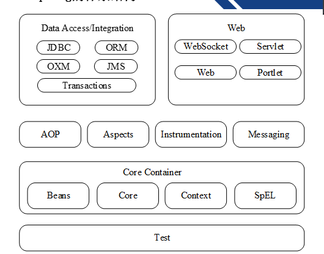
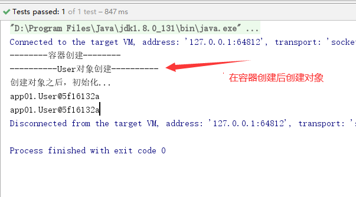
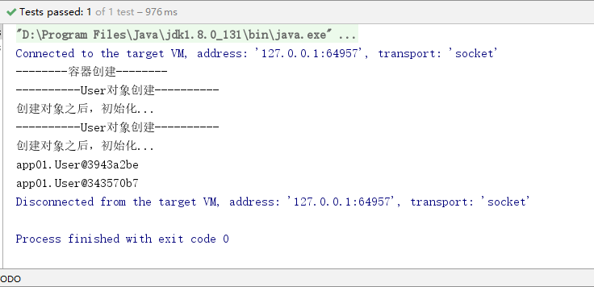

# Spring

## 1.Spring简介

Spring是当前主流的Java Web框架，为企业级应用开发提供了丰富的功能，掌握了Spring框架的使用是Java开发者必备的技能之一，Spring作为一个轻量级框架，它的出现迎来了JavaEE的春天，目前已经成为当今最主流的框架之一。

> 为什么要学习Spring？

它是一个轻量级开发框架，最早由Rod Johnson创建，该框架解决了企业级应用开发的业务逻辑和其它各层的耦合问题，并且分层的==一站式==轻量级开发框架，为开发Java应用提供全面的基础框架支持

**Spring体系结构**



Spring官网

```
https://spring.io/
```

## 2.开发环境搭建

导入jar文件

```xml
<?xml version="1.0" encoding="UTF-8"?>
<project xmlns="http://maven.apache.org/POM/4.0.0"
         xmlns:xsi="http://www.w3.org/2001/XMLSchema-instance"
         xsi:schemaLocation="http://maven.apache.org/POM/4.0.0 http://maven.apache.org/xsd/maven-4.0.0.xsd">
    <modelVersion>4.0.0</modelVersion>

    <groupId>com.lnboxue</groupId>
    <artifactId>springdemo_2002</artifactId>
    <version>1.0-SNAPSHOT</version>

    <dependencies>
        <!-- Spring -->
        <dependency>
            <groupId>org.springframework</groupId>
            <artifactId>spring-webmvc</artifactId>
            <version>5.1.9.RELEASE</version>
        </dependency>
        <dependency>
            <groupId>org.aspectj</groupId>
            <artifactId>aspectjweaver</artifactId>
            <version>1.9.4</version>
        </dependency>
        <!-- Junit -->
        <dependency>
            <groupId>junit</groupId>
            <artifactId>junit</artifactId>
            <version>4.12</version>
        </dependency>
    </dependencies>
    <!-- 解决maven项目无法读取src/main/java目录下面的配置文件问题 -->
    <build>
        <resources>
            <resource>
                <directory>src/main/java</directory>
                <includes>
                    <include>**/*.properties</include>
                    <include>**/*.xml</include>
                </includes>
                <filtering>false</filtering>
            </resource>
            <resource>
                <directory>src/main/resources</directory>
                <includes>
                    <include>**/*.properties</include>
                    <include>**/*.xml</include>
                </includes>
                <filtering>false</filtering>
            </resource>
        </resources>
    </build>
</project>
```

## 3.bean的创建细节

```xml
<?xml version="1.0" encoding="UTF-8"?>
<beans xmlns="http://www.springframework.org/schema/beans"
       xmlns:xsi="http://www.w3.org/2001/XMLSchema-instance"
       xsi:schemaLocation="http://www.springframework.org/schema/beans http://www.springframework.org/schema/beans/spring-beans.xsd">

    <!-- IOC容器配置，要创建的所有对象都配置到这里 -->
    <bean id="user" class="app01.User"/>
</beans>
```

```java
package app01;

/**
 * 用户类
 */
public class User {

    //编号
    private Integer id;
    //姓名
    private String name;

    public User(){
        System.out.println("----------User对象创建----------");
    }

    public Integer getId() {
        return id;
    }

    public void setId(Integer id) {
        this.id = id;
    }

    public String getName() {
        return name;
    }

    public void setName(String name) {
        this.name = name;
    }

    public void initUser(){
        System.out.println("创建对象之后，初始化...");
    }

    public void destroyUser(){
        System.out.println("IOC容器销毁，user对象回收...");
    }
}
```

**测试类**

```java
package app01;

import org.junit.Test;
import org.springframework.context.ApplicationContext;
import org.springframework.context.support.ClassPathXmlApplicationContext;

/**
 * 测试类
 */
public class App01 {

    //直接获取IOC容器对象
    @Test
    public void testAc() throws Exception{
        //获取IOC容器对象
        ApplicationContext ac = new ClassPathXmlApplicationContext("app01/applicationContext.xml");
        //从容器中获取bean
        User user = (User) ac.getBean("user");
        System.out.println(user);
    }
}
```

场景1

```xml
<!-- IOC容器配置，要创建的所有对象都配置到这里 -->
    <bean id="user" class="app01.User" init-method="initUser" destroy-method="destroyUser" scope="singleton" lazy-init="false"/>
```


场景2

```xml
<bean id="user" class="app01.User" init-method="initUser" destroy-method="destroyUser" scope="singleton" lazy-init="true"/>
```



场景3

```xml
<bean id="user" class="app01.User" init-method="initUser" destroy-method="destroyUser" scope="prototype" lazy-init="false"/>
```


场景4

```xml
<bean id="user" class="app01.User" init-method="initUser" destroy-method="destroyUser" scope="prototype" lazy-init="true"/>
```



**测试类**

```java
package app01;

import org.junit.Test;
import org.springframework.context.ApplicationContext;
import org.springframework.context.support.ClassPathXmlApplicationContext;

public class App02 {

    /**
     * 1.对象创建：分为单例/多例
     *  scope="singleton"，默认值，即默认为单例，service/dao/工具类
     *  scope="prototype"，多例，如：action对象
     * 2.什么时候创建？
     *  scope="prototype"：在用到对象的时候才创建
     *  scope="singleton"：在启动（容器初始化之前），就已经创建了bean，且整个应用中只有一个
     * 3.是否延迟创建
     *  lazy-init="false" 默认为false，不延迟创建，即在启动时就创建对象
     *  lazy-init="true" 延迟初始化，在用到对象时候才创建（仅仅对单例有效）
     * 4.创建对象后，初始化/销毁
     *  init-method="方法名"：对应initUser，在对象创建之后执行
     *  destroy-method="方法名"：调用容器对象的destroy方法时执行（该方法已废除）
     */
    @Test
    public void testAc() throws Exception{
        //获取IOC容器对象
        //ApplicationContext ac = new ClassPathXmlApplicationContext("app01/applicationContext.xml");
        ClassPathXmlApplicationContext ac = new ClassPathXmlApplicationContext("app01/applicationContext.xml");
        System.out.println("--------容器创建--------");
        //从容器中获取bean
        User user1 = (User) ac.getBean("user");
        User user2 = (User) ac.getBean("user");
        System.out.println(user1);
        System.out.println(user2);
        //销毁容器对象
        //ac.destroy();
    }
}
```

## 4.IOC容器创建对象

> 什么是IOC?

IOC(控制反转)是Spring框架的基础，也是Spring框架的核心理念

1. 控制反转(Inversion of control)：是一个比较抽象的概念，是Spring框架的核心，用于消减计算机的耦合问题
2. 依赖注入(DI：dependecy injection)：是IOC的另一个说法，不同角度描述相同的概念

**创建对象的方式**

**使用无参构造器创建对象**

```xml
<!-- 默认无参构造器 -->
<bean id="user1" class="app02.User"/>
```

**使用有参构造器创建对象**

```xml
<!-- 有参构造器 -->
<bean id="user2" class="app02.User">
    <constructor-arg index="0" type="java.lang.Integer" value="100"/>
    <constructor-arg index="1" type="java.lang.String" value="美楠"/>
</bean>
```

拓展：使用有参构造器创建对象（其中有一个参数是一个bean）

```xml
<bean id="str" class="java.lang.String">
        <constructor-arg value="小玉"/>
</bean>
<!-- 有参构造器创建对象（其中有一个参数是一个bean） -->
<bean id="user3" class="app02.User">
    <constructor-arg index="0" type="java.lang.Integer" value="100"/>
    <constructor-arg index="1" type="java.lang.String" ref="str"/>
</bean>
```

拓展：使用有参构造器创建对象（每一个参数都是一个bean）

```xml
<!-- 第一个参数的bean -->
<bean id="iid" class="java.lang.Integer">
    <constructor-arg index="0" type="java.lang.String" value="101"/>
</bean>
<!-- 第二个参数的bean -->
<bean id="str" class="java.lang.String">
    <constructor-arg index="0" type="java.lang.String" value="宏达"/>
</bean>
<!-- 使用有参构造器创建对象（每一个参数都是一个bean） -->
<bean id="user4" class="app02.User">
    <constructor-arg index="0" ref="iid"/>
    <constructor-arg index="1" ref="str"/>
</bean>
```

**工厂类创建对象**

编写工厂类

```java
package app02;

/**
 * 工厂创建对象
 */
public class ObjectFactory {
    
    //实例方法创建对象
    public User getInstance(){
        return new User(100,"工厂：调用实例方法...");
    }
    
    //静态方法创建对象
    public static User getStaticInstance(){
        return new User(101,"工厂：调用静态方法...");
    }
}
```

```xml
<!-- 工厂类创建对象 -->
    <!-- 工厂类（实例方法） -->
    <!-- 创建工厂 -->
    <!--<bean id="factory" class="app02.ObjectFactory"/>-->
    <!-- 再创建user对象，用factory的实例方法 -->
    <!--<bean id="user5" factory-bean="factory" factory-method="getInstance"/>-->

    <!-- 工厂类（静态方法）
            class：指定的就是工厂类型
            factory-method：一定是工厂类中的静态方法
    -->
<bean id="user6" class="app02.ObjectFactory" factory-method="getStaticInstance"/>
```

```java
package app02;

import org.junit.Test;
import org.springframework.context.ApplicationContext;
import org.springframework.context.support.ClassPathXmlApplicationContext;

/**
 * 测试类
 */
public class App {

    @Test
    public void testIOC() throws Exception{
        //创建IOC容器对象
        ApplicationContext ac = new ClassPathXmlApplicationContext("app02/applicationContext.xml");
        //获取容器中的对象
        //User user = (User) ac.getBean("user1");
        //User user = (User) ac.getBean("user2");
        //User user = (User) ac.getBean("user3");
        //User user = (User) ac.getBean("user4");
        //User user = (User) ac.getBean("user5");
        User user = (User) ac.getBean("user6");
        System.out.println(user);
    }
}
```

## 5.DI对象依赖关系处理

> 如何为对象的属性赋值？

使用有参构造方法为对象的属性赋值

**使用有参构造方法为属性赋值**

```xml
<!-- 使用有参构造方法为属性赋值 -->
<bean id="user" class="app03.User" scope="prototype">
    <constructor-arg value="100"/>
    <constructor-arg value="思莹"/>
</bean>
```

**使用属性的setter方法注入**

概述：使用setter方法注入是Spring框架中最主流的注入方式，它利用JavaBean规范所定义的setter方法完成注入，灵活且可读性高，对于setter方法注入，Spring框架也是使用==Java反射机制==实现的

```xml
<!-- 使用属性的setter方法注入 -->
<bean id="user2" class="app03.User" scope="prototype">
    <property name="id" value="101"/>
    <property name="name" value="明鑫"/>
</bean>
```

**案例：action/service/dao（推荐使用）**

```xml
<!-- 案例：action/service/dao -->
<!-- dao instance -->
<bean id="userDao" class="app03.UserDao"/>
<!-- service instance -->
<bean id="userService" class="app03.UserService">
    <property name="userDao" ref="userDao"/>
</bean>
<!-- action instance -->
<bean id="userAction" class="app03.UserAction">
    <property name="userService" ref="userService"/>
</bean>
```

**使用内部bean方式**

```xml
<!-- 内部bean的方式 -->
<bean id="userAction2" class="app03.UserAction">
    <property name="userService">
        <bean class="app03.UserService">
            <property name="userDao">
                <bean class="app03.UserDao"/>
            </property>
        </bean>
    </property>
</bean>
```

**测试类**

```java
package app03;

import org.junit.Test;
import org.springframework.context.ApplicationContext;
import org.springframework.context.support.ClassPathXmlApplicationContext;

/**
 * 测试类
 */
public class App {

    ApplicationContext ac = new ClassPathXmlApplicationContext("app03/applicationContext.xml");

    @Test
    public void testSet() throws Exception{
        //获取容器中的对象
        //User user = (User) ac.getBean("user");
        User user = (User) ac.getBean("user2");
        System.out.println(user);
    }

    @Test
    public void testExecution() throws Exception{
        //获取Spring IOC容器的action对象
        //UserAction userAction = (UserAction) ac.getBean("userAction");
        UserAction userAction = (UserAction) ac.getBean("userAction2");
        //调用控制层中的方法
        userAction.execute();
    }
}
```

## 6.自动装配

Spring中的自动装配有两种方式

1. 按照类型装配
2. 按照名称装配

**按类型装配**

```xml
<?xml version="1.0" encoding="UTF-8"?>
<beans xmlns="http://www.springframework.org/schema/beans"
       xmlns:xsi="http://www.w3.org/2001/XMLSchema-instance"
       xsi:schemaLocation="http://www.springframework.org/schema/beans http://www.springframework.org/schema/beans/spring-beans.xsd" default-autowire="byType">

    <!-- 按照类型装配 -->
    <!-- dao instance -->
    <bean id="userDao1" class="app04.UserDao"/>
    <!-- service instance -->
    <bean id="userService1" class="app04.UserService"/>
    <!-- action instance -->
    <bean id="userAction" class="app04.UserAction"/>
</beans>
```

<font color="red">注：按照类型装配，配置default-autowire="byType"，id可以改，但是建议不改</font>

**按名称装配**

```xml
<!-- 按照名称装配 -->
<!-- dao instance -->
<bean id="userDao1" class="app04.UserDao"/>
<!-- service instance -->
<bean id="userService1" class="app04.UserService"/>
<!-- action instance -->
<bean id="userAction" class="app04.UserAction"/>
```

<font color="red">注：这样写会报空指针异常，根据自动装配，userAction中注入的属性回去Spring IOC容器中自动查找于属性同名的对象</font>

```xml
<!-- 按照名称装配 -->
<!-- dao instance -->
<bean id="userDao" class="app04.UserDao"/>
<!-- service instance -->
<bean id="userService" class="app04.UserService"/>
<!-- action instance -->
<bean id="userAction" class="app04.UserAction"/>
```

**方式二**

```xml
<!-- 按照名称装配 -->
<!-- dao instance -->
<bean id="userDao" class="app04.UserDao" autowire="byName"/>
<!-- service instance -->
<bean id="userService" class="app04.UserService" autowire="byName"/>
<!-- action instance -->
<bean id="userAction" class="app04.UserAction" autowire="byName"/>
```

## 7.自动装配（注解版）

> 为什么要使用注解装配？

在Spring框架中，尽管使用XML配置文件可以简单地装配Bean，但应用中大量的Bean需要装配，会导致XML配置文件过于庞大，不便以后的升级与维护，因此更多的时候推荐开发者使用注解的方式去装配Bean

我们要学习以下注解

1. @Component：表示一个组件对象（Bean），可以作用在任何层次上
2. @Repository：用于将<font color="red">数据库访问层（Dao）</font>的类标识为Bean
3. @Service：用于标注一个<font color="red">业务逻辑组件（Service）</font>
4. @Controller：用于标注一个<font color=red>控制器组件类（Action/Controller）</font>
5. ==@Autowired==：可以对类的成员变量、方法及构造方法进行标注，完成装配工作（Spring中的注解，按照类装配）
6. @Resource：该注解与@Autowired的功能一样（先按照名称装配，再按照类型装配）=>jdk中的注解
7. ==@Qualifier==：该注解与@Autowired配合使用（@Autowired+@Qualifier=按名称装配）

