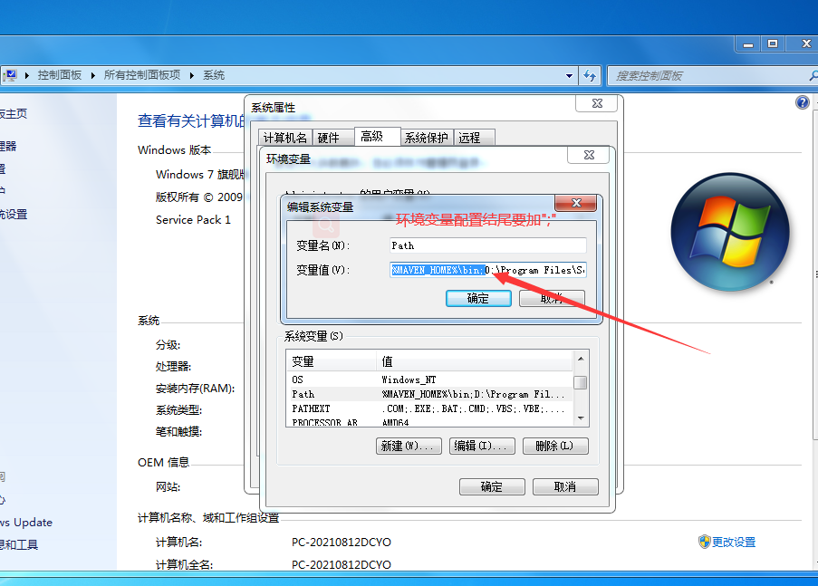
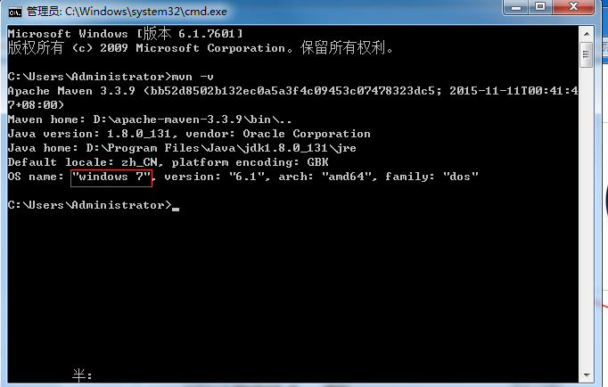
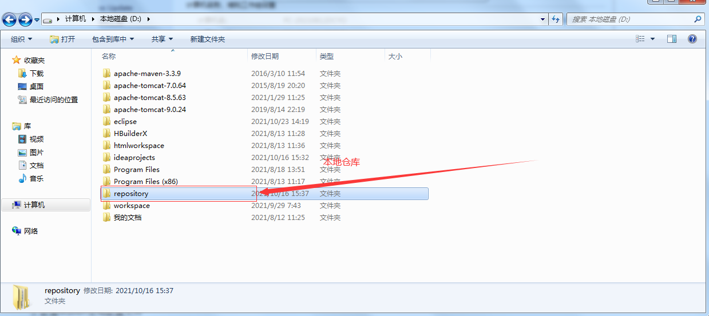
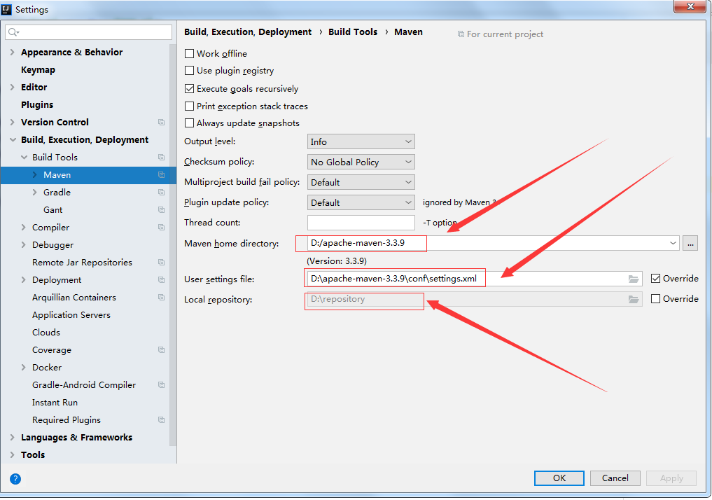
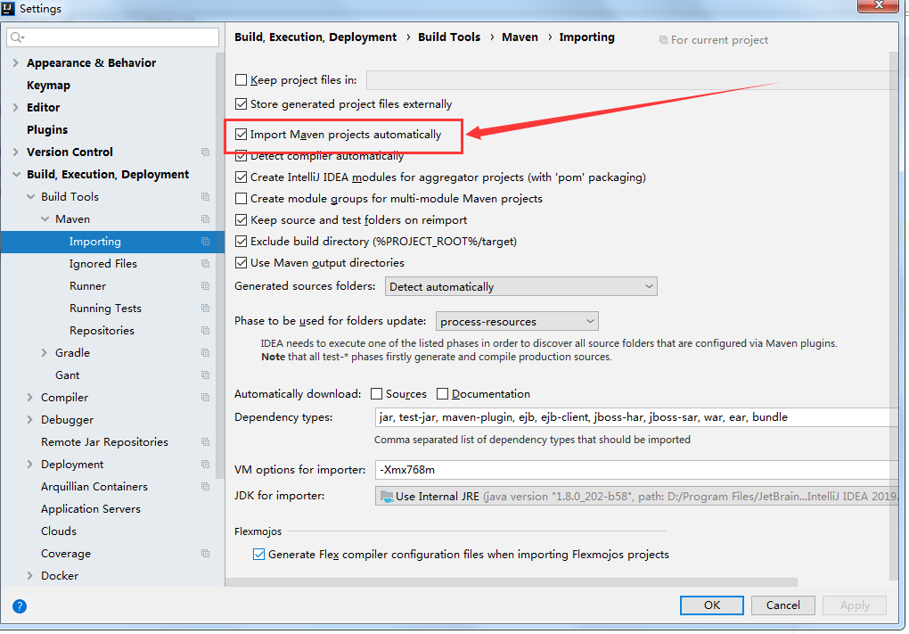

# Maven

## 1.为什么要学习Maven?

1. 一个项目就是一个工程，如果项目非常庞大，就不适合使用package进行划分，最好每一个模块对应一个工程，有利于分工协作
2. 项目中的jar包，需要复制到lib，借助于Maven可以将包保存在仓库中，不管在哪个项目只要引用就可以了
3. jar包需要的时候每次都在官网上下载，借助Maven可以用统一规范的方式下载jar包
4. jar包版本不一致存在风险，不同项目在使用jar包的时候，有可能导致各个项目的jar包版本不一致，导致执行错误，借助于Maven所有jar包都在仓库中，所有项目使用一份jar包
5. 一个jar包依赖的其它jar包需要手动导入到项目中，借助于Maven会将这些依赖jar包导入进来

## 2.什么是Maven?

概念：Maven是一款服务于平台的自动化构建工具

<font color=red>注：我们可以叫妹文也可以叫麦文，没有叫妈文的</font>

## 3.如何使用Maven?

Maven的配置

1. 去maven官网下载Maven

   ```
   https://maven.apache.org/download.cgi
   ```

   下载之后将Maven压缩包解压，要记住解压的位置，后面配置环境变量时需要

2. 配置环境变量，进入高级系统设置，打开环境变量，在系统变量中新建一个系统变量，变量名为MAVEN_HOME，变量值为Maven的加压位置，配置path变量，编辑path变量，将%MAVEN_HOME%\bin;添加进去，这时Maven就配置上去了，这个时候我们通过win+r命令提示符监测是否配置成功，输入mvn -v

   
   
   
   
   ​					
   
3. 配置Maven全局配置文件

   1. 新建文件夹repository作为我们的本地仓库，maven下载jar都会存放在这个文件夹下

       

   2. 接下来打开maven文件夹下的conf文件夹，打开里面的setting.xml（推荐使用notepad++打开），防止编译报错，首先配置项目的本地路径。接下来配置阿里云镜像（==推荐配置==），这样下载速度会更快，一般配置阿里云即可

      ```xml
      <mirror>
            <id>alimaven</id>
            <name>aliyun maven</name>
            <url>http://maven.aliyun.com/nexus/content/groups/public</url>
      	  <mirrorOf>central</mirrorOf>
      </mirror>
      ```

      ```xml
      <localRepository>D:\repository</localRepository>
      ```

   3. 在IDEA中配置Maven

      
      
      
      
   4. 新建Maven项目，会出现一个pom.xml，这是存储你的版本信息以及进行Maven仓库配置和下载的
   
         ```xml
         <?xml version="1.0" encoding="UTF-8"?>
         <project xmlns="http://maven.apache.org/POM/4.0.0"
                  xmlns:xsi="http://www.w3.org/2001/XMLSchema-instance"
                  xsi:schemaLocation="http://maven.apache.org/POM/4.0.0 http://maven.apache.org/xsd/maven-4.0.0.xsd">
             <modelVersion>4.0.0</modelVersion>
         
             <groupId>com.lnboxue</groupId>
             <artifactId>mybatisdemo_2002</artifactId>
             <version>1.0-SNAPSHOT</version>
         
             <!-- 导入依赖 -->
             <dependencies>
                 <!-- 数据库驱动 -->
                 <dependency>
                     <groupId>mysql</groupId>
                     <artifactId>mysql-connector-java</artifactId>
                     <version>5.1.47</version>
                 </dependency>
                 <!-- Mybatis -->
                 <dependency>
                     <groupId>org.mybatis</groupId>
                     <artifactId>mybatis</artifactId>
                     <version>3.5.2</version>
                 </dependency>
                 <!-- Junit -->
                 <dependency>
                     <groupId>junit</groupId>
                     <artifactId>junit</artifactId>
                     <version>4.12</version>
                 </dependency>
                 <!-- log4j -->
                 <dependency>
                     <groupId>log4j</groupId>
                     <artifactId>log4j</artifactId>
                     <version>1.2.17</version>
                 </dependency>
             </dependencies>
             <!-- 解决maven项目无法读取src/main/java目录下面的配置文件问题 -->
             <build>
                 <resources>
                     <resource>
                         <directory>src/main/java</directory>
                         <includes>
                             <include>**/*.properties</include>
                             <include>**/*.xml</include>
                         </includes>
                         <filtering>false</filtering>
                     </resource>
                     <resource>
                         <directory>src/main/resources</directory>
                         <includes>
                             <include>**/*.properties</include>
                             <include>**/*.xml</include>
                         </includes>
                         <filtering>false</filtering>
                     </resource>
                 </resources>
             </build>
         </project>
         ```
   
       