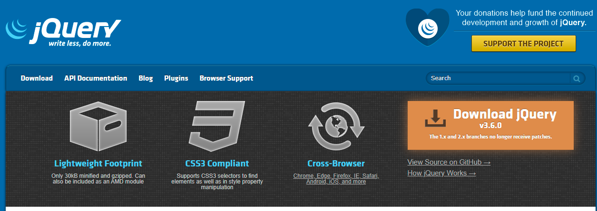

# jQuery

## 1.jQuery简介

jQuery是一个快速、简洁的[JavaScript](https://baike.baidu.com/item/JavaScript/321142)框架，是继[Prototype](https://baike.baidu.com/item/Prototype/14335188)之后又一个优秀的==JavaScript代码库（框架）==于2006年1月由[John Resig](https://baike.baidu.com/item/John Resig/6336344)发布。jQuery设计的宗旨是“write Less，Do More”，即倡导写更少的代码，做更多的事情。它封装JavaScript常用的功能代码，提供一种简便的JavaScript[设计模式](https://baike.baidu.com/item/设计模式/1212549)，优化[HTML](https://baike.baidu.com/item/HTML/97049)==文档操作==、==事件处理==、==动画设计==和==Ajax==交互。

## 2.jQuery的使用

首先进入jQuery官网获取jQuery库文件，下载jQuery库文件

```
https://jquery.com/
```



jQuery库分为开发版和发布版，两种版本有细微的差别

| 名称                             | 大小    | 说明                                                         |
| -------------------------------- | ------- | ------------------------------------------------------------ |
| jQuery-3.版本号.js（开发版）     | 约268KB | 完整无压缩版本，主要用于测试、学习和开发                     |
| jQuery-3.版本号.min.js（发布版） | 约91KB  | 经过工具压缩或经过服务器开启Gzip压缩，主要用于大部产品和项目 |

## 3.初识jQuery

### 3.1 简化创建自定义对象的方式

