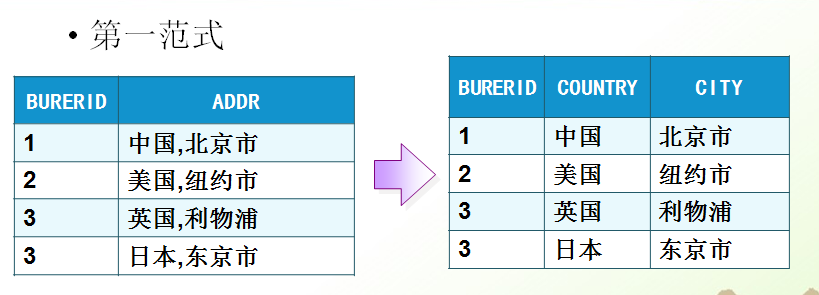
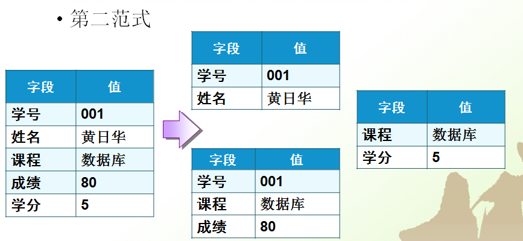

# 10月19日笔记 2003 34节

## 1.回顾

1. 外键约束（在项目开发中需要屏蔽掉物理外键）
2. 有了外键约束会出现的问题

## 2.表的约束

**外键约束**

```sql
-- 添加数据
insert into employee values(5,'陈六',4); -- 违反了外键约束
-- 原因插入了一个并不存在的部门
-- 修改数据
update dept set id=4 where id=3;
-- 因为并没有把id=3的人员“转岗”
-- 先修改员工表
update employee set deptId=2 where id=4;
-- 删除数据
delete from dept where id=2; 
-- 因为并没有将id=2的部门的员工“劝退”
-- 先删除员工表
delete from employee where id=2;
```

存在外键约束需要注意的事项

1. 当有了外键约束，添加数据的顺序，先添加主表，再添加副表数据
2. 当有了外键约束，修改数据的顺序，先修改副表，再修改主表
3. 当有了外键约束，删除数据的顺序，先删除副表，再删除主表

## 3.数据库设计

> 为什么需要数据库设计？

当数据比较复杂时候，我们就需要数据库设计

> 什么是糟糕的数据库设计呢？

1. 数据冗余，浪费空间
2. 数据插入和删除（修改）都会很麻烦，可能会产生异常（屏蔽使用物理外键）
3. 程序系能差

> 良好的数据设计？

1. 节省内存空间
2. 保证数据的完整性
3. 为开发人员开发工作带来便利

> 软件开发中包含的数据库设计？

分析需求：分析业务和需要处理的数据库的需求

概要设计：设计关系E-R图

1. 实体用矩形表示
2. 属性用椭圆表示
3. 关系用菱形表示

详细设计：类的详细设计、属性和方法

## 4.数据库的三大范式

**第一范式**



第一范式的目标是确保每列的==原子性==

如果每列都是不可再分的==最小数据单元==（也称为最小的原子单元），则满足第一范式（1NF）

**第二范式**



如果一个关系满足1NF，并且除了主键以外的其他列，都==依赖于该主键==，则满足第二范式（2NF）

第二范式要求每个表只描述==一件事情==

**第三范式**


如果一个关系满足2NF，并且除了主键以外的其他列都不==传递依赖==于其它列，则满足第三范式（3NF） 

<font color="red">注：建议设计数据库表尽量遵循数据库三大范式</font>

```sql
USE db_2003;
-- 准备测试数据
DELETE FROM employee;
DELETE FROM dept;
-- 插入部门数据
INSERT INTO dept(id,deptName) VALUES(1,'软件开发部');
INSERT INTO dept(id,deptName) VALUES(2,'应用维护部');
INSERT INTO dept(id,deptName) VALUES(3,'秘书部');
INSERT INTO dept(id,deptName) VALUES(4,'总经办');
SELECT * FROM dept;
-- 插入员工数据
INSERT INTO employee VALUES(1,'张三',1);
INSERT INTO employee VALUES(2,'李四',1);
INSERT INTO employee VALUES(3,'王五',2);
INSERT INTO employee VALUES(4,'陈六',3);
SELECT * FROM employee;
```

