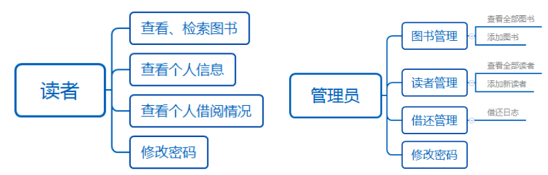

# 图书管理平台（Spring+Spring MVC+MyBatis）

## 1.系统数据库设计

**管理员表**

```sql
DROP TABLE IF EXISTS `admin`;

CREATE TABLE `admin` (
  -- 管理员编号  
  `admin_id` bigint(20) NOT NULL,
  -- 管理员密码  
  `password` varchar(15) NOT NULL,
  -- 管理员用户名  
  `username` varchar(15) DEFAULT NULL,
  PRIMARY KEY (`admin_id`)
) ENGINE=InnoDB DEFAULT CHARSET=utf8;
```

**图书信息表**

```sql
DROP TABLE IF EXISTS `book_info`;

CREATE TABLE `book_info` (
  -- 图书编号  
  `book_id` bigint(20) NOT NULL AUTO_INCREMENT,
  -- 图书名称  
  `name` varchar(20) NOT NULL,
  -- 图书作者  
  `author` varchar(15) NOT NULL,
  -- 出版社  
  `publish` varchar(20) NOT NULL,
  -- 国际标准号 
  `ISBN` varchar(15) NOT NULL,
  -- 图书介绍 
  `introduction` text,
  -- 图书语言   
  `language` varchar(4) NOT NULL,
  -- 图书价格  
  `price` decimal(10,2) NOT NULL,
  -- 出版时间  
  `pub_date` date NOT NULL,
  -- 图书类别  
  `class_id` int(11) DEFAULT NULL,
  -- 库存数量  
  `number` int(11) DEFAULT NULL,
  PRIMARY KEY (`book_id`)
) ENGINE=InnoDB AUTO_INCREMENT=15 DEFAULT CHARSET=utf8;
```

**图书分类表**

```sql
DROP TABLE IF EXISTS `class_info`;

CREATE TABLE `class_info` (
  -- 分类编号  
  `class_id` int(11) NOT NULL,
  -- 类别名称  
  `class_name` varchar(15) NOT NULL,
  PRIMARY KEY (`class_id`)
) ENGINE=InnoDB DEFAULT CHARSET=utf8;
```

**图书借阅表**

```sql
DROP TABLE IF EXISTS `lend_list`;

CREATE TABLE `lend_list` (
  -- 序列号  
  `ser_num` bigint(20) NOT NULL AUTO_INCREMENT,
  -- 图书编号  
  `book_id` bigint(20) NOT NULL,
  -- 读者编号  
  `reader_id` bigint(20) NOT NULL,
  -- 借阅日期  
  `lend_date` date DEFAULT NULL,
  -- 归还日期  
  `back_date` date DEFAULT NULL,
  PRIMARY KEY (`ser_num`)
) ENGINE=InnoDB AUTO_INCREMENT=9 DEFAULT CHARSET=utf8;
```

**借阅卡表**

```sql
DROP TABLE IF EXISTS `reader_card`;

CREATE TABLE `reader_card` (
  -- 借阅卡编号  
  `reader_id` bigint(20) NOT NULL,
  -- 借阅卡用户名  
  `username` varchar(15) NOT NULL,
  -- 借阅卡密码  
  `password` varchar(15) NOT NULL,
  PRIMARY KEY (`reader_id`)
) ENGINE=InnoDB DEFAULT CHARSET=utf8;
```

**读者信息表**

```sql
DROP TABLE IF EXISTS `reader_info`;

CREATE TABLE `reader_info` (
  -- 读者编号  
  `reader_id` bigint(20) NOT NULL AUTO_INCREMENT,
  -- 读者姓名  
  `name` varchar(10) NOT NULL,
  -- 读者性别  
  `sex` varchar(2) NOT NULL,
  -- 出生日期  
  `birth` date NOT NULL,
  -- 家庭住址  
  `address` varchar(50) NOT NULL,
  -- 电话号码  
  `phone` varchar(15) NOT NULL,
  PRIMARY KEY (`reader_id`)
) ENGINE=InnoDB AUTO_INCREMENT=10015 DEFAULT CHARSET=utf8;
```

**创建数据数据库并插入测试数据**

```sql
/*
SQLyog Ultimate v11.25 (64 bit)
MySQL - 5.5.56 : Database - library
*********************************************************************
*/


/*!40101 SET NAMES utf8 */;

/*!40101 SET SQL_MODE=''*/;

/*!40014 SET @OLD_UNIQUE_CHECKS=@@UNIQUE_CHECKS, UNIQUE_CHECKS=0 */;
/*!40014 SET @OLD_FOREIGN_KEY_CHECKS=@@FOREIGN_KEY_CHECKS, FOREIGN_KEY_CHECKS=0 */;
/*!40101 SET @OLD_SQL_MODE=@@SQL_MODE, SQL_MODE='NO_AUTO_VALUE_ON_ZERO' */;
/*!40111 SET @OLD_SQL_NOTES=@@SQL_NOTES, SQL_NOTES=0 */;
CREATE DATABASE /*!32312 IF NOT EXISTS*/`library` /*!40100 DEFAULT CHARACTER SET utf8 */;

USE `library`;

/*Table structure for table `admin` */

DROP TABLE IF EXISTS `admin`;

CREATE TABLE `admin` (
  `admin_id` bigint(20) NOT NULL,
  `password` varchar(15) NOT NULL,
  `username` varchar(15) DEFAULT NULL,
  PRIMARY KEY (`admin_id`)
) ENGINE=InnoDB DEFAULT CHARSET=utf8;

/*Data for the table `admin` */

insert  into `admin`(`admin_id`,`password`,`username`) values (123456,'123456','admin');

/*Table structure for table `book_info` */

DROP TABLE IF EXISTS `book_info`;

CREATE TABLE `book_info` (
  `book_id` bigint(20) NOT NULL AUTO_INCREMENT,
  `name` varchar(20) NOT NULL,
  `author` varchar(15) NOT NULL,
  `publish` varchar(20) NOT NULL,
  `ISBN` varchar(15) NOT NULL,
  `introduction` text,
  `language` varchar(4) NOT NULL,
  `price` decimal(10,2) NOT NULL,
  `pub_date` date NOT NULL,
  `class_id` int(11) DEFAULT NULL,
  `number` int(11) DEFAULT NULL,
  PRIMARY KEY (`book_id`)
) ENGINE=InnoDB AUTO_INCREMENT=15 DEFAULT CHARSET=utf8;

/*Data for the table `book_info` */

insert  into `book_info`(`book_id`,`name`,`author`,`publish`,`ISBN`,`introduction`,`language`,`price`,`pub_date`,`class_id`,`number`) values (1,'大雪中的山庄','东野圭吾 ','北京十月文艺出版社','9787530216835','东野圭吾长篇小说杰作，中文简体首次出版。 一出没有剧本的舞台剧，为什么能让七个演员赌上全部人生.东野圭吾就是有这样过人的本领，能从充满悬念的案子写出荡气回肠的情感，在极其周密曲折的同时写出人性的黑暗与美丽。 一家与外界隔绝的民宿里，七个演员被要求住满四天，接受导演的考验，但不断有人失踪。难道这并非正常排练，而是有人布下陷阱要杀他们。 那时候我开始喜欢上戏剧和音乐，《大雪中的山庄》一书的灵感就来源于此。我相信这次的诡计肯定会让人大吃一惊。——东野圭吾','中文','35.00','2017-06-01',9,1),(2,'三生三世 十里桃花','唐七公子 ','沈阳出版社','9787544138000','三生三世，她和他，是否注定背负一段纠缠的姻缘？\r\n三生三世，她和他，是否终能互许一个生生世世的承诺？','中文','26.80','2009-01-06',7,1),(3,'何以笙箫默','顾漫 ','朝华出版社','9787505414709','一段年少时的爱恋，牵出一生的纠缠。大学时代的赵默笙阳光灿烂，对法学系大才子何以琛一见倾心，开朗直率的她拔足倒追，终于使才气出众的他为她停留驻足。然而，不善表达的他终于使她在一次伤心之下远走他乡……','中文','15.00','2007-04-03',7,1),(4,'11处特工皇妃','潇湘冬儿','江苏文艺出版社','9787539943893','《11处特工皇妃(套装上中下册)》内容简介：她是国安局军情十一处惊才绝艳的王牌军师——收集情报、策划部署、进不友好国家布置暗杀任务……她运筹帷幄之中，决胜于千里之外，堪称军情局大厦的定海神针。','中文','74.80','2011-05-05',7,1),(5,'人类简史','[以色列] 尤瓦尔·赫拉利 ','中信出版社','9787508647357','十万年前，地球上至少有六种不同的人\r\n但今日，世界舞台为什么只剩下了我们自己？\r\n从只能啃食虎狼吃剩的残骨的猿人，到跃居食物链顶端的智人，\r\n从雪维洞穴壁上的原始人手印，到阿姆斯壮踩上月球的脚印，\r\n从认知革命、农业革命，到科学革命、生物科技革命，\r\n我们如何登上世界舞台成为万物之灵的？\r\n从公元前1776年的《汉摩拉比法典》，到1776年的美国独立宣言，\r\n从帝国主义、资本主义，到自由主义、消费主义，\r\n从兽欲，到物欲，从兽性、人性，到神性，\r\n我们了解自己吗？我们过得更快乐吗？\r\n我们究竟希望自己得到什么、变成什么？','英文','68.00','2014-11-01',11,1),(6,'明朝那些事儿（1-9）','当年明月 ','中国海关出版社','9787801656087','《明朝那些事儿》讲述从1344年到1644年，明朝三百年间的历史。作品以史料为基础，以年代和具体人物为主线，运用小说的笔法，对明朝十七帝和其他王公权贵和小人物的命运进行全景展示，尤其对官场政治、战争、帝王心术着墨最多。作品也是一部明朝政治经济制度、人伦道德的演义。','中文','358.20','2009-04-06',11,1),(7,'经济学原理（上下）','[美] 曼昆 ','机械工业出版社','9787111126768','此《经济学原理》的第3版把较多篇幅用于应用与政策，较少篇幅用于正规的经济理论。书中主要从供给与需求、企业行为与消费者选择理论、长期经济增长与短期经济波动以及宏观经济政策等角度深入浅出地剖析了经济学家们的世界观。','英文','88.00','2003-08-05',6,1),(8,'方向','马克-安托万·马修 ','后浪丨北京联合出版公司','9787020125265','《方向》即便在马修的作品中也算得最独特的：不着一字，尽得风流。原作本无一字，标题只是一个→，出版时才加了个书名Sens——既可以指“方向”，也可以指“意义”。 《方向》没有“字”，但有自己的语言——请读者在尽情释放想象力和独立思考之余，破解作者的密码，听听作者对荒诞的看法。','中文','99.80','2017-04-01',9,1),(9,'画的秘密','马克-安托万·马修 ','北京联合出版公司·后浪出版公司','9787550265608','一本关于友情的疗伤图像小说，直击人内心最为隐秘的情感。 一部追寻艺术的纸上悬疑电影，揭示命运宇宙中奇诡的真相。 ★ 《画的秘密》荣获欧洲第二大漫画节“瑞士谢尔漫画节最佳作品奖”。 作者曾两度夺得安古兰国际漫画节重要奖项。 ★ 《画的秘密》是一部罕见的、结合了拼贴、镜像、3D等叙事手法的实验型漫画作品。作者巧妙地调度光线、纬度、时间、记忆，在一个悬念重重又温情治愈的故事中，注入了一个有关命运的哲学议题。','中文','60.00','2016-01-01',9,0),(10,'造彩虹的人','东野圭吾 ','北京十月文艺出版社','9787530216859','其实每个人身上都会发光，但只有纯粹渴求光芒的人才能看到。 从那一刻起，人生会发生奇妙的转折。功一高中退学后无所事事，加入暴走族消极度日；政史备战高考却无法集中精神，几近崩溃；辉美因家庭不和对生活失去勇气，决定自杀。面对糟糕的人生，他们无所适从，直到一天夜里，一道如同彩虹的光闯进视野。 凝视着那道光，原本几乎要耗尽的气力，源源不断地涌了出来。一切又开始充满希望。打起精神来，不能输。到这儿来呀，快来呀——那道光低声呼唤着。 他们追逐着呼唤，到达一座楼顶，看到一个人正用七彩绚烂的光束演奏出奇妙的旋律。 他们没想到，这一晚看到的彩虹，会让自己的人生彻底转...','中文','39.50','2017-06-01',9,1),(11,'控方证人','阿加莎·克里斯蒂 ','新星出版社','9787513325745','经典同名话剧六十年常演不衰； 比利•怀尔德执导同名电影，获奥斯卡金像奖六项提名！ 阿加莎对神秘事物的向往大约来自于一种女性祖先的遗传，在足不出户的生活里，生出对世界又好奇又恐惧的幻想。 ——王安忆 伦纳德•沃尔被控谋杀富婆艾米丽以图染指其巨额遗产，他却一再表明自己的无辜。伦纳德的妻子是唯一能够证明他无罪的证人，却以控方证人的身份出庭指证其确实犯有谋杀罪。伦纳德几乎陷入绝境，直到一个神秘女人的出现…… 墙上的犬形图案；召唤死亡的收音机；蓝色瓷罐的秘密；一只疯狂的灰猫……十一篇神秘的怪谈，最可怕的不是“幽灵”，而是你心中的魔鬼。','中文','35.00','2017-05-01',9,1),(12,'少有人走的路','M·斯科特·派克 ','吉林文史出版社','9787807023777','这本书处处透露出沟通与理解的意味，它跨越时代限制，帮助我们探索爱的本质，引导我们过上崭新，宁静而丰富的生活；它帮助我们学习爱，也学习独立；它教诲我们成为更称职的、更有理解心的父母。归根到底，它告诉我们怎样找到真正的自我。 正如开篇所言：人生苦难重重。M·斯科特·派克让我们更加清楚：人生是一场艰辛之旅，心智成熟的旅程相当漫长。但是，他没有让我们感到恐惧，相反，他带领我们去经历一系列艰难乃至痛苦的转变，最终达到自我认知的更高境界。','中文','26.00','2007-01-01',9,1),(13,'追寻生命的意义','[奥] 维克多·弗兰克 ','新华出版社','9787501162734','《追寻生命的意义》是一个人面对巨大的苦难时，用来拯救自己的内在世界，同时也是一个关于每个人存在的价值和能者多劳们生存的社会所应担负职责的思考。本书对于每一个想要了解我们这个时代的人来说，都是一部必不可少的读物。这是一部令人鼓舞的杰作……他是一个不可思议的人，任何人都可以从他无比痛苦的经历中，获得拯救自己的经验……高度推荐。','中文','12.00','2003-01-01',9,0),(14,'秘密花园','乔汉娜·贝斯福 ','北京联合出版公司','9787550252585','欢迎来到秘密花园！ 在这个笔墨编织出的美丽世界中漫步吧 涂上你喜爱的颜色，为花园带来生机和活力 发现隐藏其中的各类小生物，与它们共舞 激活创造力，描绘那些未完成的仙踪秘境 各个年龄段的艺术家和“园丁”都可以来尝试喔！','中文','42.00','2015-06-01',9,1);

/*Table structure for table `class_info` */

DROP TABLE IF EXISTS `class_info`;

CREATE TABLE `class_info` (
  `class_id` int(11) NOT NULL,
  `class_name` varchar(15) NOT NULL,
  PRIMARY KEY (`class_id`)
) ENGINE=InnoDB DEFAULT CHARSET=utf8;

/*Data for the table `class_info` */

insert  into `class_info`(`class_id`,`class_name`) values (1,'马克思主义'),(2,'哲学'),(3,'社会科学总论'),(4,'政治法律'),(5,'军事'),(6,'经济'),(7,'文化'),(8,'语言'),(9,'文学'),(10,'艺术'),(11,'历史地理'),(12,'自然科学总论'),(13,' 数理科学和化学'),(14,'天文学、地球科学'),(15,'生物科学'),(16,'医药、卫生'),(17,'农业科学'),(18,'工业技术'),(19,'交通运输'),(20,'航空、航天'),(21,'环境科学'),(22,'综合');

/*Table structure for table `lend_list` */

DROP TABLE IF EXISTS `lend_list`;

CREATE TABLE `lend_list` (
  `ser_num` bigint(20) NOT NULL AUTO_INCREMENT,
  `book_id` bigint(20) NOT NULL,
  `reader_id` bigint(20) NOT NULL,
  `lend_date` date DEFAULT NULL,
  `back_date` date DEFAULT NULL,
  PRIMARY KEY (`ser_num`)
) ENGINE=InnoDB AUTO_INCREMENT=9 DEFAULT CHARSET=utf8;

/*Data for the table `lend_list` */

insert  into `lend_list`(`ser_num`,`book_id`,`reader_id`,`lend_date`,`back_date`) values (1,1,10000,'2017-03-15','2017-06-16'),(2,2,10001,'2017-06-10','2017-09-02'),(3,3,10003,'2017-06-12','2017-09-02'),(4,4,10000,'2017-03-15','2017-09-03'),(5,5,10002,'2017-06-15',NULL),(6,6,10000,'2017-06-15',NULL),(8,14,10000,'2022-01-02','2022-01-02');

/*Table structure for table `reader_card` */

DROP TABLE IF EXISTS `reader_card`;

CREATE TABLE `reader_card` (
  `reader_id` bigint(20) NOT NULL,
  `username` varchar(15) NOT NULL,
  `password` varchar(15) NOT NULL,
  PRIMARY KEY (`reader_id`)
) ENGINE=InnoDB DEFAULT CHARSET=utf8;

/*Data for the table `reader_card` */

insert  into `reader_card`(`reader_id`,`username`,`password`) values (10000,'张华','123456'),(10001,'王小伟','123456'),(10002,'王莞尔','123456'),(10003,'张明华','123456'),(10004,'李一琛','123456'),(10005,'李二飞','123456');

/*Table structure for table `reader_info` */

DROP TABLE IF EXISTS `reader_info`;

CREATE TABLE `reader_info` (
  `reader_id` bigint(20) NOT NULL AUTO_INCREMENT,
  `name` varchar(10) NOT NULL,
  `sex` varchar(2) NOT NULL,
  `birth` date NOT NULL,
  `address` varchar(50) NOT NULL,
  `phone` varchar(15) NOT NULL,
  PRIMARY KEY (`reader_id`)
) ENGINE=InnoDB AUTO_INCREMENT=10015 DEFAULT CHARSET=utf8;

/*Data for the table `reader_info` */

insert  into `reader_info`(`reader_id`,`name`,`sex`,`birth`,`address`,`phone`) values (10000,'张华','男','1995-06-10','沈阳市','12345678900'),(10001,'王小伟','男','1996-02-01','北京市','12345678909'),(10002,'王莞尔','女','1995-04-15','浙江省杭州市','12345678908'),(10003,'张明华','男','1996-08-29','陕西省西安市','12345678907'),(10004,'李一琛','男','1996-01-01','陕西省西安市','15123659875'),(10005,'李二飞','男','1996-05-03','山东省青岛市','15369874123');

/*!40101 SET SQL_MODE=@OLD_SQL_MODE */;
/*!40014 SET FOREIGN_KEY_CHECKS=@OLD_FOREIGN_KEY_CHECKS */;
/*!40014 SET UNIQUE_CHECKS=@OLD_UNIQUE_CHECKS */;
/*!40111 SET SQL_NOTES=@OLD_SQL_NOTES */;
```

## 2.系统功能设计



## 3.项目搭建

### 3.1 创建项目

创建一个==带有Web骨架==的maven项目

### 3.2 导入依赖

```xml
<?xml version="1.0" encoding="UTF-8"?>

<project xmlns="http://maven.apache.org/POM/4.0.0" xmlns:xsi="http://www.w3.org/2001/XMLSchema-instance"
  xsi:schemaLocation="http://maven.apache.org/POM/4.0.0 http://maven.apache.org/xsd/maven-4.0.0.xsd">
  <modelVersion>4.0.0</modelVersion>

  <groupId>com.lnboxue</groupId>
  <artifactId>library_2002</artifactId>
  <version>1.0-SNAPSHOT</version>
  <packaging>war</packaging>

  <properties>
    <project.build.sourceEncoding>UTF-8</project.build.sourceEncoding>
    <maven.compiler.source>1.8</maven.compiler.source>
    <maven.compiler.target>1.8</maven.compiler.target>
  </properties>

  <dependencies>
    <!-- Junit -->
    <dependency>
      <groupId>junit</groupId>
      <artifactId>junit</artifactId>
      <version>4.12</version>
      <scope>test</scope>
    </dependency>
    <!-- 数据库驱动 -->
    <dependency>
      <groupId>mysql</groupId>
      <artifactId>mysql-connector-java</artifactId>
      <version>5.1.47</version>
    </dependency>
    <!-- druid -->
    <dependency>
      <groupId>com.alibaba</groupId>
      <artifactId>druid</artifactId>
      <version>1.1.20</version>
    </dependency>
    <!-- Mybatis -->
    <dependency>
      <groupId>org.mybatis</groupId>
      <artifactId>mybatis</artifactId>
      <version>3.5.2</version>
    </dependency>
    <dependency>
      <groupId>org.mybatis</groupId>
      <artifactId>mybatis-spring</artifactId>
      <version>2.0.2</version>
    </dependency>
    <!-- Spring -->
    <dependency>
      <groupId>org.springframework</groupId>
      <artifactId>spring-webmvc</artifactId>
      <version>5.1.9.RELEASE</version>
    </dependency>
    <dependency>
      <groupId>org.aspectj</groupId>
      <artifactId>aspectjweaver</artifactId>
      <version>1.9.4</version>
    </dependency>
    <dependency>
      <groupId>org.springframework</groupId>
      <artifactId>spring-jdbc</artifactId>
      <version>5.1.9.RELEASE</version>
    </dependency>
    <!-- Jackson -->
    <dependency>
      <groupId>com.fasterxml.jackson.core</groupId>
      <artifactId>jackson-databind</artifactId>
      <version>2.9.8</version>
    </dependency>
    <!-- FileUpload -->
    <dependency>
      <groupId>commons-fileupload</groupId>
      <artifactId>commons-fileupload</artifactId>
      <version>1.2.2</version>
    </dependency>
    <dependency>
      <groupId>commons-io</groupId>
      <artifactId>commons-io</artifactId>
      <version>2.4</version>
    </dependency>
    <!-- pagehelper -->
    <dependency>
      <groupId>com.github.pagehelper</groupId>
      <artifactId>pagehelper</artifactId>
      <version>5.1.9</version>
    </dependency>
    <!-- JSR303 hibernate-validator -->
    <dependency>
      <groupId>org.hibernate</groupId>
      <artifactId>hibernate-validator</artifactId>
      <version>5.1.0.Final</version>
    </dependency>
    <!-- Servlet - JSP -->
    <dependency>
      <groupId>javax.servlet</groupId>
      <artifactId>javax.servlet-api</artifactId>
      <version>3.0.1</version>
      <scope>provided</scope>
    </dependency>
    <dependency>
      <groupId>javax.servlet.jsp</groupId>
      <artifactId>jsp-api</artifactId>
      <version>2.1</version>
      <scope>provided</scope>
    </dependency>
    <dependency>
      <groupId>javax.servlet.jsp.jstl</groupId>
      <artifactId>jstl-api</artifactId>
      <version>1.2</version>
    </dependency>
    <dependency>
      <groupId>taglibs</groupId>
      <artifactId>standard</artifactId>
      <version>1.1.2</version>
    </dependency>
    <!-- logback -->
    <!-- 接口 -->
    <dependency>
      <groupId>org.slf4j</groupId>
      <artifactId>slf4j-api</artifactId>
      <version>1.7.30</version>
    </dependency>
    <!-- 实现类 -->
    <dependency>
      <groupId>ch.qos.logback</groupId>
      <artifactId>logback-classic</artifactId>
      <version>1.1.2</version>
    </dependency>
    <dependency>
      <groupId>ch.qos.logback</groupId>
      <artifactId>logback-core</artifactId>
      <version>1.1.2</version>
    </dependency>
    <dependency>
      <groupId>org.logback-extensions</groupId>
      <artifactId>logback-ext-spring</artifactId>
      <version>0.1.1</version>
    </dependency>
  </dependencies>
  <!-- 解决maven项目无法读取src/main/java目录下面的配置文件问题 -->
  <build>
    <resources>
      <resource>
        <directory>src/main/java</directory>
        <includes>
          <include>**/*.properties</include>
          <include>**/*.xml</include>
        </includes>
        <filtering>false</filtering>
      </resource>
      <resource>
        <directory>src/main/resources</directory>
        <includes>
          <include>**/*.properties</include>
          <include>**/*.xml</include>
        </includes>
        <filtering>false</filtering>
      </resource>
    </resources>
  </build>
</project>
```

### 3.3 配置Web.xml

```xml
<?xml version="1.0" encoding="UTF-8"?>
<web-app xmlns="http://xmlns.jcp.org/xml/ns/javaee"
         xmlns:xsi="http://www.w3.org/2001/XMLSchema-instance"
         xsi:schemaLocation="http://xmlns.jcp.org/xml/ns/javaee http://xmlns.jcp.org/xml/ns/javaee/web-app_4_0.xsd"
         version="4.0">

  <!-- DispatcherServlet -->
  <servlet>
    <servlet-name>DispatcherServlet</servlet-name>
    <servlet-class>org.springframework.web.servlet.DispatcherServlet</servlet-class>
    <init-param>
      <param-name>contextConfigLocation</param-name>
      <param-value>classpath:applicationContext.xml</param-value>
    </init-param>
    <load-on-startup>1</load-on-startup>
  </servlet>
  <servlet-mapping>
    <servlet-name>DispatcherServlet</servlet-name>
    <url-pattern>/</url-pattern>
  </servlet-mapping>

  <!-- CharacterEncodingFilter -->
  <filter>
    <filter-name>encodingFilter</filter-name>
    <filter-class>org.springframework.web.filter.CharacterEncodingFilter</filter-class>
    <init-param>
      <param-name>encoding</param-name>
      <param-value>utf-8</param-value>
    </init-param>
  </filter>
  <filter-mapping>
    <filter-name>encodingFilter</filter-name>
    <url-pattern>/*</url-pattern>
  </filter-mapping>

  <!-- logback -->
  <context-param>
    <param-name>logbackConfigLocation</param-name>
    <param-value>classpath:logback.xml</param-value>
  </context-param>
  <listener>
    <listener-class>ch.qos.logback.ext.spring.web.LogbackConfigListener</listener-class>
  </listener>

  <!-- Session过期时间 -->
  <session-config>
    <session-timeout>15</session-timeout>
  </session-config>
</web-app>
```

### 3.4 SSM配置整合

**数据库信息配置**

```properties
#jdbc.driver=com.mysql.cj.jdbc.Driver
jdbc.driver=com.mysql.jdbc.Driver
#如果使用的是MySQL8.0+,增加一个时区的配置，即serverTimezone=Asia/Shanghai
jdbc.url=jdbc:mysql://localhost:3306/library_2002?useSSL=true&useUnicode=true&characterEncoding=utf8
jdbc.username=root
jdbc.password=123456

```

**配置logback日志**

```xml
<?xml version="1.0" encoding="UTF-8"?>
<configuration scan="true" scanPeriod="60 seconds" debug="false">
    <!--
   `根节点<configuration>包含的属性：
        scan：当此属性设置为true时，配置文件如果发生改变，将会被重新加载，默认值为true。
        scanPeriod：设置监测配置文件是否有修改的时间间隔，如果没有给出时间单位，默认单位是毫秒。当scan为true时，此属性生效。默认的时间间隔为1分钟。
        debug：当此属性设置为true时，将打印出logback内部日志信息，实时查看logback运行状态。默认值为false。
    -->
    <!-- 定义参数常量 -->
    <!-- TRACE < DEBUG < INFO < WARN <ERROR -->
    <property name="log.level" value="debug"/>
    <property name="log.maxHistory" value="30"/>     <!--文件最大保存历史数量,30-->
    <property name="log.filePath" value="D:/log"/> <!--标识这个日志储存的根路径-->
    <property name="log.pattern" value="%d{yyyy-MM-dd HH:mm:ss.SSS}[%thread]%-5level%logger{50}-%msg%n"/>  <!--日志展现的格式-->
    <!--
    %d{yyyy-MM-dd HH:mm:ss.SSS} :时间格式
    [%thead] :是哪个线程执行
    %-5level :哪个级别的日志
    %logger{50} :哪个package下面的哪个类里面的信息
    %msg :信息
    -->
    <!-- 控制台输出 -->
    <appender name="consoleAppender" class="ch.qos.logback.core.ConsoleAppender">
        <encoder>
            <pattern>${log.pattern}</pattern>
        </encoder>
    </appender>

    <!-- DEBUG -->
    <appender name="debugAppender" class="ch.qos.logback.core.rolling.RollingFileAppender">
        <!-- 文件路径 -->
        <file>${log.filePath}/debug.log</file>
        <!-- 滚动策略:按天或者按月,还是按年... -->
        <rollingPolicy class="ch.qos.logback.core.rolling.TimeBasedRollingPolicy">
            <!-- 文件名称 -->
            <fileNamePattern>${log.filePath}/debug/debug.%d{yyyy-MM-dd}.log.gz</fileNamePattern>
            <!-- 文件最大保存历史数量 -->
            <maxHistory>${log.maxHistory}</maxHistory>
        </rollingPolicy>
        <encoder>
            <pattern>${log.pattern}</pattern>
        </encoder>
        <!-- 过滤器 -->
        <filter class="ch.qos.logback.classic.filter.LevelFilter">
            <level>DEBUG</level>
            <onMatch>ACCEPT</onMatch>     <!--如果是DEBUG信息就保留-->
            <onMismatch>DENY</onMismatch> <!--如果不是DEBUG信息就过滤掉-->
        </filter>
    </appender>

    <!-- INFO -->
    <appender name="infoAppender" class="ch.qos.logback.core.rolling.RollingFileAppender">
        <!-- 文件路径 -->
        <file>${log.filePath}/info.log</file>
        <!-- 滚动策略:按天或者按月,还是按年 -->
        <rollingPolicy class="ch.qos.logback.core.rolling.TimeBasedRollingPolicy">
            <!-- 文件名称 -->
            <fileNamePattern>${log.filePath}/info/info.%d{yyyy-MM-dd}.log.gz</fileNamePattern>
            <!-- 文件最大保存历史数量 -->
            <maxHistory>${log.maxHistory}</maxHistory>
        </rollingPolicy>
        <encoder>
            <pattern>${log.pattern}</pattern>
        </encoder>
        <!-- 过滤器 -->
        <filter class="ch.qos.logback.classic.filter.LevelFilter">
            <level>INFO</level>
            <onMatch>ACCEPT</onMatch>     <!--如果是INFO信息就保留-->
            <onMismatch>DENY</onMismatch> <!--如果不是INFO信息就过滤掉-->
        </filter>
    </appender>

    <!-- ERROR -->
    <appender name="errorAppender" class="ch.qos.logback.core.rolling.RollingFileAppender">
        <!-- 文件路径 -->
        <file>${log.filePath}/error.log</file>
        <!-- 滚动策略:按天或者按月,还是按年... -->
        <rollingPolicy class="ch.qos.logback.core.rolling.TimeBasedRollingPolicy">
            <!-- 文件名称 -->
            <fileNamePattern>${log.filePath}/error/error.%d{yyyy-MM-dd}.log.gz</fileNamePattern>
            <!-- 文件最大保存历史数量 -->
            <maxHistory>${log.maxHistory}</maxHistory>
        </rollingPolicy>
        <encoder>
            <pattern>${log.pattern}</pattern>
        </encoder>
        <!-- 过滤器 -->
        <filter class="ch.qos.logback.classic.filter.LevelFilter">
            <level>ERROR</level>
            <onMatch>ACCEPT</onMatch>
            <onMismatch>DENY</onMismatch>
        </filter>
    </appender>

    <!-- additivity="true"这个的意思是：也继承下面root里面的信息 -->
    <logger name="com.lnboxue" level="${log.level}" additivity="true">
        <appender-ref ref="debugAppender"/>
        <appender-ref ref="infoAppender"/>
        <appender-ref ref="errorAppender"/>
    </logger>
    <!-- 如果上面的logger没输出,就执行下面的root -->
    <root level="info">
        <appender-ref ref="consoleAppender"/>
    </root>

</configuration>
```

**mybatis配置**

```xml
<?xml version="1.0" encoding="UTF-8" ?>
<!DOCTYPE configuration
        PUBLIC "-//mybatis.org//DTD Config 3.0//EN"
        "http://mybatis.org/dtd/mybatis-3-config.dtd">
<configuration>

    <typeAliases>
        <package name="com.lnboxue.pojo"/>
    </typeAliases>

    <mappers>
        <!-- <mapper class="com.lnboxue.dao.UserMapper"></mapper> -->
        <!--<mapper resource="com/lnboxue/dao/UserMapper.xml"/>-->
    </mappers>
</configuration>
```

**Spring整合dao**

```xml
<?xml version="1.0" encoding="UTF-8"?>
<beans xmlns="http://www.springframework.org/schema/beans"
       xmlns:xsi="http://www.w3.org/2001/XMLSchema-instance"
       xmlns:context="http://www.springframework.org/schema/context"
       xsi:schemaLocation="http://www.springframework.org/schema/beans
       http://www.springframework.org/schema/beans/spring-beans.xsd
       http://www.springframework.org/schema/context
       https://www.springframework.org/schema/context/spring-context.xsd">

    <!-- 配置整合mybatis -->
    <!-- 关联数据库文件 -->
    <context:property-placeholder location="classpath:database.properties"/>

    <!-- 2.数据库连接池 -->
    <bean id="dataSource" class="com.alibaba.druid.pool.DruidDataSource">
        <!-- 配置连接池属性 -->
        <property name="driverClassName" value="${jdbc.driver}"/>
        <property name="url" value="${jdbc.url}"/>
        <property name="username" value="${jdbc.username}"/>
        <property name="password" value="${jdbc.password}"/>
    </bean>

    <!-- 配置SqlSessionFactory对象 -->
    <bean id="sqlSessionFactory" class="org.mybatis.spring.SqlSessionFactoryBean">
        <!-- 注入数据库连接池 -->
        <property name="dataSource" ref="dataSource"/>
        <!-- 配置MyBatis全局配置文件:mybatis-config.xml -->
        <property name="configLocation" value="classpath:mybatis-config.xml"/>
        <!-- 配置PageHelper插件-->
        <property name="plugins">
            <array>
                <bean class="com.github.pagehelper.PageInterceptor">
                    <property name="properties">
                        <!-- 使用下面的方式配置参数，一行配置一个 -->
                        <!-- helperDialect表示使用的数据库 -->
                        <!-- reasonable表示当用户查看的页码超出了拥有的范围时 默认查询第一页或最后一页 -->
                        <value>
                            helperDialect=mysql
                            reasonable=true
                        </value>
                    </property>
                </bean>
            </array>
        </property>
    </bean>

    <!-- 4.配置扫描Dao接口包，动态实现Dao接口注入到spring容器中 -->
    <bean class="org.mybatis.spring.mapper.MapperScannerConfigurer">
        <!-- 注入sqlSessionFactory -->
        <property name="sqlSessionFactoryBeanName" value="sqlSessionFactory"/>
        <!-- 给出需要扫描Dao接口包 -->
        <property name="basePackage" value="com.lnboxue.dao"/>
    </bean>
</beans>
```

**Spring整合service**

```xml
<?xml version="1.0" encoding="UTF-8"?>
<beans xmlns="http://www.springframework.org/schema/beans"
       xmlns:xsi="http://www.w3.org/2001/XMLSchema-instance"
       xmlns:tx="http://www.springframework.org/schema/tx"
       xmlns:context="http://www.springframework.org/schema/context"
       xmlns:aop="http://www.springframework.org/schema/aop"
       xsi:schemaLocation="http://www.springframework.org/schema/beans
       http://www.springframework.org/schema/beans/spring-beans.xsd
       http://www.springframework.org/schema/tx
       http://www.springframework.org/schema/tx/spring-tx.xsd
       http://www.springframework.org/schema/context
       https://www.springframework.org/schema/context/spring-context.xsd http://www.springframework.org/schema/aop https://www.springframework.org/schema/aop/spring-aop.xsd">

    <!-- 扫描service相关的bean -->
    <context:component-scan base-package="com.lnboxue.service" />

    <!-- 声明式事务配置 -->
    <bean id="transactionManager" class="org.springframework.jdbc.datasource.DataSourceTransactionManager">
        <!-- 注入数据库连接池 -->
        <property name="dataSource" ref="dataSource" />
    </bean>

    <!-- aop事务支持 -->
    <!-- 配置事务通知，即让哪些方法需要事务支持 -->
    <tx:advice id="tx" transaction-manager="transactionManager">
         <tx:attributes>
             <tx:method name="*" propagation="REQUIRED"/>
         </tx:attributes>
    </tx:advice>

    <!-- 配置事务切面，即让哪些包下的类需要事务 -->
    <aop:config>
        <aop:pointcut id="pointcut" expression="execution(* com.lnboxue.service.*.*(..))"/>
        <aop:advisor advice-ref="tx" pointcut-ref="pointcut"/>
    </aop:config>
</beans>
```

**Spring整合spring mvc**

```xml
<?xml version="1.0" encoding="UTF-8"?>
<beans xmlns="http://www.springframework.org/schema/beans"
       xmlns:xsi="http://www.w3.org/2001/XMLSchema-instance"
       xmlns:mvc="http://www.springframework.org/schema/mvc"
       xmlns:context="http://www.springframework.org/schema/context"
       xsi:schemaLocation="http://www.springframework.org/schema/beans
       http://www.springframework.org/schema/beans/spring-beans.xsd
       http://www.springframework.org/schema/mvc
       http://www.springframework.org/schema/mvc/spring-mvc.xsd
       http://www.springframework.org/schema/context
       https://www.springframework.org/schema/context/spring-context.xsd">

    <!-- 配置SpringMVC -->
    <!-- 开启SpringMVC注解驱动及Jackson乱码解决 -->
    <mvc:annotation-driven>
        <mvc:message-converters>
            <bean class="org.springframework.http.converter.StringHttpMessageConverter">
                <constructor-arg value="UTF-8"/>
            </bean>
            <bean class="org.springframework.http.converter.json.MappingJackson2HttpMessageConverter">
                <property name="objectMapper">
                    <bean class="org.springframework.http.converter.json.Jackson2ObjectMapperFactoryBean">
                        <property name="failOnEmptyBeans" value="false"/>
                    </bean>
                </property>
            </bean>
        </mvc:message-converters>
    </mvc:annotation-driven>

    <!-- 静态资源默认servlet配置 DefaultServlet -->
    <mvc:default-servlet-handler/>

    <!-- 配置SpringMVC静态资源路径映射，即如果你的静态资源是放在WEB-INF下的，那么静态资源通过http是请求不到的，这时候就会使用资源映射。-->
    <mvc:resources mapping="/bootstrap/**" location="/static" />

    <!-- 配置jsp 显示ViewResolver视图解析器 -->
    <bean class="org.springframework.web.servlet.view.InternalResourceViewResolver">
        <property name="prefix" value="/WEB-INF/jsp/" />
        <property name="suffix" value=".jsp" />
    </bean>

    <!-- 扫描web相关的bean -->
    <context:component-scan base-package="com.lnboxue.controller" />
</beans>
```

## 4.项目开发

### 4.1 编写实体类

**管理员类**

```java
package com.lnboxue.pojo;

import java.io.Serializable;

/**
 * 管理员类
 */
public class Admin implements Serializable {

    //管理员编号
    private Long adminId;
    //管理员密码
    private String password;
    //管理员用户名
    private String username;

    //无参构造方法
    public Admin(){}

    public Long getAdminId() {
        return adminId;
    }

    public void setAdminId(Long adminId) {
        this.adminId = adminId;
    }

    public String getPassword() {
        return password;
    }

    public void setPassword(String password) {
        this.password = password;
    }

    public String getUsername() {
        return username;
    }

    public void setUsername(String username) {
        this.username = username;
    }
}
```

**图书类**

```java
package com.lnboxue.pojo;

import java.io.Serializable;
import java.math.BigDecimal;
import java.util.Date;

/**
 * 图书类
 */
public class Book implements Serializable {

    //图书编号
    private Long bookId;
    //图书名称
    private String name;
    //图书作者
    private String author;
    //出版社
    private String publish;
    //国际标准号
    private String ISBN;
    //图书介绍
    private String introduction;
    //图书语言
    private String language;
    //图书价格
    private BigDecimal price;
    //出版时间
    private Date pubDate;
    //图书类别编号
    private Integer classId;
    //图书库存数量
    private Integer number;

    //无参构造方法
    public Book(){}

    public Long getBookId() {
        return bookId;
    }

    public void setBookId(Long bookId) {
        this.bookId = bookId;
    }

    public String getName() {
        return name;
    }

    public void setName(String name) {
        this.name = name;
    }

    public String getAuthor() {
        return author;
    }

    public void setAuthor(String author) {
        this.author = author;
    }

    public String getPublish() {
        return publish;
    }

    public void setPublish(String publish) {
        this.publish = publish;
    }

    public String getISBN() {
        return ISBN;
    }

    public void setISBN(String ISBN) {
        this.ISBN = ISBN;
    }

    public String getIntroduction() {
        return introduction;
    }

    public void setIntroduction(String introduction) {
        this.introduction = introduction;
    }

    public String getLanguage() {
        return language;
    }

    public void setLanguage(String language) {
        this.language = language;
    }

    public BigDecimal getPrice() {
        return price;
    }

    public void setPrice(BigDecimal price) {
        this.price = price;
    }

    public Date getPubDate() {
        return pubDate;
    }

    public void setPubDate(Date pubDate) {
        this.pubDate = pubDate;
    }

    public Integer getClassId() {
        return classId;
    }

    public void setClassId(Integer classId) {
        this.classId = classId;
    }

    public Integer getNumber() {
        return number;
    }

    public void setNumber(Integer number) {
        this.number = number;
    }
}
```

**图书借阅类**

```java
package com.lnboxue.pojo;

import java.io.Serializable;
import java.util.Date;

/**
 * 图书借阅类
 */
public class Lend implements Serializable {

    //图书借阅编号
    private Long serNum;
    //图书编号
    private Long bookId;
    //读者编号
    private Long readerId;
    //借阅时间
    private Date lendDate;
    //归还时间
    private Date backDate;

    //无参构造方法
    public Lend(){}

    public Long getSerNum() {
        return serNum;
    }

    public void setSerNum(Long serNum) {
        this.serNum = serNum;
    }

    public Long getBookId() {
        return bookId;
    }

    public void setBookId(Long bookId) {
        this.bookId = bookId;
    }

    public Long getReaderId() {
        return readerId;
    }

    public void setReaderId(Long readerId) {
        this.readerId = readerId;
    }

    public Date getLendDate() {
        return lendDate;
    }

    public void setLendDate(Date lendDate) {
        this.lendDate = lendDate;
    }

    public Date getBackDate() {
        return backDate;
    }

    public void setBackDate(Date backDate) {
        this.backDate = backDate;
    }
}
```

**借阅卡类**

```java
package com.lnboxue.pojo;

import java.io.Serializable;

/**
 * 借阅卡类
 */
public class ReaderCard implements Serializable {

    //读者编号
    private Long readerId;
    //读者用户名
    private String username;
    //读者密码
    private String password;

    //无参数构造方法
    public ReaderCard(){}

    public Long getReaderId() {
        return readerId;
    }

    public void setReaderId(Long readerId) {
        this.readerId = readerId;
    }

    public String getUsername() {
        return username;
    }

    public void setUsername(String username) {
        this.username = username;
    }

    public String getPassword() {
        return password;
    }

    public void setPassword(String password) {
        this.password = password;
    }
}
```

**读者信息类**

```java
package com.lnboxue.pojo;

import java.io.Serializable;
import java.util.Date;

/**
 * 读者信息类
 */
public class ReaderInfo implements Serializable {

    //读者编号
    private Long readerId;
    //读者姓名
    private String name;
    //读者性别
    private String sex;
    //出生日期
    private Date birth;
    //家庭住址
    private String address;
    //读者电话
    private String phone;

    //无参构造方法
    public ReaderInfo(){}

    public Long getReaderId() {
        return readerId;
    }

    public void setReaderId(Long readerId) {
        this.readerId = readerId;
    }

    public String getName() {
        return name;
    }

    public void setName(String name) {
        this.name = name;
    }

    public String getSex() {
        return sex;
    }

    public void setSex(String sex) {
        this.sex = sex;
    }

    public Date getBirth() {
        return birth;
    }

    public void setBirth(Date birth) {
        this.birth = birth;
    }

    public String getAddress() {
        return address;
    }

    public void setAddress(String address) {
        this.address = address;
    }

    public String getPhone() {
        return phone;
    }

    public void setPhone(String phone) {
        this.phone = phone;
    }
}
```

### 4.2 编写业务模块（管理员模块）

#### 4.2.1 用户登录

**数据库访问层**

```java
package com.lnboxue.dao;

import org.apache.ibatis.annotations.Param;

/**
 * 数据库访问层
 */
public interface AdminMapper {

    //登录验证
    int getMatchCount(@Param("adminId") long adminId,@Param("password") String password);
    //查询用户名
    String getUsername(long adminId);
}
```

```xml
<?xml version="1.0" encoding="UTF-8"?>
<!DOCTYPE mapper PUBLIC "-//mybatis.org//DTD Config 3.0//EN"
        "http://mybatis.org/dtd/mybatis-3-mapper.dtd">

<mapper namespace="com.lnboxue.dao.AdminMapper">
    <select id="getMatchCount" resultType="int">
        SELECT COUNT(*) FROM admin WHERE admin_id=#{adminId} AND PASSWORD=#{password}
    </select>

    <select id="getUsername" resultType="string">
        SELECT username FROM admin WHERE admin_id=#{adminId}
    </select>
</mapper>
```

**业务层**

```java
package com.lnboxue.service;

/**
 * 业务层
 */
public interface LoginService {

    boolean hasMatchAdmin(long adminId,String password);
    String getAdminUsername(long adminId);
}
```

```java
package com.lnboxue.service.impl;

import com.lnboxue.dao.AdminMapper;
import com.lnboxue.service.LoginService;
import org.springframework.beans.factory.annotation.Autowired;
import org.springframework.stereotype.Service;

/**
 * 业务层实现类
 */
@Service
public class LoginServiceImpl implements LoginService {

    //注入Mapper
    @Autowired
    private AdminMapper adminMapper;

    @Override
    public boolean hasMatchAdmin(long adminId, String password) {
        return adminMapper.getMatchCount(adminId,password)==1;
    }

    @Override
    public String getAdminUsername(long adminId) {
        return adminMapper.getUsername(adminId);
    }
}
```

**控制层**

```java
package com.lnboxue.controller;

import com.lnboxue.pojo.Admin;
import com.lnboxue.service.LoginService;
import org.springframework.beans.factory.annotation.Autowired;
import org.springframework.stereotype.Controller;
import org.springframework.web.bind.annotation.RequestMapping;
import org.springframework.web.bind.annotation.ResponseBody;
import org.springframework.web.servlet.ModelAndView;

import javax.servlet.http.HttpServletRequest;
import java.util.HashMap;
import java.util.Map;

/**
 * 控制层
 */
@Controller
public class LoginController {

    //注入Service
    @Autowired
    private LoginService loginService;

    //跳转到登录页 login.html
    @RequestMapping(value = {"/","/login.html"})
    public String toLogin(HttpServletRequest request){
        //使Session失效
        request.getSession().invalidate();
        return "index";
    }

    //跳转到管理员主页面
    @RequestMapping("/admin_main.html")
    public ModelAndView toAdminMain(){
        return new ModelAndView("admin_main");
    }

    //跳转到管理员公共头部页面
    @RequestMapping("/admin_header.html")
    public ModelAndView toAdminHeader(){
        return new ModelAndView("admin_header");
    }

    @RequestMapping("/loginCheck")
    @ResponseBody
    public Map<String,String> loginCheck(HttpServletRequest request){
        //获取账号并进行类型转换
        long id = Long.parseLong(request.getParameter("id"));
        //获取密码
        String password = request.getParameter("password");
        //调用Service中的登录验证方法
        boolean isAdmin = loginService.hasMatchAdmin(id, password);
        //实例化Map对象
        HashMap<String,String> result = new HashMap<>();
        //判断用户是否存在，判断是否是管理员
        if (isAdmin){
            //实例化管理员对象
            Admin admin = new Admin();
            //封装数据
            admin.setAdminId(id);
            admin.setPassword(password);
            //调用Service中的用户名查询方法
            String username = loginService.getAdminUsername(id);
            //封装用户名
            admin.setUsername(username);
            //将admin对象放入Session中
            request.getSession().setAttribute("admin",admin);
            //设置响应数据
            result.put("stateCode","1");
            //设置登录成功信息
            result.put("msg","管理员登录成功！");
        } else {
            //用户名密码错误
            result.put("stateCode","0");
            result.put("msg","账号或密码错误");
        }
        return result;
    }
}
```

```jsp
<%@ page contentType="text/html;charset=UTF-8"  language="java"%>
<%@taglib prefix="c" uri="http://java.sun.com/jsp/jstl/core" %>
<html>
<head>
    <title>图书馆首页</title>
    <link rel="stylesheet" href="${pageContext.request.contextPath}/static/css/bootstrap.min.css">
    <script src="${pageContext.request.contextPath}/static/js/jquery-3.3.1.js"></script>
    <script src="${pageContext.request.contextPath}/static/js/bootstrap.min.js" ></script>
    <script src="${pageContext.request.contextPath}/static/js/js.cookie.js"></script>
    <style>
        #login{
           height: 50%;
            width: 28%;
            margin-left: auto;
            margin-right: auto;
            margin-top: 5%;
            display: block;
            position: center;
        }
        .form-group {
            margin-bottom: 0;
        }
        * {
            padding:0;
            margin:0;
        }
    </style>
</head>
<body background="${pageContext.request.contextPath}/static/img/timg.jpg" style=" background-repeat:no-repeat ;
background-size:100% 100%;
background-attachment: fixed;">

<h2 style="text-align: center; color: white; font-family: '华文行楷'; font-size: 500%">图 书 馆</h2>

<div class="panel panel-default" id="login">
    <div class="panel-heading" style="background-color: #fff">
        <h3 class="panel-title">请登录</h3>
    </div>
    <div class="panel-body">
        <div class="form-group">
            <label for="id">账号</label>
            <input type="text" class="form-control" id="id" placeholder="请输入账号">
        </div>
        <div class="form-group">
            <label for="password">密码</label>
            <input type="password" class="form-control" id="password" placeholder="请输入密码">
        </div>
        <div class="checkbox text-left">
            <label>
                <input type="checkbox" id="remember">记住密码
            </label>
        </div>

        <p style="text-align: right;color: red;position: absolute" id="info"></p><br/>
        <button id="loginButton"  class="btn btn-primary  btn-block">登陆
        </button>
    </div>
	</div>
		<script>
			//对账号进行合法性的验证 not a number=>NaN
            $("#id").keyup(function () {
                //判断账号是否为数字
                if (isNaN($("#id").val())) {
                    //非法，给出提示信息
                    $("#info").text("提示：账号只能为数字");
                } else {
                    $("#info").text("");
                }
            });

            //jQuery的表单提交
            $("#loginButton").click(function () {
                //获取账号内容
                var id = $("#id").val();
                //获取密码内容
                var password = $("#password").val();
                //对用户输入进行合理性的判断
                if (id==""){
                    //给出提示信息
                    $("#info").text("提示：账号不能为空");
                } else if(password==""){
                    //给出提示信息
                    $("#info").text("提示：密码不能为空");
                } else if(isNaN(id)){
                    $("#info").text("提示：账号必须为数字");
                } else {
                    $.ajax({
                        //提交方式
                        type:"POST",
                        //请求的URL
                        url:"${pageContext.request.contextPath}/loginCheck",
                        //请求的数据，JSON写法
                        data:{
                            id:id,
                            password:password
                        },
                        //返回类型
                        dataType:"json",
                        //响应数据处理函数
                        success:function (data) {
                            //判断客户端响应的角色信息
                            if (data.stateCode.trim()=="0"){
                                //给出提示信息
                                $("#info").text("提示：账号或密码错误！");
                            } else if(data.stateCode.trim()=="1"){
                                //给出登录成功提示信息
                                $("#info").text("提示：登录成功，跳转中...");
                                //跳转到管理员主页面
                                window.location.href = "${pageContext.request.contextPath}/admin_main.html";
                            }
                        }
                    });
                }
            });
		</script>
	</div>
</body>
</html>
```

#### 4.2.2 图书管理

**数据库访问层**

```java
package com.lnboxue.dao;

import com.lnboxue.pojo.Book;

import java.util.List;

/**
 * 数据库访问层
 */
public interface BookMapper {

    //查询图书列表
    List<Book> getAllBooks();

}
```

```xml
<?xml version="1.0" encoding="UTF-8"?>
<!DOCTYPE mapper PUBLIC "-//mybatis.org//DTD Config 3.0//EN"
        "http://mybatis.org/dtd/mybatis-3-mapper.dtd">

<mapper namespace="com.lnboxue.dao.BookMapper">
    <resultMap id="bookMap" type="Book">
        <id property="bookId" column="book_id"/>
        <result property="name" column="name"/>
        <result property="author" column="author"/>
        <result property="publish" column="publish"/>
        <result property="ISBN" column="ISBN"/>
        <result property="introduction" column="introduction"/>
        <result property="language" column="language"/>
        <result property="price" column="price"/>
        <result property="pubDate" column="pub_date"/>
        <result property="classId" column="class_id"/>
        <result property="number" column="number"/>
    </resultMap>

    <select id="getAllBooks" resultMap="bookMap">
        SELECT * FROM book_info
    </select>
</mapper>
```

**业务层**

```java
package com.lnboxue.service;

import com.lnboxue.pojo.Book;

import java.util.List;

/**
 * 业务层
 */
public interface BookService {
    
    List<Book> getAllBooks();
}
```

```java
package com.lnboxue.service.impl;

import com.lnboxue.dao.BookMapper;
import com.lnboxue.pojo.Book;
import com.lnboxue.service.BookService;
import org.springframework.beans.factory.annotation.Autowired;
import org.springframework.stereotype.Service;

import java.util.List;

/**
 * 业务层实现类
 */
@Service
public class BookServiceImpl implements BookService {

    @Autowired
    private BookMapper bookMapper;

    @Override
    public List<Book> getAllBooks() {
        return bookMapper.getAllBooks();
    }
}
```

**控制层**

```java
package com.lnboxue.controller;

import com.lnboxue.pojo.Book;
import com.lnboxue.service.BookService;
import org.springframework.beans.factory.annotation.Autowired;
import org.springframework.stereotype.Controller;
import org.springframework.web.bind.annotation.RequestMapping;
import org.springframework.web.servlet.ModelAndView;

import java.util.List;

/**
 * 控制层
 */
@Controller
public class BookController {

    //注入Service
    @Autowired
    private BookService bookService;

    @RequestMapping("/admin_books.html")
    public ModelAndView adminBooks(){
        //调用业务层中查询方法
        List<Book> books = bookService.getAllBooks();
        //跳转到图书展示页面
        ModelAndView modelAndView = new ModelAndView("admin_books");
        //保存图书数据
        modelAndView.addObject("books",books);
        return modelAndView;
    }
}
```

```jsp
<%@ page contentType="text/html;charset=UTF-8" language="java" %>
<%@taglib prefix="c" uri="http://java.sun.com/jsp/jstl/core" %>
<html>
<head>
    <title>全部图书信息</title>
    <link rel="stylesheet" href="${pageContext.request.contextPath}/static/css/bootstrap.min.css">
    <script src="${pageContext.request.contextPath}/static/js/jquery-3.3.1.js"></script>
    <script src="${pageContext.request.contextPath}/static/js/bootstrap.min.js" ></script>
    <script>
        $(function () {
            $('#header').load('${pageContext.request.contextPath}/admin_header.html');
        });
    </script>
</head>
<body background="${pageContext.request.contextPath}/static/img/book1.jpg" style=" background-repeat:no-repeat ;
background-size:100% 100%;
background-attachment: fixed;">

<div id="header"></div>

<div style="padding: 70px 550px 10px">
    <form   method="post" action="" class="form-inline"  id="searchform">
        <div class="input-group">
           <input type="text" placeholder="输入图书名" class="form-control" id="search" name="searchWord" class="form-control">
            <span class="input-group-btn">
                            <input type="submit" value="搜索" class="btn btn-default">
            </span>
        </div>
    </form>
    <script>

    </script>
</div>
<div style="position: relative;top: 10%">
<c:if test="${!empty success}">
    <div class="alert alert-success alert-dismissable">
        <button type="button" class="close" data-dismiss="alert"
                aria-hidden="true">
            &times;
        </button>
        ${success}
    </div>
</c:if>
<c:if test="${!empty error}">
    <div class="alert alert-danger alert-dismissable">
        <button type="button" class="close" data-dismiss="alert"
                aria-hidden="true">
            &times;
        </button>
        ${error}
    </div>
</c:if>
</div>
<div class="panel panel-default" style="width: 90%;margin-left: 5%">
    <div class="panel-heading" style="background-color: #fff">
        <h3 class="panel-title">
            全部图书
        </h3>
    </div>
    <div class="panel-body">
        <table class="table table-hover">
            <thead>
                <tr>
                    <th>书名</th>
                    <th>作者</th>
                    <th>出版社</th>
                    <th>ISBN</th>
                    <th>价格</th>
                    <th>剩余数量</th>
                    <th>详情</th>
                    <th>编辑</th>
                    <th>删除</th>
                </tr>
            </thead>
            <tbody>
                <c:forEach items="${books}" var="book">
                    <tr>
                        <td>${book.name}</td>
                        <td>${book.author}</td>
                        <td>${book.publish}</td>
                        <td>${book.ISBN}</td>
                        <td>${book.price}</td>
                        <td>${book.number}</td>
                        <td><a href="">
                            <button type="button" class="btn btn-success btn-xs">详情</button>
                        </a></td>
                        <td><a href=""><button type="button" class="btn btn-info btn-xs">编辑</button></a></td>
                        <td><a href=""><button type="button" class="btn btn-danger btn-xs">删除</button></a></td>
                    </tr>
                </c:forEach>
            </tbody>
        </table>
    </div>
</div>
</body>
</html>
```

#### 4.2.3 用户注销功能

```java
package com.lnboxue.controller;

import com.lnboxue.pojo.Admin;
import com.lnboxue.service.LoginService;
import org.springframework.beans.factory.annotation.Autowired;
import org.springframework.stereotype.Controller;
import org.springframework.web.bind.annotation.RequestMapping;
import org.springframework.web.bind.annotation.ResponseBody;
import org.springframework.web.servlet.ModelAndView;

import javax.servlet.http.HttpServletRequest;
import java.util.HashMap;
import java.util.Map;

/**
 * 控制层
 */
@Controller
public class LoginController {

    //注入Service
    @Autowired
    private LoginService loginService;

    //跳转到登录页 login.html
    @RequestMapping(value = {"/","/login.html"})
    public String toLogin(HttpServletRequest request){
        //使Session失效
        request.getSession().invalidate();
        return "index";
    }

    //跳转到管理员主页面
    @RequestMapping("/admin_main.html")
    public ModelAndView toAdminMain(){
        return new ModelAndView("admin_main");
    }

    //跳转到管理员公共头部页面
    @RequestMapping("/admin_header.html")
    public ModelAndView toAdminHeader(){
        return new ModelAndView("admin_header");
    }

    @RequestMapping("/loginCheck")
    @ResponseBody
    public Map<String,String> loginCheck(HttpServletRequest request){
        //获取账号并进行类型转换
        long id = Long.parseLong(request.getParameter("id"));
        //获取密码
        String password = request.getParameter("password");
        //调用Service中的登录验证方法
        boolean isAdmin = loginService.hasMatchAdmin(id, password);
        //实例化Map对象
        HashMap<String,String> result = new HashMap<>();
        //判断用户是否存在，判断是否是管理员
        if (isAdmin){
            //实例化管理员对象
            Admin admin = new Admin();
            //封装数据
            admin.setAdminId(id);
            admin.setPassword(password);
            //调用Service中的用户名查询方法
            String username = loginService.getAdminUsername(id);
            //封装用户名
            admin.setUsername(username);
            //将admin对象放入Session中
            request.getSession().setAttribute("admin",admin);
            //设置响应数据
            result.put("stateCode","1");
            //设置登录成功信息
            result.put("msg","管理员登录成功！");
        } else {
            //用户名密码错误
            result.put("stateCode","0");
            result.put("msg","账号或密码错误");
        }
        return result;
    }

    //注销功能
    @RequestMapping("/logout.html")
    public String logout(HttpServletRequest request){
        //清除当前用户的Session
        request.getSession().invalidate();
        return "redirect:/login.html";
    }
}
```

**作业**

完成图书模糊查询功能

