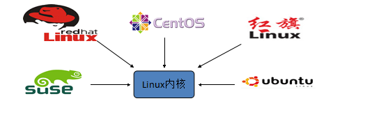
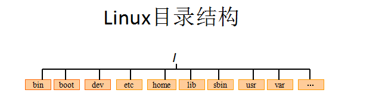

# 3月7日笔记 Linux 2003

## 1.什么是Linux

### 1.1 学习Linux之前先了解Unix

Unix是一个强大的多用户、多任务的操作系统，于1969年在贝尔实验室开发，UNIX的商标仅由国际开放标准组织所拥有。UNIX操作系统是商业版，需要收费，价格要比Microsoft Windows正版要贵一些。

### 1.2 Linux概述

Linux是基于Unix的，Linux是一种自由开放源码的操作系统，存在着许多不同的Linux版本，但他们都使用了Linux的内核。Linux可安装在各种计算机硬件设备中，比如手机、平板但那哦、路由器、台式计算机



诞生于1991年10月5日。是由芬兰赫尔辛基大学生Linus（林纳斯）和后来加入的众多爱好者共同开发完成的。

### 1.3 Linux的历史

Linux最初是由芬兰赫尔辛基大学学生Linus由于自己不满意教学中使用的MINIX操作系统，所以在19901年底由于个人爱好设计出Linux系统的核心。后来发布于芬兰最大的ftp服务器上，用户可以免费下载，所以他的周边程序越来越多了，Linux本身也逐渐发展壮大起来，之后Linux在不到三年的时间里成为了一个功能完善、稳定可靠的操作系统。

### 1.4 Linux的应用

1. 服务器系统：Web服务器拥有服务器、数据库服务器、接口服务器、DNS、FTP等
2. 嵌入式系统：路由器、防火墙、手机、交换机等
3. 高性能运算：计算机密集型应用（Linux有强大的运算能力）
4. 桌面应用系统
5. 系统手持系统

## 1.5 Linux版本

Linux的版本分为两种：内核版本和发行版本

1. 内核版本：内核版本是指在Linus领导下的内核小组开发维护的内核版本号
2. 发行版本：发行版本是一些组织和公司根据自己发行版的不同而制定的

### 1.6 发行版本的特点

红帽企业版（RedHat Enterprise Linux，RHEL）操作系统：红帽公司是最大的开源技术厂商，RHEL操作系统是全世界内==最广泛==的Linux操作系统。RHEL操作系统具有极强的性能和稳定性，并且在全球范围内有完善的技术支持。RHEL操作系统也是红帽认证及==众多生产环境中==使用的操作系统。

**社区企业操作系统（Community Enterprise Operating System，CentOS）**

> CentOS与RHEL操作系统本质关系？

CentOS通过RHEL操作系统释放出的程序代码经过二次编译之后生成的一种Linux操作系统，其命令操作与服务器配置方法与RHEL操作系统完全相同，但是CentOS==去掉了很多收费服务套件功能==，不提供任何的技术支持，出现问题只能由运维人员自己解决。2014年年初，CentOS被红帽公司收编，无论是CentOS还是RHEL操作系统==免费使用==，甚至可以修改其代码创建衍生产品，其开源和自由程度没有任何差异

## 2.Linux的安装

> 什么是虚拟机？

虚拟机：一台虚拟的电脑

作用：有些时候想模拟出一个真实的电脑环境，碍于使用真机安装代价太大，因此而诞生的一款可以模拟操作系统运行的软件

虚拟机软件：

1. VMWare：收费的（vmware出品的vmware workstation）
2. VirtualBox：免费的（oracle出品的virtual box）

Linux版本的选择

版本选择：CentOS 7（镜像一般都是xxx.iso）

<font color="red">注：6.x的各种系统操作模式是基础，7.x版本实际上也支持大多数6.x的操作形式</font>

**给各位的软件**

Xshell：编写linux命令（远程连接）

Xftp：windows系统向Linux系统传输数据（传文件）

### 2.1 安装VMWare

1. 傻瓜式安装
2. 注册激活

### 2.2 Linux的安装

桥接模式：相当于物理主机与虚拟主机之间有一道桥梁，通过物理主机网卡访问外网

安装方式：目前安装操作系统方式有3种

1. 真机安装：使用真实的电脑进行安装，像安装windows操作系统一样，真机安装的结果就是替换掉当前的windows系统
2. 双系统安装：不建议
3. 虚拟机安装：通过特定的手段，来进行模拟安装并不影响当前计算机的真实操作系统

<font color=red>注：如果是学习或测试使用，强烈建议使用虚拟机安装</font>

**安装注意事项**

1. 软件选择：GUI服务器
2. 安装位置：自动分区（回放）
3. 网络主机名：打开ens33网卡（ON）,定义host name并点击应用（==忘记了就设置了寂寞==）
4. 在安装中设置root用户密码，并且创建用户后设置密码
5. 需要重启CentOS7，重启后接收协议并点击完成配置

### 2.3 Linux的目录结构



1. bin目录：存放二进制可执行文件

2. sbin目录：存放二进制可执行文件，只有root才能访问
3. etc目录：存放系统配置文件
4. usr目录：用于存放共享的系统资源
5. dev目录：用于存放设备文件
6. boot目录：存放系统引导时的各种文件
7. var目录：用于存放运行时需要改变数据的文件
8. lib目录：存放跟文件系统种的程序运行所需要的共享库及内核模块
9. home目录：存放用户文件的根目录
10. root目录：超级用户目录

<font color=red>注：root管理员的home目录为root（/root），其他用户的home目录为home（/home）,如：/home/liyang、/home/haoying（用户主目录）</font>

## 3.Linux的常用命令

### 3.1 切换目录命令 cd

```
cd liyang：切换到liyang目录
cd ..：切换到上一层目录
cd /：切换到系统的根目录
cd ~：切换到到用户主目录（回家）
cd -：切换到上一个所在目录
```

关于路径：

路径可以分为两种：相对路径和绝对路径

相对路径：相对首先得有一个参照物（一般是当前工作路径）。相对路径的写法：在相对路径中通常用到两个符号"./"（表示当前目录下），"../"（上一级目录）。绝对路径：绝对路径不需要参照物，直接从"/"开始寻找对应路径。

### 3.2 创建目录和删除目录

```
man 命令：查看帮助，使用q退出帮助
mkdir：创建
1.mkdir 目录名：创建某目录
2.mkdir -p 目录层级（a/b/c）：创建多层目录
	cd test
	mkdir -p a/b/c
	cd a
	cd b
	cd c
3.rmdir 删除
	rmdir 目录名 删除用户名（只能删除一个空目录）
		cd test
		cd a/b
		rmdir c
```

### 3.3 展示目录下的文件列表

```
ls：展示能看见的文件（和目录）名称
ls -a：展示所有文件名称（文件前面有”.“代表的是隐藏目录）
ls -l:显示文件的详细信息（简写方式：ll）
ll -h：友好的显示
推荐使用：以后使用ll即可
```

### 3.4 浏览文件

```
cat：显示文件的所有内容
	cat 文件名
		cd /etc
        cat yum.conf
more：分页显示
	more 文件名
		more /etc/yum.conf
		more /etc/wgetrc
注：空格为下一页，回车下一行
less：分页显示
	less 文件名
		less /etc/wgetrc
注：可以通过PgUp与PgDn分页查看，按q退出
tail 查看一个文件后面的内容
	tail 文件名
		tail /etc/wgetrc
	tail -行数 文件名：查看几行
   		tail -2 /etc/wgetrc
    tail -f 文件名:动态查看
    	tail -f catlina.xxx.log
注：ctrl+c结束滚动查看    	
```

### 3.5 文件的操作

```
创建一个文件
	touch 文件名：创建一个空白文件
		cd test
		touch 1.txt
复制文件
	cp 文件 目录/文件名
		cd test
		cp 1.txt 2.txt
		cp 1.txt a/1.txt
		cd a
移动文件/重命名
	mv 文件 目录/文件名
		cd test
		cp 1.txt 3.txt
		cp 1.txt 4.txt
		mv 4.txt a/4.txt
		cd a
	mv 文件名 新文件名
    	cd test
    	mv 3.txt a/30.txt
    	cd a
    	mv 30.txt 300.txt
删除文件
	rm 文件名：带询问的删除
		cd a
		rm 300.txt
	rm -f 文件名：不带询问的删除
    	cd ..
    	cd b
    	rm -f 4.txt
		
```

