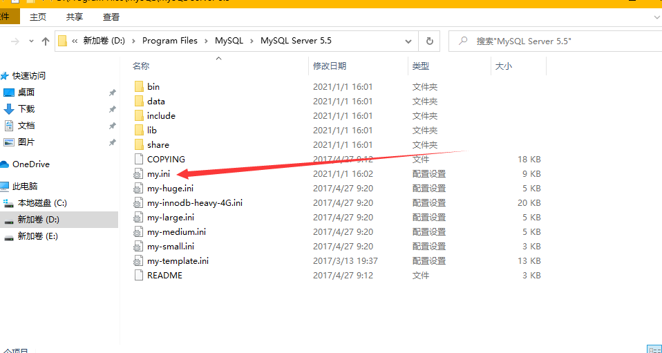
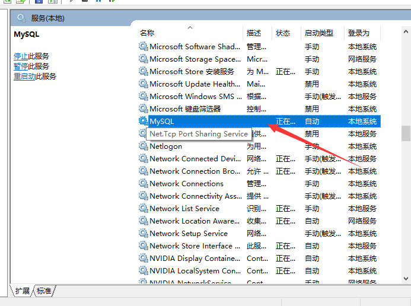

# 8月27日笔记 2002 78节

## 1.回顾

1. 为什么使用数据库
2. MySQL数据的简介
3. 常见的数据库软件
4. MySQL数据库的特点
5. MySQL数据库的安装、SQLyog工具的安装

## 2.MySQL数据库的目录结构

主要文件夹：bin、lib、data、share



<font color="red">注：my.ini文件记录MySQL配置信息，可修改配置内容，如端口号，字符集等</font>

## 3.启动MySQL服务

手动启动->services.msc



**使用命令启动MySQL服务**

注意使用管理员身份开发cmd

启动MySQL服务：net start mysql

停止MySQL服务：net stop mysql

## 4.登录和退出MySQL

登录数据库

```
mysql -h 服务器的主机地址 -u用户名 -p密码
```

<font color="red">注：如果连接本机-h部分可以省略</font>

退出MySQL数据库（两种方式）

1. quit
2. exit

## 5.什么是SQL

Structured Query Language：结构化查询语言

其定义了操作了所有关系型数据库的规则，每一种数据库的操作方式称之为==方言==

## 6.SQL的通用语法

**通用语法**

1. SQL语句可以单行或多行书写，以分号结尾
2. 可以使用空格和缩进来增强语句的可读性
3. MySQL不区分大小写，关键字建议使用大写，如：CREATE、ALTER、SELECT、INSERT...

**MySQL的注释**

3种注释

单行注释：-- 注释内容或==# 注释内容（MySQL特有）==

多行注释：/* 注释内容 */

## 7.SQL的分类

| 名称                  | 解释                                       | 命令                    |
| --------------------- | ------------------------------------------ | ----------------------- |
| DDL  （数据定义语言)  | 定义和管理数据对象，  如数据库，数据表等   | CREATE、DROP、ALTER     |
| DML  （数据操作语言） | 用于操作数据库对象中所包含的数据           | INSERT、UPDATE、DELETE  |
| DQL  （数据查询语言） | 用于查询数据库数据                         | SELECT                  |
| DCL  （数据控制语言） | 用来管理数据库的语言，如管理权限及数据更改 | GRANT、COMMIT、ROLLBACK |

