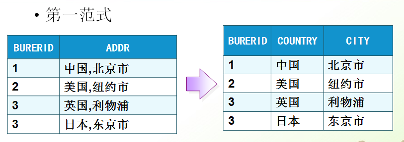

# 10月16日笔记 2002 34节

## 1.回顾

外键约束：在我们的项目开发中创建的都是物理外键，因为定义了外键约束会有一些相应的问题

1. 为什么使用外键约束
2. 外键约束的语法
3. 外键约束的创建方式
4. 外键约束给我们带来哪些问题（项目开发中）

## 2.表的约束

> 外键约束需要注意的问题

```sql
-- 添加数据
-- insert into employee values(5,'陈六',4); -- 插入了一个不存在的部门
-- 修改数据
update employee set id=4 where id=3;
-- 先修改员工表
update employee set deptId=2 where id=4;
-- 删除数据
delete from dept where id=2;
-- 先删除员工表
delete from employee where deptId=2;
```

当有了外键约束的注意事项

1. 当有了外键约束，添加数据的顺序，先添加主表，再添加副表
2. 当有了外键约束，修改数据的顺序，先修改副表，再修改主表
3. 当有了外键约束，删除数据的顺序，先删除副表，在删除主表

## 3.数据库设计

> 为什么需要数据库设计？

当数据比较复杂的时候，我们就需要数据设计

> 什么是糟糕的数据库设计？

1. 数据冗余，浪费空间
2. 数据库插入和删除数据都会麻烦，尤其会产生异常（==屏蔽使用物理外键==）
3. 程序性能降低

> 良好的数据库设计？

1. 节省内存空间
2. 保证数据的完整性
3. 方便我们开发系统

**软件开发中关于数据库的设计**

1. 分析需求：分析业务和需要处理的数据库的需求
2. 概要设计：设计关系图E-R图
3. 详细设计：类的详细设计，如：属性和方法等

## 4.数据库的三大范式

**第一范式**



第一范式的目标是确保每列的原子性

如果每列都是不可再分的最小数据单元（也称为最小的原子单元），则满足第一范式（==1NF==）


如果一个关系满足1NF，并且除了主键以外的其他列，都依赖于该主键，则满足第二范式（==2NF==）

第二范式要求每个表只描述==一件事情==

**第三范式**


如果一个关系满足2NF，并且除了主键以外的其他列都==不传递依赖==于其它列，则满足第三范式（3NF） 

**插入测试数据**

```sql
USE db_2002;
SELECT * FROM employee;
SELECT * FROM dept;
-- 清空部门表中的数据
DELETE FROM dept;
-- 先清空员工表
DELETE FROM employee;
-- 准备测试数据
INSERT INTO dept(id,deptName) VALUES(1,'软件开发部');
INSERT INTO dept(id,deptName) VALUES(2,'应用维护部');
INSERT INTO dept(id,deptName) VALUES(3,'秘书部');
INSERT INTO dept(id,deptName) VALUES(4,'总经办');
SELECT * FROM dept;
INSERT INTO employee VALUES(1,'张三',1);
INSERT INTO employee VALUES(2,'李四',1);
INSERT INTO employee VALUES(3,'王五',2);
INSERT INTO employee VALUES(4,'陈六',3);
SELECT * FROM employee;
```

## 5.关联查询

连接查询：如需要==多张数据表==的数据进行查询，则可通过连接运算符实现多个查询

分类包括

1. 内连接（inner join）:等值和非等值的连接查询，自身连接查询
2. 外连接（out join）：左连接（left join），右连接（right join）

